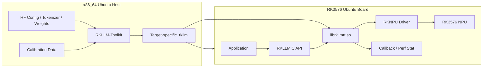
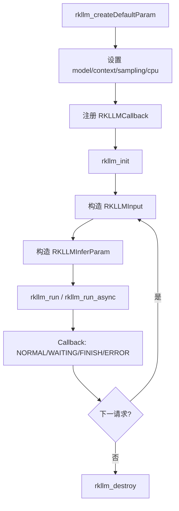

# RKLLM 软件栈：Artifact、Runtime 与 Driver

> [!summary] 核心链
> `Hugging Face → RKLLM-Toolkit → .rkllm → Application → RKLLM C API → librkllmrt.so → RKNPU Driver → NPU`。每一层的输入、输出和责任不同，排错必须先确定问题属于哪一层。

## 1. Host 与 Board 必须分工



Host 侧负责模型理解与目标相关转换；Board 侧负责加载已经生成的 Artifact 并执行。4GB RK3576 不应该承担 Hugging Face 全精度模型加载、量化和编译。

## 2. 七个对象分别是什么

| 对象 | 位置 | 主要职责 | 不是什麼 |
|---|---|---|---|
| Hugging Face 模型目录 | Host | 保存 Config、Tokenizer、Processor、Weights | 不是板端执行产物 |
| RKLLM-Toolkit | Host Python | 识别架构、量化、优化、生成目标 Artifact | 不是板端 Runtime |
| `.rkllm` | Host 生成、Board 使用 | 面向目标 Rockchip 平台的 LLM 部署产物 | 不是 GGUF、ONNX、`.rknn` |
| RKLLM C API | Board Header/API | 定义应用如何初始化、输入、运行、取消和释放 | 不是模型转换器 |
| `librkllmrt.so` | Board 用户态 | 模型加载、状态、调度、Runtime 执行 | 不是内核驱动 |
| RKNPU Driver | Board Kernel | 设备、内存映射、任务提交、同步 | 不理解 Chat Template |
| RK3576 NPU | Hardware | 执行映射后的计算任务 | 不自动支持任意模型 |

## 3. `.rkllm` 是什么

`.rkllm` 应理解为 **Target-specific Deployment Artifact**，而不是“低精度权重文件”。它至少需要让 Runtime 获得：

- 模型结构与目标平台信息；
- 转换后的 Tensor 与量化信息；
- Runtime 执行所需的布局/元数据；
- 最大 Context 等编译期约束；
- Toolkit 版本、模型类型、Core 等可诊断信息。

Artifact 内部格式属于厂商实现。没有公开证据时，不应声称某段字节一定是“编译后的机器指令”或“完整计算图”。能够确认的内容来自 Runtime 加载日志、SDK 文档和实际行为。

## 4. 为什么 `.rkllm` 不能和其他格式互换

```text
.safetensors：通用 Tensor 权重，依赖模型代码和 Config
.gguf：llama.cpp/ggml 生态容器，含 GGUF Metadata 和量化布局
.onnx：开放计算图 IR
.rknn：RKNN Runtime 使用的通用/视觉 NPU Artifact
.rkllm：RKLLM Runtime 使用的 LLM Artifact
```

文件里即使都包含“INT4 权重”，其 Block Layout、Scale、图表达、缓存协议、Kernel 约定和 Runtime API 也可能完全不同。

## 5. Runtime 生命周期

官方 C API 的核心生命周期：



常用控制 API 还包括：

- `rkllm_abort()`：中止当前任务；
- `rkllm_is_running()`：查询运行状态；
- Prompt Cache Load/Release；
- KV Cache Clear/Shrink 等版本相关 API；
- LoRA Load；
- Chat Template/Function Tools 等配置 API。

所有 API 必须以当前 `rkllm.h` 为准，不能从旧博客复制结构体定义。结构体字段变化时，旧 ctypes Binding 可能产生 ABI 错位甚至段错误。

## 6. 四种输入类型

官方头文件定义：

```text
RKLLM_INPUT_PROMPT      文本 Prompt
RKLLM_INPUT_TOKEN       Token ID Sequence
RKLLM_INPUT_EMBED       外部 Embedding
RKLLM_INPUT_MULTIMODAL  多模态输入
```

它们代表不同的责任边界：

- Prompt Input：Runtime/模型内部负责更多 Tokenizer/Template 工作；
- Token Input：应用明确控制 Token 序列；
- Embed Input：视觉或外部编码器直接提供语言 Hidden Size 对齐的向量；
- Multimodal Input：按 SDK 定义同时描述文本与视觉内容。

多模态不是“传一张 JPEG 给语言模型”。JPEG 必须经过 Decode、Resize/Normalize、Vision Encoder、Projection/Merge，最终形成 Runtime 接受的视觉 Embedding 或多模态结构。

## 7. Callback 为什么是核心

LLM 逐 Token 生成，Runtime 使用 Callback 返回增量结果。官方状态包括：

| State | 含义 | 应用动作 |
|---|---|---|
| `RKLLM_RUN_NORMAL` | 正常增量输出 | 推入线程安全队列，向 UI/API Streaming |
| `RKLLM_RUN_WAITING` | 等待完整 UTF-8 字符 | 不把半个字符错误显示 |
| `RKLLM_RUN_FINISH` | 推理结束 | 完成请求、记录 Perf、释放 Session 状态 |
| `RKLLM_RUN_ERROR` | Runtime 报错 | 终止流、生成结构化错误、保留日志 |

Callback 中不能执行重量级 UI、磁盘或网络操作，否则可能阻塞 Runtime 线程。正确结构：

```text
RKLLM Callback
    ↓ copy small result
Lock-free/Bounded Queue
    ↓
Service Worker
    ├── SSE
    ├── Qt Signal
    └── Log/Metric
```

## 8. Runtime 参数分三类

### 8.1 模型实例参数

在 `rkllm_init` 前设置，通常影响整个 Handle：

- `model_path`；
- `max_context_len`；
- 默认 `max_new_tokens`；
- Sampling 默认值；
- `n_keep`；
- CPU Mask/数量；
- `embed_flash` 等扩展字段。

### 8.2 单请求参数

新版本允许在 `RKLLMInferParam` 覆盖部分 Sampling 和 `max_new_tokens`。服务端不能为了修改每次 Temperature 就重新初始化整个模型。

### 8.3 编译期参数

写入 Artifact，改变后通常必须重新转换：

- Target Platform；
- Quantization Dtype/Algorithm；
- NPU Core 相关配置；
- 最大 Context 编译约束；
- Hybrid/Optimization 相关转换参数。

区分这三类可以避免“修改 Runtime 配置却期待 Artifact 发生变化”。

## 9. Backend 这个词在 RKLLM 中怎么用

开放框架经常显式暴露 CPU/CUDA/Vulkan Backend；RKLLM 主链对应用暴露的是厂商 Runtime，并不一定存在一个可由用户任意切换的独立 `NPUBackend` 对象。

因此针对 RKLLM 更准确的图是：

```text
Application → RKLLM Runtime → RKNPU Driver → NPU
```

Runtime 内部当然承担目标硬件映射、调度和 Kernel 选择职责，但不要把通用框架的 Backend API 结构生搬硬套到闭源/半开放厂商 Runtime。

## 10. 版本矩阵是运行契约

当前已验证组合：

```text
Qwen3.5-2B Artifact
RKLLM-Toolkit 1.3.0
RKLLM Runtime 1.3.0
RKNPU Driver 0.9.7
RK3576
```

每次部署记录：

| 项目 | 获取方法 |
|---|---|
| Toolkit | Python Package Version |
| Artifact | Filename + SHA256 + Export Log |
| Runtime | Library/Runtime Log |
| Header | 与 `.so` 同一 Release |
| Driver | Runtime Init Log / sysfs / kernel log |
| Platform | Runtime Log + CPU/Board 信息 |

“Runtime 都叫 1.3.0”仍不保证二进制完全一致，Release Commit、SDK 包来源和 Hash 也应保存。

## 11. 分层排错

```text
下载/加载 HF 失败
→ 模型目录、依赖、Transformers、网络

build/export 失败
→ Toolkit、架构支持、转换参数、内存、校准数据

rkllm_init 失败
→ Artifact/Platform/Runtime/Driver/内存/动态库

rkllm_run 失败或段错误
→ ABI、结构体初始化、输入生命周期、Runtime Bug、并发、内存

有输出但内容异常
→ Tokenizer、Chat Template、Sampling、量化质量、Prompt

能跑但慢
→ Prefill/Decode 分段、频率、温度、CPU/NPU利用率、Context、Runtime配置
```

## 12. 实验

### 实验 1：最小生命周期 Trace

为每一步打印时间、返回码、线程 ID 和内存：

```text
process start
dlopen runtime
create default param
before init / after init
before run
first callback
finish callback
destroy
process exit
```

### 实验 2：动态库契约

检查：

- 二进制 Architecture；
- `librkllmrt.so` 依赖；
- `libomp.so` 是否存在；
- RPATH / `LD_LIBRARY_PATH`；
- Header 与 `.so` 来源是否一致。

### 实验 3：错误注入

分别制造错误模型路径、错误 Artifact Platform、缺失动态库、超大 Context、重复初始化和并发调用，记录错误发生在哪一层。

## 13. 验收清单

- [ ] 能画出 Host→Artifact→Board→Runtime→Driver→NPU；
- [ ] 能解释 `.rkllm` 为什么不是普通权重文件；
- [ ] 能写出 init/run/callback/destroy 生命周期；
- [ ] 能区分模型实例参数、单请求参数和编译期参数；
- [ ] 能解释四种输入类型；
- [ ] Callback 不执行重量级任务；
- [ ] 能用版本矩阵和分层日志定位问题。

## 14. 参考

- [RKLLM README](https://github.com/airockchip/rknn-llm)
- [RKLLM C API Header](https://github.com/airockchip/rknn-llm/blob/main/rkllm-runtime/Linux/librkllm_api/include/rkllm.h)
- [RKLLM C++ Demo](https://github.com/airockchip/rknn-llm/blob/main/examples/rkllm_api_demo/deploy/src/llm_demo.cpp)
- [RKLLM Server Demo](https://github.com/airockchip/rknn-llm/tree/main/examples/rkllm_server_demo)
- [07_RKLLM_C_API_Runtime封装与服务化](./07_RKLLM_C_API_Runtime封装与服务化.md)
- [09_版本矩阵_故障定位与回归测试](./09_版本矩阵_故障定位与回归测试.md)
