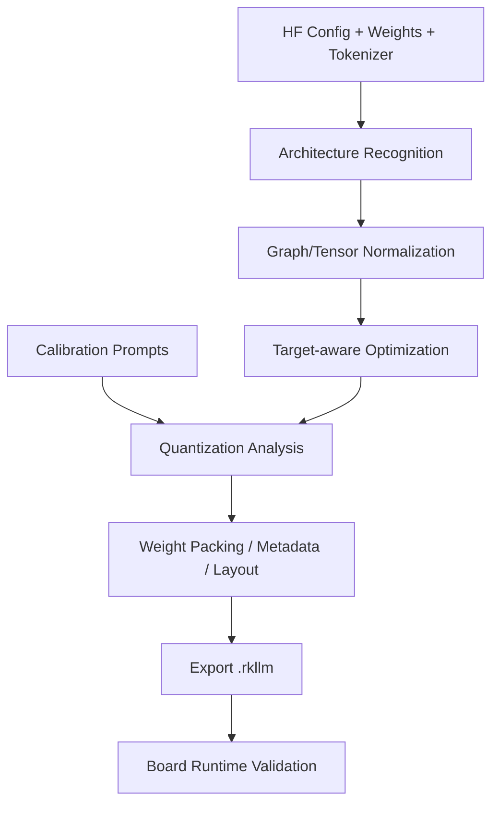

# RKLLM 转换、量化与 W4A16/GRQ

> [!summary] 本章目标
> 不把 `llm.build(...)` 当成黑盒命令：明确输入模型、校准数据、量化对象、目标平台、转换参数、Artifact 和验证结果之间的关系。

## 1. 转换阶段到底做什么



从外部可验证的角度，转换至少完成：

- 识别模型类和 Config；
- 读取并处理权重；
- 按目标平台和量化配置构建部署表示；
- 生成 RKLLM Runtime 可加载的 Artifact；
- 保存必要的模型/量化/目标元数据。

具体内部 Pass、Kernel Layout 与 Binary Section 若官方没有公开，不应自行杜撰。

## 2. 当前已验证转换配置

```python
llm.build(
    do_quantization=True,
    optimization_level=1,
    quantized_dtype="w4a16",
    quantized_algorithm="grq",
    target_platform="rk3576",
    num_npu_core=2,
    dataset="data/inputs.json",
    hybrid_rate=0,
    max_context=4096,
)
```

输出：

```text
qwen3.5-2b-w4a16-grq-rk3576.rkllm
约 2.2GB
```

## 3. 参数逐项解释

| 参数 | 控制范围 | 当前值的意义 | 改变后的验证 |
|---|---|---|---|
| `do_quantization` | 是否量化 | 生成低比特部署模型 | 文件、质量、性能、内存 |
| `optimization_level` | Toolkit 优化等级 | 当前基线为 1 | 输出正确性与 Build/Runtime 性能 |
| `quantized_dtype` | 权重/激活组合 | W4A16 | 对比 W8A8/支持格式 |
| `quantized_algorithm` | 量化算法 | GRQ | 必须看对应版本文档，不凭名字猜内部数学 |
| `target_platform` | 目标 SoC | RK3576 | 不同平台 Artifact 不通用 |
| `num_npu_core` | NPU 目标配置 | 当前为 2 | Build Log、运行兼容性、性能 |
| `dataset` | 校准输入 | 实际 Prompt JSON | 量化质量、异常值覆盖 |
| `hybrid_rate` | 混合量化相关策略 | 当前为 0 | Artifact、精度、性能；以 SDK 定义为准 |
| `max_context` | Artifact Context 约束 | Build 4096 | 文件/内存/Runtime 上限与性能 |

> [!warning] 参数语义受版本约束
> `GRQ`、`hybrid_rate` 和优化等级属于 RKLLM 工具链语义。文档只记录当前 1.3.0 行为；升级 Toolkit 后必须重新读 SDK、Changelog 和示例。

## 4. W4A16 到底表示什么

工程上先建立以下边界：

```text
W4：主要权重使用 4bit 级表示/存储
A16：激活以 16bit 级精度参与主要计算路径
```

但不能推导为：

```text
所有 Tensor 都严格 4bit
模型文件 = 参数量 × 0.5 Byte
所有算术都是纯 INT4
KV/线性注意力状态自动 4bit
```

真实 Artifact 可能包含：

- 不适合 4bit 的敏感 Tensor；
- Embedding、Norm、Bias 或状态相关的更高精度数据；
- Scale/Group/Block Metadata；
- 对齐与 Padding；
- Tokenizer/模型元数据或目标布局；
- Runtime 所需部署信息。

哪些项确实存在，必须依靠公开格式、导出日志或实验确认。

## 5. 为什么理想 1GB，Artifact 却约 2.2GB

2B 参数全按 4bit 的理想裸权重：

$$
2\times10^9\times 4/8\approx1\text{GB}
$$

实际约 2.2GB，说明“所有参数等价为裸 4bit”这个假设不成立。建议按证据逐层排查：

1. **精确参数量**：2B 是营销量级，不是恰好 2,000,000,000；
2. **语言/视觉范围**：导出日志确认是否只含语言部分；
3. **Tensor Dtype 清单**：哪些 Tensor 被保留高精度；
4. **量化元数据**：Scale、Group、Block 和对齐成本；
5. **Tied Weight 表示**：共享权重在 Artifact 中是否仍只存一份；
6. **目标部署信息**：图、布局、常量或其他数据；
7. **单位差异**：GB 与 GiB 不要混淆。

在缺少 `.rkllm` 公开格式时，结论应写成：

> **已验证** Artifact 为约 2.2GB；**可推断**并非所有数据都以裸 4bit 保存；具体构成仍需 Toolkit/Runtime 证据，不能仅凭文件大小反推内部格式。

## 6. 仿射量化基础

常见量化抽象：

$$
q=\operatorname{clip}\left(\operatorname{round}(x/s)+z\right)
$$

$$
\hat{x}=s(q-z)
$$

- `s`：Scale；
- `z`：Zero Point；
- `q`：低比特整数；
- `x_hat`：反量化近似值。

必须理解四组选择：

| 维度 | 选择 | 权衡 |
|---|---|---|
| 对称性 | Symmetric / Asymmetric | Zero Point、范围利用率、Kernel 复杂度 |
| 粒度 | Per-tensor / Per-channel / Per-group | 精度 vs Metadata/Kernel 成本 |
| 对象 | Weight-only / Weight+Activation | 容量、带宽、硬件支持、校准要求 |
| 静动态 | Static / Dynamic | 校准、运行开销、输入分布适应性 |

RKLLM 的具体组合以 1.3.0 SDK 为准，不要直接套用 PyTorch 或 GGUF 名称。

## 7. Calibration Dataset 不是形式文件

校准数据的目标是让 Toolkit 观察代表性输入分布，辅助确定量化参数或敏感性。一个只放随意短句的数据集可能不能覆盖：

- 中文、英文、代码、数字；
- 短 Prompt、长 Prompt；
- System/User/Assistant Chat Template；
- 特殊 Token；
- 设备手册、日志、Tool JSON 等项目真实分布。

建议建立最小校准集：

```text
20% 通用中文问答
15% 英文与中英混合
15% 代码/命令/错误日志
20% 设备手册与技术术语
15% Tool Calling JSON
15% 长输入与多轮格式
```

校准集不能混入秘密数据；必须版本化并保存 Hash。

## 8. GRQ 应该怎样理解

当前实战使用 `quantized_algorithm="grq"`。在缺少完整公开算法定义时，正确做法是：

- 将 GRQ 视为 RKLLM 1.3.0 提供的一种量化算法选择；
- 记录它与 W4A16、Dataset、Platform 的组合；
- 用实际 Artifact、质量与性能对比它；
- 不把 GRQ 自动解释成某个开源论文算法；
- 不在没有证据时描述其 Group Size、Scale 公式或敏感层策略。

可通过实验回答：

```text
GRQ vs 其他受支持算法
Artifact 大小是否变化？
Build Time 是否变化？
固定任务集质量是否变化？
Prefill/Decode 是否变化？
峰值内存是否变化？
```

## 9. W4A16 vs W8A8 实验设计

| 维度 | W4A16 | W8A8 |
|---|---|---|
| 权重容量 | 通常更小 | 通常更大 |
| 激活 | 16bit 级 | 8bit 级 |
| Decode 权重搬运 | 理论上更低 | 较高 |
| 校准敏感度 | 主要关注权重低比特误差 | 权重和激活都需关注 |
| 精度 | 需要实测 | 需要实测，不能默认一定更好 |
| Kernel/平台效率 | 由 RK3576/RKLLM 实现决定 | 同样由实现决定 |

固定：模型 Revision、Calibration、Context、Prompt、生成长度、Sampling、频率、散热、Runtime。

测量：

- Build Time 与 Host 峰值内存；
- Artifact 大小与 Hash；
- Init Time；
- TTFT、Prefill、Decode；
- Board 内存；
- 输出质量；
- 长上下文稳定性；
- 温度与持续运行降频。

## 10. 正确性验证分三层

### 10.1 模型级

Hugging Face 原模型能在 Host 用固定 Prompt 生成合理输出，Tokenizer/Template 正确。

### 10.2 Artifact 级

RKLLM 转换成功不等于正确。板端对同一提示集检查：

- 语言是否通顺；
- 指令是否遵循；
- JSON/Tool 格式是否稳定；
- 数字、代码和专有名词是否明显退化；
- Thinking/Non-thinking 模式是否符合预期。

### 10.3 产品级

在真实 RAG、日志诊断和 Tool Calling 场景评估任务成功率，而不是只看一条“请解释 NPU”。

## 11. 转换资源规划

Host 侧需要同时容纳：

```text
原始权重
+ 反序列化 Tensor
+ 量化/优化临时数据
+ 输出 Artifact
+ Python/Framework 开销
```

当前 4核/8GB 虚拟机依赖额外 Swap 才完成转换，说明：

- Swap 能避免 OOM，但会显著变慢；
- “长时间无输出”不等于卡死，需要观察 CPU、内存、Swap 和磁盘；
- 输出目录必须预留原模型、临时数据和 Artifact 的总空间；
- 最好记录每个 Build Phase 的耗时和峰值资源。

## 12. 实验与验收

### 必做实验

1. 生成当前 W4A16+GRQ 可复现 Artifact；
2. 保存 Build Log、脚本、Calibration、模型 Revision、Artifact SHA256；
3. 生成 W8A8 对照；
4. 固定 20–50 条任务集做质量回归；
5. 固定性能参数做三次以上重复测试；
6. 分析 Artifact 大小差异，明确事实与推断。

### 验收清单

- [ ] 能解释每个 `build()` 参数属于什么层；
- [ ] 不把 W4A16 等同于所有数据严格 4bit；
- [ ] 不把 GRQ 当成未经证实的公开算法；
- [ ] Calibration 数据与真实应用分布相关；
- [ ] 量化比较同时覆盖质量、速度、内存和稳定性；
- [ ] Build 可由脚本、版本和 Hash 完整复现。

## 13. 参考

- [RKLLM Official Repository](https://github.com/airockchip/rknn-llm)
- [RKLLM 1.3.0 Release](https://github.com/airockchip/rknn-llm/releases/tag/release-v1.3.0)
- [10_Qwen3.5-2B_RK3576完整可复现实战](./10_Qwen3.5-2B_RK3576完整可复现实战.md)
- [09_版本矩阵_故障定位与回归测试](./09_版本矩阵_故障定位与回归测试.md)
