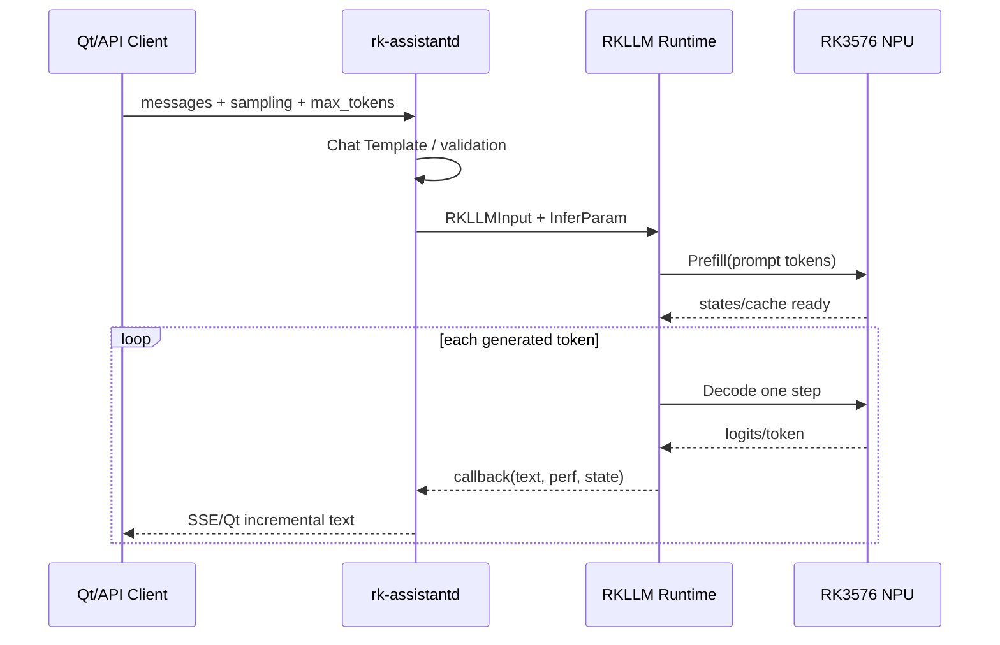

# Prefill、Decode、混合注意力与缓存

> [!important] 本章边界
> 标准 Transformer 的 KV Cache 公式只能用于 Qwen3.5-2B 的 6 个 Full-Attention Layer。18 个 Linear-Attention Layer 维护另一类递推状态，不能假装它们也有同样的 K/V Sequence Cache。

## 1. 一次请求的完整时序



端到端时间至少分为：

```text
Request Parse
+ Template/Tokenizer
+ Queue/Scheduler
+ Prefill
+ First Sampling/Callback
+ Decode × N
+ Network/UI Rendering
```

## 2. Chat Template 与 Tokenizer

用户看到：

```text
请解释 NPU。
```

模型看到的是带角色和特殊 Token 的序列：

```text
System Role
User Role
User Content
Assistant Generation Prefix
```

必须确认：

- Runtime 是否内置 Tokenizer；
- Chat Template 在转换时还是运行时处理；
- Thinking/Tool Token 如何设置；
- BOS/EOS 与多 EOS 是否匹配；
- Prompt Token 数由谁统计。

RKLLM 1.3.0 增加 Tokenizer/Embedding Callback 等能力，实际用法以当前 Header 和 Demo 为准。

## 3. Prefill 的两个输出

Prefill 不只是“算第一个 Token”，它完成：

1. 对全部 Prompt Token 做一次前向；
2. 建立后续 Decode 所需的历史状态。

文本 Shape：

```text
Input IDs [1,T]
Embedding [1,T,2048]
Hybrid Backbone [1,T,2048]
Last Logits [1,248320]
```

在 6 个 Full-Attention Layer 中建立 K/V Cache；在 18 个 Linear-Attention Layer 中建立对应递推/卷积状态。

Prefill 的矩阵 M 维等于多个 Token，权重可在 T 个 Token 间复用，较容易形成大矩阵计算。

## 4. Decode 为什么一次只生成一个 Token

自回归条件：

$$
P(x_{t+1}|x_{1:t})
$$

只有采样出 `x_(t+1)` 后，才能知道下一步的条件输入，因此普通 Decode 必须循环：

```text
new_token = sample(model(history))
history.append(new_token)
repeat
```

Decode Step 的主 Shape：

```text
New Token ID [1,1]
New Hidden   [1,1,2048]
Full Attention Q [1,8,1,256]
Historical K/V  [1,2,T,256] per full-attention layer
Next Logits     [1,248320]
```

每步 M≈1，很多大权重只服务一个 Token，权重复用低。

## 5. Full Attention KV Cache 精确估算

标准公式：

$$
Bytes_{KV}=2\times L_{full}\times T\times H_{kv}\times D_h\times bytes
$$

Qwen3.5-2B 已知：

```text
L_full = 6
H_kv = 2
D_h = 256
假设 K/V 使用 2 Bytes 元素
```

每 Token：

$$
2\times6\times2\times256\times2=12288\ Bytes
$$

约等于 12KiB/Token：

| Context T | Full-Attention K/V 理论量 |
|---:|---:|
| 512 | 6 MiB |
| 1024 | 12 MiB |
| 2048 | 24 MiB |
| 4096 | 48 MiB |

这只是标准全注意力 K/V 的结构估算，不包含：

- Linear-Attention State；
- Runtime Alignment/Workspace；
- Prompt Cache；
- Batch/Session；
- Vision Tokens；
- 可能不同的 Cache Dtype/Layout。

所以不能拿“24MiB”解释整个 Context 增量内存。

## 6. 如果错误地按 24 层计算会怎样

错误套用：

$$
2\times24\times T\times2\times256\times2
$$

在 T=2048 时约 96MiB，是只计算 6 个 Full-Attention Layer 的 4 倍。这个结果对 Qwen3.5-2B 的标准 KV Cache 不成立，因为 18 层不是 Full Attention。

但这不意味着混合模型一定只增加 24MiB：Linear State 仍占内存，且可能使用 FP32 状态。最终必须做 Context Sweep。

## 7. Linear Attention State 怎么理解

抽象地表示：

```text
state_t = update(state_(t-1), key_t, value_t, gate_t)
output_t = read(query_t, state_t)
```

它的目标是把历史压缩进状态，而不是保存完整 `K[1:T]`、`V[1:T]`。Qwen Config 的 Linear Head、Value Head、Conv Kernel 和 State Dtype 会影响状态规模。

RKLLM 内部的实际 State Layout 未完全公开时，正确测量方法是：

1. 固定 Model、Runtime、Session 数；
2. 测量 Context 0/512/1024/2048/4096 的内存；
3. 对内存增量做线性拟合；
4. 对比 Full-Attention KV 理论斜率；
5. 差额只能称为“其他状态与 Runtime 开销”，不能直接命名。

## 8. Prefill 与 Decode 的性能指标

### Prefill

```text
Prefill tok/s = Prompt Token Count / Prefill Time
```

影响：Prompt 长度、矩阵 Shape、量化、NPU Kernel、频率、线性/全注意力组合。

### Decode

```text
Decode tok/s = Generated Token Count / Decode Time
```

影响：权重读取、状态读取、词表投影、Context、Sampling、回调和同步。

### TTFT

必须声明起点和终点。推荐热模型定义：

```text
TTFT = Request Received → First Complete Output Token Available
```

它包含 Template/Tokenizer、排队、Prefill、首步 Sampling 和 Callback，但不包含进程启动/模型初始化。冷启动另报：

```text
Cold Start = Process Start → Model Ready
```

## 9. Context Sweep 实验

固定：

```text
Model Artifact
Runtime/Driver
Output Tokens = 64
Sampling
Frequency/Cooling
Prompt 内容类型
```

改变 Prompt Token：

```text
128 / 512 / 1024 / 2048 / 4096
```

记录：

| Context | Prefill tok/s | TTFT | Decode tok/s 起点/终点 | Memory | Temp |
|---:|---:|---:|---:|---:|---:|
| 128 | | | | | |
| 512 | | | | | |
| 1024 | | | | | |
| 2048 | | | | | |
| 4096 | | | | | |

Decode 最好分前 16 Token、后 16 Token，观察 Context 增长是否持续降低速度。

## 10. 多轮会话与 History

多轮会话有三种不同策略：

1. 每次重新拼接全部 Messages，重新 Prefill；
2. Runtime 保留 History/State，只追加新 Token；
3. 使用 Prompt Cache 复用固定前缀。

必须验证：

- `keep_history` 在当前模型/Runtime 是否真正生效；
- Session 间状态是否隔离；
- Clear Conversation 是否清理缓存；
- Context 超限后 `n_keep` 和 Shift 行为；
- History 与 Prompt Cache 是否重复占用内存；
- 服务重启后哪些状态持久化。

## 11. Sampling 不是性能之外的东西

Sampling Chain：

```text
Logits
→ penalty
→ temperature
→ top-k/top-p
→ random/greedy select
→ token
```

固定 Prompt 但 Sampling 不同，会导致：

- 输出 Token 数不同；
- EOS 到达时间不同；
- 内容质量不可直接比较；
- Tool JSON 稳定性不同。

性能基准通常使用固定 Seed/Greedy 或完全记录参数；产品质量测试再使用真实 Sampling。

## 12. 实验与验收

### 实验

1. 用 Config 手算 6 层 Full-Attention KV Cache；
2. 做 Context Sweep，测总内存斜率；
3. 分开记录 Tokenizer、Prefill、First Callback、Decode；
4. 比较 History Re-prefill 与 Cache Reuse；
5. 在 2048/4096 Context 下运行长生成，观察温度和 Decode 衰减。

### 验收

- [ ] 能解释 Prefill 的两个输出；
- [ ] 能写出 Decode 的单 Token Shape；
- [ ] 能计算 6 个 Full-Attention Layer 的 KV Cache；
- [ ] 不把线性注意力状态误称为标准 KV Cache；
- [ ] 能区分 TTFT、Cold Start、Prefill tok/s、Decode tok/s；
- [ ] 能设计 Context Sweep 并解释内存斜率。

## 13. 参考

- [Qwen3.5-2B Config](https://huggingface.co/Qwen/Qwen3.5-2B/blob/main/config.json)
- [RKLLM C API Header](https://github.com/airockchip/rknn-llm/blob/main/rkllm-runtime/Linux/librkllm_api/include/rkllm.h)
- [01_Qwen3.5-2B模型解剖与Shape主线](./01_Qwen3.5-2B模型解剖与Shape主线.md)
- [05_RK3576性能模型_GEMM_GEMV与Roofline](./05_RK3576性能模型_GEMM_GEMV与Roofline.md)
- [06_4GB内存容量工程与测量方法](./06_4GB内存容量工程与测量方法.md)
