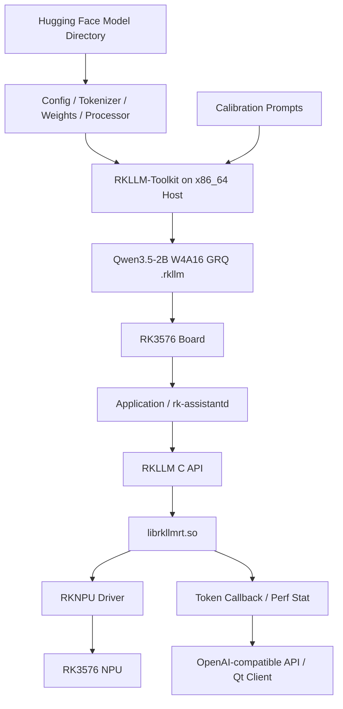

# RK3576 端侧大模型部署深度专题

> [!summary] 专题主线
> 本专题只回答一个问题：**Qwen3.5-2B 如何从 Hugging Face 模型，经过 RKLLM 转换、量化和板端 Runtime，最终成为 4GB RK3576 上可测量、可服务化、可排错、可继续扩展多模态的本地大模型系统？**

## 1. 专题定位

本目录不是 AI 基础课程，也不是命令速查表。需要 AI、神经网络、Transformer、ONNX、RKNN 等前置知识时，回到相邻项目《从 AI 基础到端侧部署优化》查阅。

本专题聚焦一套已经验证的真实环境：

| 项目 | 当前基线 |
|---|---|
| SoC | RK3576 |
| RAM / Storage | 4GB / 32GB |
| Board OS | KickPi Ubuntu 24.04.3 LTS aarch64 |
| Host | Ubuntu 22.04.5 LTS x86_64 虚拟机 |
| Model | Qwen3.5-2B，当前先部署语言部分 |
| Quantization | W4A16 + GRQ |
| Toolkit / Runtime | RKLLM 1.3.0 |
| NPU Driver | 已验证环境为 v0.9.7 |
| Artifact | 约 2.2GB `.rkllm` |
| 首次基线 | Prefill 26.37 tok/s；Decode 6.14 tok/s；一次观测内存 1501MB |

这些数字只属于当时的模型、提示词、参数、频率、散热和测量方法。后续任何比较都必须重新声明测试条件。

## 2. 完整系统链



部署不是“复制模型到板子”，而是同时建立五个契约：

1. **模型契约**：架构、Tokenizer、Chat Template 和权重匹配；
2. **编译契约**：Toolkit 支持模型架构、量化类型和目标芯片；
3. **运行契约**：Artifact、Runtime、Driver 和平台版本相容；
4. **资源契约**：权重、状态、KV/线性注意力状态、工作区和应用总内存不超过 4GB；
5. **产品契约**：推理结果可以通过 API、Qt、RAG、Camera 和 Tool 被真实应用消费。

## 3. 阅读顺序

1. [01_Qwen3.5-2B模型解剖与Shape主线](./01_Qwen3.5-2B模型解剖与Shape主线.md)
   - 从官方 Config 读取真实结构，不把 Qwen3.5 当成普通 24 层全注意力模型。
2. [02_RKLLM软件栈_Artifact_Runtime与Driver](./02_RKLLM软件栈_Artifact_Runtime与Driver.md)
   - 分清 Toolkit、`.rkllm`、C API、Runtime、Driver 与 NPU。
3. [03_RKLLM转换_量化与W4A16_GRQ](./03_RKLLM转换_量化与W4A16_GRQ.md)
   - 解释转换参数、校准、W4A16、GRQ、W8A8 和正确性验证。
4. [04_Prefill_Decode_混合注意力与缓存](./04_Prefill_Decode_混合注意力与缓存.md)
   - 解释一次生成、混合注意力状态、全注意力 KV Cache 和上下文成本。
5. [05_RK3576性能模型_GEMM_GEMV与Roofline](./05_RK3576性能模型_GEMM_GEMV与Roofline.md)
   - 从 Shape、计算量、带宽、利用率和温度理解实际 token/s。
6. [06_4GB内存容量工程与测量方法](./06_4GB内存容量工程与测量方法.md)
   - 给 Ubuntu、Qt、RKLLM、RKNN、Camera、RAG 建整机内存账本。
7. [07_RKLLM_C_API_Runtime封装与服务化](./07_RKLLM_C_API_Runtime封装与服务化.md)
   - 从 `rkllm_init`、Callback 到 OpenAI-compatible Server 和 systemd。
8. [08_IMX415_RKNN_RKLLM多模态链路](./08_IMX415_RKNN_RKLLM多模态链路.md)
   - 将 IMX415、视觉编码器、RKNN、Embedding 和 RKLLM 串起来。
9. [09_版本矩阵_故障定位与回归测试](./09_版本矩阵_故障定位与回归测试.md)
   - 用分层证据定位转换失败、初始化失败、段错误、内存不足和性能异常。
10. [10_Qwen3.5-2B_RK3576完整可复现实战](./10_Qwen3.5-2B_RK3576完整可复现实战.md)
   - 把环境、命令、代码、结果、Benchmark 和验收收成完整闭环。

## 4. 三条边界必须分清

### 4.1 RKLLM 与 RKNN

```text
语言模型：Hugging Face → RKLLM-Toolkit → .rkllm → RKLLM Runtime
视觉模型：PyTorch/ONNX → RKNN-Toolkit2 → .rknn → RKNN Runtime
多模态：视觉 .rknn + 语言 .rkllm + 中间 Embedding/Projection 协议
```

`.rknn` 和 `.rkllm` 不是同一种文件换了后缀，也不能交给对方 Runtime 加载。

### 4.2 RKLLM 与 llama.cpp

```text
GGUF → llama.cpp / ggml → CPU/GPU Backend
.rkllm → RKLLM Runtime → Rockchip NPU
```

llama.cpp 可作为 CPU 基线和开放源码学习对象，但不属于当前 NPU 主链。Q4_K_M 也不能直接等同于 RKLLM 的 W4A16。

### 4.3 已验证事实与内部推断

厂商 Artifact 与 NPU Kernel 很多细节并不公开。文档统一使用以下标记：

- **已验证**：来自实际命令、日志、模型 Config、公开头文件或可重复实验；
- **官方说明**：来自对应版本官方仓库、SDK 文档或示例；
- **工程推断**：根据现象和通用原理推测，必须明确标注，不能伪装成内部实现事实；
- **待验证**：当前缺少证据，需要设计实验。

## 5. 统一实验规范

### 5.1 正确性基线

每个模型至少保留三类输入：

```text
固定短 Prompt：检查基本输出与速度
固定长 Prompt：检查 Prefill、Context 和内存
固定任务集：检查量化前后质量与回归
```

### 5.2 性能基线

每次记录：

```yaml
board: RK3576
ram: 4GB
os: KickPi Ubuntu 24.04.3 aarch64
kernel: TODO
npu_driver: 0.9.7
rkllm_toolkit: 1.3.0
rkllm_runtime: 1.3.0
model: Qwen3.5-2B
artifact: qwen3.5-2b-w4a16-grq-rk3576.rkllm
artifact_sha256: TODO
quantization: W4A16 + GRQ
max_context_len: 2048
max_new_tokens: 64
prompt_tokens: 20
generated_tokens: 55
temperature: 0.8
top_k: 1
top_p: 0.95
warmup: TODO
repeat_count: 3
frequency_policy: TODO
cooling: TODO
```

然后分别记录：模型加载时间、Tokenizer 时间、TTFT、Prefill tok/s、Decode tok/s、总时延、内存、CPU/NPU 利用率、温度和频率。

### 5.3 一次只改变一个变量

有效比较示例：

- W4A16 vs W8A8：其他条件固定；
- Context 512/1024/2048/4096：模型和生成长度固定；
- NPU Core 数：模型 Artifact 和参数明确记录；
- 冷启动 vs 热模型：分开报告；
- 文本模式 vs 视觉模式：分开报告。

## 6. 最终能力标准

学完本专题，不以“模型输出了一句话”为完成标准，而要能够回答：

- Qwen3.5-2B 的 24 层为什么不能全部按标准 Self-Attention 理解？
- 为什么只有部分层使用标准 KV Cache，线性注意力层还需要什么状态？
- `.rkllm` 为什么不是通用权重文件？
- W4A16、W8A8、GRQ 和校准数据分别解决什么问题？
- 为什么 2B×4bit 的理想值约 1GB，而实际 Artifact 约 2.2GB？哪些是事实，哪些只能推断？
- `rkllm_init` 成功但 `rkllm_run` 崩溃，应该如何分层定位？
- 6 TOPS 为什么不能直接换算成 Decode token/s？
- 1501MB 到底是哪一种内存指标，是否包含 mmap、CMA、Page Cache 和 NPU 分配？
- 4GB 设备同时运行 Ubuntu Desktop、Qt、RKLLM、RKNN 和 IMX415 时如何留出安全余量？
- 如何把官方 Demo 封装成可取消、可观测、可恢复的长期服务？

## 7. 官方与本地证据入口

- [Rockchip RKLLM 官方仓库](https://github.com/airockchip/rknn-llm)
- [RKLLM C API 头文件](https://github.com/airockchip/rknn-llm/blob/main/rkllm-runtime/Linux/librkllm_api/include/rkllm.h)
- [RKLLM API Demo](https://github.com/airockchip/rknn-llm/tree/main/examples/rkllm_api_demo)
- [RKLLM Server Demo](https://github.com/airockchip/rknn-llm/tree/main/examples/rkllm_server_demo)
- [RKLLM Multimodal Demo](https://github.com/airockchip/rknn-llm/tree/main/examples/multimodal_model_demo)
- [Qwen3.5-2B Model Card](https://huggingface.co/Qwen/Qwen3.5-2B)
- [Qwen3.5-2B Config](https://huggingface.co/Qwen/Qwen3.5-2B/blob/main/config.json)
- 原始个人操作日志未纳入本仓库；本专题以可复现、可验证、可扩展的正式版本为准。

本仓库只保留当前专题主线；旧版概念卡片仍保存在个人知识库中。
