# 第 1 章 AI 基础与机器学习

> **所属路线**：AI 学习路线 · 第一部分
> **本章定位**：从 AI 基本概念到经典机器学习的完整入门
> **核心教材**：[microsoft/AI-For-Beginners](https://github.com/microsoft/AI-For-Beginners) · [microsoft/ML-For-Beginners](https://github.com/microsoft/ML-For-Beginners)
> **前置要求**：会一点 Python 即可，不需要任何 AI 背景
> **学习边界**：本章讲到经典机器学习为止；神经网络、深度学习、Transformer 与 LLM 在后续章节展开
> **资料检查日期**：2026-08-25

---

## 本章导读

这一章要回答一个看起来很朴素、但很多人学了很久 AI 都答不清楚的问题：

> **机器学习到底在做什么？它和传统写代码有什么本质区别？**

我们不会从公式开始，而是从问题开始。你会先看到"用规则写程序"这条老路为什么会撞墙，然后自然地理解为什么人们转向"让机器从数据中学习"。接着我们把机器学习世界里最常用的词汇——数据、特征、标签、模型、参数、训练、推理——一个一个钉牢，再按照"监督 / 无监督 / 强化"三大类，把回归、分类、聚类这三项基本功各做一遍。

学完本章，你应该能够：

1. 说清楚 AI、机器学习、深度学习、LLM 之间的包含关系；
2. 解释什么是特征、标签、模型、参数，以及训练和推理的区别；
3. 判断一个实际问题该用回归、分类还是聚类；
4. 解释为什么不能把全部数据拿去训练，什么是过拟合和泛化；
5. 读懂 Accuracy、Precision、Recall、F1、MSE、R² 这些指标，并知道什么时候 Accuracy 会骗人；
6. 用 Scikit-learn 独立完成 `fit()` → `predict()` → 评估 的完整流程；
7. 说清楚为什么端侧设备上很多任务根本不需要大模型。

**本章的学习方法**：不要试图记住所有算法细节。最重要的是建立一套"遇到问题 → 判断任务类型 → 选工具 → 验证效果"的分析框架。这套框架会一直用到 RK3576 端侧部署那一章。

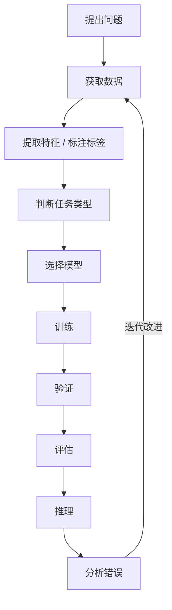

---

## 1. 人工智能：一个不断扩大的概念

### 1.1 什么是 Artificial Intelligence？

> **定义**：人工智能（Artificial Intelligence, AI）是让计算机完成原本需要人类**感知、判断、推理、学习或决策**才能完成的任务的技术总称。

注意关键词是"总称"。AI 不是某一种具体技术，而是一把大伞——伞下面装着几代人发明的各种方法。

看几个典型的 AI 问题：

```text
图像       → 这是一只猫还是狗？
声音       → 用户说了什么？
文本       → 这句话表达什么含义？
传感器数据  → 当前动作属于哪种状态？
环境状态    → 下一步应该采取什么行为？
```

这些问题的共同点是：**答案没有一个可以用几行 if-else 写死的计算公式**。如果有人能写出公式，那就只是普通程序，不需要 AI。

### 1.2 AI 技术树：先搞清楚每个概念站在哪

初学者最大的混乱来源，是把 AI、机器学习、深度学习、LLM 当成同义词。它们其实是一层套一层的包含关系：

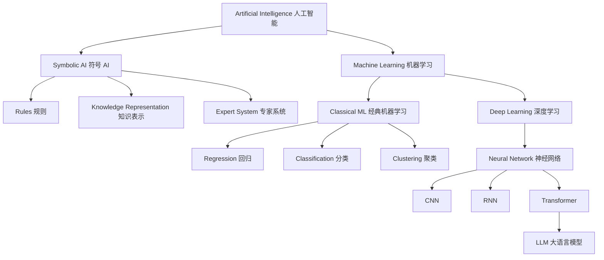

如果把今天火热的 Generative AI 也放进来：

```text
AI
└── Machine Learning
    └── Deep Learning
        └── Transformer
            └── Foundation Model（基础模型）
                ├── LLM
                ├── VLM（视觉语言模型）
                └── Generative AI Applications
```

> ⚠️ **最容易犯的错误**：AI 不等于 LLM。LLM 只是当前 AI 技术体系中的一个重要分支。一个用随机森林做传感器分类的嵌入式设备，也是正经的 AI 系统。

### 1.3 本节小结

- AI 是一个总称，核心特征是"完成需要人类智能的任务"；
- AI 历史上有两条路线：**自顶向下的符号 AI**（人写规则）和**自底向上的机器学习**（机器从数据学规律）；
- AI ⊃ 机器学习 ⊃ 深度学习 ⊃ Transformer ⊃ LLM，是包含关系，不是并列关系。

---

## 2. 符号 AI：规则的时代

在机器学习统治世界之前，AI 的主流做法是：把人类专家的知识提炼成规则，交给计算机执行。Microsoft 课程中的 [Knowledge Representation and Expert Systems](https://github.com/microsoft/AI-For-Beginners/blob/main/lessons/2-Symbolic/README.md) 讲的就是这段历史。

### 2.1 符号 AI 的工作原理

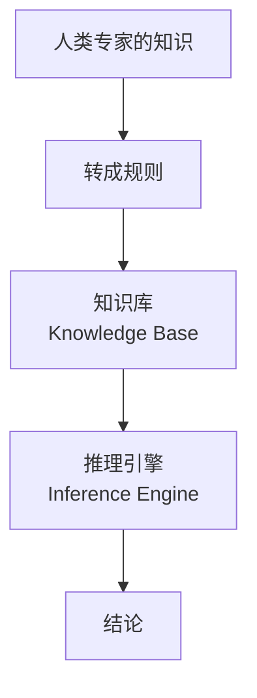

一条典型的规则长这样：

```text
IF
    温度 > 38℃
AND
    咳嗽 = True
THEN
    可能存在感染
```

整个系统由两部分组成：**知识库**（存所有规则）和**推理引擎**（根据规则和输入事实推出结论）。上世纪七八十年代流行的"专家系统"就是这个思路。

### 2.2 规则方法的优势——而且它并没有过时

规则程序有四个明显优点：

- **逻辑明确**：每一条行为都能追溯到具体规则；
- **可解释**：出了错知道是哪条规则触发的；
- **行为可控**：不会出现"模型自己学到奇怪行为"的问题；
- **适合确定性问题**：因果关系清晰的场景，规则就是最优解。

一个嵌入式工程师最熟悉的例子：

```c
if (temperature > 80) {
    fan_on();
}
```

温度超过 80℃ 就开风扇——这个任务**根本不需要机器学习**。写规则就是最快、最可靠、最省资源的方案。

### 2.3 规则方法为什么会撞墙

现在把任务换成：

> 根据摄像头画面，判断画面中的人是不是跌倒了。

试着写规则你会发现写不下去：

```text
IF 身体倾斜角度 > ? AND 高度变化速度 > ? AND 姿态是 ? AND ...
THEN fall
```

姿态千变万化，光照、遮挡、身高、衣着都不一样。**世界上不存在一小组能覆盖所有"跌倒"样子的规则**。这就是符号 AI 的根本局限：规则只能由人事先想到，而现实世界的变化远远超过人所能枚举。

于是人们换了一个思路：

> **不直接告诉机器规则，而是给机器大量样本，让机器自己从数据中寻找规律。**

这就是机器学习。

### 2.4 本节小结

- 符号 AI = 知识库 + 推理引擎，适合确定性问题，至今仍有价值；
- 它的死穴是"规则枚举不完"的问题——视觉、语音、传感器模式识别；
- 机器学习正是为了补上这个死穴而生。

---

## 3. 机器学习：让数据说话

### 3.1 定义

> **定义**：机器学习（Machine Learning, ML）是让计算机**从数据中学习规律**，从而获得一个可以完成预测或决策的模型的方法。

对比最能说明问题。传统程序是"人给规则"：

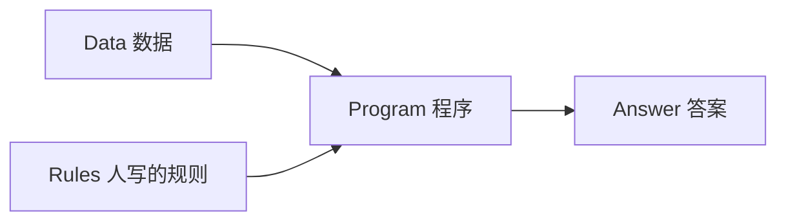

机器学习把顺序倒过来——"人给答案，机器找规则"：

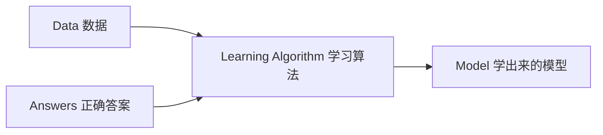

模型训练好之后，就可以对没见过的新数据做预测：

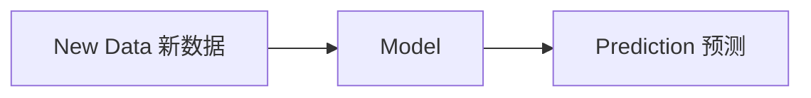

> 💡 **一句话记住**：传统编程是"数据 + 规则 → 答案"；机器学习是"数据 + 答案 → 规则（模型）"。

### 3.2 本节小结

机器学习的本质，是把"找规律"这件原本由人做的事交给了算法。人要做的事情变成了三件：**准备数据、定义任务、评价效果**。

---

## 4. 机器学习的核心词汇：数据、特征、标签、模型、参数

这一节是全章最重要的地基。后面所有章节——一直到 LLM 和 NPU 部署——都在反复使用这几个词。

### 4.1 一个贯穿本章的例子

假设我们手里有一份人体动作识别数据集（用 IMU 惯性传感器采集）：

| 加速度X | 加速度Y | 加速度Z | 角速度X | ... | 动作 |
|---:|---:|---:|---:|---|---|
| 0.12 | 0.43 | 9.61 | 0.31 | ... | Walking |
| 4.21 | 1.12 | 3.18 | 5.91 | ... | Fall |

这一张表里，藏着机器学习最重要的四个概念。

### 4.2 特征（Feature）

> **定义**：特征（Feature）是模型用来做判断的**输入信息**。

上表中的加速度、角速度各列就是特征。再如预测房价时：

```text
面积、楼层、房龄、位置、房间数 → 都是 Feature
```

特征选得好不好，直接决定模型的上限。一份充满噪声、与目标无关的特征，再强的模型也救不回来。

### 4.3 标签（Label）

> **定义**：标签（Label）是我们希望模型预测的**答案**。

上表中"动作"那一列（Walking / Fall）就是标签。房价预测中，标签是价格；跌倒识别中，标签是 Fall / Normal。

**有没有标签，是区分机器学习任务类型的第一分水岭**（第 6 节详述）。

### 4.4 模型（Model）

> **定义**：模型（Model）是一个由数据学习得到的**数学函数**，它把特征映射为预测结果。

用符号表示，机器学习的目标就是找到一个函数，使：

```text
Model(X) ≈ y
```

其中 `X` 是特征（Features），`y` 是标签（Labels）。

### 4.5 参数（Parameter）

> **定义**：参数（Parameter）是模型内部那些**需要通过训练来确定的数值**。

以最简单的线性模型为例：

```text
y = wx + b
```

这里的 `w` 和 `b` 就是参数。**训练的本质，就是寻找一组合适的参数，让模型的预测尽可能接近真实答案**。

这个思想在深度学习时代完全不变，变的只是规模：

```text
Linear Regression：可能只有几个参数
LLM：可能有几十亿甚至几千亿个参数
```

### 4.6 小结：一张对照表

| 概念 | 英文 | 通俗理解 | 动作识别例子 |
|---|---|---|---|
| 数据 | Data | 所有素材 | 整张数据集 |
| 特征 | Feature | 判断依据 | 加速度、角速度 |
| 标签 | Label | 标准答案 | Walking / Fall |
| 模型 | Model | 学出来的函数 | Model(X) ≈ y |
| 参数 | Parameter | 函数里待定的数 | w、b（或神经网络的权重） |

---

## 5. 训练与推理：AI 系统的两个阶段

这是整个 AI 技术栈最重要的一对概念，没有之一。

### 5.1 训练（Training）

> **定义**：训练（Training）是利用数据**寻找模型参数**的过程。

训练的循环是这样的：

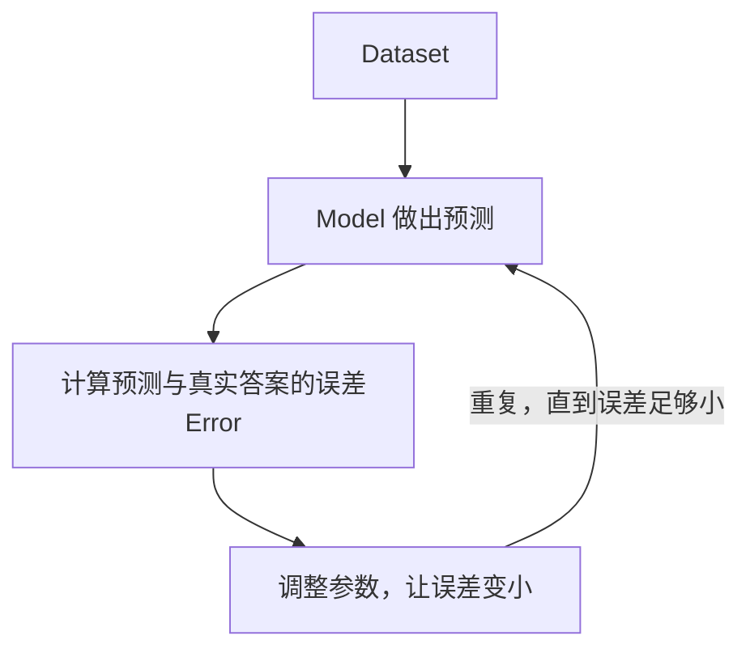

训练阶段的标志：**需要数据、需要标签、需要反复迭代、计算量大**。

### 5.2 推理（Inference）

> **定义**：推理（Inference）是使用训练好的模型**对新输入做预测**的过程。

```text
Input
 ↓
Trained Model
 ↓
Output
```

下面两个例子都是推理：

```text
摄像头图像 → YOLO → person
Prompt     → Qwen → Response
```

### 5.3 为什么这对概念贯穿整条学习路线

后面要学的 llama.cpp、vLLM、RKNN、RKLLM，本质上都在解决同一个问题：

> **Inference 怎么更快、更省内存、更适合特定硬件。**

所以请从第一章就牢牢记住：

```text
Training ≠ Inference
训练 = 学参数（离线、慢、耗资源）
推理 = 用参数（在线、要快、要省）
```

端侧 AI 工程的主战场，几乎全在推理这一侧。

---

## 6. 机器学习的三大类型

按"数据里有没有答案、以及答案以什么形式给出"，机器学习分成三大类：

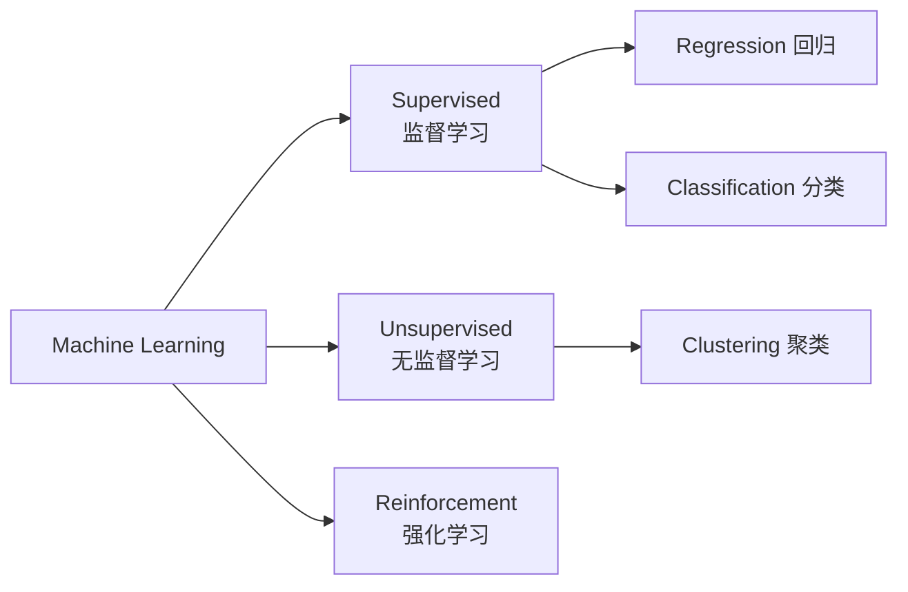

### 6.1 监督学习（Supervised Learning）

> **定义**：训练数据里**每条样本都带有正确答案（标签）**的学习方式。

```text
Feature          Label
身高 体重     →   男 / 女
传感器数据    →   跌倒 / 正常
图片          →   猫 / 狗
房屋信息      →   房价
```

监督学习有两个典型任务：**回归**（预测数值）和**分类**（预测类别），第 7、9 节分别详述。

### 6.2 无监督学习（Unsupervised Learning）

> **定义**：训练数据**没有标签**，让机器自己发现数据内部结构的学习方式。

```text
Song 1: danceability, energy, tempo ...
Song 2: danceability, energy, tempo ...
Song 3: danceability, energy, tempo ...
         ↓
没人告诉机器正确答案
         ↓
机器自己发现"哪些歌比较像"
```

典型任务是**聚类**（Clustering），第 11 节详述。

### 6.3 强化学习（Reinforcement Learning）

> **定义**：不给标准答案，只给**奖励（Reward）信号**，让智能体在与环境的交互中不断调整策略的学习方式。

```text
Agent（智能体）
  ↓ 采取 Action（行动）
Environment（环境）
  ↓ 返回 State（新状态）+ Reward（奖励）
Agent 根据奖励调整策略
  ↓
循环往复
```

本章只需要知道它的位置。这套思想后面会在 RLHF、PPO、GRPO、AI Agent 中再次出现。

### 6.4 对比小结

| 类型 | 数据里有什么 | 学什么 | 典型任务 |
|---|---|---|---|
| 监督学习 | 特征 + 标签 | 特征 → 标签的映射 | 回归、分类 |
| 无监督学习 | 只有特征 | 数据的内部结构 | 聚类、降维 |
| 强化学习 | 状态 + 奖励 | 什么行动能拿更多奖励 | 游戏、控制、对齐 |

---

## 7. 回归：预测一个数字

### 7.1 什么是回归

> **定义**：回归（Regression）是预测**连续数值**的监督学习任务。

```text
输入                输出
面积 + 位置     →   房价
温度 + 时间     →   功耗
速度 + 负载     →   电流
历史销售数据    →   下月销售额
```

判断口诀：**答案是一个可以连续变化的数，就是回归**。

### 7.2 线性回归：一切模型的起点

最简单的回归模型：

```text
y = wx + b
```

- `x`：输入特征（比如面积）；
- `w`：权重，表示面积每增加 1，房价变化多少；
- `b`：偏置，表示"基础价"；
- `y`：预测的房价。

`w` 和 `b` 就是模型参数。训练线性回归，就是找到一组 `w, b`，让预测值 `ŷ` 尽量接近真实值 `y`。

> 💡 **类比**：就像你根据经验估房价——"每平米 1 万 × 面积 + 装修溢价"。`w` 是"每平米多少钱"，`b` 是"基础溢价"。线性回归就是用数据把这两个数定下来。

### 7.3 损失函数：模型怎么知道自己有多差

模型要改进，先得能量化"现在有多差"。这就是损失函数（Loss Function）的作用。

回归中最经典的是 **MSE（Mean Squared Error，均方误差）**：

```text
对每个样本：真实值 - 预测值 = 误差（Error）
            误差取平方（Square）
            所有样本求平均（Average）

MSE = average((y - ŷ)²)
```

为什么要平方？两个原因：一是避免正负误差相互抵消；二是让大误差受到更重的惩罚。

训练的核心目标一句话：**Minimize Loss（让损失尽可能小）**。这个思想会一路延续到神经网络和 LLM——训练任何模型，本质上都是在最小化某种损失。

### 7.4 动手：第一个回归程序

```python
from sklearn.model_selection import train_test_split
from sklearn.linear_model import LinearRegression
from sklearn.metrics import mean_squared_error, r2_score

# 1. 把数据分成训练集和测试集（第 8 节详述）
X_train, X_test, y_train, y_test = train_test_split(
    X, y, test_size=0.2, random_state=42
)

# 2. 创建模型
model = LinearRegression()

# 3. 训练：从训练数据学习参数
model.fit(X_train, y_train)

# 4. 推理：对测试集做预测
y_pred = model.predict(X_test)

# 5. 评估
print("MSE:", mean_squared_error(y_test, y_pred))
print("R2:", r2_score(y_test, y_pred))
```

暂时不要纠结 API 细节，真正要理解的是这个结构：

```text
fit()     →  训练模型（学参数）
predict() →  模型推理（用参数）
```

### 7.5 回归的评估指标

| 指标 | 全称 | 含义 | 特点 |
|---|---|---|---|
| MAE | Mean Absolute Error | 平均绝对误差 | 直观，单位与目标一致 |
| MSE | Mean Squared Error | 均方误差 | 惩罚大误差，最常用 |
| RMSE | Root MSE | MSE 开根号 | 单位与目标一致，兼顾两者 |
| R² | R-squared | 模型解释了多大比例的数据变化 | 越接近 1 越好 |

---

## 8. 训练集、验证集、测试集

### 8.1 为什么不能拿全部数据训练

假设有 1000 条数据，全部拿去训练，然后再用同样的 1000 条评估：

```text
训练数据 → 模型 → 又用训练数据考它
```

这就像**考前把答案发给学生**——分数再高也证明不了什么。模型可能只是把训练数据"背"下来了。

我们真正关心的是：

> **模型面对从来没见过的数据，还能不能工作？**

> 💡 **类比**：训练集是"课后作业"，验证集是"模拟考"，测试集是"高考"。高考题必须保密到最后，否则成绩没有意义。

### 8.2 三个集合的分工

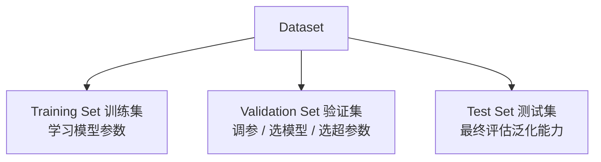

最简单的做法：80% 训练 + 20% 测试。

> ⚠️ **铁律：测试集不能参与训练，也不能参与调参。** 否则就构成 Data Leakage（数据泄漏）——评估结果虚高，上线后现原形。

### 8.3 过拟合、欠拟合与泛化

**欠拟合（Underfitting）**：模型太简单，连训练数据都拟合不好。

```text
Train Error 高
Test Error  高
```

**过拟合（Overfitting）**：模型把训练数据的细节和噪声都背了下来，遇到新数据反而失效。

```text
Train Error 很低
Test Error  很高
```

> 💡 **类比**：过拟合像一个只会死记硬背的学生——做过的题全对，换个问法就蒙；欠拟合像没复习的学生——什么题都不会。

我们真正想要的状态叫**泛化（Generalization）**：

```text
Training Performance ≈ Testing Performance
```

**泛化能力是评价一切模型的终极标准**。

---

## 9. 分类：预测一个类别

### 9.1 什么是分类

> **定义**：分类（Classification）是预测**离散类别**的监督学习任务。

```text
图片      → Cat / Dog
邮件      → Spam / Normal
动作      → Walking / Sitting / Fall
产品      → OK / Defect
手势信号   → Gesture 1 / Gesture 2 / Gesture 3
```

和回归的分界线很清楚：**回归的答案是一个数，分类的答案是一个类别**。

### 9.2 二分类与多分类

- **二分类（Binary Classification）**：只有两个类别，如 Fall / Normal；
- **多分类（Multi-class Classification）**：多个类别，如 Walking / Running / Sitting / Standing / Fall。

### 9.3 逻辑回归：名字叫回归，干的却是分类

这是初学者最容易困惑的地方。**Logistic Regression 虽然名字叫 Regression，但它是一个分类器**。

它的做法是：先输出一个**概率**——

```text
P(y = 1) = 0.92
（模型认为有 92% 的可能属于类别 1）
```

再用一个阈值把概率变成类别：

```python
if probability > 0.5:
    class = 1
else:
    class = 0
```

所以逻辑回归是一个非常重要的**线性分类器**，也是很多实际项目的首选 baseline。

### 9.4 为什么不能只看准确率

假设跌倒检测数据：

```text
1000 个样本：990 个正常，10 个跌倒
```

一个"懒模型"永远预测 Normal：

```text
Accuracy = 990 / 1000 = 99%
```

看起来 99% 非常优秀，实际上 10 个跌倒**一个都没识别出来**——而这个系统的全部意义就是识别跌倒。

> ⚠️ **结论：在类别不平衡的场景，Accuracy 会骗人。** 必须看更细的指标。

### 9.5 混淆矩阵：把预测结果拆成四类

二分类的所有预测结果，都可以落进四个格子：

```text
                 Prediction
               Positive Negative

Actual Positive    TP      FN
Actual Negative    FP      TN
```

| 缩写 | 全称 | 跌倒检测中的含义 |
|---|---|---|
| TP | True Positive | 真跌倒了，模型也说跌倒 ✅ |
| TN | True Negative | 没跌倒，模型也说没跌倒 ✅ |
| FP | False Positive | 没跌倒，模型误报跌倒（狼来了） |
| FN | False Negative | 真跌倒了，模型说没跌倒（漏报！） |

对安全系统来说，**FN（漏报）往往是最严重的错误**。

### 9.6 Precision 与 Recall：一枚硬币的两面

**Precision（精确率）**：模型说"是正类"的样本里，有多少是真的？

```text
Precision = TP / (TP + FP)
```

Precision 高 = 模型很少乱报警。

**Recall（召回率）**：所有真正的正类里，模型找出了多少？

```text
Recall = TP / (TP + FN)
```

Recall 高 = 模型很少漏掉真实事件。

**F1 Score**：两者的调和平均，用来综合评价：

```text
F1 = 2 × Precision × Recall / (Precision + Recall)
```

> 💡 **怎么选指标**：
> - 跌倒检测、疾病筛查 → **优先 Recall**（宁可误报，不可漏报）；
> - 垃圾邮件过滤 → **优先 Precision**（宁可漏掉垃圾邮件，不能误删重要邮件）。

### 9.7 ROC 与 AUC（概念级）

分类阈值（上面那个 0.5）调高调低，Precision 和 Recall 会此消彼长。**ROC 曲线**描述的就是阈值变化时模型整体的表现，**AUC** 是曲线下面积，越接近 1 模型越好。本阶段知道含义即可，Microsoft 的 [Logistic Regression 课程](https://github.com/microsoft/ML-For-Beginners/blob/main/2-Regression/4-Logistic/README.md)有详细讲解。

### 9.8 动手：第一个分类程序

```python
from sklearn.model_selection import train_test_split
from sklearn.linear_model import LogisticRegression
from sklearn.metrics import classification_report, confusion_matrix

# stratify=y 保证训练集和测试集中各类别比例一致
X_train, X_test, y_train, y_test = train_test_split(
    X, y, test_size=0.2, random_state=42, stratify=y
)

model = LogisticRegression(max_iter=1000)
model.fit(X_train, y_train)

y_pred = model.predict(X_test)

print(confusion_matrix(y_test, y_pred))       # 混淆矩阵
print(classification_report(y_test, y_pred))  # Precision/Recall/F1 一览
```

---

## 10. 经典分类器巡礼

逻辑回归之外，经典机器学习还有几个常用分类器。本阶段不要求掌握数学推导，建立直觉即可。

### 10.1 KNN（K 近邻）

> **思想**：看新样本周围最近的 K 个样本是什么类别，少数服从多数。

```text
New Point → 找最近的 K 个样本 → 投票 → Class
```

- ✅ 优点：思想直观、几乎不需要训练；
- ❌ 缺点：数据量大时推理慢；对特征尺度敏感（所以要做 13.5 节的归一化）。

### 10.2 决策树（Decision Tree）

> **思想**：像"二十个问题"游戏一样，不断用特征提问，把样本一步步分到叶子节点。

```text
Feature A > x ?
      │
  ┌───┴───┐
 Yes      No
```

- ✅ 优点：可解释性强（能看到完整判断路径），能处理非线性关系；
- ❌ 缺点：容易过拟合（一棵树可以硬背下所有训练样本）。

### 10.3 随机森林（Random Forest）

> **思想**：训练很多棵各自略有差异的决策树，让它们投票。

```text
很多 Decision Tree
        ↓
     Voting
        ↓
     Output
```

单棵树不稳定，一片森林的集体决策就稳定多了——这是"集成学习（Ensemble Learning）"思想的代表。工程实践中，随机森林经常是表格数据任务的第一梯队选择。

### 10.4 SVM（支持向量机）

> **思想**：找到一个能**最大化类别间隔（Margin）**的决策边界。

前期只需要认识三个词：Decision Boundary（决策边界）、Margin（间隔）、Kernel（核技巧，用来处理非线性）。本阶段到此为止。

### 10.5 对比小结

| 分类器 | 一句话思想 | 适合场景 |
|---|---|---|
| 逻辑回归 | 线性边界 + 概率输出 | 需要 baseline、需要概率 |
| KNN | 近朱者赤 | 小数据、快速原型 |
| 决策树 | 不停提问 | 需要强解释性 |
| 随机森林 | 多树投票 | 表格数据的主力 |
| SVM | 拉大间隔 | 小样本、高维特征 |

---

## 11. 无监督学习与聚类

### 11.1 无监督学习是什么

> **定义**：无监督学习（Unsupervised Learning）处理**没有标签**的数据，目标是发现数据本身的结构。

最常见的问题是："这堆数据里，哪些样本比较像？"

### 11.2 聚类（Clustering）

> **定义**：聚类（Clustering）是把相似的样本自动分组的无监督学习方法。

```text
Unlabelled Data（无标签数据）
      ↓
Algorithm
      ↓
Cluster A / Cluster B / Cluster C
```

常见用途：数据探索、用户分群、异常模式发现、数据预处理。

### 11.3 K-Means：最经典的聚类算法

假设 `K = 3`，要把数据分成三组，K-Means 的做法：

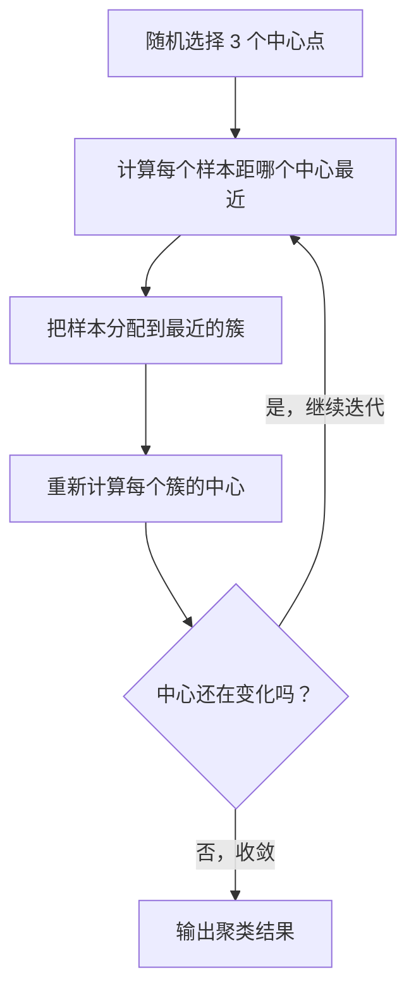

代码非常短：

```python
from sklearn.cluster import KMeans

model = KMeans(n_clusters=3, random_state=42)
labels = model.fit_predict(X)
```

> ⚠️ **注意**：这里的 `labels` 不是人工标注的真实答案，而是 **K-Means 自己产生的簇编号**（Cluster ID）。这也正是无监督学习的特点——机器给出的分组，需要人来解读含义。

### 11.4 监督 vs 无监督：一张表记牢

| 类型 | 是否有标签 | 典型任务 |
|---|---|---|
| 监督学习 | 有 | Regression / Classification |
| 无监督学习 | 没有 | Clustering |

同一个传感器数据集的两种用法：

```text
IMU 数据 + 人工标注的动作类别 → Classification（监督）
IMU 数据，没有任何标签       → Clustering（无监督）
```

---

## 12. 强化学习：先混个脸熟

强化学习（Reinforcement Learning, RL）不再给"正确答案"，而是给"奖励"：

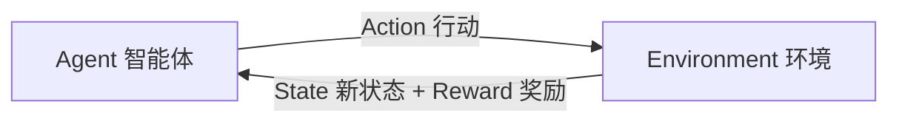

智能体根据奖励不断调整策略，循环往复。

> 💡 **类比**：训练小狗——不会给它一本"正确动作手册"（标签），而是在它做对时给零食（奖励），做错时不给。狗自己摸索出"什么情况下该做什么"。

这套思想后面会在这些地方再次出现：

```text
RLHF（人类反馈强化学习，训练 ChatGPT 类模型的关键技术）
PPO / GRPO（具体算法）
AI Agent（智能体决策）
```

现在只需要知道它的位置和基本循环，不必深入。

---

## 13. 机器学习工程实战

前面的概念解决"是什么"，这一节解决"怎么做"。Microsoft 课程的 [Techniques of Machine Learning](https://github.com/microsoft/ML-For-Beginners/blob/main/1-Introduction/4-techniques-of-ML/README.md) 是这部分的最好补充阅读。

### 13.1 完整的机器学习工作流

现实中的机器学习工程，大致是一条十二步流水线：

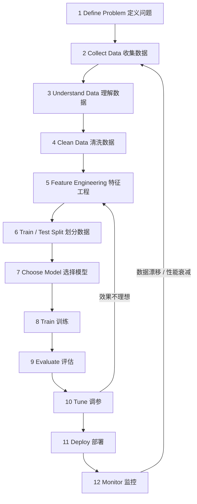

注意：**模型本身往往只是整个系统的一小部分**。数据的质量、问题的定义、部署后的监控，通常比"换个更强的模型"影响更大。

### 13.2 第一步不是选模型，而是问对问题

> **原则：先问问题，再选算法。**

错误姿势：

```text
我想用 Random Forest → 找个问题来套
```

正确姿势：

```text
我要解决什么问题？
      ↓
输出是什么？有没有标签？
      ↓
是数值还是类别？
      ↓
选择 ML Task（任务类型）
      ↓
再选择 Algorithm（具体算法）
```

可以固化成这样一棵判断树：

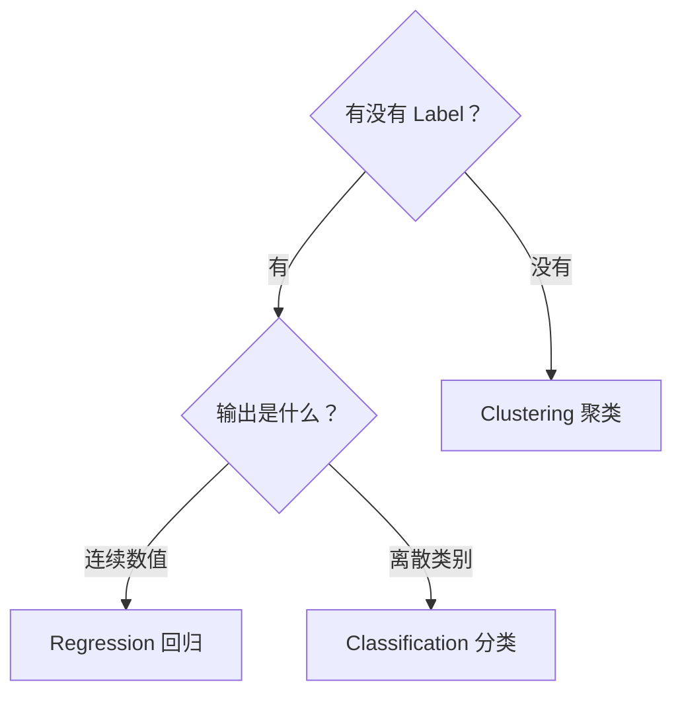

### 13.3 数据预处理：脏数据是常态

现实数据几乎从来不会"开箱即用"，常见问题：

```text
缺失值、异常值、重复数据
类别字符串、量纲不一致
错误数据、噪声、类别不平衡
```

所以标准动作是：

```text
Raw Data → Clean（清洗）→ Transform（变换）→ Feature → Model
```

> 💡 **工程铁律**：模型性能很多时候首先取决于数据质量，而不是模型有多高级。"Garbage in, garbage out"（垃圾进，垃圾出）说的就是这件事。

### 13.4 特征工程：传统机器学习的灵魂

传统机器学习特别依赖**人工设计特征**。以原始 IMU 信号为例：

```text
ax(t), ay(t), az(t), gx(t), gy(t), gz(t)
```

工程师可以人为提取统计特征：

```text
Mean（均值）、Variance（方差）、RMS（均方根）
Peak（峰值）、Skewness（偏度）、Kurtosis（峰度）
FFT（频谱）、Energy（能量）
```

组成特征向量后送进分类器。**这正是大量嵌入式传感器应用的标准流程**——包括智能鞋垫这类项目。

而深度学习带来的最大变化之一就是：

> **尽量让神经网络自己学特征（Representation Learning）。**

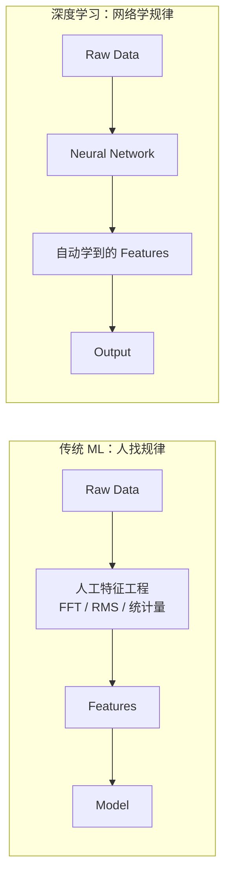

这是从本章通往下一章"深度学习"的桥梁。

### 13.5 特征缩放与一个隐蔽的陷阱

不同特征的数值范围可能差好几个数量级：

```text
Temperature: 20 ~ 100
Motor Speed: 0 ~ 10000
Voltage:     0 ~ 24
```

很多算法（KNN、SVM、逻辑回归）会因此被"大数值特征"主导，所以需要缩放：

```python
from sklearn.preprocessing import StandardScaler

scaler = StandardScaler()
X_train = scaler.fit_transform(X_train)
X_test  = scaler.transform(X_test)     # 注意：测试集只 transform！
```

> ⚠️ **高频陷阱**：scaler 只能在**训练集**上 `fit`。如果在全量数据上 fit，测试数据的统计信息就泄漏进了预处理过程——这就是另一种形式的 Data Leakage。记住口诀：**训练集 `fit_transform`，测试集只 `transform`**。

### 13.6 Scikit-learn 的统一 API 思维

经典机器学习阶段最常用的工具是 Scikit-learn，它几乎所有模型都遵循同一个接口：

```python
model = SomeModel()
model.fit(X_train, y_train)     # 训练：学参数
y_pred = model.predict(X_test)  # 推理：用参数
```

四个动词的含义：

| 方法 | 含义 | 备注 |
|---|---|---|
| `fit()` | 从数据学习 | 训练模型 / 学统计量 |
| `predict()` | 做预测 | 推理 |
| `transform()` | 做转换 | 归一化、降维、编码 |
| `fit_transform()` | 学习 + 转换 | 通常只对训练数据用 |

学会这套 API 思维后，换任何模型都只是换一个类名——这让你可以把注意力放在问题本身，而不是工具上。

### 13.7 Pipeline：把流程串成一条线

真实流程往往是"缩放 → 变换 → 模型"多步串联。Scikit-learn 的 `Pipeline` 把它们打包：

```python
from sklearn.pipeline import Pipeline
from sklearn.preprocessing import StandardScaler
from sklearn.linear_model import LogisticRegression

model = Pipeline([
    ("scaler", StandardScaler()),
    ("classifier", LogisticRegression())
])

model.fit(X_train, y_train)
y_pred = model.predict(X_test)
```

它的价值：**让预处理和模型形成统一、可复现的推理流程**——部署时不会再出现"忘了对输入做归一化"这类事故。这个思想和后续 AI Runtime / Model Graph 的"把整条数据处理链固化下来"一脉相承。

---

## 14. 模型选择的工程智慧

### 14.1 模型不是越复杂越好

一个重要原则：**简单模型能解决问题时，就不要上复杂模型**。

```text
10 个数值传感器特征
+ 几千条数据
+ 二分类
```

这种问题，Logistic Regression / Random Forest / SVM 很可能已经足够，而且：

```text
模型更小、速度更快、功耗更低、更容易部署、更好解释
```

### 14.2 为什么经典 ML 对端侧 AI 特别重要

端侧系统不应该默认"什么问题都上大模型"。很多实际设备任务：

```text
异常检测、传感器分类、设备健康监测
简单视觉分类、预测维护、状态识别
```

完全可以用经典模型 + 微型神经网络搞定，优势是：

```text
模型尺寸小、RAM 占用小、计算量低
延迟低、功耗低、可解释性更强
```

成熟的 Edge AI 思维是：

> **根据任务选择最合适的模型，而不是选择最流行的模型。**

这也是为什么本路线把经典机器学习放在第一章——它不是"过时的前置知识"，而是端侧工程师工具箱里最趁手的一层。

### 14.3 Responsible AI：几个必须建立的意识

Microsoft 在课程里专门讲了 [Fairness and Machine Learning](https://github.com/microsoft/ML-For-Beginners/blob/main/1-Introduction/3-fairness/README.md)。不需要投入大量时间，但要有这几个意识：

数据可能带有偏见（Sampling Bias、Class Imbalance、Historical Bias），而偏见会沿着链条放大：

```text
Training Data Bias → Model Bias → Prediction Bias
```

所以模型评价不能只看整体 Accuracy，有时还要分群体、分场景、看极端输入下的表现。对工程系统来说，一个真正可用的 AI 系统是多项性质的综合：

```text
Accuracy + Robustness + Reliability + Safety + Explainability
```

---
## 15. 机器学习简史：建立时间轴，不要背年份

对应课程：[History of Machine Learning](https://github.com/microsoft/ML-For-Beginners/blob/main/1-Introduction/2-history-of-ML/README.md)。

只需要记住几个关键阶段：

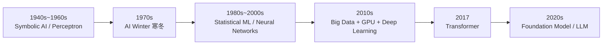

历史的价值不是背年份，而是理解一个规律：

> **AI 的每一次跃迁，都同时依赖算法、数据和算力三者的进步。**

```text
Algorithm（算法） + Data（数据） + Compute（算力）
```

记住这个三角，后面理解"为什么 LLM 出现在 2020 年代而不是 1990 年代"（Transformer 思想 + 互联网级数据 + GPU 算力同时到位）就非常自然。

---

## 16. 本章实验

光看不练等于没学。以下三个实验各需要 1~2 小时，全部可以用 Python + Scikit-learn 完成。

### 实验 1：回归

找一份二维或多维传感器数据（或任意表格数据），预测一个连续数值。

**步骤与验收标准**：

```text
load → split → fit → predict → MSE → R²
```

- [ ] 完整跑通上述六步；
- [ ] 能说出 train_test_split 各参数的含义；
- [ ] 能解释 R² 数值代表什么。

### 实验 2：分类

使用一份动作识别 / Iris / Wine 数据集，完成一个分类任务。

**步骤与验收标准**：

```text
Feature → Logistic Regression → Class
```

- [ ] 输出 Confusion Matrix；
- [ ] 输出 Accuracy / Precision / Recall / F1；
- [ ] 能回答"这个任务里 FN 和 FP 哪个更严重、为什么"。

### 实验 3：聚类

把实验 2 的数据集**去掉所有标签**，用 K-Means 聚类。

**步骤与验收标准**：

```text
Feature only → K-Means → Cluster
```

- [ ] 观察自动形成的簇与真实类别是否存在对应关系；
- [ ] 能用自己的话说出"监督学习与无监督学习的本质区别"。

---

## 17. 一个完整的最小模板

以后看到任何经典 ML 项目，都可以先套这个框架检查自己是否理解了主干：

```python
# 1. Load Data（加载数据）
X = ...
y = ...

# 2. Split（划分训练/测试集）
from sklearn.model_selection import train_test_split

X_train, X_test, y_train, y_test = train_test_split(
    X, y, test_size=0.2, random_state=42
)

# 3. Preprocess（预处理：缩放，注意只在训练集上 fit）
from sklearn.preprocessing import StandardScaler

scaler = StandardScaler()
X_train = scaler.fit_transform(X_train)
X_test  = scaler.transform(X_test)

# 4. Model（选择模型）
from sklearn.linear_model import LogisticRegression

model = LogisticRegression()

# 5. Train（训练）
model.fit(X_train, y_train)

# 6. Inference（推理）
y_pred = model.predict(X_test)

# 7. Evaluation（评估）
from sklearn.metrics import classification_report

print(classification_report(y_test, y_pred))
```

看到这段代码，应该能直接在脑中映射成：

```text
Dataset → Train/Test → Preprocess → Model → Training → Inference → Evaluation
```

而不是只记住 Python API。

---

## 18. 本章小结

### 18.1 六个核心思维模型

1. **AI ⊃ ML ⊃ DL ⊃ LLM**：它们是包含关系，不是同义词；
2. **Machine Learning = Learning from Data**：从数据学规律，而不是人写规则；
3. **Training = 学参数，Inference = 用参数**：这对概念贯穿整条学习路线；
4. **Regression = 预测数字，Classification = 预测类别，Clustering = 发现分组**；
5. **真正重要的是 Generalization**：模型表现 ≠ 训练表现，测试集必须独立；
6. **好数据 + 对的指标 + 合适的模型 > 盲目上大模型**。

### 18.2 术语表

| 术语 | 英文 | 一句话解释 |
|---|---|---|
| 人工智能 | AI | 让机器完成需要人类智能的任务的技术总称 |
| 机器学习 | Machine Learning | 从数据中学习预测/决策模型的方法 |
| 监督学习 | Supervised Learning | 数据带标签 |
| 无监督学习 | Unsupervised Learning | 数据无标签 |
| 强化学习 | Reinforcement Learning | 通过奖励信号学习策略 |
| 特征 | Feature | 模型的输入信息 |
| 标签 | Label | 希望模型预测的答案 |
| 模型 | Model | 学出来的函数，Model(X) ≈ y |
| 参数 | Parameter | 训练中确定的模型内部数值 |
| 训练 | Training | 学参数的过程 |
| 推理 | Inference | 用参数对新输入做预测 |
| 损失函数 | Loss Function | 量化预测有多差的函数 |
| 过拟合 | Overfitting | 背熟训练数据、新数据失效 |
| 欠拟合 | Underfitting | 连训练数据都拟合不好 |
| 泛化 | Generalization | 在未见数据上的表现能力 |
| 数据泄漏 | Data Leakage | 测试信息混入训练过程，评估虚高 |
| 混淆矩阵 | Confusion Matrix | TP/TN/FP/FN 四格表 |
| 特征工程 | Feature Engineering | 人工设计输入特征 |

### 18.3 自测清单

如果下面的问题基本都能自己解释，本章就可以结束：

- [ ] 能解释 AI、ML、DL、LLM 的包含关系
- [ ] 能解释 Symbolic AI 和 Machine Learning 的区别
- [ ] 能解释 Feature、Label、Model、Parameter
- [ ] 能解释 Training 和 Inference
- [ ] 能区分 Supervised / Unsupervised / Reinforcement Learning
- [ ] 能判断一个问题属于 Regression、Classification 还是 Clustering
- [ ] 能解释为什么需要 Train / Test Split
- [ ] 能解释 Overfitting 和 Generalization
- [ ] 能解释 Accuracy、Precision、Recall、F1
- [ ] 能解释 MSE 和 R² 大致在表示什么
- [ ] 能使用 Scikit-learn 完成一次 `fit()` + `predict()`
- [ ] 能理解 `fit_transform()` 与 `transform()` 的区别
- [ ] 能完成一个 Regression 小实验
- [ ] 能完成一个 Classification 小实验
- [ ] 能完成一个 K-Means 小实验
- [ ] 能说明为什么某些端侧任务不需要神经网络或 LLM

**不要求**：手推所有 ML 数学公式、精通所有 Scikit-learn 模型、学完仓库全部 26 节课程。这些都不是当前阶段的目标。

---

## 19. 学习资源与推荐阅读顺序

本章对应两个 Microsoft 开源课程仓库：

### 19.1 核心仓库

| 仓库 | 定位 | 本章用法 |
|---|---|---|
| [microsoft/AI-For-Beginners](https://github.com/microsoft/AI-For-Beginners) | AI 总览课程（含 NN / CV / NLP / RL） | 只看前两课：AI 简史 + 符号 AI |
| [microsoft/ML-For-Beginners](https://github.com/microsoft/ML-For-Beginners) | 经典机器学习课程（Scikit-learn） | **主仓库**，重点看 Introduction / Regression / Classification / Clustering |

### 19.2 推荐阅读顺序

**Stage 1 · 建立 AI 世界观**

1. [Introduction and History of AI](https://github.com/microsoft/AI-For-Beginners/blob/main/lessons/1-Intro/README.md)
2. [Knowledge Representation and Expert Systems](https://github.com/microsoft/AI-For-Beginners/blob/main/lessons/2-Symbolic/README.md)
3. [Introduction to Machine Learning](https://github.com/microsoft/ML-For-Beginners/blob/main/1-Introduction/1-intro-to-ML/README.md)

目标：AI / ML / DL / Symbolic AI 的关系彻底清楚。

**Stage 2 · 建立 ML 工作流**

- [Techniques of Machine Learning](https://github.com/microsoft/ML-For-Beginners/blob/main/1-Introduction/4-techniques-of-ML/README.md)
- [Prepare and Visualize Data](https://github.com/microsoft/ML-For-Beginners/blob/main/2-Regression/2-Data/README.md)

目标：掌握 Problem → Data → Feature → Label → Train → Test → Model → Metric 这条链。

**Stage 3 · 回归**

- [Get started with Python and Scikit-learn](https://github.com/microsoft/ML-For-Beginners/blob/main/2-Regression/1-Tools/README.md)
- [Linear and Polynomial Regression](https://github.com/microsoft/ML-For-Beginners/blob/main/2-Regression/3-Linear/README.md)

目标：亲手运行 LinearRegression + train_test_split，看懂 MSE 和 R²。

**Stage 4 · 分类**

- [Classification 目录](https://github.com/microsoft/ML-For-Beginners/tree/main/4-Classification)
- [Logistic Regression / ROC / AUC](https://github.com/microsoft/ML-For-Beginners/blob/main/2-Regression/4-Logistic/README.md)

目标：掌握 Logistic Regression、Confusion Matrix、Precision / Recall / F1、ROC-AUC。

**Stage 5 · 聚类**

- [Clustering 目录](https://github.com/microsoft/ML-For-Beginners/tree/main/5-Clustering)
- [K-Means](https://github.com/microsoft/ML-For-Beginners/tree/main/5-Clustering/2-K-Means)

目标：理解 Labeled vs Unlabeled 的区别即可。

**Stage 6 · 选读扩展（不要让它阻塞下一章）**

- [Fairness / Responsible AI](https://github.com/microsoft/ML-For-Beginners/blob/main/1-Introduction/3-fairness/README.md)
- [Natural Language Processing](https://github.com/microsoft/ML-For-Beginners/tree/main/6-NLP)
- [Time Series](https://github.com/microsoft/ML-For-Beginners/tree/main/7-TimeSeries)
- [Reinforcement Learning](https://github.com/microsoft/ML-For-Beginners/tree/main/8-Reinforcement)

各主题优先级参考：

| 内容 | 优先级 |
|---|---|
| AI / ML 基本概念 | ★★★★★ |
| Training / Inference | ★★★★★ |
| Feature / Label / Model | ★★★★★ |
| Train / Test Split | ★★★★★ |
| Regression | ★★★★★ |
| Classification | ★★★★★ |
| Metrics | ★★★★★ |
| Clustering | ★★★★ |
| Feature Engineering | ★★★★ |
| Time Series | ★★★ |
| Reinforcement Learning | ★★★ |
| NLP | ★★ |
| Symbolic AI | ★★ |

---

## 20. 下一章预告：从"人找规律"到"网络学规律"

本章结束时，留下一个自然的问题：

> 特征工程这么依赖人的经验——能不能让模型**自己学特征**？

传统手势识别的流程是：

```text
Raw Sensor Signal → FFT / RMS / Kurtosis → Feature Vector → Classifier
                    （全部由工程师手工设计）
```

深度学习把它变成：

```text
Raw Signal → Neural Network → 自动学到的特征 → Class
```

也就是说：

```text
Classical ML → Feature Engineering → Neural Network → Representation Learning → Deep Learning
```

当"模型"从简单的线性函数，逐渐变成由大量神经元构成的网络，会发生什么？下一章将正式进入：

> **[02_深度学习与神经网络](02_深度学习与神经网络.md)**

---

## 附录：核心参考链接汇总

### Microsoft AI-For-Beginners

- [Repository](https://github.com/microsoft/AI-For-Beginners)
- [Introduction and History of AI](https://github.com/microsoft/AI-For-Beginners/blob/main/lessons/1-Intro/README.md)
- [Symbolic AI / Knowledge Representation](https://github.com/microsoft/AI-For-Beginners/blob/main/lessons/2-Symbolic/README.md)
- [Chinese README](https://github.com/microsoft/AI-For-Beginners/blob/main/translations/zh-CN/README.md)

### Microsoft ML-For-Beginners

- [Repository](https://github.com/microsoft/ML-For-Beginners)
- [Course README](https://github.com/microsoft/ML-For-Beginners/blob/main/README.md)
- [Introduction to ML](https://github.com/microsoft/ML-For-Beginners/blob/main/1-Introduction/1-intro-to-ML/README.md)
- [History of ML](https://github.com/microsoft/ML-For-Beginners/blob/main/1-Introduction/2-history-of-ML/README.md)
- [Responsible AI / Fairness](https://github.com/microsoft/ML-For-Beginners/blob/main/1-Introduction/3-fairness/README.md)
- [Techniques of ML](https://github.com/microsoft/ML-For-Beginners/blob/main/1-Introduction/4-techniques-of-ML/README.md)
- [Regression](https://github.com/microsoft/ML-For-Beginners/tree/main/2-Regression)
- [Regression Tools](https://github.com/microsoft/ML-For-Beginners/blob/main/2-Regression/1-Tools/README.md)
- [Data Preparation](https://github.com/microsoft/ML-For-Beginners/blob/main/2-Regression/2-Data/README.md)
- [Linear / Polynomial Regression](https://github.com/microsoft/ML-For-Beginners/blob/main/2-Regression/3-Linear/README.md)
- [Logistic Regression / ROC / AUC](https://github.com/microsoft/ML-For-Beginners/blob/main/2-Regression/4-Logistic/README.md)
- [Classification](https://github.com/microsoft/ML-For-Beginners/tree/main/4-Classification)
- [Introduction to Classification](https://github.com/microsoft/ML-For-Beginners/blob/main/4-Classification/1-Introduction/README.md)
- [Classifiers 1](https://github.com/microsoft/ML-For-Beginners/tree/main/4-Classification/2-Classifiers-1)
- [Classifiers 2](https://github.com/microsoft/ML-For-Beginners/tree/main/4-Classification/3-Classifiers-2)
- [Clustering](https://github.com/microsoft/ML-For-Beginners/tree/main/5-Clustering)
- [K-Means](https://github.com/microsoft/ML-For-Beginners/tree/main/5-Clustering/2-K-Means)
- [NLP](https://github.com/microsoft/ML-For-Beginners/tree/main/6-NLP)
- [Time Series](https://github.com/microsoft/ML-For-Beginners/tree/main/7-TimeSeries)
- [Reinforcement Learning](https://github.com/microsoft/ML-For-Beginners/tree/main/8-Reinforcement)
