# 第 2 章 深度学习与神经网络

> **所属路线**：AI 学习路线 · 第一部分
> **本章定位**：从神经元、MLP、反向传播与自动微分，一直到 CNN、RNN 的完整深度学习基础
> **核心教材**：[d2l-ai/d2l-en](https://github.com/d2l-ai/d2l-en) · [karpathy/micrograd](https://github.com/karpathy/micrograd) · [karpathy/nn-zero-to-hero](https://github.com/karpathy/nn-zero-to-hero)
> **主要框架**：PyTorch
> **前置要求**：第 1 章（AI/ML 基础）已完成；会 Python
> **学习边界**：本章在 Attention / Transformer 之前收口；第 3 章先系统掌握 PyTorch 与模型框架，Transformer、LLM、Tokenizer 放到第 4 章
> **资料检查日期**：2026-08-25

## 英文术语与读音速查

> **怎么使用这张表**：音标以美式英语为主，`ˈ` 后面的音节需要重读；CNN、RNN 等缩写按英文字母逐个读。品牌名与组合词采用技术社区中的常见读法。第一次遇到名词时先查中文含义，读完对应小节后再回来看释义，不需要一次背完。

| 英文术语 | 音标 / 常见读法 | 中文翻译 | 本章中的含义 |
|---|---|---|---|
| Deep Learning | `/ˌdiːp ˈlɝːnɪŋ/` | 深度学习 | 用多层神经网络从数据中自动学习特征和任务规律。 |
| Neural Network | `/ˈnʊrəl ˈnetwɝːk/` | 神经网络 | 由许多可训练的计算单元连接而成的模型。 |
| Neuron | `/ˈnʊrɑːn/` | 神经元 | 接收输入、加权求和，再经过激活函数输出的基本单元。 |
| MLP | `/ˌem el ˈpiː/`，逐字母读 | 多层感知机 | 由多层全连接层组成的基础神经网络。 |
| Input | `/ˈɪnpʊt/` | 输入 | 送进模型的数据，如图像、传感器序列或特征向量。 |
| Output | `/ˈaʊtpʊt/` | 输出 | 模型计算出的结果，如分类分数或预测值。 |
| Forward | `/ˈfɔːrwərd/` | 前向传播 | 输入从网络起点流向输出并得到预测的计算过程。 |
| Prediction | `/prɪˈdɪkʃən/` | 预测 | 模型根据输入给出的结果。 |
| Loss | `/lɔːs/` | 损失 | 衡量预测与真实答案差距的标量。 |
| Backward | `/ˈbækwərd/` | 反向计算 | 从损失出发，沿计算图反向求梯度的过程；代码中常见 `backward()`。 |
| Gradient | `/ˈɡreɪdiənt/` | 梯度 | 损失对参数的变化率，用来决定参数更新方向。 |
| Backpropagation | `/ˌbækˌprɑːpəˈɡeɪʃən/` | 反向传播 | 利用链式法则，从输出层向输入层逐步计算梯度。 |
| Chain Rule | `/ˈtʃeɪn ruːl/` | 链式法则 | 复合函数求导规则，也是反向传播的数学基础。 |
| Computational Graph | `/ˌkɑːmpjəˈteɪʃənəl ɡræf/` | 计算图 | 用节点和连线表示数值、运算及依赖关系的图。 |
| Autograd | `/ˈɔːtoʊ ɡræd/` | 自动求导 | 框架记录运算并自动计算梯度的机制。 |
| Parameter | `/pəˈræmɪtər/` | 参数 | 训练过程中由优化器更新的可学习数值。 |
| Weight | `/weɪt/` | 权重 | 控制输入影响大小的主要可学习参数。 |
| Bias | `/ˈbaɪəs/` | 偏置 | 在线性计算结果上额外相加的可学习参数。 |
| Activation | `/ˌæktɪˈveɪʃən/` | 激活值；激活 | 神经元的输出，也可指经过激活函数这一操作。 |
| ReLU | `/ˈriːluː/`，常读作 “ree-loo” | 线性整流单元 | 常用激活函数 `max(0, x)`。 |
| Tensor | `/ˈtensər/` | 张量 | 框架表示多维数据的统一数据结构。 |
| Shape | `/ʃeɪp/` | 形状；维度大小 | 描述 Tensor 每个维度的长度，如 `[B, C, H, W]`。 |
| Batch | `/bætʃ/` | 批次 | 一次送入模型共同计算的一组样本。 |
| Epoch | `/ˈepək/` | 训练轮次 | 训练数据集被完整使用一遍。 |
| Iteration | `/ˌɪtəˈreɪʃən/` | 迭代 | 完成一次 Batch 的前向、反向和参数更新。 |
| Optimizer | `/ˈɑːptəmaɪzər/` | 优化器 | 根据梯度更新参数的算法或程序。 |
| CNN | `/ˌsiː en ˈen/`，逐字母读 | 卷积神经网络 | 擅长处理图像和空间局部结构的网络。 |
| Convolution | `/ˌkɑːnvəˈluːʃən/` | 卷积 | 卷积核在输入上滑动并执行局部加权计算。 |
| Kernel | `/ˈkɝːnəl/` | 卷积核；计算内核 | 在 CNN 中指滑动权重窗口；在硬件层也可指算子的具体实现。 |
| Feature Map | `/ˈfiːtʃər mæp/` | 特征图 | 卷积核扫描输入后产生的一组空间特征。 |
| Channel | `/ˈtʃænəl/` | 通道 | 数据或特征的类别维度，如 RGB 的 3 个通道。 |
| Stride | `/straɪd/` | 步长 | 卷积核或池化窗口每次移动的距离。 |
| Padding | `/ˈpædɪŋ/` | 填充 | 在输入边缘补值，以控制输出尺寸和边缘信息。 |
| Pooling | `/ˈpuːlɪŋ/` | 池化 | 汇总局部区域并缩小空间尺寸的操作。 |
| Receptive Field | `/rɪˈseptɪv fiːld/` | 感受野 | 某个特征位置在原始输入中能够“看到”的区域。 |
| RNN | `/ˌɑːr en ˈen/`，逐字母读 | 循环神经网络 | 通过循环状态处理序列数据的网络。 |
| Hidden State | `/ˈhɪdən steɪt/` | 隐藏状态 | RNN 对此前序列信息的压缩表示。 |
| BPTT | `/ˌbiː piː tiː ˈtiː/`，逐字母读 | 随时间反向传播 | 把 RNN 沿时间展开后执行的反向传播。 |
| LSTM | `/ˌel es tiː ˈem/`，逐字母读 | 长短期记忆网络 | 用门控机制缓解普通 RNN 的长期依赖问题。 |
| GRU | `/ˌdʒiː ɑːr ˈjuː/`，逐字母读 | 门控循环单元 | 结构比 LSTM 更简化的一类门控循环网络。 |
| Dropout | `/ˈdrɑːpaʊt/` | 随机失活 | 训练时随机关闭部分神经元，降低过拟合风险。 |
| Batch Normalization | `/bætʃ ˌnɔːrmələˈzeɪʃən/` | 批归一化 | 对中间激活做归一化，帮助训练保持稳定。 |
| Operator / Op | `/ˈɑːpəreɪtər/`；Op `/ɑːp/` | 算子 | 模型图中的一种计算，如 Conv、ReLU 或 MatMul。 |

## 本章学习实验室

第 2 章沿用第 1 章的五层学习闭环，不以“看懂神经网络代码”为完成标准，而以能够独立训练、解释梯度与 Shape、提交可复算结果为准：

```text
阅读讲义 → 完整实验 → 独立练习 → 机器验收 → 真实任务
```

| 环节 | 入口 | 完成证据 |
|---|---|---|
| 阅读讲义 | 当前页面 | 能解释 Forward、Loss、Backward 与参数更新 |
| 完整实验 | [运行参考 Notebook](../labs/02_deep_learning_nn/完整实验.ipynb) | Autograd、MLP、CNN 三条参考链路运行成功 |
| 独立练习 | [打开练习 Notebook](../labs/02_deep_learning_nn/练习.ipynb) | 三项核心检查全部通过 |
| 机器验收 | [查看实验室说明](../labs/02_deep_learning_nn/README.md) | 生成 `exercise_result.json` |
| 真实任务 | [IMU 动作识别原型](../labs/02_deep_learning_nn/真实任务_IMU动作识别.md) | 预测、指标、参数量和工程结论可复算 |

完整实验负责拆开黑盒，练习要求脱离参考答案完成关键步骤，真实任务再把相同能力迁移到端侧传感器分类。建议完整实验 90～120 分钟、练习 120～180 分钟、真实任务 3～5 小时。环境、命令与验收标准见[第 2 章实验室导航](../labs/02_deep_learning_nn/README.md)。

---

## 本章导读

上一章结尾留下了一个问题：**特征工程这么依赖人的经验，能不能让模型自己学特征？** 本章就是回答这个问题的。

深度学习（Deep Learning）用一句话概括：

> **把很多层"可学习的数学函数"叠起来，让网络自己从原始数据中逐层提炼特征，再用损失函数和梯度把整个网络调好。**

学完本章，你应该能够：

1. 说清楚经典机器学习与深度学习的本质区别；
2. 解释一个神经元在算什么，为什么必须配激活函数；
3. 解释 MLP 为什么能拟合复杂非线性关系；
4. 从"链式法则"一路解释到 `loss.backward()` 背后发生了什么；
5. 看懂 micrograd 的 `engine.py`，理解 Autograd 不是魔法；
6. 背出标准 PyTorch 训练循环的四步动作，并解释每一步；
7. 说清楚 CNN 为什么适合图像、RNN 为什么适合序列，各自的核心概念；
8. 建立"模型 → 层 → 算子 → Kernel → 硬件"的底层视角。

**本章的学习方法**：核心是拆黑盒——先用 D2L 建立知识体系，再用 micrograd 把"反向传播"缩小到人脑能完全理解的程度，最后用 PyTorch 重写一遍。每学一个概念，追问一句：**它在 Forward 里算什么？在 Backward 里需要什么？部署到硬件上是什么算子？**

本章要建立的主干数据流：

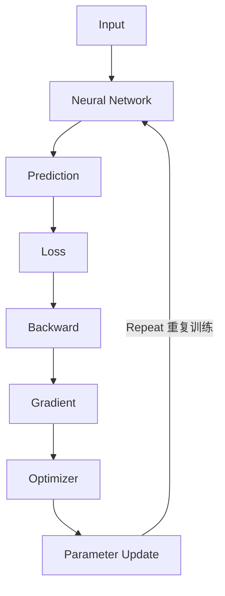

把这条链真正理解后，CNN、RNN、Transformer、LLM 都只是用不同结构实现同一种训练逻辑。

---

## 1. 从经典机器学习到深度学习

### 1.1 上一章留下的问题

传统机器学习的标准流程是"人做特征工程"：

```text
Raw IMU（原始传感器数据）
   ↓
FFT / RMS / Skewness / Kurtosis（人工提取统计特征）
   ↓
Feature Vector
   ↓
SVM / Random Forest
```

问题是：**这些特征怎么提，全靠工程师的经验和试错**。换一个任务、换一种传感器，可能整套特征设计都要重来。

### 1.2 Representation Learning：让网络自己学特征

深度学习的回答是：

> **不再人工设计特征，而是让神经网络自己从数据中学习特征。**

这叫表示学习（Representation Learning）：

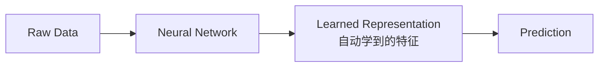

### 1.3 逐层抽象：深度学习的真正威力

深度学习强大，不只是参数多，更在于：

> **多层结构可以逐层构建越来越抽象的表示。**

以图像为例：

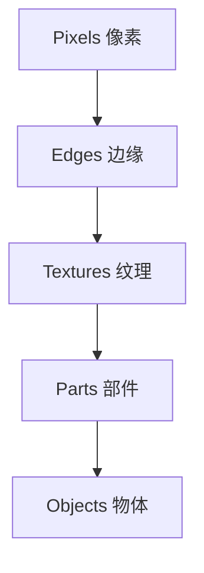

浅层学"边缘"，中层学"纹理/部件"，深层学"物体"。这种层次化表示，正是"Deep"（深）这个词的含义。

### 1.4 本节小结

- 传统 ML：**人**设计特征 → 模型分类；
- 深度学习：**网络**自己学特征（Representation Learning）；
- 网络越深，学到的表示越抽象。

---

## 2. 神经网络长什么样

### 2.1 定义

> **定义**：神经网络（Neural Network）是大量可学习的数学函数（神经元）按照一定结构连接而成的网络。

一个最简单的结构：

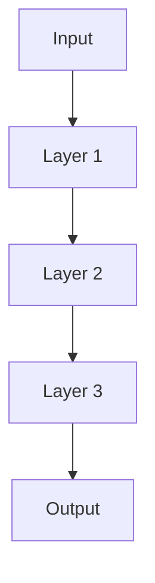

每一层做两件事：

```text
Input Tensor
    ↓
Linear Transformation（线性变换：Wx + b）
    ↓
Nonlinear Activation（非线性激活：ReLU 等）
    ↓
Output Tensor
```

整个网络是一个带参数的复合函数：

```text
f(x; θ)

x = 输入
θ = 所有可学习参数
```

训练的目标就是找到 θ，使 `f(x; θ)` 的输出尽量接近真实目标 y。

### 2.2 与生物神经元的正确关系

> ⚠️ **常见误区**：人工神经元只是**受生物神经元启发**，本质上是一组参数化的数学函数。不要试图把它当成生物神经元模拟器。

---

## 3. 神经元：最小的计算单元

### 3.1 一个神经元的内部

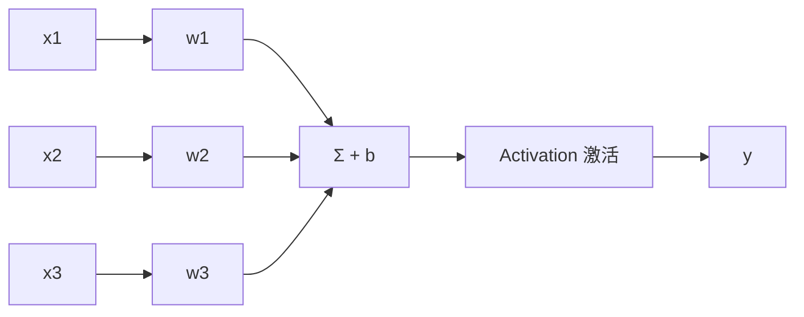

### 3.2 数学形式

```text
z = w1·x1 + w2·x2 + ... + wn·xn + b
y = activation(z)
```

向量形式：

```text
z = w · x + b
y = σ(z)
```

一个神经元 = **Linear（线性） + Activation（激活）**。

### 3.3 Weight 和 Bias

- **Weight（权重）w**：每个输入特征对输出的重要程度；
- **Bias（偏置）b**：给线性变换增加一个可学习的偏移。

一个神经元的全部参数：`[w1, w2, ..., wn, b]`。训练就是调整这组参数。

### 3.4 神经元与线性回归的关系

上一章学过 `y = wx + b`。神经元内部的 `z = wx + b` 和它一模一样。**如果没有激活函数，一个神经元 ≈ 线性回归模型**。深度学习不是突然出现一套全新的数学，而是在"线性代数 + 非线性 + 层叠 + 优化"上不断扩展。

---

## 4. 激活函数：让网络"弯"起来

### 4.1 为什么必须有非线性

先看一个致命问题。假设网络没有激活函数：

```text
Layer 1: h = W1·x
Layer 2: y = W2·h
```

代入得：`y = W2·W1·x`。令 `W = W2·W1`，则 `y = W·x`。

> **结论：两层线性层叠起来，仍然只是一个线性层。** 即使叠 100 层 Linear，本质还是 1 层 Linear——它永远学不出任何弯曲的决策边界。

因此必须插入非线性激活函数：

```text
Linear → Nonlinear → Linear → Nonlinear → ...
```

这样复合出来的函数才能拟合复杂关系。

### 4.2 三种基本激活函数

| 激活函数 | 公式 | 输出范围 | 特点与用途 |
|---|---|---|---|
| ReLU | max(0, x) | [0, +∞) | 计算最简单、正区梯度稳定，**现代网络默认首选** |
| Sigmoid | 1/(1+e⁻ˣ) | (0, 1) | 过去常用于二分类概率输出；输入绝对值大时梯度趋近 0，易梯度消失 |
| Tanh | (eˣ-e⁻ˣ)/(eˣ+e⁻ˣ) | (-1, 1) | 零中心化，经典 RNN 中常见 |

> 💡 后面在 Transformer 中还会遇到 GELU、SiLU / Swish，到时候再深入。本章掌握上面三个即可。

### 4.3 激活函数要建立的认识

```text
Activation Function
        ↓
引入 Nonlinearity
        ↓
神经网络才能表达复杂函数
```

---

## 5. 层与 MLP

### 5.1 从神经元到层

- 一个神经元：输入向量 → 1 个输出；
- 一层（Layer）：输入向量 → 多个神经元 → 输出向量。

数学上，一个全连接层就是一次矩阵乘法 + 偏置：

```text
y = Wx + b

x: [input_dim]
W: [output_dim, input_dim]
b: [output_dim]
y: [output_dim]
```

> ⚠️ **这件事极其重要**：一个 Fully Connected Layer 本质就是 `MatMul + Bias`。后面 Transformer、LLM 里大量计算最终都会落到 **MatMul / GEMM** 上。

### 5.2 MLP：多层感知机

MLP（Multilayer Perceptron）就是堆叠多个这样的层：

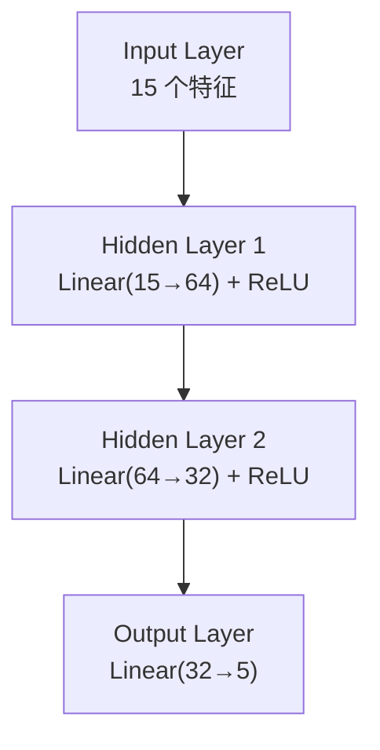

这就是一个基本的**前馈神经网络（Feedforward Neural Network）**。

### 5.3 micrograd 中的层次结构

micrograd 的 `nn.py` 结构非常清晰：

```text
Module（基类）
  ↓
Neuron（weights + bias + activation）
  ↓
Layer（多个 Neuron）
  ↓
MLP（多个 Layer）
```

和 PyTorch 的 `nn.Module / nn.Linear / nn.Sequential` 思想高度一致。

### 5.4 用 PyTorch 写一个最小 MLP

```python
import torch.nn as nn

class MLP(nn.Module):
    def __init__(self):
        super().__init__()
        self.net = nn.Sequential(
            nn.Linear(15, 64),   # 输入 15 个特征 → 64 个神经元
            nn.ReLU(),           # 非线性激活
            nn.Linear(64, 32),   # 64 → 32
            nn.ReLU(),
            nn.Linear(32, 5)     # 32 → 5 个类别
        )

    def forward(self, x):
        return self.net(x)       # 前向传播
```

---

## 6. Tensor：深度学习的"数字容器"

### 6.1 定义

> **定义**：Tensor（张量）是深度学习中对多维数组的统一称呼。

```text
0-D Tensor = Scalar（标量）
1-D Tensor = Vector（向量）
2-D Tensor = Matrix（矩阵）
3-D / 4-D / N-D = 更高维张量
```

例如一张 RGB 图片 `[C, H, W] = [3, 224, 224]`，一批图片 `[B, C, H, W] = [32, 3, 224, 224]`。

### 6.2 为什么需要 Tensor

现实中不会一个标量一个标量地算。32 张图、每张 3×224×224，如果逐元素计算效率极低。Tensor 的作用是把大量标量运算**打包成并行张量运算**，从而可以利用 CPU SIMD / GPU 并行。

```text
大量 Scalar Operation → Vectorize / Tensorize → Tensor Operation → CPU SIMD / GPU Parallel
```

> 💡 micrograd 故意只用标量（Scalar），是为了看清每一个加法、乘法和梯度传播；PyTorch 用 Tensor，是为了高性能并行。**micrograd = 原理，PyTorch Tensor = 工程化。**

### 6.3 Batch / Epoch / Iteration

假设数据集 3200 条、Batch Size = 32：

```text
每个 Epoch 的 Iteration 数 = 3200 / 32 = 100
```

| 术语 | 含义 |
|---|---|
| Batch | 一次参与训练的数据块 |
| Epoch | 完整看一遍数据集 |
| Iteration / Step | 一次参数更新 |

---

## 7. 前向传播与计算图

### 7.1 Forward Pass

> **定义**：前向传播（Forward Pass）就是把输入沿着网络定义的计算路径一路算到输出。

```python
y_pred = model(x)
```

### 7.2 Computational Graph：整个 Autograd 的地基

看一个标量例子：

```python
a = 2
b = 3
c = a * b
d = c + 4
e = d ** 2
```

它对应一张计算图：

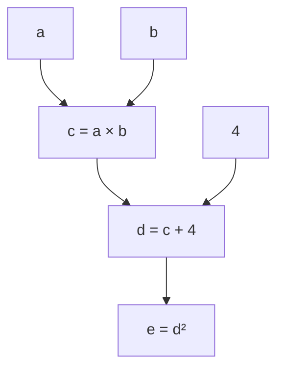

- **节点** = 值（Value / Tensor）；
- **边** = 依赖关系；
- **运算** = +、×、pow、ReLU、MatMul……

> **Backpropagation 本质上就是：沿着这张计算图，从输出往输入反向传播梯度。**

---

## 8. 损失函数：网络知道自己错多少

### 8.1 原理

网络输出 Prediction 后，必须能量化"错多少"，才能指导调整：

```text
Prediction + Ground Truth → Loss Function → Loss（标量）
```

训练目标：**Minimize Loss**。

### 8.2 回归与分类的损失

- **回归**常用 MSE：`Loss = mean((Prediction - Target)²)`;
- **分类**常用交叉熵（Cross Entropy）：模型输出的是 Logits（未归一化得分），交叉熵结合 Softmax 衡量"模型给真实类别的概率是否足够高"。

> 💡 前期不必手推交叉熵公式，记住结论：**正确类别的概率越高 → Loss 越低**。

---

## 9. 梯度与链式法则：学习的数学引擎

### 9.1 梯度是什么

> **定义**：梯度（Gradient）dL/dw 表示：如果参数 w 稍微变一点点，Loss 会怎么变化。

- `dL/dw > 0`：w 增大 → Loss 增大 → 应该减小 w；
- `dL/dw < 0`：w 增大 → Loss 减小 → 应该增大 w。

几何上，梯度指向**函数增长最快的方向**，所以训练沿 `-Gradient` 方向下降（Gradient Descent）。

### 9.2 链式法则：反向传播的数学核心

如果 `x → y → z`，即 `y = f(x)`、`z = g(y)`：

```text
dz/dx = dz/dy × dy/dx
```

对一条更长的链 `x → a → b → c → Loss`：

```text
dLoss/dx = dLoss/dc × dc/db × db/da × da/dx
```

### 9.3 Backward：从 Loss 往回算

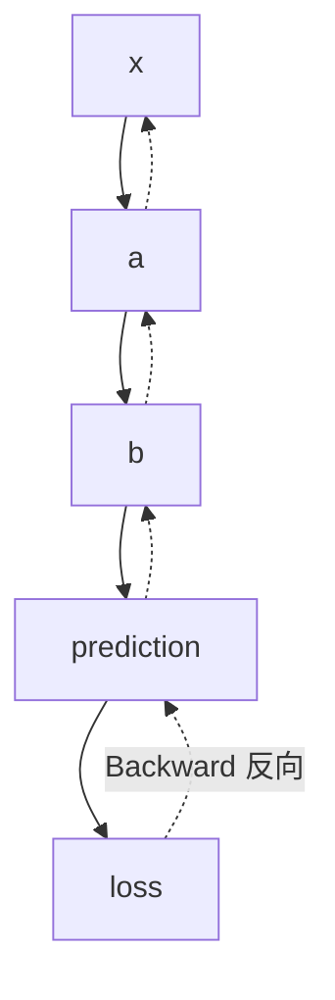

所以叫 **Backpropagation（反向传播）**：从 Loss 开始，逐层计算 Loss 对每个参数的梯度。

---

## 10. micrograd：把 Autograd 拆到骨头里

### 10.1 为什么要看 micrograd

> micrograd 最重要的价值不是"它能训练一个小网络"，而是把 PyTorch 最关键的 Autograd 机制缩小到**人脑可以完整理解**的程度。

必读两个文件：

- [micrograd/engine.py](https://github.com/karpathy/micrograd/blob/master/micrograd/engine.py)（Autograd 引擎）
- [micrograd/nn.py](https://github.com/karpathy/micrograd/blob/master/micrograd/nn.py)（神经网络）

### 10.2 核心类 Value

一个 `Value` 就是计算图的一个节点，保存：

```text
data（数值）
grad（梯度）
_prev（前驱节点）
_op（产生它的运算）
_backward（局部反向函数）
```

### 10.3 局部导数：每个运算自带反向

- 加法 `z = x + y`：`dz/dx = 1`、`dz/dy = 1` → `x.grad += z.grad`、`y.grad += z.grad`；
- 乘法 `z = x * y`：`dz/dx = y`、`dz/dy = x` → `x.grad += y * z.grad`、`y.grad += x * z.grad`。

> 每个运算 = **Forward（算结果） + Local Backward（算局部梯度）**。这正是所有大型 Autograd 框架（PyTorch / TensorFlow / JAX）的基本思想，只是它们支持的是 Tensor、GPU、复杂算子。

### 10.4 拓扑排序：反向必须有序

计算图中存在依赖，反向传播不能乱序——必须先算下游、再算上游。micrograd 的 `backward()` 先对图做**拓扑排序**，再逆序执行每个节点的 `_backward()`。这就是 `loss.backward()` 最值得理解的核心逻辑。

### 10.5 梯度累加与 zero_grad 的由来

一个变量可能通过多条路径影响 Loss，总梯度 = 各路径梯度之和，所以 micrograd 用 `self.grad += ...`（累加而非赋值）。PyTorch 默认也累加，因此**每轮训练必须先 `optimizer.zero_grad()`**，否则梯度会叠加。

### 10.6 micrograd ↔ PyTorch 对照表

| micrograd | PyTorch |
|---|---|
| `Value.data` | Tensor data |
| `Value.grad` | `tensor.grad` |
| `_prev` | 计算图依赖 |
| `_backward` | Autograd backward 函数 |
| `backward()` | `loss.backward()` |
| `Neuron` | Linear + Activation |
| `Layer` | `nn.Linear` 等层 |
| `MLP` | `nn.Module` 模型 |
| `parameters()` | `model.parameters()` |
| `zero_grad()` | `optimizer.zero_grad()` |

这张表要**理解**，不是背诵。

---

## 11. 训练循环：四个动作的循环

### 11.1 最小训练循环

```python
for epoch in range(num_epochs):          # 外层：完整过几遍数据
    for x, y in dataloader:              # 内层：取一个 Batch
        optimizer.zero_grad()            # ① 清空上一轮梯度
        y_pred = model(x)                # ② 前向传播
        loss = loss_fn(y_pred, y)        # ③ 计算损失
        loss.backward()                  # ④ 反向传播，填满每个参数.grad
        optimizer.step()                 # ⑤ 用梯度更新参数
```

看到它要能自动翻译成：

```text
取 Batch → Forward → 计算 Loss → Backward → 得到 Gradient → Optimizer Update
```

### 11.2 为什么 Training 比 Inference 重

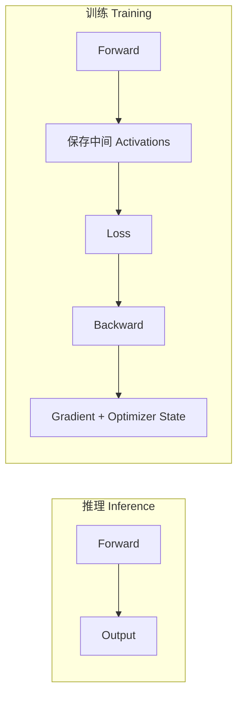

训练要额外保存中间激活值、算梯度、维护优化器状态，所以需要**多得多的算力和内存**。这也是后面理解"为什么大模型训练需要巨大显存"的关键。端侧设备（如 RK3576）一般只做推理，不做大型训练。

### 11.3 参数 vs 超参数

| 类型 | 含义 | 例子 |
|---|---|---|
| 参数 Parameter | 模型训练自动学习 | Weight、Bias |
| 超参数 Hyperparameter | 人为设定 | Learning Rate、Batch Size、Epoch、Hidden Size、Dropout Rate |

### 11.4 优化器：参数怎么更新

最基础的 SGD：`θ = θ - lr × gradient`。

| 优化器 | 直觉 |
|---|---|
| SGD | 沿负梯度走固定步长，最简单 |
| Momentum | 保留"运动惯性"，像小球滚下山坡 |
| Adam / AdamW | Momentum + 自适应学习率，LLM 训练常用 AdamW |

本章不深入优化器数学，只需建立 `Gradient → Optimizer → Parameter Update Rule` 的链条。

---

## 12. 训练不稳定：梯度消失与爆炸

### 12.1 数值稳定性问题

深层网络 Forward 反复做"矩阵乘 + 激活"，Backward 则是一连串梯度相乘：

```text
Gradient × Gradient × Gradient × ...
```

- 不断乘小数值（如 0.5×0.5×0.5…）→ **Vanishing Gradient（梯度消失）**：前几层几乎收不到训练信号；
- 不断乘大数值（如 1.5×1.5×1.5…）→ **Exploding Gradient（梯度爆炸）**：参数更新过大，训练不稳定。

### 12.2 初始化（Initialization）

参数不能随便初始化。若所有 weight = 0，多个神经元会完全对称、学到一样的东西。所以需要随机初始化，并按激活/层类型选择合适尺度（Xavier、Kaiming/He）。

> 初始化的目标：**让 Forward 的激活值尺度和 Backward 的梯度尺度都保持在合理范围**。

### 12.3 BatchNorm（批归一化）

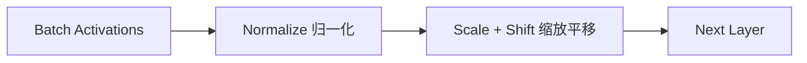

目标：让中间层的激活数值分布更稳定，网络更容易优化。Zero-to-Hero 的 Lecture 4 专门讲了 Activations / Gradients / BatchNorm，很值得看。

### 12.4 正则化：防止过拟合

| 方法 | 直觉 |
|---|---|
| Weight Decay | 不希望权重过大，在 Loss 里加权重惩罚，鼓励更平滑的参数 |
| Dropout | 训练时随机把部分神经元输出置 0，减少神经元间过度依赖，提高泛化 |
| Data Augmentation | 训练数据加扰动，扩大有效数据量 |
| Early Stopping | 验证集不再提升就提前停 |

> ⚠️ **Dropout 的经典陷阱**：Training 时 ON，Inference 时 OFF。这是又一个"训练与推理行为不同"的例子。

### 12.5 train / eval / no_grad

```python
model.train()              # 训练模式：Dropout/BatchNorm 按训练行为工作
model.eval()               # 评估/推理模式：Dropout 关闭、BatchNorm 用统计量
with torch.no_grad():      # 推理时不构建梯度图
    y = model(x)
```

`torch.no_grad()` 能省内存、省计算——因为推理根本不需要反向传播的梯度图。后面端侧部署里"推理 Runtime 不需要训练图"，也是同一个思想。

---

## 13. CNN：卷积神经网络

### 13.1 为什么需要卷积

一张 224×224×3 的图像，直接拉平是 150528 个特征，再连一个 4096 维全连接层，参数量约 **6 亿**——不可接受。更关键的是：**Flatten 破坏了图像的空间结构**。图像有两大自然特性：

```text
Locality（局部性）：相邻像素相关
Spatial Structure（空间结构）：上下左右有几何含义
```

CNN 正是为利用这两点而生的。

### 13.2 卷积过程：小窗口滑过整张图


一个 3×3 的 Kernel（卷积核）在整张图上滑动，逐位置做"乘加"，得到一张**特征图（Feature Map）**。

### 13.3 Kernel / Feature Map / Channel

- **Kernel（卷积核）**：一组很小的权重，如 3×3，它会在图上滑动。**Kernel 的权重也是通过反向传播学出来的**，不是人设计的；
- **Feature Map（特征图）**：一个 Kernel 滑完整张图得到的结果，对应一种模式（边缘、纹理、角点…）；
- **Channel（通道）**：输入 RGB 是 3 通道，CNN 中间层通常是 32/64/128/256 通道——这些不再代表颜色，而是**不同的学习到的特征通道**。

```text
Input Channels → Many Kernels → Output Channels
```

### 13.4 Stride / Padding / Receptive Field

| 概念 | 含义 |
|---|---|
| Stride 步长 | Kernel 每次移动几格；越大，输出空间尺寸越小 |
| Padding 填充 | 在图像边缘补值；常见目的：保持空间尺寸不缩小 |
| Receptive Field 感受野 | 深层一个神经元最终"看到"原始图像多大的区域；网络越深，感受野越大 |

```text
浅层 → Local Feature（局部特征）
深层 → Larger Semantic Structure（更大语义结构）
```

### 13.5 Pooling 池化

Max Pooling 把一个小窗口内的最大值取出来：

```text
[1 5
 3 2]  →  5
```

作用：**降采样、减小空间尺寸、增加一定局部不变性**。现代 CNN 也常用 Stride 卷积替代部分 Pooling。

### 13.6 一个基本 CNN：跟着 Shape 走

```python
import torch.nn as nn

class CNN(nn.Module):
    def __init__(self):
        super().__init__()
        self.features = nn.Sequential(
            nn.Conv2d(3, 16, kernel_size=3, padding=1),  # 输入3通道 → 16通道
            nn.ReLU(),
            nn.MaxPool2d(2),                              # 空间尺寸减半
            nn.Conv2d(16, 32, kernel_size=3, padding=1), # 16 → 32通道
            nn.ReLU(),
            nn.MaxPool2d(2)
        )

    def forward(self, x):
        return self.features(x)
```

理解 `3 → 16 → 32` 指的是 Channel。CNN 数据流：

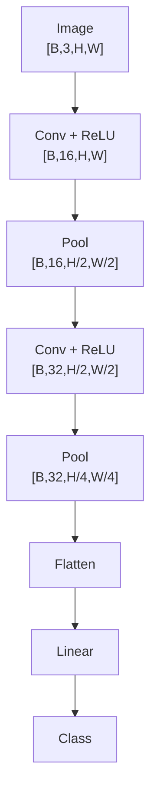

### 13.7 CNN 与端侧 AI

在 LLM 出现之前，大量端侧 AI 实际都是 CNN：YOLO、MobileNet、ResNet、人脸检测、OCR、分割、姿态估计。Rockchip 的 RKNN / RKNN-Toolkit2 部署的典型模型也大多是 CNN / 视觉模型。

> **CNN 对端侧 AI 不是过时知识，而是必须掌握的核心基础。**

### 13.8 从 CNN 看算子（Operator）

一个 CNN 模型 = Conv、ReLU、Pool、Linear、Softmax 的组合。这些在部署系统里叫 **Operator / Op**。后面学 ONNX、TVM、RKNN 时，处理的就是一张**算子图**：

> 学习阶段可以建立 `Layer ≈ Operator` 的工程视角（严格说二者不完全等价）。

---

## 14. RNN：循环神经网络

### 14.1 为什么需要序列模型

普通 MLP 假设样本彼此独立。但很多数据是**序列**：语音、文本、传感器时间序列、股价、IMU、ECG……当前时刻往往依赖之前时刻，模型需要"记忆"。

### 14.2 结构：带记忆的循环

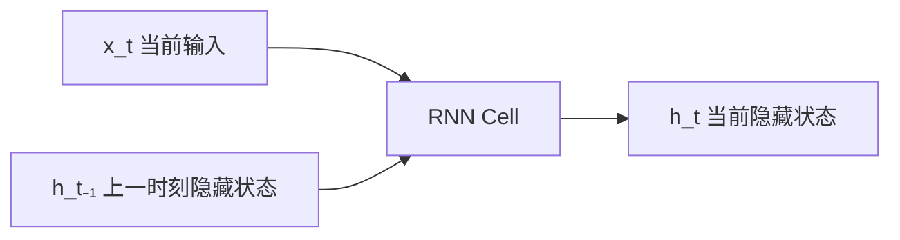

- `x_t`：当前时刻输入；
- `h₍t₋₁₎`：上一时刻的隐藏状态；
- `h_t`：当前隐藏状态，**是 RNN 对过去序列信息的压缩表示**。

沿时间展开：

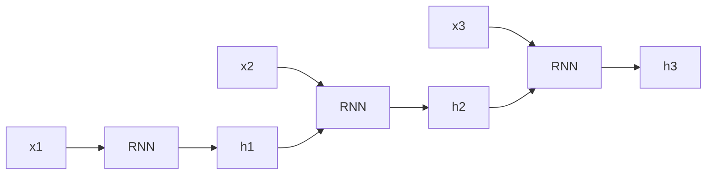

注意：**同一个 RNN Cell 在不同时刻重复使用同一套参数**——这也是参数共享（Parameter Sharing）。

### 14.3 数学形式

```text
h_t = tanh(W_xh · x_t + W_hh · h_(t-1) + b_h)
y_t = W_hy · h_t + b_y
```

关键点：`h_t` 依赖 `h₍t₋₁₎`，所以网络有时间记忆。

### 14.4 RNN 与传感器数据

200Hz 的 IMU，每个时间步有 6 个特征（ax/ay/az/gx/gy/gz），可以组织成 `[T, Feature]` 的序列：

```text
Sequence → RNN → Hidden State → Classification
```

因此 RNN 对**时序传感器、动作识别、手势识别**非常自然——这也正是你熟悉的应用场景。

### 14.5 BPTT：沿时间反向传播

RNN 沿时间展开后就是一个很长的计算图，反向传播自然也是沿时间往回走：

```text
Loss → hT → h(T-1) → ... → h1
```

这叫 **BPTT（Backpropagation Through Time）**——本质还是反向传播，只是计算图沿时间展开。

### 14.6 为什么 RNN 特别容易梯度消失/爆炸

序列可能 T=100、500、1000。反向传播要经过大量重复矩阵乘法，梯度要么不断衰减、要么不断放大。应对手段是 **Gradient Clipping（梯度裁剪）**：

```python
torch.nn.utils.clip_grad_norm_(model.parameters(), max_norm=1.0)
```

梯度范数超过阈值就缩回来。LLM 训练中仍然经常使用。

### 14.7 LSTM / GRU：对付长期依赖

传统 RNN 记不住很长的历史，于是出现 LSTM / GRU，核心思想是引入 **Gate（门控）**，控制信息保留、更新、遗忘。本章只需知道它们为什么出现、核心思想是 Gate、仍属循环架构；不必手推全部门公式。

### 14.8 CNN vs RNN

| 模型 | 利用的结构 | 典型数据 |
|---|---|---|
| MLP | 无（特征独立） | 表格 / 特征向量 |
| CNN | Spatial Locality（空间局部性） | 图像 / 空间数据 |
| RNN | Temporal Dependency（时间依赖） | 时间序列 / 文本序列 |

---

## 15. 从 RNN 到 Attention：必然的转折

RNN 有三个天然问题：

1. **串行计算**：h1 → h2 → h3 → h4 必须按顺序算，无法像 CNN 那样大规模并行；
2. **长距离依赖**：x1 的信息要穿过 h1 → h2 → … → h1000 才能影响后面，容易丢失；
3. **信息瓶颈**：过去的所有信息被压缩进一个 Hidden State 里。

于是新的思路出现：

> **能不能让当前 Token 直接"看"其他所有 Token？**

这就通向 Attention → Self-Attention → Transformer → GPT → LLM，下一章展开。

---

## 16. 底层视角：一切最终都是 MatMul

### 16.1 从模型结构到硬件

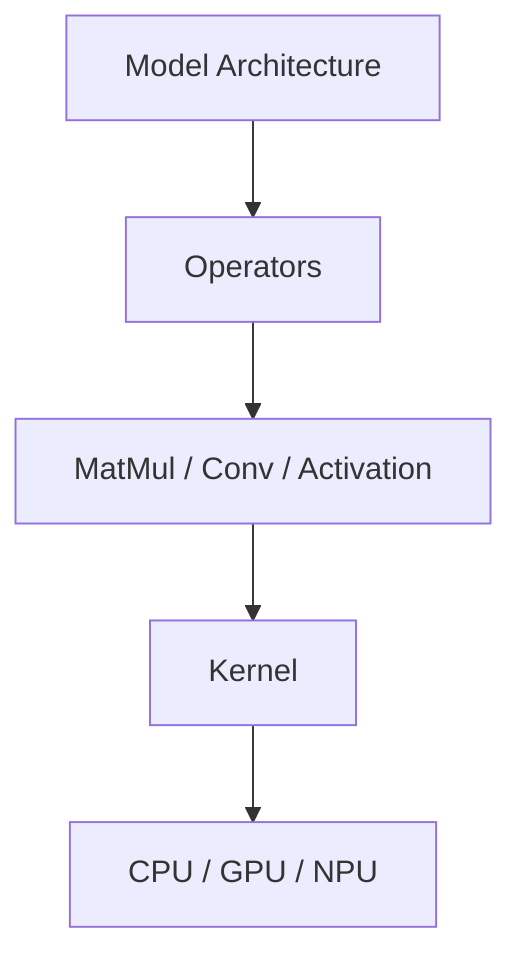

- MLP 的 Linear → `Y = XW + b` → 大量 MatMul；
- CNN 的卷积 → 底层可实现为 GEMM / 专用 Kernel；
- RNN 的 `W_xh·x_t + W_hh·h_(t-1)` → 依然是 MatMul。

这是连接**深度学习**与**AI Compiler / 硬件优化**的关键桥梁，后面第 9、10 章会完整展开。

### 16.2 为什么 GPU 适合深度学习

神经网络充满矩阵 / 张量运算，里面大量乘加互相独立、可并行。CPU 是"少量强核心"，GPU 是"大量并行计算单元"，所以"深度学习 + GPU"非常自然。

### 16.3 Device 概念

```python
x = torch.tensor(...)          # 默认在 CPU
x = x.to("cuda")               # 搬到 GPU 显存
model = model.to("cuda")       # 参数也搬到 GPU
```

> `.to(device)` 不改变模型结构，只改变**存储位置和执行设备**：Tensor / Parameter 从 CPU RAM 搬到 GPU VRAM，之后算子由对应 GPU Kernel 执行。这个认识对后面理解 GPU Offload、llama.cpp backend、NPU tensor、RKNN memory 都很重要。

---

## 17. PyTorch 工程实践

### 17.1 nn.Module / nn.Parameter / state_dict

| 对象 | 作用 |
|---|---|
| `nn.Module` | 所有模型、层、块的统一抽象，管理参数、子模块、设备、训练/评估模式、序列化 |
| `nn.Parameter` | 把 Weight / Bias 注册为可训练参数，`model.parameters()` 才能收集到 |
| `state_dict` | 保存 Parameter + Buffer（不含模型结构代码） |

```python
torch.save(model.state_dict(), "model.pt")
model.load_state_dict(torch.load("model.pt"))
```

> ⚠️ 要逐渐形成：**Architecture（结构）≠ Weights（权重）**。一个模型 = 结构 + 权重。这个区别对后面理解 ONNX、GGUF、RKNN、Checkpoint 都非常关键。`state_dict` 主要是参数，不等于一个完全独立的跨平台部署模型。

### 17.2 完整分类示例（必须能解释每一句）

```python
import torch
import torch.nn as nn

model = nn.Sequential(
    nn.Linear(15, 64), nn.ReLU(),
    nn.Linear(64, 32), nn.ReLU(),
    nn.Linear(32, 5)              # 5 类输出
)

loss_fn = nn.CrossEntropyLoss()
optimizer = torch.optim.Adam(model.parameters(), lr=1e-3)

for epoch in range(20):
    model.train()
    for x, y in train_loader:
        optimizer.zero_grad()      # ① 清梯度
        logits = model(x)          # ② 前向 → Logits
        loss = loss_fn(logits, y)  # ③ 计算损失
        loss.backward()            # ④ 反向传播
        optimizer.step()           # ⑤ 更新参数
```

### 17.3 深度学习真正核心的五个对象

以后看任何训练框架，先找这五样：

```text
1. Data（数据）
2. Model（模型）
3. Loss（损失）
4. Optimizer（优化器）
5. Training Loop（训练循环）
```

---

## 18. 参数量与内存：通往量化的桥梁

### 18.1 参数量怎么算

一个 `Linear(1024, 4096)`：

```text
Weight: 4096 × 1024
Bias:   4096
参数量 = 4096 × 1024 + 4096 ≈ 4.2M
```

这是后面理解 2B / 7B / 70B 模型（B = Billion Parameters）的基础。

### 18.2 参数占多少内存

| 精度 | 每参数字节数 | 10 亿参数占用 |
|---|---|---|
| FP32 | 4 Byte | ≈ 4 GB |
| FP16 | 2 Byte | ≈ 2 GB |
| INT8 | 1 Byte | ≈ 1 GB |

这就是**量化（Quantization）**为什么如此重要。

### 18.3 训练时内存不只看权重

训练显存 ≈ Weights + Gradients + Optimizer State + Activations（中间激活值也要保存供反向传播用）。所以训练占用的内存远大于模型权重本身。

---

## 19. 本章实验

### 实验 1：手写 Micrograd 风格 Autograd（★必做）

自己实现一个最小的 `Value` 类，至少支持 `+`、`*`、ReLU、`backward()`：

```python
class Value:
    # data / grad / _prev / _op / _backward
    ...
```

然后构建 `x → Neuron → Loss → Backward`，打印 `parameter.grad`。

**验收标准**：

- [ ] 能解释为什么每个运算都要定义自己的 Local Gradient；
- [ ] 能解释拓扑排序的作用；
- [ ] 能解释为什么梯度要累加（`+=` 而不是 `=`）。

### 实验 2：PyTorch MLP 分类

用 Iris / Wine / 手势特征 / IMU 特征数据，实现完整流程：

```text
Dataset → DataLoader → Model → Loss → Optimizer → Train → Eval → Confusion Matrix
```

**验收标准**：

- [ ] 网络结构：Input → Linear → ReLU → Linear → ReLU → Linear → Classes；
- [ ] 跑完后和上一章的 Logistic Regression / Random Forest 对比，回答：
  - MLP 是否真的更好？为什么？
  - 参数量增加多少？推理成本增加多少？

### 实验 3：最小 CNN

用 MNIST / Fashion-MNIST / CIFAR-10，完成 `Conv → ReLU → Pool → Conv → ReLU → Pool → Linear`。

**验收标准**：

- [ ] 每层之后打印 `x.shape`，能说出 `[B, C, H, W]` 怎么变化；
- [ ] 真正建立"CNN 数据在 Channel 和 Spatial 维度中如何流动"的直觉。

### 可选实验：RNN 时序分类

用 IMU / Sine Wave / 字符序列，输入 `[B, T, Feature]`，观察 Hidden State。

**验收标准**：

- [ ] 分清 Batch、Sequence Length、Feature Dimension、Hidden Dimension 四个维度。

---

## 20. 常见错误与调试

| # | 常见错误 | 正确认识 |
|---|---|---|
| 1 | 只会 `model.fit()` 或复制训练循环 | 必须理解 Forward → Loss → Backward → Update 每一步 |
| 2 | 把人工神经元当生物神经元模拟 | 它是参数化数学函数，只是受生物启发 |
| 3 | 认为网络越深越好 | 效果由架构 + 数据 + 优化 + 正则 + 算力共同决定 |
| 4 | 只看 Accuracy | 第 1 章的评估思维（Precision/Recall/F1/ROC）完全适用 |
| 5 | 不看 Tensor Shape | 维度错误、Broadcast 错误、Channel/序列维度搞反是家常便饭 |
| 6 | 忘了 `optimizer.zero_grad()` | 梯度意外累计 |
| 7 | 推理时忘了 `model.eval()` | Dropout / BatchNorm 行为不正确 |

**Shape 是阅读模型源码的第一语言**：MLP `[B, Feature]`、CNN `[B, C, H, W]`、RNN `[B, T, Feature]`、Transformer `[B, T, D]`。

---

## 21. 本章小结

### 21.1 八个核心思维模型

1. **Neuron = Linear + Nonlinear Activation**；
2. **Deep Network = 大量参数化函数复合**（f(x) = f4(f3(f2(f1(x))))）；
3. **Training = Forward + Loss + Backward + Update**；
4. **Backpropagation = Chain Rule 作用在 Computational Graph 上**；
5. **PyTorch Autograd 不是魔法**：Record Operations → Build Graph → Reverse Graph → Apply Local Derivatives → Accumulate Gradients；
6. **CNN = 利用空间结构**（Local Connectivity + Parameter Sharing）；
7. **RNN = 通过 Hidden State 传递序列历史**；
8. **Model → Layer → Operator → Tensor Operation → Kernel → Hardware**，是本路线后半段最重要的一座桥。

### 21.2 术语表

| 术语 | 英文 | 一句话解释 |
|---|---|---|
| 神经元 | Neuron | Linear + Activation 的最小计算单元 |
| 激活函数 | Activation | 引入非线性，让网络能拟合复杂函数 |
| 多层感知机 | MLP | 多个全连接层 + 激活堆叠 |
| 张量 | Tensor | 多维数组的统一称呼 |
| 前向传播 | Forward Pass | 输入沿网络计算路径算出输出 |
| 计算图 | Computational Graph | 运算与依赖关系的有向图，Autograd 的地基 |
| 损失函数 | Loss Function | 量化预测与真实答案差距 |
| 梯度 | Gradient | Loss 对参数的变化率 |
| 链式法则 | Chain Rule | 复合函数求导法则，反向传播的数学核心 |
| 反向传播 | Backpropagation | 沿计算图反向传播梯度 |
| 学习率 | Learning Rate | 每次参数更新的步长 |
| 过拟合 | Overfitting | 背熟训练数据、新数据失效 |
| 梯度消失 | Vanishing Gradient | 梯度连乘趋近 0，前层收不到训练信号 |
| 梯度爆炸 | Exploding Gradient | 梯度连乘爆炸，训练不稳定 |
| 卷积核 | Kernel | 在图上滑动的小权重窗口 |
| 特征图 | Feature Map | 一个卷积核滑完整张图的结果 |
| 感受野 | Receptive Field | 深层神经元能看到原始图多大区域 |
| 隐藏状态 | Hidden State | RNN 对过去序列信息的压缩表示 |
| BPTT | Backprop Through Time | 沿时间展开计算图的反向传播 |

### 21.3 自测清单

**神经网络基础**

- [ ] 能解释 Neuron 的 `wx + b`
- [ ] 能解释 Weight 和 Bias
- [ ] 能解释为什么必须加入 Activation Function
- [ ] 能解释 ReLU / Sigmoid / Tanh 的基本作用
- [ ] 能根据一个 MLP 写出每层 Tensor Shape

**训练**

- [ ] 能解释 Forward / Loss / Gradient / Chain Rule / Backpropagation
- [ ] 能解释 `loss.backward()` 背后发生了什么
- [ ] 能解释为什么梯度默认会累计、为什么需要 `optimizer.zero_grad()`
- [ ] 能解释 Parameter vs Hyperparameter
- [ ] 能背出标准训练循环四步并解释每一步

**micrograd**

- [ ] 阅读过 `engine.py` 和 `nn.py`
- [ ] 能解释 `_backward`、`_prev`、拓扑排序、梯度累加
- [ ] 能自己写出最小 `Value` 类

**PyTorch**

- [ ] 能写 `nn.Module`、用 `nn.Linear`、完成标准 Training Loop
- [ ] 能解释 `model.train()` / `model.eval()` / `torch.no_grad()`
- [ ] 能解释 `state_dict`，知道 Architecture ≠ Weights

**训练稳定性**

- [ ] 能解释 Vanishing / Exploding Gradient
- [ ] 知道初始化为什么重要、BatchNorm 解决什么问题
- [ ] 知道 Dropout 训练/推理的区别、Weight Decay 的思想

**CNN**

- [ ] 能解释为什么图像不适合直接上巨大 MLP
- [ ] 能解释 Kernel / Feature Map / Channel / Stride / Padding / Pooling / Receptive Field
- [ ] 能完成一个 MNIST / CIFAR CNN 实验

**RNN**

- [ ] 能解释 Hidden State、参数共享、BPTT
- [ ] 能解释为什么 RNN 容易梯度消失、Gradient Clipping 的作用
- [ ] 知道 LSTM / GRU 为什么出现
- [ ] 能解释为什么后来需要 Attention

**不要求**：手推 Hessian、证明万能逼近定理、精通所有优化器、精通 ResNet/DenseNet、深入 LSTM/GRU 全部门公式、深入 CUDA/cuDNN、深入 Attention/Transformer。不要因为这些暂时不会而停留在本章。

---

## 22. 学习资源与阅读顺序

### 22.1 仓库分工

| 仓库 | 负责什么 |
|---|---|
| [D2L](https://github.com/d2l-ai/d2l-en) | 完整知识结构（数学 + PyTorch 实现 + CNN + RNN） |
| [micrograd](https://github.com/karpathy/micrograd) | "Backprop / Autograd 到底是什么" |
| [Zero to Hero](https://github.com/karpathy/nn-zero-to-hero) | 亲手把神经网络训练过程走一遍 |
| PyTorch | 把原理映射到真正的工程框架 |

**不要只学其中一个**。推荐用法：一个知识点 → 先看 D2L 建立体系 → 再看 micrograd / Zero-to-Hero 拆底层 → 最后用 PyTorch 重写。

### 22.2 推荐学习顺序（7 个 Stage）

| Stage | 内容 | 必读 | 目标 |
|---|---|---|---|
| 1 | Neuron / MLP | [D2L MLP](https://github.com/d2l-ai/d2l-en/tree/master/chapter_multilayer-perceptrons) | 能手写一个两层 MLP |
| 2 | micrograd | [engine.py](https://github.com/karpathy/micrograd/blob/master/micrograd/engine.py) + [nn.py](https://github.com/karpathy/micrograd/blob/master/micrograd/nn.py) + [Zero-to-Hero README](https://github.com/karpathy/nn-zero-to-hero/blob/master/README.md) | 真正理解 `loss.backward()` |
| 3 | PyTorch 重写 | 手写 Linear/ReLU/MLP/CrossEntropyLoss/SGD/训练循环 | 把原理映射到框架 |
| 4 | 训练稳定性 | Zero-to-Hero Lecture 4（Activations/Gradients/BatchNorm） | 理解初始化/梯度消失/BatchNorm/Dropout |
| 5 | CNN | [D2L CNN](https://github.com/d2l-ai/d2l-en/tree/master/chapter_convolutional-neural-networks) + [Conv Layer](https://github.com/d2l-ai/d2l-en/blob/master/chapter_convolutional-neural-networks/conv-layer.md) | 能看懂基本 CNN 架构 |
| 6 | RNN | [D2L RNN](https://github.com/d2l-ai/d2l-en/tree/master/chapter_recurrent-neural-networks) + [RNN from Scratch](https://github.com/d2l-ai/d2l-en/blob/master/chapter_recurrent-neural-networks/rnn-scratch.md) | 理解 RNN 为什么适合序列及其结构性问题 |
| 7 | **停止** | 不在此处展开 Attention/Transformer/GPT/Tokenizer | 全部留给第 4 章 |

### 22.3 学习节奏参考

```text
Module 1  Neuron + MLP          Module 6  BatchNorm + Dropout
Module 2  Computational Graph   Module 7  CNN
Module 3  Chain Rule + micrograd Module 8  CNN 实验
Module 4  PyTorch Training Loop Module 9  RNN
Module 5  Activation + 初始化    Module 10 RNN 实验 + 总结
```

具体每天完成几个 Module 不重要，重要的是**每个 Module 至少跑一次代码**。

### 22.4 笔记怎么记

每个知识点保持四层：

```text
1. 概念
2. 数学表达
3. PyTorch 代码
4. 底层 / 部署意义
```

示例——Linear Layer：

```text
概念：全连接变换
数学：Y = XW + b
PyTorch：nn.Linear
部署：MatMul / Gemm + Add
```

这是最适合后续端侧 AI 的笔记方式。

---

## 23. 为什么这章是后面所有章节的地基

- **对 llama.cpp**：它里面全是 Tensor / Operator / Graph / MatMul / Norm / Backend——不理解本章的 Tensor、Layer、Forward，后面会非常抽象；
- **对 TVM / RKNN**：它们处理的是模型图（Conv → ReLU → Add → MatMul），深度学习模型结构就是 AI Compiler 的输入；
- **对 GPU Kernel**：`nn.Linear → ATen/Operator → CUDA/GEMM Kernel → GPU`，这条链后面完整展开；
- **对训练框架 vs Runtime**：Backpropagation 对理解 AI 很重要，但很多端侧 Runtime（ONNX Runtime、TFLite、llama.cpp、RKNN Runtime）**根本不实现训练**，只关心 Forward Graph、算子、权重、内存、硬件。

---

## 24. 下一章预告

本章结束时，我们已经彻底理解：

```text
Neural Network = 大量可学习参数 + 一系列 Tensor Operation
Training       = Forward + Loss + Backpropagation + Optimizer Update
Backpropagation = Chain Rule 在 Computational Graph 上反向传播
```

现在先把这些原理落到真实工程里：Tensor 如何存储，`nn.Module` 如何组织模型，Autograd 如何工作，模型又如何保存、导出并交给 Runtime？

下一章系统掌握这套工具与软件栈：

> **[03_PyTorch与模型框架](03_PyTorch与模型框架.md)**

掌握框架后，第 4 章再沿着 RNN 的局限进入 Attention → Transformer → GPT → LLM。

---

## 附录：核心参考链接

### Dive into Deep Learning

- [D2L Repository](https://github.com/d2l-ai/d2l-en)
- [D2L Table of Contents](https://github.com/d2l-ai/d2l-en/blob/master/index.md)
- [Multilayer Perceptrons](https://github.com/d2l-ai/d2l-en/tree/master/chapter_multilayer-perceptrons)
- [Builders Guide](https://github.com/d2l-ai/d2l-en/tree/master/chapter_builders-guide)
- [Convolutional Neural Networks](https://github.com/d2l-ai/d2l-en/tree/master/chapter_convolutional-neural-networks)
- [Convolutions for Images](https://github.com/d2l-ai/d2l-en/blob/master/chapter_convolutional-neural-networks/conv-layer.md)
- [Recurrent Neural Networks](https://github.com/d2l-ai/d2l-en/tree/master/chapter_recurrent-neural-networks)
- [RNN from Scratch](https://github.com/d2l-ai/d2l-en/blob/master/chapter_recurrent-neural-networks/rnn-scratch.md)

### micrograd

- [micrograd Repository](https://github.com/karpathy/micrograd)
- [Autograd Engine: engine.py](https://github.com/karpathy/micrograd/blob/master/micrograd/engine.py)
- [Neural Network Library: nn.py](https://github.com/karpathy/micrograd/blob/master/micrograd/nn.py)

### Neural Networks: Zero to Hero

- [NN Zero to Hero Repository](https://github.com/karpathy/nn-zero-to-hero)
- [Course README](https://github.com/karpathy/nn-zero-to-hero/blob/master/README.md)

本章重点：Lecture 1（micrograd 反向传播）、Lecture 3（MLP）、Lecture 4（Activations & Gradients / BatchNorm）、Lecture 5（Backprop Ninja）。
