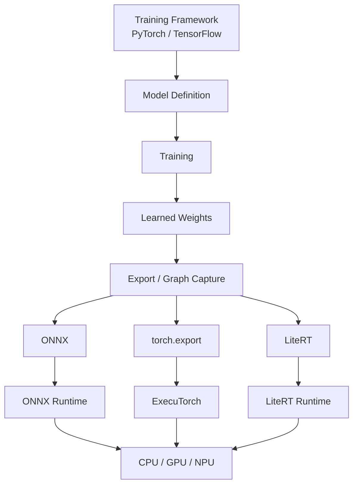
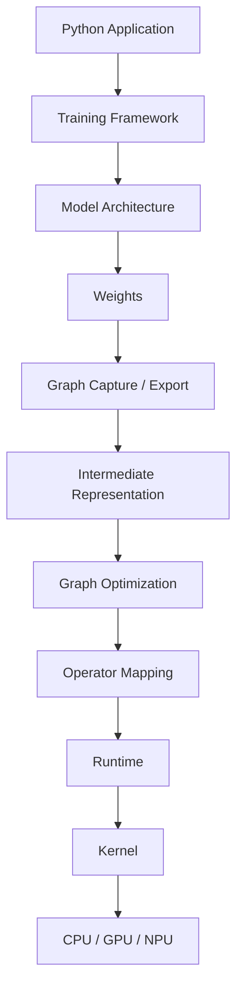
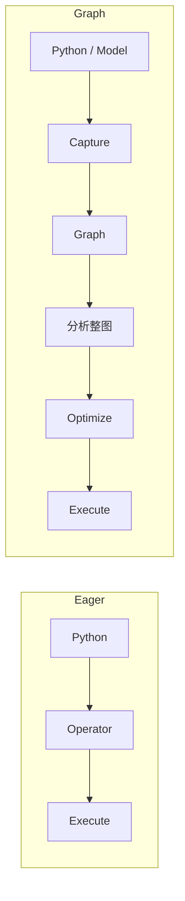
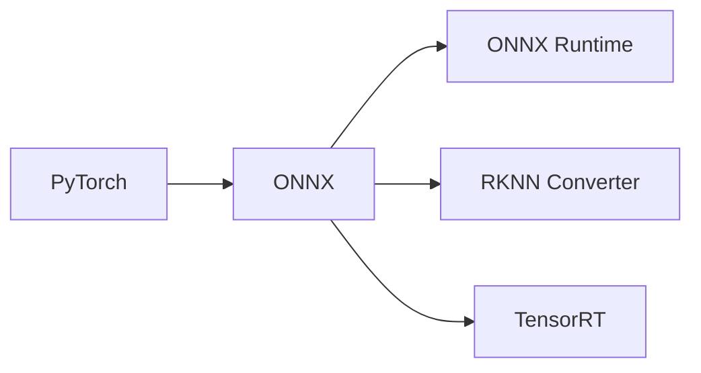
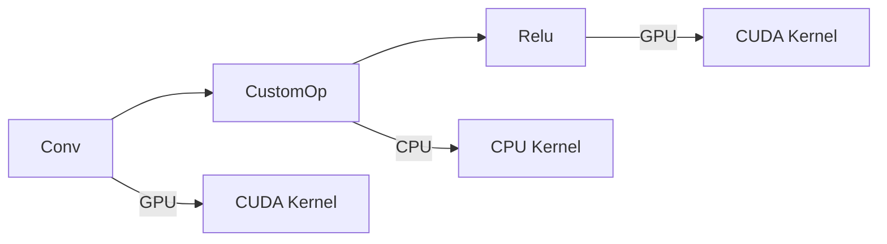

# 第 3 章 PyTorch 与模型框架

> **所属路线**：AI 学习路线 · 第一部分
> **本章定位**：理解主流 AI 框架如何定义模型、组织数据、完成训练、保存权重、导出计算图，并最终进入跨平台 Runtime 与端侧部署
> **核心框架**：PyTorch
> **辅助框架与模型表示**：TensorFlow / Keras、LiteRT（TensorFlow Lite 后继）、ONNX、ONNX Runtime、ExecuTorch
> **前置要求**：第 2 章（深度学习与神经网络）已完成
> **学习边界**：本章解决"Framework → Model → Graph → Export → Runtime"的工程链路；量化算法、AI Compiler、GPU Kernel、RKNN/RKLLM 在后续章节深入
> **资料检查日期**：2026-08-25

---

## 本章导读

前两章回答了“模型是什么、为什么能够学习”；这一章把这些原理落到真实软件框架中：

> **一个训练好的模型，在真实软件栈里是怎么被表示、保存、导出，最终跑到 CPU / GPU / NPU 上的？**

这是从"理论 AI"走向"AI 系统工程"的第一座桥。很多人在这里翻车，不是因为数学，而是因为**把框架、文件格式、Runtime、编译器四个角色混为一谈**。

学完本章，你应该能够：

1. 一口说清 PyTorch / ONNX / ONNX Runtime / LiteRT 分别是什么角色；
2. 熟练操作 PyTorch 的 Tensor、`nn.Module`、Dataset、Optimizer、`state_dict`；
3. 区分 `torch.compile`（优化执行）与 `torch.export`（导出图）；
4. 说清 ONNX 的 Model / Graph / Node / Operator / Initializer / Opset 是什么；
5. 理解 Execution Provider 与 CPU Fallback，以及"GPU EP 已启用 ≠ 全模型在 GPU 跑"；
6. 独立完成 PyTorch → ONNX → ONNX Runtime 的完整链路并做数值验证；
7. 说清部署正确性依赖预处理、Layout、Dtype、后处理等多道坎。

**本章的学习方法**：每个概念都追问"它属于哪一层（框架/格式/Runtime/编译器）"。**文件后缀背后的抽象层完全不同**——这是本章最重要的心智。

本章要建立的核心工程视图：



---

## 1. 先分清四个角色：框架、格式、Runtime、编译器

> ⚠️ 很多初学者把 PyTorch、ONNX、ONNX Runtime、TFLite、RKNN、GGUF 都叫"模型格式"或"AI 框架"，这是不准确的。**它们是四个完全不同的角色。**

### 1.1 Training Framework（训练框架）

负责：模型定义、数据管线、前向、Autograd、损失、优化器、训练、分布式训练。

典型：**PyTorch、TensorFlow、JAX**。解决的问题是"如何表达和训练一个 AI 模型"。

### 1.2 Model Representation / File Format（模型表示 / 文件格式）

负责把 Architecture / Graph / Weight / Metadata 以某种格式保存。典型：`state_dict`、`.safetensors`、ONNX、`.tflite`、GGUF、`.rknn`。

> ⚠️ 但这些格式的**抽象层不同**：`state_dict` 主要是权重张量；ONNX 包含完整计算图、算子、输入输出、Shape/Type、Metadata。

### 1.3 Runtime（推理运行时）

负责**真正执行已准备好的模型**：加载模型、分配 Tensor、调度算子、选 Kernel、执行、管内存、返回输出。

典型：ONNX Runtime、LiteRT Runtime、ExecuTorch Runtime、RKNN Runtime、llama.cpp。

### 1.4 Compiler / Converter（编译器 / 转换器）

负责把框架模型转成目标形式：Graph Capture → Operator Conversion → Graph Optimization → Hardware Mapping → Target Model。

典型：`torch.export`、ONNX Exporter、LiteRT Converter、RKNN-Toolkit2、TVM。

### 1.5 完整软件栈图（贯穿全书）



**这张图会贯穿后面所有章节**——llama.cpp、vLLM、TVM、RKNN 都在这个栈的不同位置。

---

## 2. 本章涉及的仓库

| 仓库 | 角色 |
|---|---|
| [pytorch/pytorch](https://github.com/pytorch/pytorch) | 主框架，**需要真正掌握** |
| [tensorflow/tensorflow](https://github.com/tensorflow/tensorflow) | 了解级（看懂 + 基本训练 + 导出） |
| [keras-team/keras](https://github.com/keras-team/keras) | 高层 API（注意：Keras 3 是 multi-backend） |
| [google-ai-edge/LiteRT](https://github.com/google-ai-edge/LiteRT) | 端侧 Runtime / Toolchain（TFLite 后继） |
| [onnx/onnx](https://github.com/onnx/onnx) | 开放模型中间表示规范 |
| [microsoft/onnxruntime](https://github.com/microsoft/onnxruntime) | 跨平台推理 Runtime |
| [pytorch/executorch](https://github.com/pytorch/executorch) | PyTorch 端侧部署 |
| [lutzroeder/netron](https://github.com/lutzroeder/netron) | 模型可视化工具（**强烈推荐**） |

---

## 3. PyTorch 核心对象

### 3.1 Tensor：Data + Metadata

一个 Tensor = 数据缓冲 + Shape + Stride + Dtype + Device：

```python
x = torch.tensor([1.0, 2.0, 3.0])
print(x.shape)   # torch.Size([3])
print(x.dtype)   # torch.float32
print(x.device)  # cpu
```

- **Shape 是模型工程的第一语言**：MLP `[B, D]`、CNN `[B, C, H, W]`、Transformer `[B, T, D]`；
- **Dtype**：训练常见 FP32 / FP16 / BF16；推理常见 FP32 / FP16 / INT8 / INT4；
- **Device**：Tensor 的存储和执行位置（CPU / CUDA / MPS），`.to(device)` 改变的是位置；
- **Stride**：每个维度在底层内存中的跨步——**Shape ≠ Memory Layout**。`x.transpose()` 可能只改 View 和 Stride，不搬数据；某些 Kernel 需要连续内存，用 `y.contiguous()` 强制重排。这个概念后面直接进入性能优化。

### 3.2 Autograd

上一章 micrograd 的工业级版本：Forward 构建动态计算图 → `grad_fn` 记录 → `backward()` 沿图反向传播 → 每个 `Parameter.grad` 被填上梯度。

```python
x = torch.tensor(2.0, requires_grad=True)
y = x ** 2
y.backward()
print(x.grad)   # 4.0（因为 dy/dx = 2x）
```

- `requires_grad=True`：记录后续与梯度相关的运算；模型 Parameter 默认开启；
- `torch.no_grad()` / `torch.inference_mode()`：推理时不构建梯度图，省内存省计算。核心思想：**训练需要图，推理不需要**。

### 3.3 nn.Module / Parameter / Buffer / state_dict

| 对象 | 作用 |
|---|---|
| `nn.Module` | 模型/层/块的统一抽象：管理参数、子模块、Device、train/eval 状态、Hooks、序列化 |
| `nn.Parameter` | 特殊 Tensor，被 Module 注册后自动成为可训练参数（`model.parameters()` 能找到） |
| `Buffer` | 模型状态但不是可训练参数（如 BatchNorm 的 running_mean/var） |
| `state_dict` | Parameters + Persistent Buffers，即"模型的可序列化状态" |

```python
class Net(nn.Module):
    def __init__(self):
        super().__init__()
        self.fc1 = nn.Linear(10, 64)
        self.relu = nn.ReLU()
        self.fc2 = nn.Linear(64, 3)

    def forward(self, x):        # 定义 Tensor 如何流过模型
        x = self.relu(self.fc1(x))
        return self.fc2(x)
```

注意：通常写 `model(x)` 而不是 `model.forward(x)`，因为 `nn.Module.__call__` 还会处理 Hooks、Autograd 等。

### 3.4 保存与加载：分清三种"文件"

| 后缀 / 概念 | 里面是什么 | 恢复需要 |
|---|---|---|
| `.pt / .pth` | 常用序列化后缀，里面可能是 state_dict、checkpoint 或任意 Python 对象 | **不能只看扩展名判断语义** |
| Checkpoint | model + optimizer + epoch + loss 等训练状态 | 用于中断恢复训练 |
| `.safetensors` | 纯 Weight Tensor，安全高效 | 需要配合 config + 模型代码/已知架构 |

关键认知：

```text
Architecture Code + state_dict = 可恢复的 PyTorch 模型
Architecture ≠ Weights
```

### 3.5 Dataset / DataLoader / Optimizer / Training Loop

- **Dataset**：`index → one sample`（`__len__` + `__getitem__`）；
- **DataLoader**：Batch、Shuffle、多进程加载。**Dataset 和 Model 是两个独立系统**——模型不负责从硬盘读图；
- **Optimizer**：`AdamW(model.parameters(), lr=1e-3)`，维护参数、梯度、优化器状态，`step()` 更新权重。

标准训练循环（上一章已理解，本章补工程视角）：

```python
for epoch in range(epochs):
    model.train()
    for x, y in loader:
        x, y = x.to(device), y.to(device)
        optimizer.zero_grad()
        logits = model(x)
        loss = loss_fn(logits, y)
        loss.backward()
        optimizer.step()
```

### 3.6 往下一层：Dispatcher → ATen → Backend → Kernel

```text
Python API → Dispatcher → ATen Operator → CPU / CUDA Backend → Kernel
```

- **ATen**：PyTorch 的核心 Tensor / Operator 库，`add/matmul/conv/softmax` 最终对应 ATen Operator；
- **Backend**：同一个 MatMul 在 CPU / CUDA / MPS 上选不同 Kernel；
- **Operator vs Kernel**：Operator = "做什么"（MatMul）；Kernel = "在特定硬件上怎么高效做"（CPU AVX MatMul、CUDA Tensor Core GEMM、NPU MatMul）。

> **PyTorch ≠ CUDA**：Framework 定义 Tensor/模型/训练，Backend 负责算子执行。

---

## 4. Eager 与 Graph：两种执行模式

### 4.1 Eager Mode

一条 Python 语句马上执行对应算子：直观、Pythonic、易 Debug、动态控制流方便——这是 PyTorch 成功的核心原因。缺点是 Python 调度和 Kernel Launch 开销大、难以跨算子优化。

### 4.2 torch.compile：优化执行

```python
compiled_model = torch.compile(model)
```

PyTorch 2 的编译栈：**TorchDynamo**（捕获图）→ **AOTAutograd**（提前求导）→ **PrimTorch**（算子分解）→ **TorchInductor**（编译器后端）→ CPU/GPU 代码。

> ⚠️ **`torch.compile` ≠ 模型导出**：它主要优化当前 PyTorch 程序执行；导出图是 `torch.export` 的职责。

### 4.3 torch.export：导出图

```text
nn.Module + Example Inputs → torch.export → ExportedProgram → 规范化 Tensor Graph
```

它尽量消除 Python 控制流、规范化算子、记录 Shape 约束——对 Compiler、Edge Runtime、Backend 更友好。

### 4.4 为什么部署喜欢 Graph



Graph 模式带来：Operator Fusion、Constant Folding、Dead Code Elimination、内存规划、硬件分区、代码生成。

> **从 `nn.Module` 走向 Graph，是模型工程到 AI System 的分界点。** ONNX、TVM、RKNN、TensorRT、ExecuTorch 都极度依赖 Graph / Operator / Tensor / Shape。

---

## 5. TensorFlow 与 Keras（了解级）

### 5.1 Eager 与 tf.function

TensorFlow 2 默认也支持 Eager 执行；`@tf.function` 可以把 Python 函数 trace 成可优化的 Graph——和"Eager → Graph"思想一致。

### 5.2 Keras 3 的重要变化

> ⚠️ 过去 Keras ≈ TensorFlow 高层 API；现在 **Keras 3 是 multi-backend API**，可以选择 TensorFlow / JAX / PyTorch 后端。Keras 更像一个"多后端模型 API"了。

### 5.3 三种模型写法

| 方式 | 适用 | 特点 |
|---|---|---|
| Sequential | 线性堆叠 | 最简单 |
| Functional API | 多输入、跳连、分支、多输出 | 本身非常 Graph-oriented |
| Subclassing | 高度自定义 | 思想和 PyTorch `nn.Module` 接近 |

### 5.4 SavedModel

TensorFlow 生态的部署/服务格式，概念上包含：Graph / Function、Variables、Assets、Signatures——比纯权重更适合部署。

> 本路线不用 TensorFlow 作为主框架（LLM / Hugging Face / MiniMind / Qwen 生态更偏 PyTorch），目标只是：理解框架思想、看懂 Keras、能基本训练、理解 SavedModel / LiteRT 导出。

---

## 6. LiteRT：Google 的端侧 Runtime

### 6.1 TensorFlow Lite → LiteRT

> **LiteRT 是 TensorFlow Lite 的生态延续与升级，不是推倒重来**：官方定位为面向 edge platform 的高性能 on-device ML / GenAI 框架，建立在 TFLite 的成熟基础上。

### 6.2 .tflite 与两类 API

`.tflite` 目前仍是 LiteRT 最重要的部署格式：`Framework Model → Conversion → FlatBuffer-based model → .tflite → LiteRT Runtime`。

| API 风格 | 特点 |
|---|---|
| Interpreter API（经典） | Load .tflite → Allocate → Set Input → Invoke → Get Output，传统轻量 Runtime 模式 |
| CompiledModel API（LiteRT V2） | 自动加速器选择、异步执行、NPU 分发、高效 I/O Buffer——Runtime 进一步承担硬件选择与编译职责 |

> 注意：LiteRT 现在支持 **TensorFlow / PyTorch / JAX** 模型转换，不要再认为"TFLite 只有 TensorFlow 模型才能用"。它面向 CPU / GPU / NPU / Embedded / Android / Desktop / Web，本质是跨平台 Edge AI Runtime / Toolchain。

### 6.3 与 RKNN 的类比

```text
LiteRT：General Model → Convert/Optimize → .tflite → LiteRT Runtime → CPU/GPU/NPU
RKNN：  ONNX/Framework → RKNN-Toolkit2 → .rknn → RKNN Runtime → Rockchip NPU
```

抽象层次上，**二者都在解决"Framework Model → Edge Hardware"**。学懂 LiteRT，RKNN 会好理解很多。

---

## 7. ONNX：开放的模型中间表示

### 7.1 为什么需要 ONNX

> **定义**：ONNX（Open Neural Network Exchange）是开放的模型表示**规范**，而不是训练框架。

没有 ONNX 时，PyTorch 模型只有 PyTorch 能读，而目标设备（TensorRT、OpenVINO、ONNX Runtime、RKNN Converter）都得理解 PyTorch 全部 Python 语义——极其麻烦。所以加一个中间层：



可以把 ONNX 类比为 AI 世界的"编译器中间表示"：`C/C++ → Compiler IR → Machine Code` ↔ `PyTorch → ONNX → Runtime/Compiler → CPU/GPU/NPU`。

### 7.2 Model / Graph / Node / Operator / Initializer

| 概念 | 是什么 |
|---|---|
| ModelProto | 顶层：Graph + IR Version + Opset + Producer + Metadata |
| GraphProto | 实际计算数据流（Input → MatMul → Add → ReLU → Output） |
| Node | Graph 中的一次算子调用 |
| Operator | 已定义语义的计算操作规范（MatMul、Conv、Relu…） |
| Initializer | 权重 / 偏置 / 常量 Tensor（如 Linear 的 W、B） |

> **Node 和 Operator 的区别**：Operator = 函数定义/规范；Node = Graph 里某一次函数调用。三个 Conv Node 都可以调用同一个 Conv Operator。

### 7.3 Layer ≠ Operator

PyTorch 的 `nn.Linear` 在 ONNX 里可能是 `MatMul + Add` 或 `Gemm`；`nn.MultiheadAttention` 会展开成 MatMul / Add / Reshape / Transpose / Softmax / MatMul……

> **高层 Layer 会被拆成多个底层 Operator**——这是导出和部署排错的基本功。

### 7.4 Opset 与 IR Version（两套独立版本系统）

- **IR Version**：ONNX 模型结构格式版本；
- **Opset Version**：模型依赖的 Operator 语义集合版本（Resize / Slice / Softmax 在不同 Opset 行为可能不同）。

> Runtime 只支持到某些 Opset，导出过新可能无法加载。

### 7.5 Dynamic Shape / Checker / Netron

- **Dynamic Shape**：`[1,3,224,224]` 是静态，`[B,3,H,W]` 是动态。静态 Shape 下 Compiler 能提前做内存规划、Kernel 选择；动态 Shape 要考虑不同 Shape/Workspace/Kernel/内存——**NPU 常常更喜欢静态 Shape**；
- **ONNX Checker**：`onnx.checker.check_model(model)` 做结构合法性检查，但**通过也不代表目标 Runtime 支持全部算子**；
- **Netron**：可视化 ONNX / TFLite / TorchScript 的 Graph、算子、Shape、权重——**强烈推荐，很多部署问题一眼就能看出来**。

---

## 8. ONNX Runtime

### 8.1 是什么

ONNX = 模型规范（"要算什么"）；ONNX Runtime = 执行引擎（"怎么在硬件上算"）：

```python
import onnxruntime as ort

session = ort.InferenceSession("model.onnx", providers=["CPUExecutionProvider"])
output = session.run(None, {"input": input_array})
```

内部流程：ONNX Graph → Graph Optimization → Execution Provider Partition → Operator Kernel Selection → Memory Planning → Execute。

### 8.2 Execution Provider 与 Partition

> **Execution Provider（EP）**：为某种硬件/加速器提供算子 Kernel 和执行能力的后端适配器（CPU / CUDA / TensorRT / OpenVINO / CoreML / QNN …）。它**不等于 GPU Driver**，而是 Runtime 与硬件 Kernel/SDK 之间的适配层。

假设 Graph 是 `Conv → CustomOp → Relu`，CUDA EP 支持 Conv、Relu 但不支持 CustomOp，那么 Partition 可能：



### 8.3 CPU Fallback 的坑

Fallback 能让模型"能跑"，但 GPU↔CPU 频繁拷贝会导致性能极差。

> ⚠️ **"GPU EP 已启用" ≠ "整个模型都在 GPU 上跑"。** 对 NPU 部署也一样：100 个算子中 95 个上 NPU、5 个 CPU Fallback，频繁 Tensor Copy / 同步 / Layout 转换可能严重拖慢整体。**Operator Coverage 比"理论 TOPS"重要得多。**

### 8.4 Graph Optimization 与 IOBinding

- Runtime 内部也会做 Constant Folding、Operator Fusion（如 Conv+BN、MatMul+Add）、冗余节点消除、Layout 优化——**现代 Runtime 经常包含 Compiler 成分，二者边界不是绝对的**；
- **IOBinding**：GPU 推理时默认 NumPy CPU 输入 → 拷到 GPU → 推理 → 拷回 CPU，会产生额外 Copy；IOBinding 让 Tensor 更直接地留在 Device。它反映一个重要原则：**数据搬运也是推理成本**。

---

## 9. ExecuTorch 与 .pte

PyTorch 本身是大而全的训练框架，嵌入式设备不希望部署完整 Python 环境，于是有了 PyTorch 原生的端侧路径：

```text
nn.Module → torch.export → ExportedProgram → ExecuTorch Lowering → .pte → ExecuTorch Runtime → Mobile/Embedded
```

⚠️ 不要混淆 `.pt` / `.pth` / `.pte`——三者语义完全不同。

---

## 10. 模型文件格式总表与"一个模型包含什么"

### 10.1 格式总表（抽象层完全不同）

| 格式 | 主要角色 |
|---|---|
| `.pt/.pth` | PyTorch 常用序列化 / checkpoint 后缀 |
| `.safetensors` | Tensor Weight 存储 |
| `.keras` | Keras 模型归档 |
| SavedModel | TensorFlow graph/functions + variables 等 |
| `.onnx` | 开放计算图 / IR 模型格式 |
| `.tflite` | LiteRT / TFLite 端侧部署格式 |
| `.pte` | ExecuTorch 部署程序 |
| `.gguf` | llama.cpp 生态 LLM 模型格式 |
| `.rknn` | Rockchip NPU 编译部署模型 |

### 10.2 一个"模型"究竟包含什么

- **CV 模型**：Architecture + Weights + Resize + Normalize + Input Layout + Class Labels；
- **LLM**：Architecture + Weights + Tokenizer + Chat Template + Generation Config。

> **模型文件 ≠ 完整可部署模型**；正确部署 = 正确 Graph + 正确 Weight + 正确预处理 + 正确 Dtype + 正确 Layout + 正确 Runtime + 正确后处理。

---

## 11. 部署正确性的六道坎

| # | 坎 | 典型错误 |
|---|---|---|
| 1 | **预处理** | 训练时 RGB/224×224/float32/归一化，部署时 BGR/256×256/uint8/未归一化 → 权重一样，输出完全不同 |
| 2 | **Layout** | PyTorch 常用 NCHW `[B,C,H,W]`，TensorFlow/LiteRT 常见 NHWC `[B,H,W,C]`，弄错模型无法工作 |
| 3 | **Dtype** | 模型期望 float32 你传 uint8；量化模型期望 int8 + scale/zero point |
| 4 | **量化参数** | INT8 模型：`real ≈ scale × (quantized - zero_point)`，Tensor Data + 量化参数共同定义真实值 |
| 5 | **后处理** | 分类要 Softmax→Argmax；检测要 Decode Box→Confidence Filter→NMS。**模型对了后处理错，仍会得到"模型坏了"的假象** |
| 6 | **数值验证** | 转换后必须比较 Framework vs Runtime 输出（同一 Input/Preprocess/dtype/shape），如 `np.max(np.abs(pytorch_out - onnx_out))` |

数值差异可能来自浮点误差、不同 Kernel、图融合、量化、不同精度——小差异正常，巨大差异需要 Debug。**Debug 顺序**：固定输入 → 框架推理 → 导出 → Runtime 推理 → 比较输出 → 若错则比较中间 Tensor → 找到第一个明显偏差的算子。

---

## 12. 部署工程实战

### 12.1 必做实验：PyTorch → ONNX → ORT

```python
import torch
import torch.nn as nn

model = nn.Sequential(nn.Linear(10, 64), nn.ReLU(), nn.Linear(64, 3))
model.eval()
x = torch.randn(1, 10)

# 1. 导出 ONNX
torch.onnx.export(model, x, "model.onnx")

# 2. 结构检查
import onnx
m = onnx.load("model.onnx")
onnx.checker.check_model(m)

# 3. ONNX Runtime 推理
import onnxruntime as ort
session = ort.InferenceSession("model.onnx", providers=["CPUExecutionProvider"])
onnx_output = session.run(None, {"input": x.numpy()})

# 4. 数值验证
with torch.no_grad():
    pytorch_output = model(x).numpy()
import numpy as np
print("max abs error:", np.max(np.abs(pytorch_output - onnx_output[0])))
```

> 这个实验会把 Module → Graph → File → Runtime **第一次完整串起来**，是从"会训练模型"进入"会部署模型"的关键一步。

### 12.2 导出 Checklist

**Export 前**：`model.eval()` ✅ 固定随机种子 ✅ 真实 Example Input ✅ 确认 dtype / layout ✅ 确认 static/dynamic shape ✅ 清理 training-only logic ✅ 避免 Python side effect ✅ 保存 Framework baseline output ✅

**Export 后**：Model Checker ✅ Netron 打开 ✅ Input/Output Name & Shape ✅ Opset ✅ Operator List ✅ Runtime Load ✅ 同输入输出对比 ✅ Benchmark ✅

### 12.3 三类问题的排查思路

| 现象 | 排查方向 |
|---|---|
| **转换失败** | Unsupported Operator / Opset 过新 / Dynamic Shape / Control Flow / Custom Layer / Layout / Dtype / Converter Bug |
| **能加载但结果错** | 先怀疑预处理（Resize/RGB-BGR/Normalize）、Layout（NCHW/NHWC）、dtype、量化 scale、后处理、Tokenizer——**不要第一反应怀疑权重** |
| **能跑但很慢** | CPU Fallback、频繁 Device Copy、Dynamic Shape、Layout 低效、没用 FP16/INT8、Batch 不合适、线程配置、算子没融合、Kernel 实现差 |

### 12.4 Benchmark 要区分什么

Warmup / Latency / Throughput / Batch Size / Input Shape / Precision / Device / Thread 数 / Copy 时间 / 预处理时间 / 后处理时间——**否则两个 Benchmark 没有可比性**。

- **Latency**：一个请求要多久；**Throughput**：单位时间处理多少请求。Edge AI 更关注 Latency / Power / Memory；Server AI 更重视 Throughput；
- **Batch 大** → 并行度高、吞吐高、内存高、延迟可能升高；**Batch 1** 接近实时场景；
- **Model Size ≠ Runtime Memory**：运行内存还要算 Activation、Workspace、Runtime Buffer、Allocator、Cache；LLM 还有 KV Cache。端侧真正关心 Peak RSS / GPU/NPU Memory / CMA / ION-DMA Buffer。

### 12.5 PyTorch → RKNN 链（角色全析）

```text
PyTorch      = Training Framework
ONNX         = Interchange Graph（中间交换图）
RKNN-Toolkit2 = Vendor Converter / Compiler Toolchain
.rknn        = Compiled Deployment Model
RKNN Runtime = Device Runtime
```

大量 PyTorch 视觉模型先导出 ONNX 再进 RKNN Toolkit，所以 **ONNX Graph / Operator / Shape / Opset 是后续排错最常接触的内容**。理解这些概念，遇到 Unsupported Op / Shape Error / Quantization Error 时才能定位，而不是"不停换版本、不停复制命令"。

> **为什么不存在的"一个格式统治所有硬件"？** 因为 CPU/GPU/NPU/DSP/MCU 对 Operator、精度、Layout、内存、动态 Shape、控制流的支持不同，Universal Model 通常还需要 Target-specific Compilation。**"Train Once, Deploy Anywhere" 是理想；Train → Export → Convert → 改不支持算子 → Quantize → Compile → Validate → Benchmark → Optimize 才是现实。**

---

## 13. 框架对照表（找共同抽象，不背 API）

| 概念 | PyTorch | Keras / TensorFlow |
|---|---|---|
| Tensor | `torch.Tensor` | `tf.Tensor` |
| 模型基类 | `nn.Module` | `keras.Model` |
| 全连接 | `nn.Linear` | `layers.Dense` |
| 卷积 | `nn.Conv2d` | `layers.Conv2D` |
| 数据 | `Dataset/DataLoader` | `tf.data.Dataset` |
| 自动微分 | `torch.autograd` | `GradientTape` |
| 训练/评估模式 | `model.train()/eval()` | framework-managed |
| 存权重 | `state_dict` | model/weight saving APIs |
| 编译图 | `torch.compile` | `tf.function` / XLA |
| 导出 | `torch.export` / ONNX | SavedModel / LiteRT conversion |

补充对照：PyTorch `nn.Linear` ↔ ONNX `Gemm 或 MatMul+Add`；PyTorch Parameter ↔ ONNX Initializer；`forward` ↔ 计算图；ONNX 定义"算什么"，Runtime 决定"怎么在硬件上算"（同一个 ONNX MatMul 可由 CPU Kernel / cuBLAS / TensorRT / QNN 实现）。

---

## 14. 常见经验与误区

| # | 经验 / 误区 | 说明 |
|---|---|---|
| 1 | "模型能跑" ≠ "模型高性能运行" | 能加载只是开始 |
| 2 | 运行时性能 ≠ 纯计算 | 还有 Python 开销、Tensor 分配、内存拷贝、Layout 转换、Kernel Launch、同步 |
| 3 | Graph 优化分层次 | 高层（如 Conv+BN 融合）是 Graph/Operator 层；Tiled GEMM 是 Kernel 层 |
| 4 | 训练图 vs 推理图 | 导出时通常只保留 Forward，删掉 Gradient / Optimizer State / 训练专用算子 |
| 5 | Dropout / BatchNorm | 训练与推理行为不同：导出前必须 `model.eval()`，BatchNorm 推理用 Running Mean/Var |
| 6 | 训练框架与最终 Runtime 已解耦 | PyTorch → ONNX / LiteRT / ExecuTorch 多路线并存；但转换痛点仍在（算子版本、动态 Shape、自定义算子、量化） |

---

## 15. 本章实验（10 个）

| # | 实验 | 验收标准 |
|---|---|---|
| 1 | PyTorch Model + Checkpoint | Train → Save state_dict → 重启 Python → 重建模型 → Load → 推理，前后输出一致 |
| 2 | 完整 Training Checkpoint | 保存 Model+Optimizer+Epoch+Loss，重启后能 Resume——分清 Weight 与 Training State |
| 3 | PyTorch → ONNX | Export → `onnx.checker` → Netron，观察 `nn.Linear` 在 ONNX 中怎么表示 |
| 4 | PyTorch vs ONNX Runtime | 同输入比较 max/mean absolute error，建立数值验证习惯 |
| 5 | 观察 ONNX Graph | 用 Netron 看 CNN：找 Conv/Relu/MaxPool/Reshape/Gemm，与 PyTorch 逐层对应 |
| 6 | Dynamic Shape | 分别导出 Static Batch=1 与 Dynamic Batch 的 ONNX，观察 Input Shape 差异，理解为何增加部署难度 |
| 7 | Execution Provider | 有 NVIDIA GPU 时对同一模型 Benchmark CPU vs CUDA EP，观察 Latency / Warmup / Device Copy |
| 8 | 制造 CPU Fallback | 选一个目标 EP 不支持的模型/算子，观察 Provider Assignment，体会"用了 GPU Runtime ≠ 全节点在 GPU" |
| 9 | Keras Model | 写 Sequential MLP/CNN，完成 compile/fit/evaluate/save——把 PyTorch 概念映射到 Keras |
| 10 | LiteRT | 用简单 Keras 或 PyTorch 模型 Convert → `.tflite` → LiteRT Runtime → Inference，与原框架输出对比 |

---

## 16. 本章小结

### 16.1 十个核心思维模型

1. **Framework ≠ Model Format ≠ Runtime ≠ Compiler**；
2. **PyTorch** 主要解决模型开发 + 训练；
3. **ONNX** 主要解决可移植的计算图表示；
4. **ONNX Runtime** 主要解决执行 ONNX 图；
5. **LiteRT** 主要解决端侧模型转换 + Runtime + 加速；
6. **部署不是保存权重**：Model → Capture/Export → Graph → Convert/Compile → Runtime → Hardware；
7. **Layer ≠ Operator**（一个高层 Layer 拆成多个底层算子）；
8. **Operator = What；Kernel = How（在特定硬件上高效做）**；
9. **"模型能跑" ≠ "模型高性能运行"**；
10. **Correct Deployment = 正确 Graph + 权重 + 预处理 + Dtype + Layout + Runtime + 后处理**。

### 16.2 术语表

| 术语 | 英文 | 一句话解释 |
|---|---|---|
| 训练框架 | Training Framework | 表达和训练模型的软件（PyTorch/TF） |
| 推理运行时 | Runtime | 真正执行模型的引擎 |
| 编译器/转换器 | Compiler/Converter | 把模型转成目标形式的工具 |
| 模型格式 | Model Format | 模型/权重的存储表示 |
| 执行提供者 | Execution Provider | Runtime 与硬件 Kernel 之间的后端适配层 |
| 计算图 | Graph | 算子与数据依赖的表示 |
| 算子 | Operator | 已定义语义的计算操作 |
| 节点 | Node | 图中一次算子调用 |
| 初始值 | Initializer | 图中的常量/权重 |
| 算子集版本 | Opset | 算子语义集合的版本 |
| 动态形状 | Dynamic Shape | 维度运行时可变的张量形状 |
| 回退 | Fallback | 不支持的算子落到其他后端执行 |
| 数据布局 | Layout | 张量维度在内存中的排列（NCHW/NHWC） |

### 16.3 自测清单（精简版）

**四角色**：[ ] 能区分框架/格式/Runtime/编译器，并各举 2 个例子

**PyTorch**：[ ] 熟练 Tensor（Shape/Dtype/Device/Stride/contiguous）、写 `nn.Module`、解释 Parameter/Buffer/state_dict、区分 Weight 与 Checkpoint、写 Dataset/DataLoader/训练循环、解释 train/eval/no_grad、区分 torch.compile 与 torch.export

**序列化**：[ ] 能解释 .pt/.pth/.safetensors/.onnx/.tflite/.pte，知道 Architecture ≠ Weight，模型文件大小 ≠ Runtime 内存

**TF/Keras**：[ ] 知道 TF2 默认 Eager、tf.function、Keras 3 multi-backend、Sequential/Functional/Subclass、SavedModel，完成一次最小 Keras 训练

**LiteRT**：[ ] 知道 TFLite→LiteRT 关系、.tflite、Interpreter/CompiledModel、支持 TF/PyTorch/JAX、跑过一次 .tflite 推理

**ONNX**：[ ] 能解释 ModelProto/GraphProto/Node/Operator/Initializer/Opset/IR Version/Dynamic Shape/Custom Operator，用 Netron 看图

**ONNX Runtime**：[ ] 能创建 InferenceSession、解释 EP/CPU Fallback/Graph Optimization/IOBinding、完成 PyTorch vs ORT 数值比较

**部署工程**：[ ] 能画出 PyTorch→ONNX→ORT、PyTorch→torch.export→ExecuTorch、Keras→LiteRT、PyTorch→ONNX→RKNN 四条链，解释 Unsupported Operator / Static vs Dynamic / NCHW vs NHWC / Dtype mismatch / 预处理 mismatch / 数值验证 / CPU Fallback 为何慢

**不要求**：阅读完整 PyTorch C++ 源码、手写 Autograd Engine、精通 TorchInductor / XLA / ONNX protobuf / 自实现 EP / Delegate / Custom Kernel / 量化 / TVM / TensorRT / RKNN / GPU Kernel。这些后面逐层进入。

---

## 17. 学习资源与推荐顺序

### 17.1 推荐学习组合

```text
PyTorch         = 真正掌握
TensorFlow/Keras = 会读 + 会基本训练
ONNX            = 真正理解 Graph / Operator / IR
ONNX Runtime    = 真正完成一次跨框架推理
LiteRT          = 理解现代端侧 Runtime
ExecuTorch      = 理解 PyTorch Native Edge Path
```

不要平均用力。

### 17.2 推荐学习顺序（10 个 Stage）

| Stage | 内容 | 必读 | 目标 |
|---|---|---|---|
| 1 | PyTorch Tensor | PyTorch Docs | 任何 Tensor 操作先想 Shape 与 Memory Layout |
| 2 | nn.Module | `nn.Module` 文档 | 能完全读懂基础 PyTorch Model Class |
| 3 | Data / Training | Dataset/DataLoader/Loss/Optimizer | 写一个可恢复训练工程 |
| 4 | Autograd 工程化 | [Autograd Mechanics](https://docs.pytorch.org/docs/stable/notes/autograd.html) | 把 micrograd 与真实 PyTorch 对应 |
| 5 | Compile / Export | [torch.compile](https://docs.pytorch.org/docs/stable/generated/torch.compile.html) + [torch.export](https://docs.pytorch.org/docs/main/user_guide/torch_compiler/export/api_reference.html) | 区分"优化执行"与"导出图" |
| 6 | ONNX | [Concepts](https://onnx.ai/onnx/intro/concepts.html) + [IR](https://onnx.ai/onnx/repo-docs/IR.html) + [Operators](https://onnx.ai/onnx/operators/) | 理解 Model/Graph/Node/Op/Initializer/Opset |
| 7 | ONNX Runtime | [ORT](https://github.com/microsoft/onnxruntime) + [EP 文档](https://onnxruntime.ai/docs/execution-providers/) | 掌握 InferenceSession/EP/Fallback/IOBinding |
| 8 | TensorFlow / Keras | Keras 文档 | 能看懂主流 TF/Keras 模型 |
| 9 | LiteRT | [LiteRT](https://developers.google.com/edge/litert) | 理解 TFLite→LiteRT、Interpreter/CompiledModel |
| 10 | ExecuTorch | [ExecuTorch](https://docs.pytorch.org/executorch/) | 建立 PyTorch→export→.pte→Edge Runtime 的位置认识 |

---

## 18. 与前后章节的关系

- **与前两章**：01 讲机器学习是什么，02 讲神经网络如何训练；本章讲**这些模型在真实软件框架里如何表示、训练、保存、导出和运行**——是“理论 AI → AI Systems”的第一座桥；
- **与下一章**：Tensor、`nn.Module`、Autograd、训练循环与模型文件，是阅读和实现 Transformer / LLM 的直接工具基础；
- **与后续 Runtime**：本章已建立 Model / Graph / Operator / Runtime / Backend；后续 llama.cpp 会让你看到“不通过 PyTorch 也能直接实现一套 LLM Runtime”；
- **与 AI Compiler**：模型变成 Graph 后，自然会问：图能优化什么？算子能融合吗？怎么 Lower 到硬件？怎么选 Kernel？怎么 CodeGen？——这就是第 9 章的 AI Compiler；
- **与 RKNN**：最终 Rockchip 路线 `PyTorch → ONNX → RKNN-Toolkit2 → 图/算子分析 → 量化 → NPU 编译 → .rknn → RKNN Runtime → RK3576`，本章实际已经学完了前两步最核心的抽象。

---

## 19. 下一章预告

我们已经掌握如何用 PyTorch 表达神经网络。下一步沿着第 2 章留下的序列建模问题，学习一种由 Embedding、Attention、MLP、归一化和残差连接组成的现代模型结构。

下一章：

> **[04_Transformer与LLM](04_Transformer与LLM.md)**

---

## 附录：核心参考链接

### PyTorch

- [Repository](https://github.com/pytorch/pytorch) · [Docs](https://docs.pytorch.org/) · [Tutorials](https://docs.pytorch.org/tutorials/)
- [nn.Module](https://docs.pytorch.org/docs/stable/generated/torch.nn.Module.html) · [Autograd Mechanics](https://docs.pytorch.org/docs/stable/notes/autograd.html)
- [torch.compile](https://docs.pytorch.org/docs/stable/generated/torch.compile.html) · [PyTorch 2.x Compile Stack](https://pytorch.org/get-started/pytorch-2-x/) · [torch.export API](https://docs.pytorch.org/docs/main/user_guide/torch_compiler/export/api_reference.html)

### TensorFlow / Keras

- [tensorflow/tensorflow](https://github.com/tensorflow/tensorflow) · [TensorFlow](https://www.tensorflow.org/) · [Guide](https://www.tensorflow.org/guide)
- [keras-team/keras](https://github.com/keras-team/keras) · [Keras](https://keras.io/)

### LiteRT

- [google-ai-edge/LiteRT](https://github.com/google-ai-edge/LiteRT) · [LiteRT Official](https://developers.google.com/edge/litert) · [Samples](https://github.com/google-ai-edge/litert-samples)

### ONNX / ONNX Runtime

- [onnx/onnx](https://github.com/onnx/onnx) · [Introduction](https://onnx.ai/onnx/intro/) · [Concepts](https://onnx.ai/onnx/intro/concepts.html) · [IR Spec](https://onnx.ai/onnx/repo-docs/IR.html) · [Operators](https://onnx.ai/onnx/operators/)
- [microsoft/onnxruntime](https://github.com/microsoft/onnxruntime) · [ORT](https://onnxruntime.ai/) · [Python API](https://onnxruntime.ai/docs/api/python/api_summary.html) · [Execution Providers](https://onnxruntime.ai/docs/execution-providers/)

### ExecuTorch / Netron

- [pytorch/executorch](https://github.com/pytorch/executorch) · [Docs](https://docs.pytorch.org/executorch/)
- [Netron](https://github.com/lutzroeder/netron)
