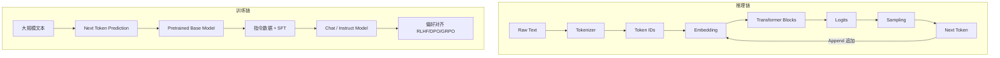
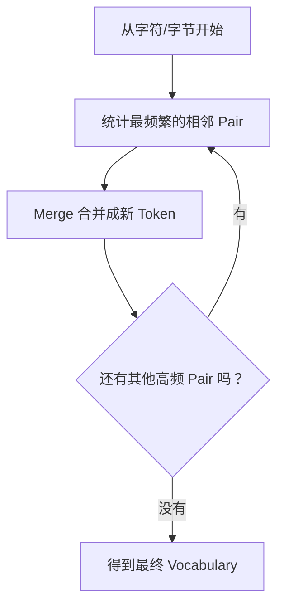
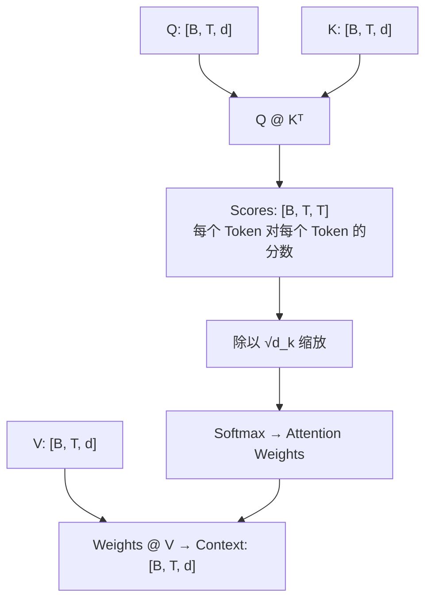
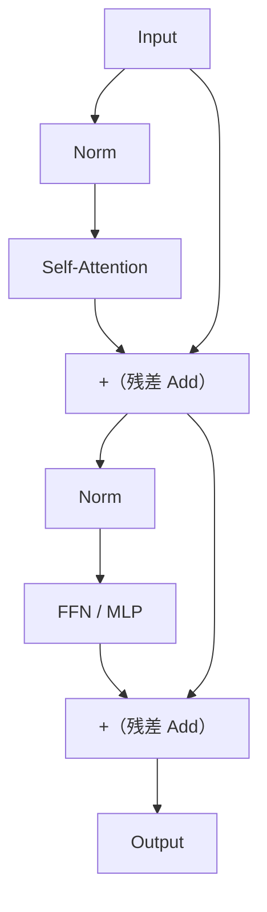
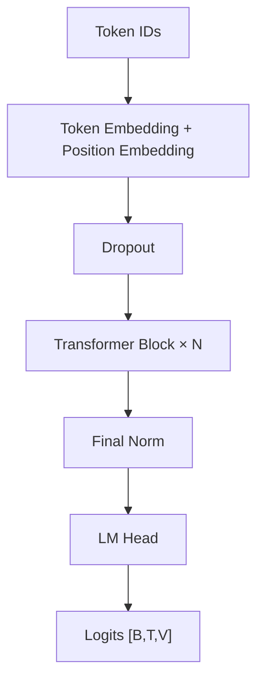
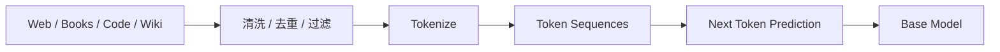
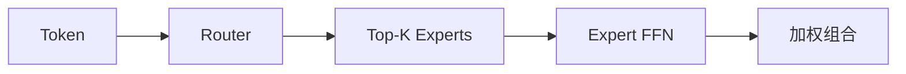
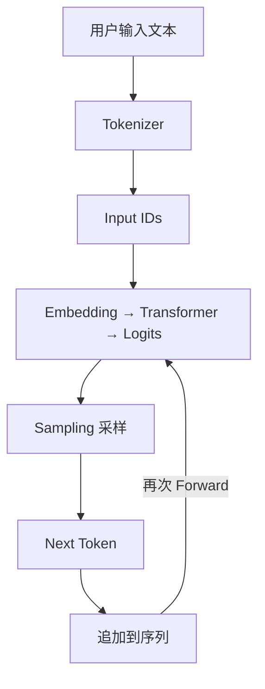
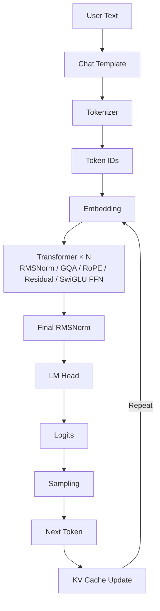

# 第 3 章 Transformer 与 LLM

> **所属路线**：AI 学习路线 · 第一部分
> **本章定位**：从 Language Modeling、Attention、Transformer，一直到 GPT / LLM 的预训练、指令微调与自回归推理
> **核心教材**：[rasbt/LLMs-from-scratch](https://github.com/rasbt/LLMs-from-scratch) · [jingyaogong/minimind](https://github.com/jingyaogong/minimind) · [karpathy/nn-zero-to-hero](https://github.com/karpathy/nn-zero-to-hero) · [d2l-ai/d2l-en](https://github.com/d2l-ai/d2l-en)
> **主要框架**：PyTorch
> **前置要求**：第 2 章（深度学习与神经网络）已完成
> **学习边界**：本章解决"LLM 是什么、如何训练、如何推理"；Agent、RAG、llama.cpp、vLLM、MLC-LLM 放到后续章节
> **资料检查日期**：2026-08-25

---

## 本章导读

上一章结束时我们问：能不能设计一种结构，让序列中任意两个位置直接建立关系，并且可以大规模并行训练？**Attention 就是答案，Transformer 把它变成了现实，LLM 把它推到了极限。**

学完本章，你应该能够：

1. 说清楚"LLM 就是 Next Token Predictor"这句话到底意味着什么；
2. 解释 Tokenizer 如何把文本变成数字，BPE 为什么实用；
3. 解释 Q、K、V 是什么，Self-Attention 的完整计算过程与每一步 Shape；
4. 画出 Causal Mask、Transformer Block、GPT 完整数据流；
5. 区分 Encoder-only / Encoder-Decoder / Decoder-only，说清 GPT 为什么用 Decoder-only；
6. 说清 Pretrain → SFT → LoRA → DPO/PPO/GRPO 在训练链中的位置；
7. 解释 Prefill、Decode、KV Cache，以及为什么 Decode 受内存带宽限制；
8. 解释 Temperature、Top-K、Top-P 如何影响生成；
9. 看懂现代 LLM（Qwen/LLaMA 类）相比 GPT-2 风格的结构差异（RoPE/RMSNorm/GQA/SwiGLU）。

**本章的学习方法**：用 `LLMs-from-scratch` 建立 GPT 主线 → 用 Zero-to-Hero 亲手再写一次 → 用 D2L 补 Attention 理论 → 用 MiniMind 对齐现代 Qwen 类结构。**先理解教学 GPT，再接触现代 LLM，不要一上来就啃 Qwen3 源码。**

本章要建立的两条主线：



---

## 1. 语言模型：预测下一个 Token 的机器

### 1.1 什么是 Language Model

> **定义**：语言模型（Language Model）是对一个 Token 序列的概率分布进行建模。

给定"今天天气很"，模型预测下一个词的概率：

```text
好   0.31
冷   0.19
热   0.12
不错 0.08
...
```

数学上，一个序列的联合概率可以按链式法则分解：

```text
P(x1, x2, ..., xT)
= P(x1) · P(x2|x1) · P(x3|x1,x2) · ... · P(xT|x<T)
```

> **核心结论：自回归语言模型就是在不断学习"根据前面的 Token 预测下一个 Token"。**

### 1.2 GPT 本质上是什么

GPT = **G**enerative **P**re-trained **T**ransformer，三个词分别代表：

| 词 | 含义 |
|---|---|
| Generative | 能够生成新的 Token 序列 |
| Pre-trained | 先在大规模文本上预训练 |
| Transformer | 模型主体采用 Transformer 架构 |

所以可以先这样理解：

> **GPT = 一个巨大的、基于 Transformer 的 Next Token Predictor**（Context Tokens → GPT → 下一个 Token 的概率分布）。

### 1.3 从字符级模型开始最容易理解

训练文本 "hello"，字符级 Token 为 `h e l l o`。训练样本就是"向右错一位"：

```text
Input:  h e l l
Target: e l l o
```

也就是说：**Target = Input 整体右移一位**。LLMs-from-scratch 的 [GPTDatasetV1](https://github.com/rasbt/LLMs-from-scratch/blob/main/ch04/01_main-chapter-code/gpt.py) 就是这个思路：

```text
Token IDs: [t0, t1, t2, t3, t4]
Input:     [t0, t1, t2, t3]
Target:    [t1, t2, t3, t4]
```

### 1.4 为什么一个序列能产生多个监督信号

一段 "I love machine learning"，模型一次 Forward 同时学习：

```text
I            → love
I love       → machine
I love machine → learning
```

一个长度为 T 的序列能提供约 T 个预测目标。这正是**自监督学习（Self-Supervised Learning）**：不需要人工标注，**文本自身就是监督信号**。

---

## 2. Tokenizer：文本与数字世界之间的接口

### 2.1 Token ≠ Word

> ⚠️ **最容易混淆的概念**：Token 可以是子词、字符、字节、单词的一部分、"空格+单词"、特殊符号……**Token 不等于 Word**。

"Hello world" 可能被切成 `["Hello", " world"]` → `[15496, 995]`（具体取决于 Tokenizer）。

### 2.2 Vocabulary 与参数量

Tokenizer 维护一张 **Vocabulary**（Token ↔ Token ID 映射表），Vocabulary Size 记为 `V`。V 会直接决定两个大矩阵的维度：

```text
Embedding Matrix: [V, D]
LM Head:          [D, V]
```

V = 150000、D = 4096 时这两个矩阵都非常大。所以：

> **Tokenizer 不是无关紧要的文本预处理工具，它直接影响模型大小、训练效率和推理行为。**

### 2.3 三种分词方式

| 方式 | 优点 | 缺点 |
|---|---|---|
| 字符级 | 实现简单、几乎没有 OOV | 序列太长、语义粒度太细 |
| 词级 | 语义完整 | 词表极大、新词难处理、多语言复杂 |
| 子词级（Subword） | 平衡两者，**现代主流** | 实现较复杂 |

### 2.4 BPE：Byte Pair Encoding

Karpathy 的 [minbpe](https://github.com/karpathy/minbpe) 是亲手实现 BPE 的最好材料。核心思想：



例如 `l o w` 和 `l o w e r` 中，`l+o` 频繁出现就会被合并成 `lo`。不断 Merge 后，序列越来越紧凑。

### 2.5 encode / decode 与 Special Tokens

任何 Tokenizer 的两个基本操作：

```text
Text --encode--> Token IDs --decode--> Text
```

常见特殊 Token：`<BOS>`、`<EOS>`、`<PAD>`、`<UNK>`；现代 Chat / Tool 模型还有 `<|system|>`、`<|user|>`、`<|assistant|>`、`<think>`、`<tool_call>` 等（具体名称随模型不同，MiniMind 也加入了 Tool Calling / Thinking 标记）。

### 2.6 Tokenizer 与模型必须匹配

> ⚠️ **铁律**：模型权重是在特定 Vocabulary、Token ID 映射、分词规则上训练出来的。**不能随便给一个训练好的 LLM 换 Tokenizer**——同一个 ID 可能代表完全不同的文本片段。

---

## 3. Embedding 与位置编码

### 3.1 Embedding：把 ID 变成向量

Token ID 只是整数（123、456），本身没有连续数学意义。**Embedding Layer** 把每个 Token ID 映射成一个 D 维向量：

```python
embedding = nn.Embedding(vocab_size, emb_dim)   # 矩阵形状 [V, D]
```

Token ID i 对应的向量 = Embedding Matrix 的第 i 行。**Embedding 也是模型参数**，会随训练更新，最终不同 Token 的向量会形成语义/统计结构。

### 3.2 为什么需要位置信息

Self-Attention 只按"内容"计算相关性。如果不注入位置信息，模型难以区分：

```text
狗咬人   vs   人咬狗
```

两个句子的 Token 集合完全相同，但含义相反。

### 3.3 绝对位置编码 vs RoPE

| 方式 | 做法 | 使用 |
|---|---|---|
| Absolute Positional Embedding | 每个位置一个可学习向量，`x = token_emb + pos_emb` | 早期 GPT 风格 |
| RoPE（Rotary Positional Embedding） | 在 Q/K 向量空间中注入与位置相关的**旋转** | 现代 LLM 主流 |

RoPE 的优势：Attention Score 能感知**相对位置**关系，且对外推更友好。MiniMind 的 [model_minimind.py](https://github.com/jingyaogong/minimind/blob/master/model/model_minimind.py) 里能看到 `precompute_freqs_cis`、`apply_rotary_pos_emb`。

> 本章先理解三点：① Self-Attention 缺顺序信息；② RoPE 把位置注入 Q/K；③ Attention Score 因此能感知相对位置。不必第一遍手推复数旋转公式。

---

## 4. Attention：让 Token 互相"看见"

### 4.1 从 RNN 的瓶颈说起

RNN 把过去信息压缩进一个 Hidden State 顺序传递，带来三个问题：串行计算、长距离依赖丢失、信息瓶颈。Attention 的新思路：

> **当前位置不要只依赖一个压缩的 Hidden State，而是直接选择性地读取其他位置的信息。**

经典例子：处理 "The animal didn't cross the street because **it** was too tired" 中的 `it` 时，模型应该重点关注 `animal`。**Attention 就是在计算"当前 Token 应该关注哪些 Token、关注多少"。**

### 4.2 Query / Key / Value：数据库检索的类比

| 角色 | 通俗理解 |
|---|---|
| Query（查询） | 我想找什么 |
| Key（键） | 我这里有什么信息 |
| Value（值） | 真正要读取的信息 |

Attention 流程：Query 与所有 Key 比较 → 得到相似度 Score → Softmax → Attention Weight → 对 Value 加权求和。

> ⚠️ Q、K、V 不是三份不同输入，而是**同一个 Hidden State X 经过三个不同权重矩阵得到的三种表示**：`Q = XW_Q`、`K = XW_K`、`V = XW_V`。三者都来自同一序列，所以叫 **Self-Attention（自注意力，序列在"看自己"）**。

### 4.3 Scaled Dot-Product Attention

核心公式：

```text
Attention(Q, K, V) = softmax(QKᵀ / √d_k) · V
```

不能只背公式，要能推导每一步 Shape。设 B = Batch、T = 序列长度、d = 头维度：



关键推论：

- **为什么是 T×T**：T 个 Query × T 个 Key = T² 个分数 → **标准 Self-Attention 在序列长度上是二次复杂度**。T 翻倍，注意力计算量约变 4 倍——这是长上下文昂贵的根本原因；
- **Dot Product 在衡量什么**：Query 与 Key 的匹配程度（越大越相关）；
- **为什么除以 √d_k**：d_k 很大时点积数值尺度变大，Softmax 分布过于尖锐、梯度不稳，除以 √d_k 控制尺度；
- **Softmax 的作用**：把分数变成非负且和为 1 的**注意力分布**；
- **加权求和**：`Weights @ V` 得到 Context Vector——**当前 Token 的新表示融合了它关注位置的信息**。

### 4.4 Causal Mask：GPT 不能偷看未来

GPT 是自回归模型，预测 Token t 时不能看 t+1、t+2……所以需要 Causal Mask。T=4 时：

```text
[ 0  -∞  -∞  -∞
  0   0  -∞  -∞
  0   0   0  -∞
  0   0   0   0 ]
```

`-∞` 经 Softmax 后权重 ≈ 0，未来位置的信息被屏蔽。

> 💡 **训练时可以一次算完整序列吗？** 可以。虽然推理是逐 Token 的，但训练时整段文本已知，借助 Causal Mask，T 个位置可以**并行计算**。这正是 Transformer 相比 RNN 最大的训练优势。

---

## 5. 多头注意力与 GQA

### 5.1 Multi-Head Attention（MHA）

单头只有一个 Q/K/V 子空间；多头把注意力切成 H 个头，每个头学不同的关系（局部依赖、语法、长距离、实体关联……），最后 Concat 再投影：

```text
输入 [B,T,D] → Q/K/V → reshape [B,T,H,d] → transpose [B,H,T,d] → 各头独立 Attention → Concat → [B,T,D]
```

D = 768、H = 12 时，`head_dim = 768/12 = 64`。注意：

> ⚠️ **MHA 不是用 Python for 循环跑 12 次模型**，而是一次大的 Linear 同时算出所有头的 Q/K/V，再在张量布局上分组并行。

### 5.2 GQA / MQA：现代 LLM 的 KV 折中

| 方案 | num_q_heads vs num_kv_heads |
|---|---|
| MHA | num_q = num_kv |
| GQA（分组查询注意力） | num_q > num_kv > 1（如 8 个 Q 头、4 个 KV 头） |
| MQA | num_kv = 1（所有 Q 头共享一组 K/V） |

GQA 为什么重要？因为 Decode 时要缓存 K/V，**减少 KV 头数 → KV Cache 显著变小**。它是"模型能力 × 推理速度 × KV Cache 内存"之间的折中，会直接进入后面的 llama.cpp / vLLM / RKLLM。

---

## 6. Transformer Block

### 6.1 一个典型的 Decoder-only Block



现代模型基本都采用 **Pre-Norm** 结构。

### 6.2 四个核心组件

| 组件 | 作用 |
|---|---|
| Residual Connection（残差） | `y = x + F(x)`，给深层网络提供直接的梯度通路，是深 Transformer 能训练的关键 |
| LayerNorm | 沿隐藏维对**单个 Token 向量**归一化；不依赖 Batch 统计量，适合序列模型 |
| RMSNorm | LayerNorm 的简化版（去掉均值中心化），**现代 LLM 主流**，MiniMind 有直接实现 |
| FFN（前馈网络） | Attention 让 Token 之间交换信息，FFN 对**每个 Token 的特征通道**做非线性变换，两者职责不同 |

经典 FFN：`D → 4D → Activation → D`（如 768 → 3072 → GELU → 768）。

### 6.3 现代 SwiGLU 风格 FFN

LLaMA / Qwen 类模型的典型 FFN（MiniMind 中可见 `gate_proj / up_proj / down_proj / SiLU`）：

```text
x → gate_proj → SiLU ─┐
                     ×
x → up_proj ──────────┘ → down_proj → out
```

### 6.4 Block 的算子拆解（为 Compiler 铺垫）

一个现代 Decoder Block 拆开就是这些算子：

```text
RMSNorm, Linear(Q), Linear(K), Linear(V), RoPE,
MatMul(Q,K), Softmax, MatMul(Attn,V), Linear(O), Add,
RMSNorm, Linear(Gate), SiLU, Linear(Up), Mul, Linear(Down), Add
```

后面学 AI Compiler / NPU / GPU Kernel 时，看到的就是这些 Operator。

---

## 7. 三种 Transformer 架构

| 类型 | 典型模型 | 特点 | 适合任务 |
|---|---|---|---|
| Encoder-only | BERT | 双向 Attention | 理解、分类、Embedding |
| Encoder-Decoder | 原始 Transformer、T5 | Encoder + Decoder | 翻译、序列到序列 |
| Decoder-only | GPT、LLaMA、Qwen、Mistral、DeepSeek | Causal Attention + 自回归生成 | **通用 LLM 的主流路线** |

**GPT 为什么用 Decoder-only？** 因为"根据过去预测下一个 Token"天然就是 Causal Decoder 的任务，不需要单独的 Encoder。

---

## 8. GPT 模型完整结构

### 8.1 数据流



对应 [LLMs-from-scratch ch04 gpt.py](https://github.com/rasbt/LLMs-from-scratch/blob/main/ch04/01_main-chapter-code/gpt.py)。

### 8.2 LM Head 与 Logits

- **LM Head**：一个 `Linear(D → V)`，把最后的 `[B,T,D]` 变成 `[B,T,V]`，V 是词表大小；
- **Logits**：Softmax 之前的原始分数，每个值代表对应 Token 的 raw score。

### 8.3 训练损失与 Weight Tying

- 训练时 `Logits [B,T,V]` 与 Target `[B,T]` 计算 CrossEntropyLoss（PyTorch 的 `nn.CrossEntropyLoss()` 直接接收 Logits，内部以数值稳定方式完成 Softmax，**不要手动先 Softmax 再传**）；
- **Weight Tying**：输入 Embedding 与输出 LM Head 共享权重（MiniMind 默认 `tie_word_embeddings=True`），可减少参数并利用输入/输出词空间相关性。

---

## 9. 预训练：从文本到 Base Model

### 9.1 Pretraining 是什么

> **定义**：预训练（Pretraining）是在大规模通用文本上训练 Next Token Prediction。



### 9.2 Base Model 学到了什么

Base Model 主要学到：语言结构、统计规律、世界知识、代码模式、部分推理模式。但它未必天然擅长"用户问一句、助手规整答一句"的对话行为——那需要指令微调。

### 9.3 数据质量与 Scaling

- **数据质量极其重要**：重复、低质量、错误、污染评测集的数据，模型都会学到；
- **Scaling 三要素**：模型大小（Model Size）× 数据量（Data Size）× 算力（Compute）——这与第 1 章的 AI 三要素（算法/数据/算力）一脉相承，LLM 只是把它们推到了极致。

### 9.4 参数量与 MoE

- **参数主要来源**：Embedding、Attention 的四个 Linear、FFN 的三个 Linear、LM Head。大模型中 **Transformer Blocks 占主要参数**；
- **为什么 FFN 参数多**：`Linear(D→4D)` 与 `Linear(4D→D)` 都是巨型矩阵（如 4096×11008）。**LLM 不只是 Attention 贵，FFN 同样是计算与参数的重要来源**；
- **MoE（Mixture of Experts）**：不让每个 Token 都过同一个 FFN，而是先 Router 选 Top-K 个 Expert：



**Total Parameters ≠ Active Parameters per Token**——这是理解 DeepSeek MoE、Qwen MoE 规格的基础。但 MoE 不是"免费变大"：负载均衡、路由、通信、内存、部署复杂度都是代价，端侧部署尤其要注意其权重内存。

---

## 10. 指令微调：从 Base 到 Chat

### 10.1 SFT（Supervised Fine-Tuning）

用"指令 + 输入 + 回复"格式的数据做监督训练，让模型学会听话：

```text
Instruction Data → 格式化 → Tokenize → Dataset → Collate → Labels（含 Ignore Index）→ Training
```

对应 [LLMs-from-scratch ch07](https://github.com/rasbt/LLMs-from-scratch/tree/main/ch07)。

> 💡 **关键认识**：SFT 仍然是 Next Token Prediction，变的只是**训练数据分布**（变成了 Instruction / Response 格式）。SFT 更重要的作用通常是改变行为分布、学习指令格式与任务形式，而不是简单"灌知识"。

### 10.2 Chat Template：角色边界的格式

不同模型对对话有固定序列格式：

```text
<BOS><system>你是助手</system><user>你好</user><assistant>
```

> ⚠️ 模型是在特定 Token Pattern 上训练的。**Tokenizer + Chat Template + Model Weight 是一个整体**，推理时格式变了模型就无法正确判断角色边界。这对后面用 llama.cpp / RKLLM 部署 Qwen 极其重要。

### 10.3 Full Fine-Tuning vs LoRA vs QLoRA

| 方法 | 做法 | 资源需求 |
|---|---|---|
| Full Fine-Tuning | 更新全部参数 | 显存高、算力高、保存完整权重 |
| LoRA（Low-Rank Adaptation） | 冻结原权重，只训练低秩增量 `W' = W + BA`（r << D） | 梯度/优化器状态/检查点都小很多，适合个人 GPU |
| QLoRA | LoRA 基础上把 Base Model 低比特量化存储 | 进一步降低显存 |

> ⚠️ 注意：QLoRA 的"量化训练"与后面 llama.cpp 的"纯推理量化"目标不同。

### 10.4 偏好对齐：RLHF / DPO / PPO / GRPO

SFT 之后模型会回答，但不一定"回答得最好、最安全、最符合偏好"，于是用偏好数据（Prompt + Chosen + Rejected）做对齐：

- **RLHF**：人类偏好数据 → 奖励模型（Reward Model）→ 强化学习（历史上常用 PPO）；
- **DPO（Direct Preference Optimization）**：不显式训练独立奖励模型，直接用偏好对优化策略；
- **PPO / GRPO / CISPO**：现代训练流程中的强化学习变体，MiniMind 包含 PPO / GRPO / CISPO 与 Agentic RL。

本章不要求推导这些 RL 算法，只需建立训练阶段的位置：

```text
Pretrain（获得基础语言能力）→ SFT（学习指令/对话行为）→ Preference / RL（对齐偏好与推理）
```

---

## 11. 推理：逐 Token 的自回归

### 11.1 推理链



### 11.2 为什么必须一个 Token 一个 Token 生成

Token t+1 依赖 Token ≤ t，Token t+2 又依赖刚生成的 t+1——**生成是串行的**。这与训练时 Sequence 维度的高度并行是一个巨大区别，直接引出 Prefill 与 Decode 的分化。

### 11.3 Prefill vs Decode

| 阶段 | 做什么 | 特点 |
|---|---|---|
| Prefill | 对整段 Prompt 一次 Forward，构建 KV Cache | 大矩阵乘、并行度高，偏 Compute-bound |
| Decode | 每步只算新 Token，逐个生成 | Token 维度小，偏 Memory-bound |

### 11.4 为什么 Decode 常受内存带宽限制

每生成一个 Token，**大量模型权重仍要被读取一遍**，而本次的有效计算规模很小 → Arithmetic Intensity 低 → 瓶颈往往在 Memory Bandwidth。

> 这就是为什么 **INT4 / Q4 量化不仅省内存，还可能明显提高 Decode 速度**（权重变小 → 每 Token 搬运的数据变少）。

---

## 12. KV Cache

### 12.1 缓存什么、为什么

- **缓存 K / V**：过去 Token 的 K、V 在后续 Decode 中会被重复使用；每次都重算所有历史 K/V 极其浪费；
- **不缓存 Q**：当前新 Token 的 Q 只在本步使用，下一步会有新的 Q；而历史 K/V 要被每个新 Query 反复读取。

| 无 KV Cache | 有 KV Cache |
|---|---|
| 第 1 步重算 Token 1..T，第 2 步重算 1..T+1，第 3 步重算 1..T+2… | Prefill 算好 K/V Cache；Decode 每步只对新 Token 算 Q/K/V，然后用 `new Q × 全部缓存 K` 做 Attention |

### 12.2 KV Cache 内存公式

```text
≈ Layers × Sequence Length × KV Heads × Head Dim × 2(K+V) × Bytes per element
```

Context 越长，KV Cache 越大。

### 12.3 与 GQA 再联系

GQA 减少 KV Heads → KV Cache 变小 → Memory Bandwidth 需求下降。这就是现代推理模型如此重视 GQA 的原因。

---

## 13. Context Length 与长上下文

### 13.1 Context 的成本

Context Length 是模型一次能处理的 Token 数量上限。注意 **Token ≠ 字符**——"32K Context"不等于 32000 个汉字。

Context 增大会同时带来：Attention 计算量↑、KV Cache↑、内存↑、Prefill 延迟↑。

> **Long Context 从来不是"免费加一个配置值"。**

### 13.2 RoPE Scaling / YaRN

想超过原始训练长度时，位置编码需要能外推。MiniMind 包含 YaRN 等 RoPE Scaling 配置。

> 长上下文不仅是 KV Cache 问题，还涉及位置编码能否外推。

---

## 14. Sampling：怎么选下一个 Token

### 14.1 Greedy

`argmax(logits)`，每次取概率最大的 Token。优点：确定、简单；缺点：容易重复、表达僵硬、陷入局部模式。

### 14.2 Temperature / Top-K / Top-P

| 方法 | 做法 | 效果 |
|---|---|---|
| Temperature | `logits / temperature` 再 Softmax | 低 → 更确定；高 → 更随机 |
| Top-K | 只保留概率最高的 K 个 Token 再采样 | 裁剪尾部候选 |
| Top-P（Nucleus） | 从高到低累积概率直到 ≥ p，动态确定候选集 | 更自适应 |

> ⚠️ **同一个模型、不同解码参数，生成风格可能差异巨大**——评估模型时必须区分 Model Weight 与 Decoding Strategy。

### 14.3 EOS / BOS / Padding

- **EOS**：模型输出 EOS Token 通常表示生成结束；
- **BOS**：某些模型输入前加 BOS 标记，不同模型行为不同——不要想当然统一处理；
- **Padding**：Batch 中序列长度不一需要 PAD 补齐，同时需要 Attention Mask 避免模型关注 Padding。

**Causal Mask（不能看未来）与 Padding Mask（不能看 PAD）是两个不同的东西**，真实模型中可能组合使用：Allowed → 0，Blocked → -∞。

---

## 15. GPT-2 风格 vs 现代 LLM

### 15.1 对比

| 维度 | GPT-2 风格（LLMs-from-scratch） | 现代 LLM（MiniMind / Qwen / LLaMA） |
|---|---|---|
| 位置编码 | Learned Position Embedding | RoPE |
| 归一化 | LayerNorm | RMSNorm |
| 注意力 | MHA | GQA |
| FFN | GELU FFN | SiLU / SwiGLU 风格 |
| 其他 | — | KV Cache、MoE（可选）、长上下文 Scaling |

**两个阶段不要颠倒**：先用教学 GPT 理解原理，再用 MiniMind 迁移到现代结构。

### 15.2 为什么不要一上来读 Qwen3 完整源码

现代工程仓库同时包含 Tensor Parallel、FlashAttention、Cache、Generation API、量化、分布式训练、MoE 路由、Checkpoint 转换、Serving……初学者很容易把"Transformer 原理"和"工程框架细节"混在一起。正确的路径：

```text
Tiny GPT → Modern Tiny LLM（MiniMind）→ Real Qwen
```

### 15.3 MiniMind 阅读顺序与 Config

读 [model_minimind.py](https://github.com/jingyaogong/minimind/blob/master/model/model_minimind.py) 不要从头硬啃，按顺序：

```text
MiniMindConfig → RMSNorm → Attention → FeedForward → MiniMindBlock → MiniMindModel → MiniMindForCausalLM → MOEFeedForward
```

**先看 Config**——它给出模型骨架：hidden_size、num_hidden_layers、vocab_size、num_attention_heads、num_key_value_heads、head_dim、intermediate_size、max_position_embeddings、rope_theta。看到一个陌生 LLM，第一件事就是看 Config。

### 15.4 一个 LLM 文件夹里有什么

Hugging Face 风格模型目录：

```text
config.json（结构）          tokenizer.json / tokenizer_config.json（分词）
model.safetensors 或 shards（权重）  generation_config.json（生成参数）
chat_template（对话模板）
```

每类负责不同部分，不是重复文件。权重可以存 `.pth / .bin / .safetensors`；而 GGUF、`.rknn`、RKLLM model 会加入部署信息或经过编译/量化转换。

---

## 16. LLM 推理的 Shape 与 GEMM

### 16.1 Shape 主线（必须记住）

```text
Input IDs       [B, T]
Embedding       [B, T, D]
Q               [B, H, T, d]
K               [B, H_kv, T, d]
V               [B, H_kv, T, d]
Attention Score [B, H, T, T]
Attention Out   [B, T, D]
FFN Hidden      [B, T, D_ff]
Block Output    [B, T, D]
Logits          [B, T, V]
```

固定维度符号：**B** = Batch、**T** = 序列长度、**D** = Hidden Size、**V** = 词表大小、**H** = 头数、**d** = 头维度，且传统 MHA 中 `D = H × d`。

### 16.2 Prefill / Decode 的 GEMM 形态不同

- Prefill：T 较大，形成大的矩阵乘（GEMM）；
- Decode：M 很小，接近 **Matrix × Vector（GEMV）** 或小 GEMM。

> **同一个模型在 Prefill 和 Decode 上，硬件利用率与瓶颈可能完全不同。** 后面 llama.cpp 文档会继续深入。

### 16.3 参数量 → 内存 → 量化

以 2B 参数为例：FP16 约 2 Byte/参数 → 权重约 4 GB；INT8 约 2 GB；INT4 裸权重约 1 GB（实际还要加 Scale、Metadata、Alignment、KV Cache、Runtime Buffer）。

本章先建立量化位置：`降低权重精度 → 减少权重内存 → 减少内存搬运`。Q4_K_M、GGUF、Weight-only / Activation Quant 等细节留给 Runtime 章节。

> ⚠️ **FLOPs 不是唯一性能指标**：LLM 推理还依赖 Memory Bandwidth、Memory Capacity、Cache、Tensor Layout、量化、Kernel 效率、Batch、序列长度、KV Cache。**不能只看 NPU TOPS 或 GPU TFLOPS 判断实际 Tokens/s。**

---

## 17. 通往应用与硬件的桥梁

### 17.1 LLM 与 VLM / Agent 的关系

- **VLM（视觉语言模型）**：`Image → Vision Encoder → Visual Tokens → Projection → LLM → Text`。LLM 往往仍是多模态模型中的核心语言 Backbone；
- **Agent**：`LLM + Tool + Memory + Workflow + Environment`。**Agent 不是新的 Transformer 结构，而是建立在 LLM 之上的系统层**，下一阶段展开。

### 17.2 两条完整链（必须能自己画出来）

**现代 Chat LLM 推理链**：



**LLM 训练阶段链**：

```text
Raw Text → 清洗/去重 → Tokenizer → Token Dataset → Pretraining → Base Model
→ Instruction Dataset → SFT → Instruct Model → Preference/RL Data → DPO/PPO/GRPO → Aligned Chat Model
```

### 17.3 为什么后面章节都需要本章

- **llama.cpp**：里面会出现 Token、Tokenizer、Embedding、RoPE、Attention、KV Cache、RMSNorm、FFN、Sampling——本章不清楚，llama.cpp 只会变成"会执行命令"；
- **vLLM**：KV Cache、Batching、Sequence、Prefill、Decode、Scheduler、PagedAttention 全部建立在自回归推理机制之上；
- **RKLLM（RK3576 部署 Qwen）**：你需要理解 Model Architecture、Context Length、KV Cache、Prefill/Decode、量化、Supported Operator、Runtime Memory，否则出了性能问题无法定位；
- **AI Compiler / GPU Kernel**：Attention 的算子层是 `Linear / MatMul / Softmax / Mask / MatMul / Linear`，Kernel 层是 `GEMM / Softmax Kernel / FlashAttention`。这正是第三部分的桥梁。

### 17.4 FlashAttention 预告

标准 Attention 会产生大型 `T×T` 中间矩阵，核心问题不仅是计算量，还有 **HBM/DRAM 数据搬运**。FlashAttention 通过更好的 Tiling 与 IO-aware 算法减少高代价内存访问——具体在第 10 章展开。

---

## 18. 本章实验

| # | 实验 | 验收标准 |
|---|---|---|
| 1 | **Bigram Language Model** | 用 tiny corpus 实现 Vocabulary/Encode/Next Token 概率/Sampling，真正理解 Language Modeling |
| 2 | **BPE Tokenizer**（[minbpe](https://github.com/karpathy/minbpe)） | 跑通 Bytes → Pair 统计 → Merge → Vocabulary → Encode/Decode，观察中/英/代码/数字如何被切分 |
| 3 | **Single-head Self-Attention** | 手写 `Q@Kᵀ/√d + mask → softmax → @V`，打印每一步 Shape |
| 4 | **Multi-Head Causal Attention** | `[B,T,D] → Q/K/V → [B,H,T,d] → Attention → Concat → [B,T,D]`，Shape 完全清楚 |
| 5 | **Tiny GPT** | Tokenizer + Embedding + Block×N + LM Head，用 Tiny Shakespeare 训练到能生成形式合理的文本 |
| 6 | **Pretraining Loss** | 记录 Train/Val Loss，观察 Epoch/Step/LR 的影响；小范围改 Context/Batch/Hidden/Layers |
| 7 | **Sampling 对比** | 同一 Prompt 下比较 Greedy / Temperature 0.2/0.8/1.2 / Top-K / Top-P 的生成差异 |
| 8 | **KV Cache** | 对比有无 KV Cache 的每 Token 推理时间，亲眼看到 Cache 为什么重要 |
| 9 | **MiniMind 模型阅读** | `print(model)` 后逐层看 Embedding/Block/Attention/FFN/Norm/LM Head，统计参数量与每个 Tensor Shape |
| 10 | **MiniMind Pretrain → SFT** | 用 Mini 数据跑通 Pretrain → SFT → Chat/Eval，亲手完成一次 Base→Chat 最小链路 |

---

## 19. 常见误区速查

| # | 误区 | 正确认识 |
|---|---|---|
| 1 | LLM = Transformer | Transformer 是架构；LLM 是架构 + Tokenizer + 权重 + 数据 + 训练配方 + 推理的系统 |
| 2 | Token = Word | Token 可以是子词/字节/字符/特殊符号 |
| 3 | Attention 就是"模型知道什么重要" | 工程上必须落实到 QKᵀ → Scale → Mask → Softmax → V |
| 4 | Transformer 只有 Attention | Block 还有 FFN / Norm / Residual / Linear，FFN 参数与计算量非常大 |
| 5 | LLM 推理就是一次 Forward | Chat 生成 = Prefill + Decode × N |
| 6 | 有 KV Cache 就不用算 Attention | Cache 只省历史 K/V 重算，当前 Query 仍要和全部缓存 K 做 Attention |
| 7 | Context Length 只影响最大输入 | 还影响 KV Cache、Prefill 延迟、注意力计算量、内存 |
| 8 | SFT 给模型"灌知识" | 主要是改变行为分布、学习指令格式与任务形式 |
| 9 | LoRA = 量化 | LoRA 是参数高效微调；量化是降精度；二者可同时使用 |
| 10 | GGUF 是一种 LLM 架构 | GGUF 是 llama.cpp 生态的模型文件格式，架构可能是 LLaMA/Qwen/Gemma… |

---

## 20. 本章小结

### 20.1 十个核心思维模型

1. **LLM = Next Token Predictor**（训练核心）；
2. **Text 不能直接进网络**：Text → Tokenizer → Token IDs → Embedding；
3. **Self-Attention = Token-to-Token Information Routing**（信息路由）；
4. **Attention = QKᵀ → Scale → Mask → Softmax → V**；
5. **Transformer Block = Attention + FFN + Norm + Residual**；
6. **GPT = Decoder-only Transformer + Causal Language Modeling**；
7. **Base = 预训练模型；Chat = Base + 指令/对齐训练**；
8. **Training = 整段并行 Next Token Prediction；Generation = 逐 Token 自回归 Decode**；
9. **KV Cache = 缓存过去 Token 的 K/V，避免重复计算**；
10. **LLM 性能 = Compute + Memory Bandwidth + KV Cache + Kernel + 量化 + Scheduler + Hardware**。

### 20.2 术语表

| 术语 | 英文 | 一句话解释 |
|---|---|---|
| 语言模型 | Language Model | 对 Token 序列概率分布建模 |
| 词表 | Vocabulary | Token ↔ ID 的映射集合 |
| 分词器 | Tokenizer | 文本 ↔ Token ID 的转换器 |
| 子词分词 | BPE | 不断合并高频字符对得到词表 |
| 嵌入 | Embedding | 把 Token ID 变成可学习的连续向量 |
| 注意力 | Attention | 按相关性加权融合其他位置的信息 |
| 自注意力 | Self-Attention | 序列对自身做注意力 |
| 因果掩码 | Causal Mask | 屏蔽未来位置，保证自回归 |
| 多头注意力 | MHA | 多个注意力子空间并行 |
| 分组查询注意力 | GQA | 减少 KV 头数，压缩 KV Cache |
| 残差连接 | Residual | y = x + F(x)，深网络训练的关键 |
| 前馈网络 | FFN | 对每个 Token 特征做非线性变换 |
| 预训练 | Pretraining | 大规模无标注文本上训练 |
| 指令微调 | SFT | 用指令-回复数据训练对话行为 |
| 低秩适配 | LoRA | 只训练低秩增量，省显存 |
| 自回归 | Autoregressive | 逐 Token 生成，下一个依赖之前的输出 |
| 预填充 | Prefill | 对 Prompt 一次前向，构建 KV Cache |
| 解码 | Decode | 逐 Token 生成阶段 |
| KV 缓存 | KV Cache | 缓存历史 K/V 向量 |
| 困惑度 | Perplexity | 模型对下一个 Token 的"困惑"程度 |
| 温度 | Temperature | 控制采样随机性 |

### 20.3 自测清单（精简版）

**基础**：[ ] 能解释 Language Model / Autoregressive / Next Token Prediction / Input-Target 错位 / 自监督

**Tokenizer**：[ ] 能解释 Token≠Word、Vocabulary、BPE、encode/decode、Special Token、Tokenizer 必须与权重匹配，跑过一次 minbpe

**Attention**：[ ] 能解释 Q/K/V、Self-Attention、核心公式、T×T 复杂度、√d_k、Softmax、Causal Mask、MHA、GQA

**Transformer**：[ ] 能画出 Block 结构、解释 Residual/LayerNorm/RMSNorm/FFN/SwiGLU、区分三种架构、说清 GPT 为什么 Decoder-only

**GPT/训练**：[ ] 能画出 GPT 数据流、解释 LM Head/Logits/CrossEntropy/Weight Tying、Pretrain/SFT/Chat Template/LoRA/DPO/PPO/GRPO 的位置、跑过 Tiny GPT Pretraining

**推理**：[ ] 能解释 Prefill/Decode、KV Cache（缓存什么、为什么）、Context Length 成本、Greedy/Temperature/Top-K/Top-P、Decode 为何受内存带宽限制、量化为何可能提速

**桥梁**：[ ] 能把 Linear/Attention 拆成算子、说明 Prefill/Decode 的 GEMM 形态差异、解释为什么需要 llama.cpp/vLLM/RKLLM

**不要求**：手推 RoPE 复数数学、精通所有 Attention 变体、MoE Router 数学、PPO/GRPO 推导、分布式训练、FlashAttention Kernel、量化算法。这些属于后续章节。

---

## 21. 学习资源与阅读顺序

### 21.1 仓库组合方式

| 仓库 | 角色 |
|---|---|
| [LLMs-from-scratch](https://github.com/rasbt/LLMs-from-scratch) | **主教材**：Text → Token → Attention → GPT → Pretrain → SFT → LoRA |
| [nn-zero-to-hero](https://github.com/karpathy/nn-zero-to-hero) | 亲手从零建立 Language Model / GPT / Tokenizer（Lecture 2/7/8） |
| [D2L](https://github.com/d2l-ai/d2l-en) | 补齐 Attention 理论与 Transformer 体系 |
| [MiniMind](https://github.com/jingyaogong/minimind) | 从教学 GPT 迁移到现代 Qwen 类 LLM |

### 21.2 推荐学习顺序（9 个 Stage）

| Stage | 内容 | 必读 | 目标 |
|---|---|---|---|
| 1 | Language Model | [Zero to Hero](https://github.com/karpathy/nn-zero-to-hero) + [LLMs-from-scratch ch02](https://github.com/rasbt/LLMs-from-scratch/tree/main/ch02) | 手写字符级 Bigram LM |
| 2 | Tokenizer | [minbpe](https://github.com/karpathy/minbpe) | 自己实现极简 BPE |
| 3 | Attention | [ch03](https://github.com/rasbt/LLMs-from-scratch/tree/main/ch03) + [D2L Attention](https://github.com/d2l-ai/d2l-en/tree/master/chapter_attention-mechanisms-and-transformers) | 手写 Self-Attention |
| 4 | GPT | [ch04](https://github.com/rasbt/LLMs-from-scratch/tree/main/ch04) + [GPT Lecture](https://github.com/karpathy/nn-zero-to-hero/blob/master/README.md) | 实现 Tiny GPT |
| 5 | Pretraining | [ch05](https://github.com/rasbt/LLMs-from-scratch/tree/main/ch05) | 完整跑一次小型预训练 |
| 6 | Instruction Finetuning | [ch07](https://github.com/rasbt/LLMs-from-scratch/tree/main/ch07) | Base → 最简单的 Instruct Model |
| 7 | LoRA | LLMs-from-scratch Appendix E | 跑一次 LoRA 微调 |
| 8 | 现代 LLM 结构 | [model_minimind.py](https://github.com/jingyaogong/minimind/blob/master/model/model_minimind.py) | 理解 RMSNorm/RoPE/GQA/SwiGLU/KV Cache/MoE |
| 9 | 完整 MiniMind Pipeline | [train_pretrain.py](https://github.com/jingyaogong/minimind/blob/master/trainer/train_pretrain.py) + [train_full_sft.py](https://github.com/jingyaogong/minimind/blob/master/trainer/train_full_sft.py) | 跑通 Pretrain → SFT → Inference |

---

## 22. 下一章预告

到这里，第一部分最核心的理论链已经走完：

```text
AI → Machine Learning → Deep Learning → Neural Network → Attention → Transformer → LLM
```

接下来的问题不再是"LLM 是怎么构成的"，而是：

> **怎样把 LLM 变成真正可用的应用和高性能推理系统？**

学习重点转向两个方向：

```text
LLM
├── Application：RAG / Tool Calling / Agent
└── Runtime：llama.cpp / vLLM / MLC-LLM
```

下一章先落地工具层：

> **[04_PyTorch与模型框架](04_PyTorch与模型框架.md)**

---

## 附录：核心参考链接

### LLMs-from-scratch

- [Repository](https://github.com/rasbt/LLMs-from-scratch)
- [Chapter 2 - Text Data](https://github.com/rasbt/LLMs-from-scratch/tree/main/ch02)
- [Chapter 3 - Attention](https://github.com/rasbt/LLMs-from-scratch/tree/main/ch03)
- [Chapter 4 - GPT](https://github.com/rasbt/LLMs-from-scratch/tree/main/ch04)
- [GPT Source](https://github.com/rasbt/LLMs-from-scratch/blob/main/ch04/01_main-chapter-code/gpt.py)
- [Chapter 5 - Pretraining](https://github.com/rasbt/LLMs-from-scratch/tree/main/ch05)
- [Chapter 7 - Instruction Finetuning](https://github.com/rasbt/LLMs-from-scratch/tree/main/ch07)
- [DPO Bonus](https://github.com/rasbt/LLMs-from-scratch/tree/main/ch07/04_preference-tuning-with-dpo)

### MiniMind

- [Repository](https://github.com/jingyaogong/minimind)
- [README](https://github.com/jingyaogong/minimind/blob/master/README.md)
- [Model Source](https://github.com/jingyaogong/minimind/blob/master/model/model_minimind.py)
- [Pretraining Script](https://github.com/jingyaogong/minimind/blob/master/trainer/train_pretrain.py)
- [Full SFT Script](https://github.com/jingyaogong/minimind/blob/master/trainer/train_full_sft.py)
- [Trainer Directory](https://github.com/jingyaogong/minimind/tree/master/trainer)

### Karpathy

- [Neural Networks: Zero to Hero](https://github.com/karpathy/nn-zero-to-hero)
- [Course README](https://github.com/karpathy/nn-zero-to-hero/blob/master/README.md)
- [minbpe](https://github.com/karpathy/minbpe)
- [nanoGPT](https://github.com/karpathy/nanoGPT)

### D2L

- [D2L Repository](https://github.com/d2l-ai/d2l-en)
- [Attention Mechanisms and Transformers](https://github.com/d2l-ai/d2l-en/tree/master/chapter_attention-mechanisms-and-transformers)
