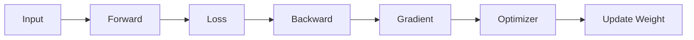
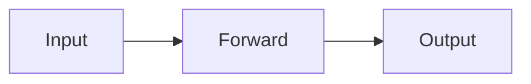
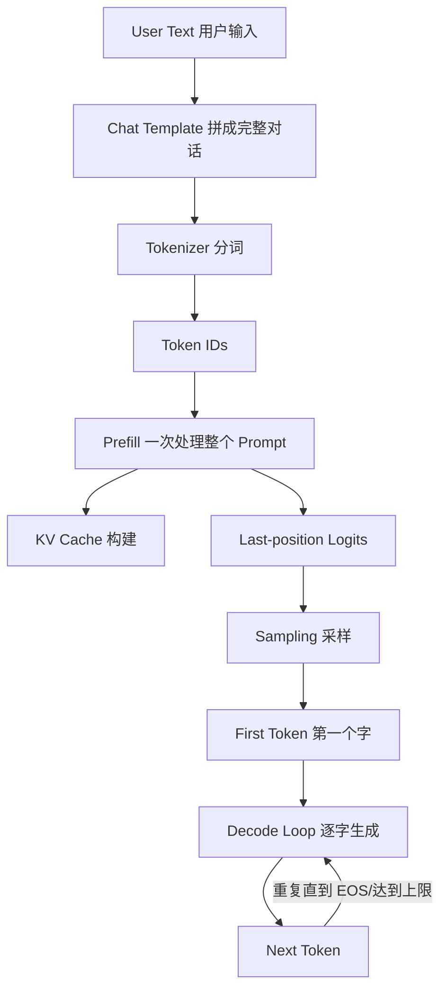
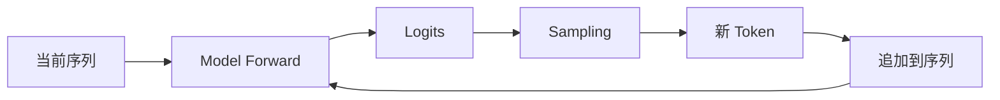
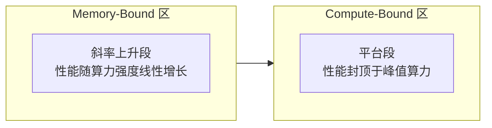
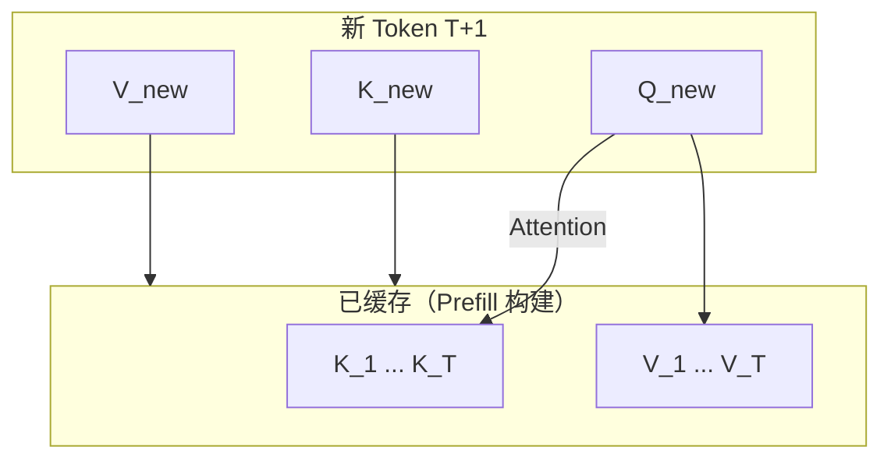
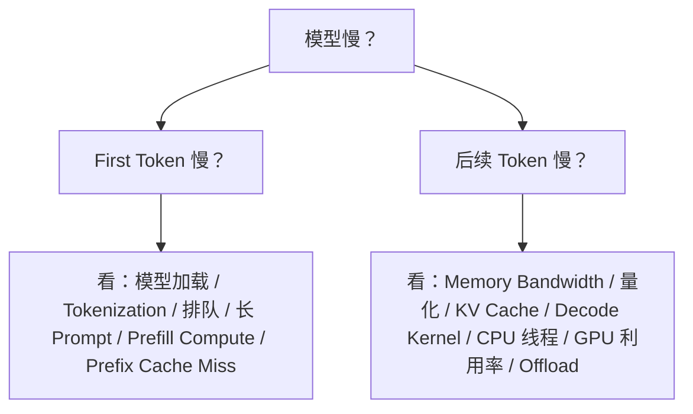

# 第 6 章 LLM 推理原理

> **所属路线**：AI 学习路线 · 第二部分
> **本章定位**：从一个训练好的 Decoder-only LLM 出发，把「用户输入一句话」到「模型逐字输出」的完整推理链路彻底拆开，并理解它为什么这样跑、瓶颈在哪里
> **核心参考**：[ggml-org/llama.cpp](https://github.com/ggml-org/llama.cpp) · [vllm-project/vllm](https://github.com/vllm-project/vllm) · Hugging Face Transformers · NVIDIA LLM Inference Optimization
> **前置要求**：已理解第 3 章 Transformer / LLM 的基本结构与自回归生成
> **学习边界**：本章解决「LLM 推理为什么这样运行」；llama.cpp、vLLM、MLC-LLM 的具体源码与工程实现放在第 7、8 章
> **资料检查日期**：2026-08-25

---

## 本章导读

第 3 章我们弄懂了 LLM 是怎么构成的，但有一个问题一直悬着：

> **模型文件就躺在硬盘上，当你敲下一句话，从字符串到屏幕上第一个字，中间到底发生了什么？**

这一章就把这条链路彻底拆开。你会看到，LLM 推理和训练是**两种完全不同的工作负载**；推理内部又被一条分界线切成两半——**Prefill** 和 **Decode**，它们的硬件瓶颈截然不同。理解了这条分界线，后面所有关于量化、KV Cache、GPU Kernel、NPU 部署的话题，都会自动各归其位。

学完本章，你应该能回答：

1. 一个 `.safetensors` / GGUF 模型被加载后，内存里到底有什么？
2. Prefill 和 Decode 分别是什么？为什么它们的硬件瓶颈完全不同？
3. 为什么只说「20 tokens/s」往往不够描述推理性能？TTFT / TPOT / ITL 分别指什么？
4. KV Cache 缓存的到底是什么？为什么缓存 K/V 而不缓存 Q？
5. 为什么 Decode 通常是 Memory-Bound，而 Prefill 更接近 Compute-Bound？
6. 为什么 INT4 量化不仅省内存，还可能直接提高 Decode 速度？
7. 为什么「模型文件只有 1.2GB」不等于「运行时只需要 1.2GB RAM」？
8. 为什么 TOPS 不能直接换算成 Tokens/s？这对 RK3576 这类端侧 SoC 意味着什么？

**本章学习方法**：先牢牢抓住「Prefill vs Decode」这条主线，再沿着 KV Cache → 内存账 → 性能指标 → 优化手段逐层展开。本章不要求深入任何源码，先把「为什么」想清楚。

---

## 1. 从训练切换到推理：两种完全不同的工作

### 1.1 训练在做的事

回忆第 2 章，训练一次 Forward 之后还有一大串事要做：



所以训练的内存里，除了模型权重，还堆着**梯度、优化器状态、为反向传播保存的中间激活值**。这也是为什么训练显存远大于权重本身。

### 1.2 推理只保留 Forward

推理把后面那一大串全砍掉了：



没有 Backward、没有 Gradient、没有 Optimizer、没有参数更新。

> **定义**：LLM 推理只需要执行模型的 Forward Graph——把输入一路算到 Logits，再采样出下一个 Token。

### 1.3 推理内存里有什么

虽然比训练少很多，但推理内存也不等于模型文件大小：

```text
Model Weights       模型权重
+ KV Cache          注意力的历史 K/V 缓存
+ Activations       当前层的临时激活值
+ Workspace         Kernel 的临时工作区
+ Runtime Metadata  运行时元数据
```

这几个词会在本章反复出现，先混个脸熟。

---

## 2. 一个 Token 的完整旅程

在深入任何细节之前，先把整条链从头到尾看一遍，建立全局坐标：



这条链里有三个最容易被人忽略、却极其重要的节点：

1. **Chat Template 和 Tokenizer 在模型 Forward 之前**，它们不是 Transformer 的一部分；
2. **Prefill 和 Decode 是两段**，不是「模型跑一次」；
3. **Sampling 在 Forward 之后**，是拿 Logits 做决策的独立逻辑。

下面沿着这条链，一段一段拆。

---

## 3. Chat Template 与 Tokenizer

### 3.1 用户输入不是直接进模型

你输入「解释一下 RK3576 的 NPU」，真正送进模型的是拼好的一整段：

```text
<system>You are a helpful assistant.</system>
<user>解释一下 RK3576 的 NPU。</user>
<assistant>
```

这个「把 System Prompt + 历史对话 + 用户消息按模型规定的格式拼起来」的动作，就是 **Chat Template（对话模板）**。

> ⚠️ 模型是在特定 Token Pattern 上训练的。**Tokenizer + Chat Template + 模型权重是一个整体**，格式变了，模型就无法正确判断「谁是用户、谁是助手、该接着说什么」。

### 3.2 Tokenizer 是推理的一部分，但不是 Transformer Forward

拼好的字符串要经过 Tokenizer 变成 Token ID：

```text
String → Tokenizer → Token IDs → Transformer Runtime
```

所以「分词」这个动作，**不属于模型 Kernel 本身**。它通常发生在 CPU 上，是一个相对独立的前置步骤。

### 3.3 这带来一个 Benchmark 的坑

有的 Benchmark（如 llama-bench）只测 `Prompt Processing` 和 `Token Generation`，不含分词；有的端到端 Benchmark 会把 Tokenization、HTTP、排队、Streaming 全算进去。**测量范围不同，两个数字就不能直接比较。**

> 同理，Tokenizer 不同的两个模型，`20 Tokens/s` 代表的实际输出速度也不同——同一句话，A 模型可能切成 10 个 Token，B 模型切成 14 个。

---

## 4. 模型加载：Load 不等于 Inference

### 4.1 加载过程

一个 Qwen 2B 的权重文件躺在 SSD 上，Runtime 启动时要：

```text
Read / mmap 读取或内存映射
→ 映射 Tensor
→ 分配 Backend Buffer
→ 把权重搬到 System RAM / GPU VRAM / NPU 可访问内存
```

### 4.2 冷启动 vs 热模型

模型加载、解析、权重上传、Kernel 初始化、图编译，这些是一次性成本，属于 **Cold Start（冷启动）**。等模型已经常驻内存，再来请求就无需重新加载权重——这才是正常在线服务测性能的**热模型**状态。

> **定义**：Model Loading ≠ Inference。加载是启动成本，推理是稳态成本。

### 4.3 mmap：加载的巧思

llama.cpp 常用 `mmap` 把模型文件**映射**到进程地址空间，而不是一次性 read 全部复制。好处是加载快、能利用 OS 的 Page Cache。但运行时行为仍受 Page Fault、RAM 大小、Swap、磁盘速度影响。

### 4.4 Load 到底 Load 了什么

至少包括：Embedding 权重、Attention 权重（Q/K/V/O 四个投影）、FFN 权重、Norm 权重、LM Head，以及 Tokenizer 元数据和架构元数据。GGUF 格式把这些打包在一个文件里（第 7 章详述）。

---

## 5. Prefill：并行处理整个 Prompt

### 5.1 什么是 Prefill

> **定义**：Prefill（预填充）是 Runtime 第一次处理完整输入 Prompt 的阶段，也叫 Prompt Processing（llama.cpp 里的 `pp`）。

假设 Prompt 有 1024 个 Token，模型会对这 1024 个 Token 做一次完整 Forward。

### 5.2 Prefill 有两个目标

```text
目标一：算出第一个输出 Token 的 Logits
目标二：为所有 Prompt Token 构建 KV Cache
```

所以：

```text
Prefill = Prompt Computation + KV Cache Construction
```

### 5.3 为什么 Prefill 并行度高

整个 Prompt 的 1024 个 Token 在运行前**全部已知**。虽然受 Causal Mask 限制（每个位置只能看过去），但各位置的 Q/K/V、FFN 计算可以**批量并行**完成。

### 5.4 Prefill 的 Tensor Shape

以 `B=1, T=1024, D=2048` 为例，输入 Hidden 是 `[1, 1024, 2048]`。线性层的 `X @ W` 里 `M ≈ 1024`，是**比较大的矩阵乘（GEMM）**。这就是为什么 Prefill 更容易把硬件算力用满。

---

## 6. Decode：逐 Token 自回归

### 6.1 什么是 Decode

Prefill 生成第一个 Token 后，就进入**逐 Token 生成**阶段——每步只产生一个字，反复循环。llama.cpp 里叫 **Token Generation（`tg`）**。

### 6.2 为什么不能一次算出 100 个未来 Token

因为 Token 2 依赖 Token 1，而 Token 1 在模型运行前是未知的。**自回归的串行依赖决定了 Decode 无法像 Prefill 那样大规模并行。**

### 6.3 Decode Loop 长什么样



这个循环重复 N 次，直到命中 EOS、达到 max_new_tokens、或触发 stop 条件。

### 6.4 Decode 时每步输入多少 Token

用了 KV Cache 之后，**每步通常只需要输入 1 个新 Token**。所以 Decode 的 Linear 层从 Prefill 的 `[1024,D] @ [D,H]` 变成 `[1,D] @ [D,H]`——从「矩阵乘」退化成接近「矩阵-向量乘（GEMV）」。

> 💡 **类比**：Prefill 像一次性批改 1024 份作业；Decode 像每次只批改 1 份，但每批改 1 份都要把整本参考答案（模型权重）重新翻一遍。

---

## 7. 两种 Workload：Compute-Bound 与 Memory-Bound

这是全章最重要的一对概念。先给定义，再看 Prefill/Decode 各属于哪一种。

### 7.1 两个定义

> **定义 · Compute-Bound**：硬件算力被占满，内存带宽还不是瓶颈，性能主要受**峰值算力**限制。

> **定义 · Memory-Bound**：计算单元在**等数据**，时间主要花在从内存搬运权重 / KV / 激活值上，性能主要受**内存带宽**限制。

### 7.2 Arithmetic Intensity：判断依据

判断一个工作负载偏向哪边，看一个比值：

```text
Arithmetic Intensity = Operations / Bytes Moved
（每搬 1 Byte 数据能做多少计算）
```

- 比值**高** → 搬一次数据做很多运算 → 更可能 Compute-Bound；
- 比值**低** → 搬很多数据只做少量计算 → 更容易 Memory-Bound。

### 7.3 Prefill 为什么更接近 Compute-Bound

Prefill 一次处理很多 Token，**同一份权重被大量 Token 重复使用**——每读一块权重，能做很多 FLOPs，Arithmetic Intensity 高。

### 7.4 Decode 为什么典型 Memory-Bound

每生成 1 个 Token，**模型的大量权重仍然要全部参与一次 Forward**，但只有 1 个 Token 在共享这些权重。于是 FLOPs/Byte 很低。

> 一个非常有用的直觉：4GB 权重的模型，单用户 Decode 一个 Token，本质上接近「把模型大部分权重从内存系统**流过一遍**」。所以 **Decode Tokens/s 和可实现的 Memory Bandwidth 强相关**。

### 7.5 Roofline Model：把两者画在一张图上



> **定义 · Roofline Model**：一张「性能 vs Arithmetic Intensity」的图。左半边是 Memory-Bound（性能随算力强度上升），右半边是 Compute-Bound（性能被峰值算力封顶）。它的价值是让你一眼看出：**当前瓶颈是带宽还是算力**。

---

## 8. KV Cache：Decode 的核心加速

### 8.1 没有 KV Cache 会发生什么

回顾 Attention：每层都要算 `Q=XWq, K=XWk, V=XWv`，再做 `softmax(QKᵀ/√d)V`。

假设已经生成了 T 个 Token，现在要生成 Token T+1。如果**没有缓存**，就得把 Token 1 到 T 的 K/V 全部重算一遍——生成 T+2 时又要重算 1 到 T+1……这是灾难性的重复计算。

### 8.2 KV Cache 缓存什么

> **定义**：KV Cache 缓存每一层 Attention 里**历史 Token 对应的 K 和 V 向量**，这样生成新 Token 时只需算新 Token 的 K/V/Q，再让新 Q 去 Attention 所有缓存的 K/V。



### 8.3 为什么缓存 K/V，而不缓存 Q

- 历史 K/V 一旦算出，**不会因为未来 Token 出现而改变**（标准 causal autoregressive Transformer 中），所以可复用；
- 历史 Q 只在它「当年」算输出时用一次；未来生成时，需要的是**新 Token 的 Query**去查所有历史 K。所以历史 Q 没有复用价值。

### 8.4 KV Cache 是逐层的

Transformer 有 N 层，**每一层都有自己的 K Cache 和 V Cache**，不是整个模型共享一份。

---

## 9. KV Cache 的内存账

### 9.1 粗略公式

```text
KV bytes ≈ 2 × Layers × Sequence Length × KV Heads × Head Dim × Bytes/Element × Batch
（其中 2 = K + V）
```

### 9.2 一个例子

假设：Layers=28、KV Heads=4、Head Dim=128、Context=8192、FP16（2 bytes）、Batch=1：

```text
2 × 28 × 4 × 128 × 8192 × 2 ≈ 448 MiB
```

这**只是一份 KV Cache**，还没算权重。

### 9.3 两条增长规律

- **Context Length 翻倍** → KV Cache 约线性翻倍（8K→16K 约 ×2）；
- **Batch 翻倍** → 同时处理更多序列，KV Cache 也近似线性增加。

> ⚠️ 所以**小模型 + 超长 Context**，KV 也可能成为内存的大头——权重是固定的，但 KV 随 Context 涨。

### 9.4 有 KV Cache ≠ Decode 与 Context 无关

有了 Cache，省掉的是「重算历史 Token 的全部 Transformer 层」。但当前新 Token 的 Q，**仍然要和所有缓存的 K 做 Attention**。所以 Context 越长，Decode 每步读的 K/V 也越多，速度仍会随 Context 变慢。

---

## 10. GQA / MQA：从模型结构上压缩 KV

### 10.1 三种注意力对比

| 类型 | KV 头数 | 特点 |
|---|---|---|
| MHA（多头注意力） | H_kv = H_q | KV 头数等于 Query 头数 |
| GQA（分组查询注意力） | H_q > H_kv | 多个 Query 头共享一组 KV 头 |
| MQA（多查询注意力） | H_kv = 1 | 所有 Query 头共享 1 组 KV |

### 10.2 为什么减少 KV 头就能省内存

KV Cache 的内存直接和 KV Heads 成正比。GQA 减少 KV 头数 → KV Cache 变小 → **Decode 时读 KV 的内存流量也下降**。这就是现代推理模型如此重视 GQA 的原因（第 3 章已埋过伏笔）。

---

## 11. 性能指标：别再说「20 tokens/s」了

### 11.1 三个速度要分开

```text
Prompt Processing Speed  单位：prompt tokens/s（对应 pp）
Generation Speed         单位：output tokens/s（对应 tg）
Serving Throughput       单位：total output tokens/s、requests/s（多用户并发）
```

### 11.2 交互体验的三个指标

| 指标 | 全称 | 含义 |
|---|---|---|
| TTFT | Time To First Token | 从发出请求到收到**第一个**输出 Token 的时间 |
| TPOT | Time Per Output Token | 第一个 Token 之后，每个输出 Token 平均耗时 |
| ITL | Inter-Token Latency | 相邻两个 streaming 输出之间的间隔 |

通常交互体验 = **TTFT（多久开始说）+ TPOT/ITL（后面说得快不快）**。

### 11.3 端到端延迟

```text
E2E Latency ≈ TTFT + TPOT × (输出 Token 数 - 1)
```

### 11.4 两个典型误区

- 看到 `Prompt Processing = 500 t/s`，就以为聊天输出也是 500 t/s——**错**。实际 Token Generation 可能只有 20 t/s；
- 只看 `TG = 30 t/s`，却忽略长 Prompt 的 Prefill 要 10 秒——**错**。真实体验里 TTFT 极差。

### 11.5 单用户 vs 服务器吞吐

「单用户 30 t/s」和「Server 3000 t/s」不矛盾：Server 可能 100 个用户各 30 t/s，总计 3000 t/s。**吞吐高不代表单用户体验好**——系统 5000 t/s 但单用户 TTFT 5 秒，体验照样差。

---

## 12. 量化为什么能加速 Decode

### 12.1 Weight Memory 的量级

| 精度 | 每参数字节 | 2B 模型裸权重 |
|---|---|---|
| FP16 | 2 Byte | ≈ 4 GB |
| INT8 | 1 Byte | ≈ 2 GB |
| INT4 | 0.5 Byte | ≈ 1 GB |

### 12.2 量化的两个价值

```text
价值一：Memory Capacity —— 让模型「装得下」设备
价值二：Memory Bandwidth —— 让 Decode「搬更少权重」
```

### 12.3 为什么 INT4 可能直接提速 Decode

Decode 是 Memory-Bound，主要成本之一是**读权重**。FP16→INT4 让权重字节减少约 4 倍 → 每 Token 搬运的数据变少 → Tokens/s 上升。

> ⚠️ 但速度收益**不是严格 4 倍**：还有反量化开销、KV Cache、其他算子、Kernel 效率、元数据、SIMD/Tensor Core 支持等因素。**内存大幅减小 ≠ 速度严格 ×4**。

### 12.4 为什么 Prefill 的量化收益不同

Prefill 的 Arithmetic Intensity 更高，更接近 Compute-Bound，权重带宽不是唯一瓶颈。要真正提速还得看**低精度计算 Kernel（Tensor Core / NPU）**是否支持。

### 12.5 对端侧的意义

RK3576 这类 SoC 的 DDR 容量和带宽都有限。INT4 **不仅让模型放得下，还能降低每 Token 的 DDR 流量**——这就是端侧 LLM 特别看重量化的根本原因。

---

## 13. 内存全景：模型文件大小 ≠ 运行时内存

### 13.1 运行时内存的完整组成

```text
Runtime Memory = Weights + KV Cache + Activations + Workspace + Runtime Buffers + Allocator Overhead
```

### 13.2 为什么「模型文件 1.2GB」不代表「运行时 1.2GB」

- 量化模型还会带 Scale、Zero Point、Block 元数据、Tensor 元数据、对齐、Tokenizer，实际比裸权重略大；
- 推理还需要 KV Cache、临时激活值、Kernel Workspace——这些是运行时额外分配的。

### 13.3 峰值内存比平均更重要

某个瞬间，FFN 中间结果 + Attention buffer + KV + 权重会同时存在。**Peak Memory（峰值内存）决定会不会 OOM，比平均值更关键。**

### 13.4 Capacity vs Bandwidth 要分开

- **Capacity**：能不能装下模型（8GB RAM 装得下 4GB 模型）；
- **Bandwidth**：每秒能搬多少数据。

> 「能装下」不等于「跑得快」。端侧部署先问五个问题，而不是只问 TOPS：模型权重多大？有效带宽多少？量化方式？KV 多大？Kernel 效率如何？

---

## 14. 服务器 Serving：从单请求到并发

### 14.1 为什么服务器需要 Scheduler

同时可能有 Request A 在 Prefill、B/C 在 Decode、D 在排队。Runtime 必须决定**下一步让 GPU 跑谁**，在 TTFT、TPOT、吞吐、公平性、内存之间权衡。

### 14.2 Static Batching 的问题

最简单的做法是「等一批 → 一起跑 → 全部完成 → 下一批」。但输出长度不同，短请求要等长请求。

### 14.3 Continuous Batching

某个请求一完成，立即把新请求插入 Batch，不用等整批结束。因为 LLM 各请求输出长度差异巨大，所以特别适合连续批处理。收益是**显著提升硬件利用率**。

### 14.4 Chunked Prefill

一个长 Prefill（如 4096 Token）如果一次性霸占 GPU 太久，会让正在 Decode 的用户下一个 Token 等更久（ITL 飙升）。**Chunked Prefill** 把长 Prompt 切成小块逐块 Prefill，在块之间插入 Decode，改善公平性和 ITL。但块太小又会增加 Kernel Launch 和调度开销——所以 Chunk Size 也是调优参数。

---

## 15. Paged KV Cache / PagedAttention

### 15.1 一个浪费问题

如果每个 Sequence 都预分配 Max Context（如 32K），而实际只用 1K，31K 空间就浪费了。几百个并发请求这样浪费不可接受。

### 15.2 Paged KV Cache

> **定义**：像 OS 的虚拟内存一样，把 KV Cache 切成**固定大小的 Block/Page**，Sequence 需要多少就分配多少块，通过 Block Table 把逻辑块映射到物理块。

### 15.3 PagedAttention 的核心

> ⚠️ PagedAttention **不改变 Attention 的数学**，它改变的是 **KV Cache 的存储和访问方式**（分块/页式管理）。价值是降低内存碎片、提高 KV 利用率、更灵活支持动态序列、方便 Continuous Batching。

---

## 16. 更多优化手段速览

| 手段 | 一句话 |
|---|---|
| **Prefix Cache** | 多个请求共享相同前缀（如固定 System Prompt）时，复用前缀的 KV，只 Prefill 新增部分 |
| **Speculative Decoding** | 用便宜的 Draft 模型一次猜多个 Token，主模型批量验证，命中率高就减少串行步数 |
| **FlashAttention** | 通过 Tiling + Kernel Fusion + Online Softmax 减少 Attention 的 HBM↔片上内存搬运（第 10 章详述） |
| **Weight Repacking** | 把量化权重重排成 SIMD/Tensor Core 友好的布局，牺牲一点加载时间换运行时更快 |

> ⚠️ 澄清两个常见误解：**FlashAttention 不是 Sparse Attention**，它是「IO-aware 的精确 Attention 实现」；**PagedAttention 没有改变 Attention 数学**，改变的是内存管理。

---

## 17. 优化四层与硬件差异

### 17.1 一个「20 t/s」慢在哪，可能在这四层里

```text
Model Level     GQA / MQA / MoE / Sliding Window / 更小 Hidden
Runtime Level   Continuous Batching / Paged KV / Prefix Cache / Chunked Prefill
Kernel Level    FlashAttention / Fused RMSNorm / Quantized GEMM / Tensor Core Kernel
Hardware Level  HBM/DDR 带宽 / Tensor Core / NPU MAC Array / Cache / SRAM
```

### 17.2 CPU / GPU / NPU 各自的瓶颈

- **CPU Decode**：权重在系统 RAM，性能高度依赖内存带宽、SIMD、Cache、NUMA、线程数。线程加多了收益会饱和——因为**内存带宽先被占满**；
- **GPU Decode**：单序列并行度不足，用不满峰值 FLOPS；但 Batch 提升后，一次读权重能服务多个序列，吞吐上升；
- **NPU**：算子集、Tensor 布局、片上 SRAM、量化格式更固定，MAC Array 对低精度整数吞吐高、功耗低，但 LLM 的动态 Decode Loop、KV Cache、RoPE 比固定 CNN 图复杂得多。

### 17.3 端侧 SoC 的关键：共享 DDR 带宽

RK3576 的 CPU/NPU/GPU/ISP 共享 DDR。**即使 NPU 算得快，多个单元同时访问 DDR 时，有效带宽会下降。** 这就是「TOPS 不能直接换算 Tokens/s」在端侧最现实的体现。

### 17.4 热节流（Thermal Throttling）

连续运行会让 CPU/NPU/GPU 升温，设备可能**降频**——前 30 秒 20 t/s，后面掉到 12 t/s。所以端侧 Benchmark 必须测**稳态**（1/5/10 分钟），不能只记第一次的峰值数字。

---

## 18. 性能 Debug：先分 Prefill / Decode

「模型慢」这个描述几乎没有信息量。先问一句：**是第一个字慢，还是后面的字慢？**



再补两条：

- **长 Context 后越来越慢** → 检查 KV Cache 读取、Attention 上下文长度、Sliding Window、内存压力；
- **本地模型突然变慢** → 检查热节流、Swap、内存压力、CPU/GPU 降频、后台进程。

---

## 19. 本章实验

### 实验 1：手写最小 Generation Loop（★必做）

用 Hugging Face 模型，先**不用** KV Cache，跑一个最朴素的循环：

```python
input_ids = tokenizer(prompt, return_tensors="pt").input_ids

for _ in range(max_new_tokens):
    outputs = model(input_ids)              # 每次把整段序列重新 Forward
    logits = outputs.logits[:, -1, :]       # 只取最后一个位置
    next_token = torch.argmax(logits, dim=-1, keepdim=True)
    input_ids = torch.cat([input_ids, next_token], dim=-1)
```

**观察**：序列越长，每步越来越慢——这就是没有 KV Cache 的代价。

### 实验 2：加入 KV Cache

使用 `past_key_values` 或 HF 的 Cache API：第一次处理完整 Prompt，之后每次只喂新 Token + 历史 Cache。对比 Decode 耗时。

### 实验 3：观察 KV Shape 并手算内存

打印每一层 K/V 的 shape，记录 Layers/Heads/Sequence/Head Dim，代入第 9 节的公式自己算 KV Memory，再和实际峰值内存对比。

### 实验 4：Prefill vs Decode 计时

固定 Output=128，Prompt 分别取 128/512/2048/4096，记录 TTFT 和 TPOT，观察 Prompt Length 主要影响谁。

### 实验 5（后续用 llama.cpp）：量化 vs Decode 速度

同一模型分别用 FP16/Q8/Q4，记录模型大小、RAM、TG t/s、PP t/s，验证「Decode 对权重大小/带宽的敏感度」。

> 完整实验清单（含 Batch/UBatch、KV Cache Type、Prefix Cache、并发 Serving、端侧持续运行）见本章「学习资源」后的 Stage 表。

---

## 20. 常见误区速查

| # | 误区 | 正确认识 |
|---|---|---|
| 1 | LLM 推理就是一次 Forward | 生成 100 Token = Prefill + 约 100 次 Decode Step |
| 2 | Prefill = Decode | Shape、并行度、算术强度、硬件瓶颈都不同 |
| 3 | KV Cache 保存整个 Hidden State | 标准 Attention Cache 核心是每层历史 K/V |
| 4 | 有 KV Cache 后 Decode 与 Context 无关 | 新 Q 仍要 Attention 所有历史 K/V |
| 5 | TOPS 越高 LLM 一定越快 | Decode 常受内存带宽限制 |
| 6 | INT4 只是省空间 | 还减少权重内存流量，可能直接提速 Decode |
| 7 | 量化后一定快 4 倍 | 还取决于 Kernel/反量化/其他算子/带宽 |
| 8 | 模型文件 1GB 就只需 1GB RAM | 还需 KV/Workspace/Activation/Runtime |
| 9 | 30 t/s 可跨模型直接比较 | Tokenizer 不同，实际字符速度不同 |
| 10 | Server 3000 t/s = 每用户 3000 t/s | 可能是多用户总吞吐 |

---

## 21. 本章小结

### 21.1 十个核心思维模型

1. **LLM Generation = Prefill + Decode Loop**；
2. **Prefill = 一次多 Token = 高并行 = 常 Compute-heavy**；
3. **Decode = 一次一 Token = 低算术强度 = 常 Memory-bandwidth-heavy**；
4. **KV Cache = 复用过去 Attention 的 K/V**；
5. **Context Length ↑ = KV Memory ↑ + Prefill 工作量 ↑ + Decode Attention 工作量 ↑**；
6. **量化 = 省容量 + 省带宽 + 低精度计算**；
7. **TOPS ≠ Tokens/s**；
8. **交互性能 = TTFT + TPOT/ITL**；
9. **服务器性能 = Latency + Throughput + 并发 + Scheduler + KV 管理**；
10. **LLM 优化 = Model + Runtime + Compiler + Kernel + Hardware 五层协同**。

### 21.2 术语表

| 术语 | 英文 | 一句话解释 |
|---|---|---|
| 预填充 | Prefill | 首次处理完整 Prompt，构建 KV Cache 并产出首个 Logits |
| 解码 | Decode | 逐 Token 自回归生成阶段 |
| 提示词处理 | Prompt Processing | llama.cpp 对 Prefill 的称呼（pp） |
| 首个 Token 延迟 | TTFT | 请求到第一个输出 Token 的时间 |
| 每 Token 延迟 | TPOT | 首 Token 之后每个输出 Token 的平均耗时 |
| Token 间隔 | ITL | 相邻流式输出之间的间隔 |
| KV 缓存 | KV Cache | 每层注意力历史 K/V 的缓存 |
| 算术强度 | Arithmetic Intensity | 每搬 1 Byte 数据能做的计算量 |
| 计算受限 | Compute-Bound | 受峰值算力限制 |
| 内存受限 | Memory-Bound | 受内存带宽限制 |
| Roofline 模型 | Roofline Model | 性能-算术强度图，判断瓶颈类型 |
| 连续批处理 | Continuous Batching | 请求完成即插入新请求，不等整批 |
| 分页 KV | Paged KV Cache | 像虚拟内存一样分块管理 KV |
| 分块预填充 | Chunked Prefill | 把长 Prefill 切块，穿插 Decode |
| 前缀缓存 | Prefix Cache | 跨请求复用相同前缀的 KV |
| 投机解码 | Speculative Decoding | 草稿模型先猜多 Token，主模型批量验证 |
| 热节流 | Thermal Throttling | 温度升高导致硬件降频 |

### 21.3 自测清单

**推理流程**：[ ] 能画出完整 Generation Loop；[ ] 能解释 Chat Template / Tokenizer / Model Loading / Prefill / Decode / Sampling 各自位置；[ ] 能解释为什么必须自回归

**Prefill/Decode**：[ ] 能解释两阶段 Shape 差异、为什么 Prefill 有大 GEMM、为什么 Decode 像 GEMV、为什么两阶段需要不同 Kernel

**KV Cache**：[ ] 能解释缓存什么、为什么是 K/V、为什么逐层、能写内存公式、能解释 GQA 为何省 KV、能解释 KV 量化与 Offload

**指标**：[ ] 能解释 PP t/s / TG t/s / TTFT / TPOT / ITL / E2E Latency / Throughput，能说明单用户 t/s 与 Server 吞吐的区别

**硬件**：[ ] 能解释 Compute-Bound / Memory-Bound / Arithmetic Intensity / Roofline / 为什么 Decode 受带宽限制 / Capacity vs Bandwidth / 为什么 TOPS 不能推导 Tokens/s

**量化**：[ ] 能解释 INT4 为何可能提速 Decode、为何速度不严格按 bit 比例、为何对 Prefill 影响不同、Weight Quant 与 KV Quant 是两件事

**Runtime**：[ ] 能解释 Prefix Cache / Continuous Batching / Paged KV / Chunked Prefill / FlashAttention / Speculative Decoding

**端侧**：[ ] 能解释为什么端侧特别关注 DDR 带宽、为什么「能装下」≠「快」、共享 DDR 的带宽竞争、热节流、为什么 RKLLM 需要专用 LLM Runtime

**不要求**：手写 Attention CUDA Kernel、精通 FlashAttention 数学、精通 vLLM Scheduler 源码、精通 GGUF、精通 Q4_K_M Block 布局、精通并行策略——这些后续逐章展开。

---

## 22. 学习资源与推荐顺序

### 22.1 核心仓库

| 仓库 | 角色 |
|---|---|
| [ggml-org/llama.cpp](https://github.com/ggml-org/llama.cpp) | 本地 Runtime，`pp`/`tg`/KV Cache/量化/Offload 的实战入口 |
| [vllm-project/vllm](https://github.com/vllm-project/vllm) | 服务器 Serving，Scheduler/Continuous Batching/Paged KV |
| Hugging Face Transformers | 用 `past_key_values` / Cache API 亲手观察 KV Cache |
| [NVIDIA Inference Optimization](https://developer.nvidia.com/blog/mastering-llm-techniques-inference-optimization/) | Compute/Memory-Bound、Arithmetic Intensity、Bandwidth |

### 22.2 推荐学习顺序（7 个 Stage）

| Stage | 内容 | 目标 |
|---|---|---|
| 1 | Generation Loop | 先手写 Logits → Sampling → Append → Repeat，别急着学 vLLM |
| 2 | Prefill vs Decode | 理解为什么两阶段 Shape 和瓶颈都不同（本章最重要分界） |
| 3 | KV Cache | 用 HF Cache API 亲手观察 Cache Shape / 内存 / 速度 |
| 4 | Performance Metrics | 吃透 TTFT / TPOT / ITL / PP / TG / Throughput |
| 5 | Roofline / Bandwidth | 建立 Compute-Bound vs Memory-Bound 直觉 |
| 6 | llama.cpp Benchmark | 理解 pp / tg / batch / ubatch / ctx / KV type |
| 7 | Serving Concepts | 只理解 Scheduler / Continuous Batching / Paged KV / Chunked Prefill，不进源码 |

---

## 23. 下一章预告

本章我们建立了整条推理链的「为什么」。但还有一个更底层的问题没回答：

> **llama.cpp 具体是怎么把 GGUF 加载进来、用 ggml 构建计算图、跑量化 Kernel、管理 KV Cache 的？**

下一章深入第一个真正的 Runtime：

> **[07_llama.cpp](07_llama.cpp.md)**

---

## 附录：核心参考链接

- [llama.cpp Repository](https://github.com/ggml-org/llama.cpp)
- [llama.cpp CLI README](https://github.com/ggml-org/llama.cpp/blob/master/tools/cli/README.md)
- [KV Cache Source](https://github.com/ggml-org/llama.cpp/blob/master/src/llama-kv-cache.h)
- [llama-bench Source](https://github.com/ggml-org/llama.cpp/blob/master/tools/llama-bench/llama-bench.cpp)
- [Batched Bench](https://github.com/ggml-org/llama.cpp/blob/master/tools/batched-bench/README.md)
- [vLLM Repository](https://github.com/vllm-project/vllm)
- [vLLM Documentation](https://docs.vllm.ai/)
- [vLLM Benchmark CLI](https://docs.vllm.ai/en/latest/benchmarking/cli/)
- [Transformers Cache Strategies](https://huggingface.co/docs/transformers/kv_cache)
- [Transformers Cache Explanation](https://huggingface.co/docs/transformers/main/cache_explanation)
- [NVIDIA: Mastering LLM Techniques — Inference Optimization](https://developer.nvidia.com/blog/mastering-llm-techniques-inference-optimization/)
- [NVIDIA: Hardware-Friendly LLM Design](https://developer.nvidia.com/blog/ai-model-co-design-hardware-friendly-llm-design/)
