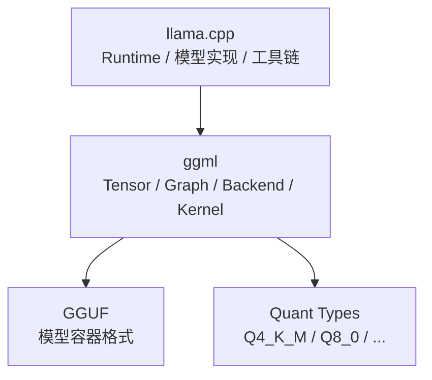
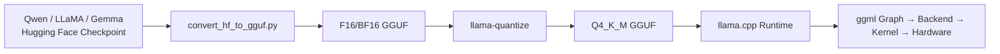
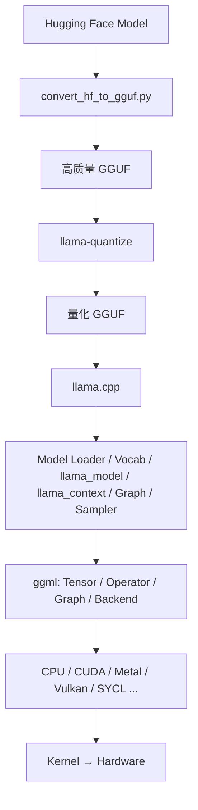
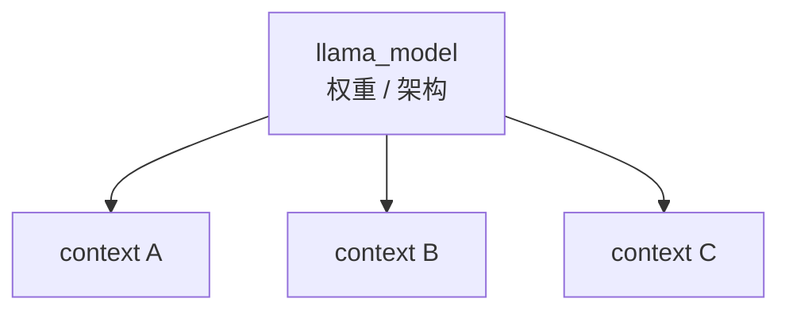
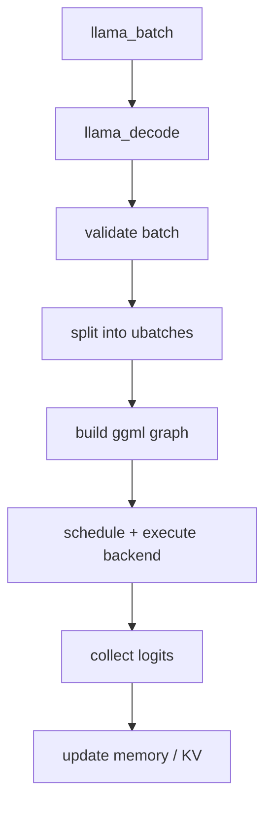
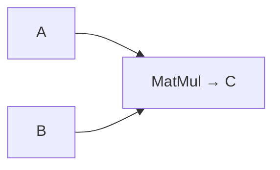
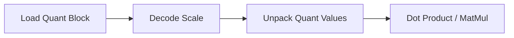
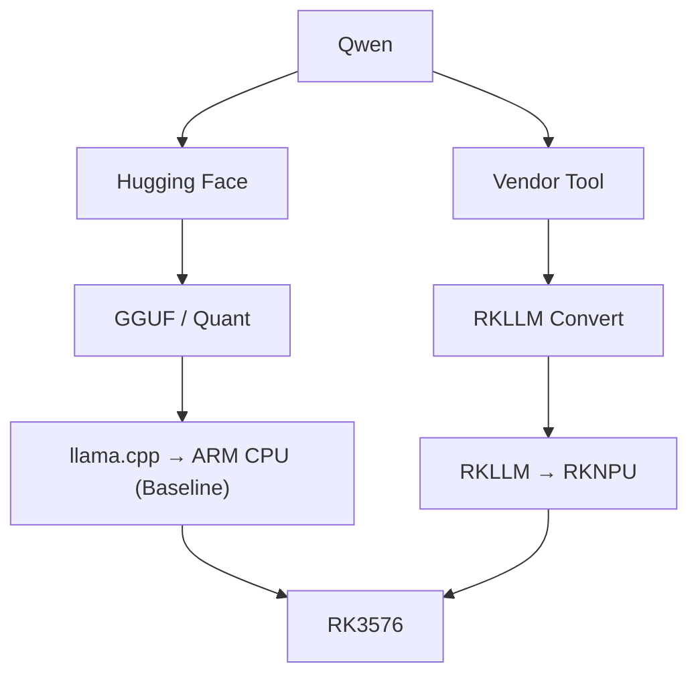

# 第 7 章 llama.cpp

> **所属路线**：AI 学习路线 · 第二部分
> **本章定位**：从 LLM 推理原理，进入第一个真正的 C/C++ Runtime，理解 GGUF、ggml、量化、计算图、Backend、KV Cache、Sampling 是如何在 llama.cpp 里落地的
> **核心仓库**：[ggml-org/llama.cpp](https://github.com/ggml-org/llama.cpp)
> **前置要求**：已理解第 5 章的 Prefill/Decode、KV Cache、量化对 Decode 的作用
> **学习边界**：本章聚焦 llama.cpp 这个 Runtime 本身；vLLM/MLC-LLM、AI Compiler、FlashAttention/CUTLASS、RKNN/RKLLM 在后续章节展开
> **资料检查日期**：2026-08-25

---

## 本章导读

第 5 章我们弄懂了 LLM 推理「为什么」这样运行。这一章回答「怎么」——一个真正的 Runtime 是如何把模型加载进来、构建计算图、跑量化 Kernel、管理 KV Cache、采样输出的。

llama.cpp 是理解这一切最好的教材：它用纯 C/C++ 实现，不依赖 PyTorch，却能跑通主流 LLM，还横跨 CPU/GPU/多平台。对有小谢这样嵌入式背景的人，它更是把「LLM 理论」和「C/C++、CMake、线程、内存、SIMD、mmap」这些熟悉的东西连起来的桥梁。

学完本章，你应该能回答：

1. llama.cpp、ggml、GGUF、Q4_K_M 四者到底是什么关系？（90% 的人一开始都分不清）
2. 为什么 llama.cpp 能不依赖 PyTorch 直接跑 LLM？
3. GGUF 文件里除了权重，还存了什么？为什么它「不只是 Weight 文件」？
4. Conversion 和 Quantization 有什么区别？为什么别反复 Re-quantize？
5. `llama_model` 和 `llama_context` 为什么分开？一个模型怎么服务多个会话？
6. `llama_decode()` 到底是什么？（它真的不是「解码文字」）
7. 源码为什么分别为 PP Graph 和 TG Graph 预留 Buffer？
8. 量化为什么需要专门 Kernel？「边解码边算」和「先反量化再算」差在哪？
9. Backend 和 Operator 有什么区别？Backend Scheduler 在解决什么？
10. 为什么 llama.cpp 在 RK3576 上是「CPU Baseline」，而不是「NPU 路线」？

**本章学习方法**：不要试图背下所有 CLI 参数和量化类型名。核心是抓住「**四层软件栈**」——`llama.cpp → ggml → Backend → Kernel → 硬件`，以及「**Model（权重）与 Context（运行状态）分离**」这两个关键抽象。源码按推荐顺序读，先 `simple.cpp`，别一头扎进几千行的 `llama-model.cpp`。

---

## 1. 先分清四个概念

这是整个 llama.cpp 生态里最容易长期混淆的一组词，先一次性钉死：

```text
llama.cpp   一个 C/C++ 的 LLM 推理 Runtime / 库 / 工具生态
ggml        它底层用的 Tensor + Operator + 计算图 + Backend 基础设施
GGUF        ggml 生态的模型容器文件格式
Q4_K_M      一种具体的量化方案（quantization scheme）
```



> ⚠️ **一句话记住**：llama.cpp 是「跑模型的人」，ggml 是「它脚下的地基」，GGUF 是「模型装进什么箱子里」，Q4_K_M 是「箱子里权重按什么精度打包」。

- `llama.cpp` ≠ 模型、≠ 量化格式、≠ GGUF；
- `ggml` ≠ GGUF（ggml 是计算库，GGUF 是文件格式）；
- `Q4_K_M` ≠ GGUF（Q4_K_M 是量化方案，GGUF 是容器）。

---

## 2. 为什么 llama.cpp 能脱离 PyTorch 跑 LLM

一个 Hugging Face 模型 = Python 模型代码 + Config + Safetensors + 框架语义。如果 llama.cpp 想直接读它，就得带上整套 PyTorch Runtime、Python 解释器、ATen——那就不「轻」了。

llama.cpp 的做法是：**自己实现模型架构、Tensor 表示、图、Kernel**，所以需要一个它自己能直接解释的容器——这就是 GGUF。于是多了「转换」这一步：



---

## 3. 完整软件栈总览

先建立全局坐标，后面每一节都是往这张图里填细节：



---

## 4. GGUF 文件结构：一个装下「一切」的容器

### 4.1 GGUF 里有什么

> **定义**：GGUF 是 ggml 生态的二进制模型容器，它保存的不只是权重，还有架构元数据、分词器信息、量化信息——一次打包，部署即插即用。

```text
GGUF File
├── Magic          "GGUF"（识别格式）
├── Version        格式版本
├── Tensor Count   张量数量
├── Metadata Count 元数据条数
├── Key-Value Metadata  架构/超参/分词器/chat template 等
├── Tensor Infos        name / shape / type / offset
└── Tensor Binary Data  真正的权重字节（按 alignment 对齐）
```

### 4.2 Metadata 为什么至关重要

Runtime 加载模型前必须知道：这是 Qwen 还是 LLaMA？多少层？Hidden Size 多大？几个头？RoPE 参数？分词器是什么？EOS Token 是多少？——这些**无法只从裸权重数组猜出来**，全靠 Metadata。

```text
general.architecture    → 架构
general.name            → 名字
context length / embedding length / layer count / attention head count
rope parameters         → 位置编码
tokenizer tokens / special token IDs / chat template
```

> ⚠️ Metadata 不能乱改：architecture、head count、rope 一旦错，Runtime 就会建错图，结果加载失败或输出乱码。

### 4.3 为什么 GGUF 适合 mmap

每个 Tensor 在文件里有明确 offset，且按 alignment 组织。所以 Runtime 可以直接把文件**映射**进进程地址空间，减少传统 read 的拷贝。大型模型还支持分片（`model-00001-of-00004.gguf`）。

---

## 5. Conversion 与 Quantization：两件不同的事

这是第二个高频混淆点：

```text
Conversion（转换）   HF 格式 → GGUF 格式
Quantization（量化） 高精度 Tensor → 低比特量化 Tensor
```

正确顺序是：`HF → 转换 → F16/BF16 GGUF → 量化 → Q4/Q5/Q8 GGUF`。

> 💡 **为什么先转高质量 GGUF 再量化？** 因为量化会损失信息。如果从 Q4 再量化到 Q2，误差会累积。最佳实践永远是「从原始 FP16/BF16 一次到位」，**不要反复 Re-quantize**（llama.cpp 官方文档也明确警告这点）。

```bash
# 量化这一步仍然输出 GGUF，只是 Tensor dtype/quant format 变了
./build/bin/llama-quantize model-f16.gguf model-Q4_K_M.gguf Q4_K_M
```

---

## 6. 量化类型：K-quants 与 Q4_K_M 的真相

### 6.1 一堆名字，别想一次背完

`F32 / F16 / BF16 / Q8_0 / Q6_K / Q5_K_M / Q4_K_M / Q4_K_S / IQ4_XS / IQ3 / IQ2 ...`。第一阶段只需掌握 `F16 / Q8_0 / Q4_0 / Q4_K_M / Q5_K_M / Q6_K`，并理解 K-quants 的基本思想即可。

### 6.2 K-quants 是什么

> **定义**：K-quants 是基于 block / super-block 的量化方案族，Q2_K 到 Q6_K 在「每权重比特数、Scale 表示、质量、速度」上各有取舍。

### 6.3 Q4_K_M 的最大误解

> ⚠️ **「Q4」不代表模型里每个 Weight 严格 4 bit。** Q4_K_M 是一种**混合量化方案**——不同 Tensor 可能用不同量化类型，在质量和速度间平衡。所以官方用 `bits/weight (BPW)` 来描述，Q4_K_M 的实际平均 BPW 略大于 4（因为每个量化块还要存 Scale 等元数据）。

### 6.4 不能只按文件大小选 Quant

还要看 Perplexity/质量、PP 速度、TG 速度、Backend 支持、Kernel 速度。一个反直觉现象：**更低的 BPW 不一定让 Prompt Processing 更快**（受 Kernel 效率、反量化影响），但 **Text Generation 通常对权重大小非常敏感**——这正是第 5 章「Decode Memory-Bound」的落地。

---

## 7. 模型加载：GGUF → llama_model

Model Loader（`llama-model-loader.cpp`）负责：打开 GGUF → 读 Metadata → 识别架构 → 索引 Tensor → 处理分片 → mmap/read。它通常先读 Header + Metadata + Tensor 描述符（`gguf_init_from_file`），**不一定立刻分配所有 Tensor Data**——这是 Graph/Tensor 系统的常见设计：先知道模型长什么样，再决定怎么分配 Buffer。

---

## 8. llama_model 与 llama_context：权重与状态分离

这是本章最重要的一个抽象：

| 对象 | 是什么 | 类比 |
|---|---|---|
| `llama_model` | 已加载的、基本不可变的模型本体（架构 + 超参 + 词表 + 权重 Tensor） | HF 的 `model` |
| `llama_context` | 一次推理会话的运行状态（KV/Memory、Scheduler、Compute Buffer、输出） | `past_key_values` + generation state |



> **为什么分开？** 同一份模型权重可以服务多个会话，每个 Context 有自己的 KV 状态和序列。这和第 5 章「一个权重、多序列」的服务器思想一脉相承。

---

## 9. 推理入口：llama_batch 与 llama_decode

### 9.1 输入不是简单的 vector<int>

llama.cpp 用 `llama_batch` 表达输入，因为它要携带更多信息：

```text
Token（Token ID）
Position（RoPE 位置编码需要）
Sequence ID（一个 Batch 可能含多个序列）
Logits 需求（要不要这个位置算 Logits）
```

### 9.2 llama_decode 不是「解码文字」

> ⚠️ 名字极容易误导。`llama_decode()` **不是 Tokenizer decode**，而是执行模型 Transformer Forward 的核心推理入口。



而 Token ID → 文本，是另一个函数 `llama_token_to_piece()`（detokenization）。

---

## 10. PP Graph 与 TG Graph：Prefill/Decode 的源码落地

第 5 章讲的 Prefill/Decode 分界，在 llama.cpp 源码里体现为 **分别 reserve 两张图**：

```text
PP Graph（Prompt Processing）  n_tokens ≈ min(n_ctx, n_ubatch)，较大
TG Graph（Token Generation）   n_tokens ≈ n_seqs，每序列一个新 Token
```

> 为什么初始化时就分别 reserve？因为两者 Tensor Shape、节点数、内存需求都不同。**高性能 Runtime 不会每生成一个 Token 就临时 new 一堆 Buffer**，而是提前规划、循环复用，避免推理过程中反复 realloc。

配套参数：`n_ctx`（上下文容量）、`n_batch`（逻辑 Batch 上限）、`n_ubatch`（物理 Micro-batch 上限，长 Prompt 切成 512/512/... 分块执行）。

---

## 11. ggml：Tensor 即 Graph Node

### 11.1 ggml_tensor 的妙处

`ggml_tensor` 既像普通 Tensor（有 dtype/shape/stride/data），**又可以直接表示一个图节点**：

```cpp
C = ggml_mul_mat(ctx, A, B);  // 返回的 C 同时是「结果 Tensor」和「MatMul 节点」
```



### 11.2 Operator 与 Graph

官方在 `docs/ops.md` 列了每种 Op（ADD / MUL_MAT / SOFT_MAX / ROPE / RMS_NORM / ...）在不同 Backend 的支持情况——这是理解 **Operator Coverage** 的第一手材料。多个 Op 串起来就组成 `ggml_cgraph`：

```text
Embedding → RMSNorm → MatMul Q/K/V → RoPE → Attention → FFN → ...
```

### 11.3 Build vs Compute

- **Build**：创建 Tensor Node、描述依赖关系；
- **Compute**：真正分配、调度、执行 Kernel。

Graph 每次 Build 可能不同（PP 时 T=512，TG 时 T=1）。

---

## 12. Backend 体系与 Scheduler

### 12.1 Operator vs Backend

> **Operator 描述「做什么」（MUL_MAT），Backend 提供「怎么做」（CPU / CUDA / Vulkan 各自的 Kernel）。**

llama.cpp 支持 CPU / BLAS / BLIS / Metal / CUDA / HIP / SYCL / Vulkan / CANN / OpenCL / WebGPU / RPC 等多种 Backend。

### 12.2 Backend Scheduler 在解决什么

一个图里「有些节点在 CPU，有些在 GPU」，Scheduler 要处理：

```text
这个 Node 放哪个 Backend？Tensor Buffer 放哪里？跨 Backend 如何复制？
Graph 如何切 Split？什么时候同步？
```

### 12.3 GPU Offload 的真相

`-ngl / --gpu-layers` 是把**部分 Layer/Tensor** 放到 GPU Backend。注意：

> ⚠️ Offload 不是「把 Python 模型搬到 GPU」，而是 llama.cpp 自己 build 的 ggml Graph，由 Scheduler 决定哪些节点在 GPU 跑。

`-ngl 99` 不是「99% GPU」，而是「一个足够大的值，让 Runtime 尽可能 Offload 可 Offload 的层」——实际放置看模型和 Backend。

---

## 13. 量化 Kernel：为什么不能「先反量化再算」

如果权重是 Q4_K，不能直接把 bit pattern 当 FP32 乘。最简单做法是「Q4 → 反量化到 FP32 → MatMul」，但会增加内存和临时流量。高性能 Kernel 的做法是：



> **llama.cpp 的关键技术不只是「把模型存成 Q4」，更是「有针对 Q4/Q5/Q8 优化的 CPU/GPU Kernel」。** 这才是它 CPU 路线能打的核心。

---

## 14. Sampling：Sampler Chain

llama.cpp 不把 top-k/top-p/temperature 硬编码在一个大函数里，而是用 **Sampler Chain** 抽象——每个 Sampler 只负责一个 Logit 变换/选择规则，然后自由组合：

```text
Raw Logits → Penalty → Grammar Mask → Top-K → Top-P → Temperature → Distribution → Token
```

```cpp
llama_sampler * smpl = llama_sampler_chain_init(...);
llama_sampler_chain_add(smpl, llama_sampler_init_greedy());
```

Grammar（语法约束）让 JSON、结构化输出更可靠。Tool Calling 最终仍依赖「模型 Chat Template + Structured Generation + 应用解析」，llama.cpp 只负责模型推理，Agent 框架负责 Tool Loop。

---

## 15. 工具链：四个程序各司其职

| 工具 | 定位 |
|---|---|
| `llama-cli` | 交互式命令行推理、测试模型、调参 |
| `llama-server` | 包装成 HTTP / OpenAI 兼容 Server，支持并发 |
| `llama-simple` | **源码学习最佳入口**，把完整流程压缩成十几步 |
| `llama-bench` | 固定 shape 的 Benchmark（`pp512` / `tg128`） |

> `pp512` = Prompt Processing 512 Token（对应 Prefill），`tg128` = Token Generation 128 Token（对应 Decode）。这就是为什么同一个模型会报出两个完全不同的 t/s。

---

## 16. 三类内存，务必分清

llama.cpp 运行时内存分三类，OOM 时都要看，不能只看 GGUF 文件大小：

```text
Model Buffer   = Weight（权重）
KV/Memory Buffer = Context State（上下文状态）
Compute Buffer = 临时图执行 Workspace
```

Linux 端侧分析内存可用 `free / top / htop / smem / /proc/<pid>/smaps`，并注意 `mmap` 下虚拟地址和 RSS 不一定相同——一旦 RAM 不够触发 Swap，Decode 会灾难性变慢。

---

## 17. RK3576 双路线：llama.cpp vs RKLLM

这是必须焊死的一张图：



> ⚠️ **llama.cpp 当前官方没有 Rockchip RKNPU Backend。** 在 RK3576 上，llama.cpp 走的是 **ARM CPU Backend**（可能进一步探索 Vulkan/OpenCL，取决于驱动）；而 NPU 是另一条 Vendor 路线（RKLLM/RKNN-LLM）。**不要写成「GGUF → RKNN Toolkit → RKNPU」——这是两个生态。**

llama.cpp 的价值在于「学通用 LLM Runtime 原理」+ 提供一个 CPU Baseline；RKLLM 的价值在于「学 Vendor NPU 部署」。最有价值的实验是：**同一个 Qwen 小模型，比较 llama.cpp Q4 CPU vs RKLLM NPU 的 PP/TG/RAM/功耗/温度**——这才是理解 NPU 价值的正确姿势，而不是「6 TOPS 所以更强」。

---

## 18. 源码阅读路线：从简单到深入

**严格建议：不要倒过来。** 先 `simple.cpp` 建立上层地图，再一层层往下：

```text
examples/simple/simple.cpp    ← 先读这个，抄一份 mini CLI
      ↓
include/llama.h               ← 外部 C API（load/tokenize/decode/sample）
      ↓
src/llama.cpp                 ← API 实现入口
      ↓
src/llama-model-loader.cpp    ← GGUF → llama_model
      ↓
src/llama-model.cpp           ← 模型生命周期/超参/Tensor 创建
      ↓
src/llama-context.cpp         ← Context/Scheduler/Decode/Memory
      ↓
src/llama-graph.cpp           ← Transformer → ggml Graph
      ↓
src/llama-kv-cache.cpp        ← KV/内存
      ↓
src/llama-sampler.cpp         ← 采样
      ↓
ggml/include/ggml.h → ggml-backend.cpp → CPU Kernel → GPU Backend
```

调试技巧：在 `llama_model_load_from_file`、`llama_init_from_model`、`llama_decode`、`llama_sampler_sample` 打断点，用 Call Stack 记录调用链，别一次 Step Into 进 STL/线程/mmap。开启 Debug Log，观察加载日志里的 architecture、tensor type count、model buffer size——这些直接验证你对模型的理解。

---

## 19. 本章实验

### 实验 1：Quant vs PP/TG（★核心）

准备 F16 / Q8_0 / Q6_K / Q5_K_M / Q4_K_M 五种，用 `llama-bench` 测 `pp512` 和 `tg128`：

| Quant | Size | PP t/s | TG t/s | RAM |
|---|---:|---:|---:|---:|
| F16 | | | | |
| Q8_0 | | | | |
| Q4_K_M | | | | |

**观察重点**：TG 对 Quant 非常敏感，但 PP 趋势可能不同——联系「Decode Memory-Bound」。

### 实验 2：CPU Threads 扫描

1/2/4/6/8 线程，记录 PP/TG，找到 TG 开始饱和的线程数，联系内存带宽。

### 实验 3：Context 对内存的影响

2K/4K/8K/16K，记录 KV memory、total memory、TG。

### 实验 4：KV Cache Quant

F16/Q8/Q4 的 KV 类型，比较 KV 内存、长上下文 TG、质量。

### 实验 5：源码 Trace

在 `simple.cpp` 加日志（before/after tokenize、context、decode、sample），建立完整时序，并打印 Token ID / Piece / Position 真正理解 Generation Loop。

> 完整实验清单（GPU Offload、Flash Attention、Batch、GGUF Metadata dump 等）见本章「学习资源」的 Stage 表。

---

## 20. 常见误区速查

| # | 误区 | 正确认识 |
|---|---|---|
| 1 | GGUF = llama.cpp | GGUF 是文件格式，llama.cpp 是 Runtime |
| 2 | ggml = GGUF | ggml 是计算库，GGUF 是容器 |
| 3 | Q4_K_M = GGUF | Q4_K_M 是量化方案，GGUF 是容器 |
| 4 | Q4_K_M = 每个 Weight 精确 4 bit | 是混合 K-quant，实际 BPW > 4 |
| 5 | llama.cpp 只能跑 LLaMA | 现代项目支持大量 LLM/多模态架构 |
| 6 | llama.cpp = CPU only | 有 CUDA/Metal/Vulkan/SYCL/OpenCL 等 |
| 7 | llama.cpp 可直接跑 Rockchip NPU | 当前无 RKNPU Backend，NPU 用 RKLLM |
| 8 | `-ngl 99` = 99% GPU | 是「尽可能 Offload 可 Offload 层」 |
| 9 | Model Q4 → KV 也是 Q4 | KV Cache 单独配置（`--cache-type-k/v`） |
| 10 | llama_decode = tokenizer decode | 是 LLM Forward；token_to_piece 才是 detokenize |
| 11 | GGUF 里存完整 ggml graph | Graph 由 Runtime 按架构在运行时构建 |
| 12 | 量化只改变磁盘大小 | 还改变内存/带宽/Kernel/TG 速度/质量 |

---

## 21. 本章小结

### 21.1 十个核心思维模型

1. **llama.cpp = LLM Runtime**；
2. **ggml = Tensor + Graph + Backend 基础设施**；
3. **GGUF = 权重 + Metadata + Tokenizer 的模型容器**；
4. **Q4_K_M = 一种量化 Tensor 编码策略**（混合，非严格 4bit）；
5. **llama_model = 权重，llama_context = 运行状态**；
6. **llama_decode = Batch → 构建/执行图 → 更新内存 → 产出 Logits**；
7. **PP Graph = Prefill，TG Graph = Decode**；
8. **实际 Kernel 路径 = 模型架构 + 权重 Tensor 类型 + Backend**；
9. **同一个 GGUF 可换 Backend，同一架构可换量化**（模型/图 与 硬件 Kernel 解耦）；
10. **llama.cpp 路线 ≠ Rockchip NPU 路线**。

### 21.2 术语表

| 术语 | 英文 | 一句话解释 |
|---|---|---|
| llama.cpp | llama.cpp | C/C++ 的 LLM 推理 Runtime / 生态 |
| ggml | ggml | 底层 Tensor/图/Backend 基础设施 |
| GGUF | GGUF | ggml 生态的模型容器格式 |
| 量化方案 | Quantization Scheme | 权重按什么低比特方式编码 |
| 每权重比特 | BPW | 量化后平均每参数实际占用 bit 数 |
| K 量化 | K-quants | 基于 block/super-block 的量化族 |
| 模型加载器 | Model Loader | 读 GGUF Metadata/Tensor，构建模型 |
| 上下文 | llama_context | 一次推理会话的运行状态 |
| 批 | llama_batch | 带 Token/Position/SequenceID 的推理输入 |
| 解码 | llama_decode | 执行模型 Forward 的核心入口 |
| 微批 | UBatch | 底层单次真正送入图计算的 Token Chunk |
| 图 | ggml_cgraph | 由 Op 组成的计算图 |
| 后端 | Backend | 为某硬件提供 Kernel 的执行适配层 |
| 后端调度器 | Backend Scheduler | 决定节点放哪个 Backend、如何切分同步 |
| 采样链 | Sampler Chain | 可组合的 Logit 变换/选择规则链 |
| 卸载 | Offload | 把层/张量放到 GPU Backend 执行 |

### 21.3 自测清单

**生态**：[ ] 能解释 llama.cpp/ggml/GGUF/Q4_K_M 四者关系；[ ] 能说明 llama.cpp 与 PyTorch、ONNX Runtime、RKLLM 的区别

**GGUF**：[ ] 能解释 Magic/Metadata/Tensor Info/Tensor Data/Alignment；[ ] 能解释为什么适合 mmap；[ ] 能解释 `general.architecture` 和 tokenizer metadata

**转换/量化**：[ ] 能用 convert_hf_to_gguf.py 和 llama-quantize；[ ] 能解释 conversion vs quantization、为什么避免 re-quantize；[ ] 能解释 BPW、K-quants、Q4_K_M 混合思想

**Model/Context**：[ ] 能解释 llama_model 与 llama_context 及为何分离；[ ] 能解释 n_ctx / n_batch / n_ubatch

**推理**：[ ] 能解释 llama_batch / llama_decode（不是 detokenize）/ PP Graph / TG Graph / 为何分别 reserve

**ggml**：[ ] 能解释 ggml_tensor 即图节点、Operator、cgraph、Build vs Compute、Backend、Backend Scheduler

**Backend**：[ ] 能解释 CPU/BLAS/CUDA/Metal/Vulkan 的位置、GPU Offload、n_gpu_layers、Op Coverage、ARM NEON/KleidiAI 的位置

**Sampling**：[ ] 能解释 Sampler Chain、Greedy/Top-K/Top-P/Temperature/Grammar

**工具**：[ ] 能用 llama-cli/llama-bench/simple；能解释 pp512/tg128

**端侧**：[ ] 能画出 llama.cpp vs RKLLM 双路线；能解释为什么 llama.cpp 不能直接等于 RKNPU；能在 RK3576 跑 CPU GGUF Baseline

**不要求**：手写全部 GGUF Parser、精通所有 Quant 格式、手写 Q4_K Kernel、精通 CUDA/Metal/Vulkan Shader、实现新 Backend、精通多 GPU Split——这些可在系统方向继续深入。

---

## 22. 学习资源与推荐顺序

### 22.1 核心仓库与入口

| 资源 | 用途 |
|---|---|
| [llama.cpp Repository](https://github.com/ggml-org/llama.cpp) | 主仓库 |
| [README](https://github.com/ggml-org/llama.cpp/blob/master/README.md) · [Build Guide](https://github.com/ggml-org/llama.cpp/blob/master/docs/build.md) | 外部地图 |
| [simple.cpp](https://github.com/ggml-org/llama.cpp/blob/master/examples/simple/simple.cpp) · [llama.h](https://github.com/ggml-org/llama.cpp/blob/master/include/llama.h) | **源码入口** |
| [GGUF Spec](https://github.com/ggml-org/ggml/blob/master/docs/gguf.md) · [quantize README](https://github.com/ggml-org/llama.cpp/blob/master/tools/quantize/README.md) | 格式与量化 |
| [ops.md](https://github.com/ggml-org/llama.cpp/blob/master/docs/ops.md) · [Feature Matrix](https://github.com/ggml-org/llama.cpp/wiki/Feature-matrix) | Op/Backend 支持 |

### 22.2 推荐学习顺序（12 Stage）

| Stage | 内容 | 目标 |
|---|---|---|
| 1 | 会跑（Build CPU + GGUF + llama-cli + llama-bench） | 熟悉外部工具 |
| 2 | 懂 GGUF（Spec + gguf.h + convert 脚本） | 知道文件里是什么 |
| 3 | 懂 Quant（quantize README + 自己做 F16→Q4） | 把 Quant 与 PP/TG 联系 |
| 4 | 读 simple.cpp | 抄一份最小 inference app |
| 5 | 读 llama.h | 知道 model/context/batch/sampler 生命周期 |
| 6 | 读 Model Loader | GGUF → llama_model |
| 7 | 读 Context | n_ctx/n_batch/n_ubatch/scheduler/pp-tg buffer |
| 8 | 读 Graph | Transformer → ggml Op |
| 9 | 读 ggml | Tensor/Op/Graph/Backend |
| 10 | 读 CPU Backend | 量化矩阵运算如何真正执行 |
| 11 | 看 GPU Backend（按设备选） | CUDA/Vulkan/Metal/SYCL/OpenCL |
| 12 | RK3576 Baseline | ARM CPU 建立 PP/TG/RAM/Power 基线，与 RKLLM 对比 |

---

## 23. 下一章预告

llama.cpp 是「本地、异构、GGUF 生态」的 Runtime。但服务器场景要处理上百个并发请求、KV 内存调度、Continuous Batching——那是另一套设计哲学：

> **vLLM 怎么用 PagedAttention + Scheduler 把 GPU 吞吐做到极致？MLC-LLM 又怎么用「编译」的思路做部署？**

下一章见：

> **[08_vLLM与MLC-LLM](08_vLLM与MLC-LLM.md)**

---

## 附录：核心参考链接

**llama.cpp**
- [Repository](https://github.com/ggml-org/llama.cpp)
- [README](https://github.com/ggml-org/llama.cpp/blob/master/README.md)
- [Build Guide](https://github.com/ggml-org/llama.cpp/blob/master/docs/build.md)
- [GGML Operations / Backend Support](https://github.com/ggml-org/llama.cpp/blob/master/docs/ops.md)
- [Feature Matrix](https://github.com/ggml-org/llama.cpp/wiki/Feature-matrix)

**源码入口**
- [simple.cpp](https://github.com/ggml-org/llama.cpp/blob/master/examples/simple/simple.cpp)
- [llama.h](https://github.com/ggml-org/llama.cpp/blob/master/include/llama.h)
- [src/llama.cpp](https://github.com/ggml-org/llama.cpp/blob/master/src/llama.cpp)

**Model / Context / Graph / Memory**
- [llama-model-loader.cpp](https://github.com/ggml-org/llama.cpp/blob/master/src/llama-model-loader.cpp)
- [llama-model.cpp](https://github.com/ggml-org/llama.cpp/blob/master/src/llama-model.cpp)
- [llama-context.cpp](https://github.com/ggml-org/llama.cpp/blob/master/src/llama-context.cpp)
- [llama-graph.cpp](https://github.com/ggml-org/llama.cpp/blob/master/src/llama-graph.cpp)
- [llama-kv-cache.cpp](https://github.com/ggml-org/llama.cpp/blob/master/src/llama-kv-cache.cpp)
- [llama-sampler.cpp](https://github.com/ggml-org/llama.cpp/blob/master/src/llama-sampler.cpp)

**GGUF / Conversion / Quantization**
- [GGUF Specification](https://github.com/ggml-org/ggml/blob/master/docs/gguf.md)
- [gguf.h](https://github.com/ggml-org/llama.cpp/blob/master/ggml/include/gguf.h)
- [convert_hf_to_gguf.py](https://github.com/ggml-org/llama.cpp/blob/master/convert_hf_to_gguf.py)
- [Quantize README](https://github.com/ggml-org/llama.cpp/blob/master/tools/quantize/README.md)

**ggml Backend**
- [ggml-backend.cpp](https://github.com/ggml-org/llama.cpp/blob/master/ggml/src/ggml-backend.cpp)
- [OpenCL Backend](https://github.com/ggml-org/llama.cpp/blob/master/docs/backend/OPENCL.md)
- [SYCL Backend](https://github.com/ggml-org/llama.cpp/blob/master/docs/backend/SYCL.md)
- [Vulkan Source](https://github.com/ggml-org/llama.cpp/tree/master/ggml/src/ggml-vulkan)
- [CUDA Source](https://github.com/ggml-org/llama.cpp/tree/master/ggml/src/ggml-cuda)

**Benchmark**
- [llama-bench Source](https://github.com/ggml-org/llama.cpp/blob/master/tools/llama-bench/llama-bench.cpp)
- [Batched Bench](https://github.com/ggml-org/llama.cpp/blob/master/tools/batched-bench/README.md)
