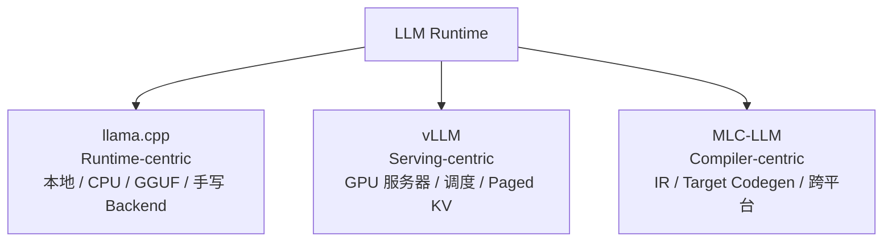
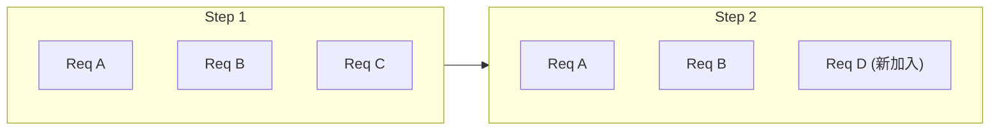
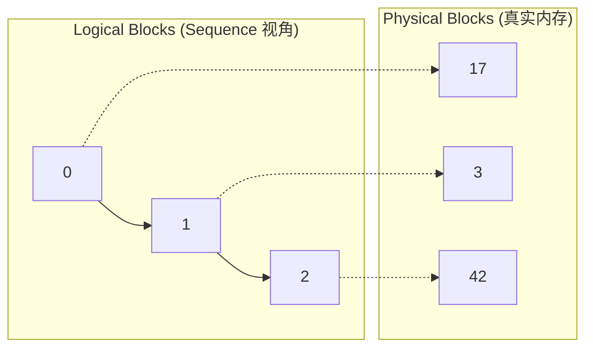
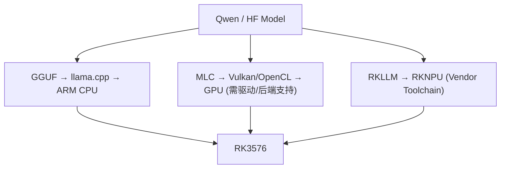

# 第 8 章 vLLM 与 MLC-LLM

> **所属路线**：AI 学习路线 · 第二部分
> **本章定位**：在理解推理原理与 llama.cpp 之后，学习两种截然不同的高性能 Runtime 思想——vLLM 的「Serving / Scheduling 路线」与 MLC-LLM 的「ML Compilation / 跨平台部署路线」
> **核心仓库**：[vllm-project/vllm](https://github.com/vllm-project/vllm) · [mlc-ai/mlc-llm](https://github.com/mlc-ai/mlc-llm)
> **前置要求**：已理解第 5 章 Prefill/Decode/KV Cache、第 7 章 llama.cpp 的 Runtime 抽象
> **学习边界**：本章聚焦 Runtime 架构、Scheduler、KV 管理与编译驱动部署；TVM、TIR、GPU Kernel、FlashAttention 在第 9、10 章深入
> **资料检查日期**：2026-08-25

---

## 本章导读

llama.cpp、vLLM、MLC-LLM 三个项目**都能跑 LLM**，但千万别把它们当成「三种速度不同的同一个东西」。它们代表的是三种完全不同的系统设计哲学：



学完本章，你应该能回答：

1. 为什么 Hugging Face 的 `model.generate()` 不适合直接做大规模在线 Serving？
2. vLLM 的核心价值为什么「不只是把 MatMul 算快」？
3. Continuous Batching 是什么？它和「把 Batch Size 调大」有什么本质区别？
4. vLLM V1 为什么说 Scheduler 里不再严格区分 Prefill Phase 和 Decode Phase？
5. PagedAttention 的核心是什么？KV Cache 为什么要按 Block/Page 管理？
6. Prefix Cache 为什么能降低 TTFT，却不能直接提升 Decode 每 Token 算力？
7. MLC-LLM 的两个部署产物（Weight + Model Library）分别是什么？为什么 Model Library 要针对 Target 编译？
8. MLC 的 `q4f16_1` 和 llama.cpp 的 `Q4_K_M` 为什么是两套不互通的量化体系？
9. 三者怎么选？在 RK3576 上为什么 vLLM 通常不是主要路线？

**本章学习方法**：抓住「三种中心」这条主线——Runtime-centric / Serving-centric / Compiler-centric。vLLM 部分先学 Scheduler 再读 Kernel；MLC 部分先看「模型如何变成 IR」再进入 TVM。

---

## 1. 为什么 HF 的 generate() 不够做 Serving

`model.generate(...)` 非常适合实验、单请求、功能验证。但服务器场景是 100/1000/10000 个并发请求，问题立刻变成：

```text
谁先 Prefill？谁在 Decode？如何组成 Batch？
KV Cache 放哪里？某个用户完成后 Batch 怎么补人？
GPU 显存不够怎么办？长 Prompt 会不会阻塞其他用户？
```

这些**都不是 `model.forward()` 的问题**。它们需要一个专门做调度、内存管理、批处理协调的系统——这正是 vLLM 的核心价值。

> **vLLM 的核心价值 = Model Execution + KV Cache Management + Request Scheduling + Batching + Serving**，而非「更快的 Attention Kernel」。

---

## 2. Continuous Batching：批处理成员每步都在变

### 2.1 Static Batching 的问题

传统做法是「等一批请求 → 一起跑 → 全部完成 → 下一批」。但 LLM 各请求输出长度差异巨大：A 输出 20 Token，B 输出 200 Token。A 早结束了，它的 Batch 槽位却要等 B 跑完——**浪费 GPU**。

### 2.2 Continuous Batching

> **定义**：某个 Sequence 一结束，立即移出，新请求马上加入，**不用等整个 Batch 完成**。因为 Decode 本来就是一步步的，每步之间都可以重新组织 Batch——这叫 **Iteration-level Scheduling（迭代级调度）**。



> ⚠️ **误区**：Continuous Batching 不是「把 Batch Size 调大」，而是「Batch 成员在每个 Decode Iteration 动态变化」。它的收益是 GPU 空闲减少、Batch 利用率提升、吞吐上升。

---

## 3. vLLM V1 的统一调度模型

### 3.1 一个漂亮的抽象

> **定义**：vLLM V1 的 Scheduler 不再严格区分「这是 Prefill Request」还是「这是 Decode Request」，而是统一看**每个 Request 还欠多少 Token**：

```text
num_computed_tokens（已算） vs num_tokens（该算到哪）
→ 差多少，Scheduler 决定这一 Step 给它多少 Token
```

一个 Request「已算 100 Token、该算到 500」，就欠 400——Scheduler 这轮给它 256，就自然形成了 **Chunked Prefill**。而一个「只差 1 个 Token」的 Decode 请求，就是 `num_tokens = 1`。

> 这个统一抽象让同一套 Scheduler 能自然支持普通 Prefill、Decode、Chunked Prefill、Prefix Cache、Speculative Decode。

### 3.2 两个预算参数

| 参数 | 含义 |
|---|---|
| `max_num_batched_tokens` | 一次 Forward 最多处理多少 Token（Token 维度预算） |
| `max_num_seqs` | 一次 Iteration 最多多少 Sequence（序列数预算） |

> 为什么两个都要？128 个 Decode 序列各 1 Token 只有 128 Token，但一个长 Prefill 单请求就可能 4096 Token——**Token 数和序列数必须分开限制**。

### 3.3 Chunked Prefill

长 Prefill 一次性霸占 GPU 会让正在 Decode 的用户卡顿（ITL 飙升）。Chunked Prefill 把长 Prompt 切成 512/512/... 分块，V1 会**优先调度 Decode，再用剩余 Token Budget 调度 Prefill**。这既是 TTFT 与 ITL 的权衡，也能把 Compute-bound 的 Prefill 与 Memory-bound 的 Decode 更合理地组合，提升硬件利用率。

---

## 4. Paged KV Cache / PagedAttention

### 4.1 为什么要分页

如果每个 Request 都预分配完整 Max Context（如 32K），而实际只用 1K，就浪费 31K。几百个并发请求这样浪费不可接受；再加上各请求长度动态增长、结束时间不同，用大块连续 Buffer 还容易产生**内存碎片**。

### 4.2 核心思想

> **定义**：把 KV Cache 切成固定大小的 Block/Page，Request 需要多少就分配多少，通过 **Block Table** 把「逻辑块」映射到「物理块」。这和操作系统的虚拟内存 Page Table 几乎一样。



> ⚠️ **PagedAttention 不改变 Attention 的数学**（仍然是 Q × K_cache → Softmax → V_cache），它改变的是 **KV 在内存中的管理方式**——Attention Kernel 需要按 Block Table 访问非连续的 KV。

### 4.3 KVCacheManager

它位于 Scheduler 和实际 KV Block 之间，负责「分配块 / 释放块 / 查找 Prefix 缓存块 / 资源不足时的准入与抢占决策」。现代模型还可能是 Full Attention + Sliding Window + Mamba 的混合架构，所以当前 vLLM 也在往更通用的 Hybrid KV Cache Manager 演进（这和 llama.cpp 的 Memory Abstraction 是同一个趋势）。

---

## 5. Prefix Caching：复用共享前缀

当所有用户共享同一个 2000 Token 的 System Prompt，每次都重新 Prefill 是巨大浪费。

> **定义**：Automatic Prefix Caching 把相同前缀的 KV Block 缓存起来，下一个请求只 Prefill 新增部分。判断「是否相同前缀」靠 **Token Prefix Hash**（且 Hash 必须包含前缀上下文，因为同一段 Token 在不同前缀之后的 K/V 不一样）。

**典型价值**：降低 Prefill 计算量、降低 TTFT（长 System Prompt、Few-shot、共享文档、多轮对话前缀、Agent 反复上下文）。但要记住：**Prefix Cache 优化的是 Prefill/TTFT，不能让 Decode 的矩阵算得更快**。

---

## 6. Scheduler 的「防御性」设计

| 概念 | 解决的问题 |
|---|---|
| **Admission Control** | KV 只剩 10 块却来了个要 100 块的请求，不能盲目接受 |
| **Watermark** | 保留一定比例 KV headroom，避免「刚好用满 → 下一步不断抢占」的抖动 |
| **Preemption** | 资源不足时暂停/重新排队部分请求，之后恢复 |

> ⚠️ 注意版本演进：旧资料常讲「GPU↔CPU KV Swap」处理 Preemption，但当前 V1 已不再依赖旧式 Swap。学系统项目一定要区分**历史论文思想**和**当前工程实现**。

---

## 7. 并行策略速览

| 并行 | 切什么 | 代价/特点 |
|---|---|---|
| Tensor Parallel (TP) | 一个 Layer 的权重切到多 GPU | 每层要 AllReduce/AllGather，依赖高速互联 |
| Pipeline Parallel (PP) | 按 Layer 切（0-19 给 GPU0…） | 有 Pipeline Bubble，单 Token Decode 延迟链长 |
| Data Parallel (DP) | 完整模型复制多份 | 提升吞吐，不让单模型「装得下」 |
| Expert Parallel (EP) | MoE 的不同 Expert 分到不同 GPU | 需要 All-to-All 通信 |

MoE Serving 不是简单 MatMul，还涉及 Routing、负载均衡、Dispatch、All-to-All、Expert GEMM、Combine——这是 MoE 让 Serving 进一步复杂的原因。

---

## 8. MLC-LLM：编译驱动的部署

### 8.1 与 llama.cpp 的根本区别

llama.cpp 是「Runtime 在运行时构建 ggml Graph + 手写 Backend Kernel」；MLC 是「模型先进 Compiler IR → 做 Pass/Lowering/Codegen → 生成目标平台的 Model Library」。

> **定义**：MLC-LLM = Machine Learning Compilation + 高性能 LLM 部署引擎，核心目标是 Universal Deployment（跨桌面/移动/浏览器）。

### 8.2 两个部署产物（最大的认知差异）

运行一个 MLC 模型需要**两样东西**，这跟 GGUF「一个文件搞定」很不一样：

```text
1. Converted / Quantized Model Weights  ← 转换/量化后的参数
2. Model Library                        ← 推理逻辑编译后的目标代码
```

Model Library 的形态随平台而变：Linux `.so`、Windows `.dll`、macOS `.dylib`、Web `.wasm`、iOS/Android `.tar`。

> 💡 **类比**：传统编译是「程序逻辑 → 编译 → 二进制」，数据运行时再输入。MLC 是「模型逻辑 → 编译 → Model Library」，权重当运行时数据。所以**同一架构、同参数形状、同量化布局**下，只换微调权重，有时能复用同一个 Model Library。

### 8.3 完整 Workflow

```text
convert_weight → gen_config → compile → MLCEngine / chat / serve
```

```bash
mlc_llm convert_weight ./HF_MODEL --quantization q4f16_1 -o dist/MODEL-q4f16_1-MLC
mlc_llm gen_config ./HF_MODEL --quantization q4f16_1 --conv-template ... -o dist/MODEL-MLC
mlc_llm compile dist/MODEL-MLC/mlc-chat-config.json --device cuda -o dist/libs/model-cuda.so
```

> `mlc-chat-config.json` 里包含 Context、Prefill Chunk、量化等**编译期信息**——因为 Context 和 Prefill Chunk 会影响内存规划、动态 Shape 边界、KV 配置。Compiler 希望尽可能早地知道 Shape Bound。

### 8.4 为什么量化体系不互通

> ⚠️ `q4f16_1` ≠ `Q4_K_M`。虽然都叫「4-bit」，但它们的 Block Layout、Scale、Packing、计算 dtype、Kernel 契约完全不同。**量化格式和 Runtime Kernel 是一个生态**：GGUF Q4_K_M ↔ ggml Kernel；MLC q4f16_1 ↔ TVM/MLC 生成的 Kernel。

---

## 9. Relax IR、TIR 与 Compiler Pass

### 9.1 模型如何变成 IR

MLC 的 Model Definition 看起来像 PyTorch，但最终目的不同：

```python
from tvm.relax.frontend import nn
class LlamaModel(nn.Module): ...
```

PyTorch 追求 Eager/Training；MLC 追求**生成 Compiler IR**。Model Definition → Export → **IRModule**（承载模型函数和低层函数的 IR 集合）。

### 9.2 Relax 与 TIR 的分工

```text
Relax  高层 Tensor Program：Linear / Attention / Paged KV Cache / Sampling
TIR    低层：Loop / Buffer / Thread Binding / Tile / Memory Access
```

### 9.3 Compiler Pass 的威力

MLC 的 Compiler Pipeline 会在 IRModule 上跑一系列 Pass。最惊人的是——**连 Sampling 都能被编译成 GPU Function**（`attach_sampler.py`）。这说明编译驱动路线的特点：不只是 Transformer Forward 能编译，连 Logit 处理、Spec Decode 辅助函数都能进入编译优化。

### 9.4 JIT vs AOT

- **JIT**：Python MLCEngine 启动时没找到 model_lib，就自动编译（首次慢，之后用 Cache）；
- **AOT**：提前 `mlc_llm compile` 生成 Model Library，部署设备**不需要带完整 Compiler 依赖**——这对 Android/iOS/Web 端侧至关重要。

---

## 10. MLCEngine 与 PagedKVCache

编译完 Model Library 后，仍需要 Runtime——`MLCEngine`（负责加载库和权重、管理 KV、调度请求、采样、返回 OpenAI 兼容结果）。

> **重要边界**：MLC-LLM = Compiler + Runtime/Serving Engine，不是「编译完静态图只跑单用户」。它也有 Scheduler、KV Cache、Request Management，也有 PagedKVCache（因为变长请求、动态 Context、Batch 是 LLM Serving 的共性，不是 vLLM 独有）。

MLC 的 Llama Model 把 `batch_prefill / batch_decode / batch_verify` 定义为**编译期可见的 Entry Point**，让 Compiler 能针对 Prefill/Decode/Verify 三种 Shape 分别生成最合适代码（`batch_verify` 正是 Speculative Decode 的入口）——这比 llama.cpp 的单一 `llama_decode` 入口更进一步。

---

## 11. 三大 Runtime 深度对比与选型

| 维度 | llama.cpp | vLLM | MLC-LLM |
|---|---|---|---|
| 哲学 | Runtime-centric | Serving-centric | Compiler-centric |
| 输入 | GGUF | HF / PyTorch | HF → Convert Weight + Model Library |
| 图表示 | 运行时动态构建 ggml Graph | PyTorch + torch.compile | Relax IR → TIR → Target Code |
| 量化 | Q4_K_M / IQ | AWQ/GPTQ/FP8/INT8 | q4f16_1 / AWQ |
| 端侧友好 | ★★★★★ | ★★ | ★★★★★ |
| 服务器吞吐 | ★★★ | ★★★★★ | ★★★ |

> **一句话**：llama.cpp 最先问「怎么在这台机器上尽量轻地跑模型」，vLLM 最先问「怎么让 GPU 同时高效服务大量动态请求」，MLC 最先问「怎么把模型编译成目标平台的原生库」。

**选型表**：

| 场景 | 优先 |
|---|---|
| CPU / ARM Linux 本地 LLM | llama.cpp |
| NVIDIA 多用户高吞吐 Serving | vLLM |
| Android/iOS/Web 原生部署 | MLC-LLM |
| 学 AI Compiler | MLC → TVM |
| Rockchip RKNPU | RKLLM / RKNN-LLM |

---

## 12. RK3576 上的三条路线



- **llama.cpp**：走 ARM CPU，作为 Baseline 和学习 Runtime；
- **MLC**：理论可探索 RK3576 GPU 的 Vulkan/OpenCL，但前提是 GPU Driver、Compiler Target、Runtime Backend、算子支持都满足；
- **vLLM**：通常不是主路线——它的设计场景是高性能服务器加速器 + 大显存 + 并发 Serving，与 RK3576 的 Edge SoC 完全不同。学它是为了**理解高性能 Serving 的系统设计**，而不是装到板子上。

> ⚠️ 关键澄清：**MLC 的 Vulkan/OpenCL 是 GPU API，不等于 Rockchip NPU**。真正的 NPU 路线是 `HF Model → RKLLM Toolchain → RKLLM Runtime → RKNPU`。

---

## 13. 性能 Debug 思路

**vLLM**：TTFT 高 → 查 Queue/Prefix Cache/Prompt Length/Chunked Prefill；ITL 高 → 查长 Prefill 干扰/Scheduler/Decode Batch；吞吐低 → 查并发/max_num_seqs/max_num_batched_tokens/KV Capacity；频繁 Preemption → 查 KV 大小/Watermark/Admission。

**MLC**：编译失败 → 查架构/TVM 版本/Target/算子；能跑但慢 → 查 Target 选对没有/量化/Kernel Schedule/Prefill Chunk；不同 Target 差异大 → 正常（CUDA/Metal/Vulkan 硬件和 Kernel 本就不同）。

---

## 14. 本章实验

### vLLM（有 GPU 时）

1. 跑 `LLM.generate`（offline）和 `vllm serve`（OpenAI 兼容 API）；
2. 测并发 1/2/4/8，记录 TTFT/TPOT/ITL/Output t/s；
3. 改 `max_num_seqs` 和 `max_num_batched_tokens`，观察吞吐/KV/延迟变化；
4. 构造「8K Prompt + 多个 Decode」并发，对比开/关 Chunked Prefill 的 ITL；
5. 构造「固定 4K Prefix + 不同 Query」，第二批测 Prefix Cache 命中后的 TTFT。

### MLC

1. 跑 `mlc_llm chat` 体验 JIT Compile；
2. `convert_weight`（HF FP16 → q4f16_1）记录模型大小；
3. `mlc_llm compile` 生成 `.so`，理解 Weight 可共享、Model Library 随 Target 变；
4. 用 `MLCEngine` 做 Chat Completion；
5. 打印一次 Relax IR，看 Llama Python Model 如何变成 Relax Function。

---

## 15. 常见误区速查

| # | 误区 | 正确认识 |
|---|---|---|
| 1 | vLLM = 更快的 HF generate | 核心是 Serving Runtime + Scheduling + KV 管理 |
| 2 | PagedAttention = 新 Attention 算法 | 核心是 Paged KV 内存管理 |
| 3 | Continuous Batching = 调大 Batch Size | 是 Batch 成员每 Iteration 动态变化 |
| 4 | Prefix Cache = KV Cache | KV 是当前请求状态，Prefix 是跨请求复用 |
| 5 | V1 仍严格分 Prefill/Decode 队列 | 已统一为「每个 Request 还欠多少 Token」 |
| 6 | MLC-LLM = TVM | MLC 是基于 TVM 的 LLM 应用栈，TVM 是通用编译器框架 |
| 7 | MLC Model = 一个类似 GGUF 的文件 | 是 Converted Weights + Compiled Model Library |
| 8 | q4f16_1 = Q4_K_M | 不同生态，Block Layout/Scale/Kernel 都不同 |
| 9 | MLC compile 只是格式转换 | 包含真正的 IR/Pass/Lowering/Codegen |
| 10 | 同一个 .so 到处跑 | Weight 可共享，Model Library 针对 Target 编译 |
| 11 | vLLM 只做 PagedAttention | 早已是完整 Serving 系统 |
| 12 | MLC Vulkan = Rockchip NPU | Vulkan 是 GPU API，RKNPU 是专用 NPU |

---

## 16. 本章小结

### 16.1 十个核心思维模型

1. **vLLM = LLM Serving System**（不是「更快的 generate」）；
2. **高吞吐不只靠更快 Kernel，更靠 Scheduler + Batching + KV 管理**；
3. **Continuous Batching = Batch 成员每 Iteration 可变**；
4. **PagedAttention 核心 = KV 的分页/块管理**；
5. **V1 Scheduler = 每 Engine Step 给各 Request 分配 Token Budget**；
6. **MLC-LLM = LLM + ML Compiler + Runtime**；
7. **MLC 部署 = Converted Weights + Compiled Model Library**；
8. **Model → Relax IR → Compiler Pass → TIR/Target → Native Code**；
9. **llama.cpp = Runtime-centric，vLLM = Serving-centric，MLC = Compiler-centric**；
10. **通用 GPU Runtime ≠ Vendor NPU Runtime**。

### 16.2 术语表

| 术语 | 英文 | 一句话解释 |
|---|---|---|
| 连续批处理 | Continuous Batching | Batch 成员每迭代动态变化 |
| 迭代级调度 | Iteration-level Scheduling | 每次 Forward 前重新决定 Batch |
| 统一调度 | V1 Unified Scheduling | 按「每个请求还欠多少 Token」统一调度 |
| 令牌预算 | Token Budget | 一次 Forward 最多处理多少 Token |
| 分块预填充 | Chunked Prefill | 长 Prefill 切块，穿插 Decode |
| 分页注意力 | PagedAttention | 按 Block/Page 管理 KV Cache |
| 块表 | Block Table | 逻辑块到物理块的映射 |
| 前缀缓存 | Prefix Caching | 跨请求复用相同前缀的 KV |
| 准入控制 | Admission Control | 决定是否接纳会耗尽资源的请求 |
| 水位线 | Watermark | 保留 KV headroom，避免抖动 |
| 抢占 | Preemption | 资源不足时暂停/重排请求 |
| 张量并行 | Tensor Parallel | 单层权重切到多 GPU |
| 专家并行 | Expert Parallel | MoE 的 Expert 分到不同 GPU |
| 模型库 | Model Library | 模型推理逻辑编译后的目标代码 |
| 编译通道 | Compiler Pass | 对 IR 做分析/变换的步骤 |

### 16.3 自测清单

**vLLM**：[ ] 能解释定位、为什么 HF generate 不够；[ ] 能解释 Continuous Batching / Iteration-level Scheduling；[ ] 能解释 max_num_batched_tokens / max_num_seqs / V1 统一调度；[ ] 能解释 Paged KV 的 Block/Block Table/Logical vs Physical；[ ] 能解释 Prefix Cache 与普通 KV Cache 的区别；[ ] 能解释 Chunked Prefill 的 TTFT/ITL 权衡；[ ] 能解释 TP/PP/DP/EP；[ ] 能启动 vllm serve 并做一次并发 Benchmark

**MLC**：[ ] 能解释 MLC 定位、与 TVM 关系；[ ] 能解释 Converted Weight + Model Library 两个产物；[ ] 能区分 JIT/AOT/Cross Compile；[ ] 能用 convert_weight/gen_config/compile；[ ] 能解释 Relax/IRModule/TIR/Compiler Pass/Target/Codegen；[ ] 能解释 MLCEngine 与 PagedKVCache；[ ] 能解释 batch_prefill/batch_decode/batch_verify

**对比**：[ ] 能解释三者哲学差异并做基本选型；[ ] 能解释为什么 vLLM 不适合 RK3576、为什么 MLC GPU 路线 ≠ RKNPU；[ ] 能画出 RK3576 三条路线

**不要求**：自己实现 Scheduler/PagedAttention Kernel、精通所有 V1 代码、精通 Ray/多节点、自己实现 TVM Relax/TIR Pass/CUDA Codegen、实现新 MLC Backend。

---

## 17. 学习资源与推荐顺序

### 17.1 vLLM 源码路线

```text
V1 Guide → LLM/serve API → EngineCore → Scheduler → KVCacheManager → Model Runner → Attention Backend → GPU Kernel
```

**重点：先学 Scheduler，再读 Kernel。**

| 资源 | 链接 |
|---|---|
| Repository | [vllm-project/vllm](https://github.com/vllm-project/vllm) |
| V1 Guide | [docs.vllm.ai](https://docs.vllm.ai/en/stable/usage/v1_guide/) |
| Scheduler Source | [scheduler.py](https://github.com/vllm-project/vllm/blob/main/vllm/v1/core/sched/scheduler.py) |
| KVCacheManager | [kv_cache_manager.py](https://github.com/vllm-project/vllm/blob/main/vllm/v1/core/kv_cache_manager.py) |
| Prefix Caching | [prefix_caching](https://docs.vllm.ai/en/latest/design/prefix_caching/) |

### 17.2 MLC 源码路线

```text
Introduction → Llama Model → Quantization → Weight Loader → Compile Interface → Compiler Pipeline → Relax IR → MLCEngine → C++ Engine → TVM/TIR
```

**重点：先看模型如何成为 IR，再进入 TVM。**

| 资源 | 链接 |
|---|---|
| Repository | [mlc-ai/mlc-llm](https://github.com/mlc-ai/mlc-llm) |
| Documentation | [llm.mlc.ai](https://llm.mlc.ai/) |
| Llama Model | [llama_model.py](https://github.com/mlc-ai/mlc-llm/blob/main/python/mlc_llm/model/llama/llama_model.py) |
| Compiler Pipeline | [pipeline.py](https://github.com/mlc-ai/mlc-llm/blob/main/python/mlc_llm/compiler_pass/pipeline.py) |
| C++ Engine | [engine.cc](https://github.com/mlc-ai/mlc-llm/blob/main/cpp/serve/engine.cc) |

---

## 18. 下一章预告

到这里，第二部分（LLM Runtime Systems）已经走完：06 推理原理 → 07 llama.cpp → 08 vLLM + MLC-LLM。MLC 章里反复出现的 Relax、IRModule、Compiler Pass、Target、TIR，都指向一个更底层的问题：

> **Compiler 究竟怎么把一个模型算子，真正变成硬件可执行的高性能代码？**

下一章正式进入第三部分，AI Compiler 的核心：

> **[09_AI_Compiler与TVM](09_AI_Compiler与TVM.md)**
