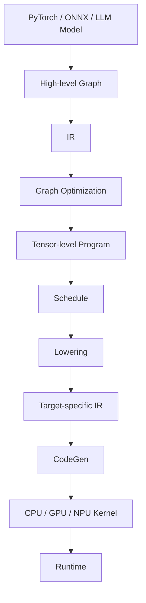
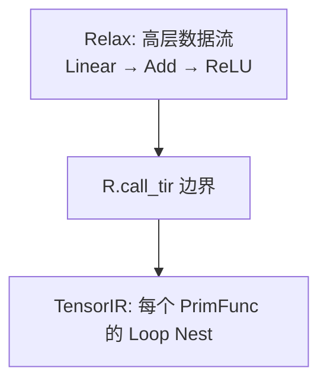
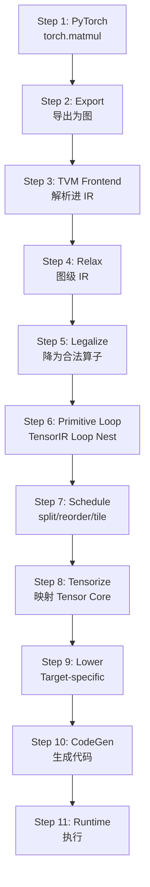

# 第 9 章 AI Compiler 与 TVM

> **所属路线**：AI 学习路线 · 第三部分
> **本章定位**：从 LLM Runtime 继续下钻，理解模型如何从 Framework/Graph 经过 IR、图优化、张量程序、Schedule、Lowering、CodeGen，最终变成 CPU/GPU/NPU 上执行的代码
> **核心仓库**：[apache/tvm](https://github.com/apache/tvm)
> **核心抽象**：Relax + TensorIR（当前主线进一步拆分为 `tirx` + `s_tir`）
> **前置要求**：已理解第 4 章 ONNX/图/算子、第 6 章 Memory-Bound/Arithmetic Intensity、第 8 章 MLC 的 Relax IR
> **学习边界**：本章解决 AI Compiler 总体架构与 TVM 核心机制；FlashAttention、Triton、CUTLASS、GPU Kernel 在下一章深入，RKNN/RKLLM 用于理解 Vendor NPU Compiler/Runtime
> **版本说明**：本章由 09/10 两版《AI_Compiler与TVM》笔记合并而成，以 09 版为基线吸收 10 版独有内容
> **资料检查日期**：2026-08-25

---

## 本章导读

前面几章我们走完了 Runtime，但一直藏着一个巨大的黑盒：

```text
MatMul
  ↓
  ???      ← 这个黑盒
  ↓
GPU Kernel
```

AI Compiler 就是在解决这个「???」。完整地看：



本章要始终追问一句话：

> **一个 `torch.matmul(x, w)`，到底经过了什么，最终才变成 CPU SIMD 指令、CUDA Kernel，或 NPU 上的矩阵计算任务？**

**学习方法**：不要把本章学成「TVM API 教程」。始终盯着「一个 MatMul 如何变成硬件上的线程、访存和指令」这条主线。

---

## 1. AI Compiler 是什么

### 1.1 传统 Compiler 做什么

```text
C/C++ 源码 → 词法/语法分析 → IR → 优化 → 目标机器码
```

核心思想：**把「人写的程序」翻译成「硬件能执行的指令」，中间经过一层可优化的中间表示（IR）**。

### 1.2 AI Compiler 做什么

> **定义**：AI Compiler 把「模型（计算图 + 权重）」编译成「特定硬件上的高效 Kernel/可执行代码」。

```text
PyTorch/ONNX Model → IR → 图优化 → 张量程序 → Schedule → Lowering → CodeGen → Kernel
```

### 1.3 为什么 AI Compiler 更难

传统编译器的输入是「顺序指令」，语义清晰；AI Compiler 的输入是「**张量运算的声明**」（一个 `matmul(x,w)` 只是说了「算什么」，没说「怎么算」）。而「怎么算」——循环怎么嵌套、数据怎么切块、放哪个内存层级——**恰恰是性能差异的来源**。所以 AI Compiler 要同时解决两个问题：

```text
算什么（What）：计算图、算子语义
怎么算（How）：循环、Tiling、访存、线程映射
```

这就是「**Algorithm 与 Schedule 分离**」思想的由来。

---

## 2. 为什么需要两层 IR

一个 MatMul 是「图里的一次算子调用」，但它内部是「三层循环 + 访存」。如果只有一个 IR，要么太高（看不到循环）、要么太低（丢掉了图结构）。所以 TVM 用两层：

| IR 层 | 关注什么 | 例子 |
|---|---|---|
| **Relax**（Graph-level IR） | 算子之间的数据流 | Linear、Attention、Paged KV |
| **TensorIR**（Tensor-level IR） | 单个算子的 Loop/Buffer/访存 | MatMul 的三层循环 |



- 只有 Graph IR：看不到 MatMul 内部循环，做不了 Tiling/向量化；
- 只有 Loop IR：看不到全局结构，做不了算子融合/内存规划。

所以两层都要，并且要能放在**同一个 IRModule** 里协同优化——这叫 **Cross-level Optimization**。

---

## 3. IRModule 与 Cross-level Optimization

> **定义**：IRModule 是承载模型函数和低层函数的一组 IR，里面可以同时包含 Relax Function 和 PrimFunc（TensorIR 函数）。

```text
IRModule
├── Relax Function（图级：描述算子间数据流）
└── PrimFunc（张量级：每个算子的循环实现）
```

关键桥梁是 `R.call_tir`：Relax 里的算子调用，最终落到某个 PrimFunc 上执行。因为两者在一个 IRModule 里，编译器能跨层做优化——比如「图级算子融合」结合「张量级调度」，这是只做图或只做 Kernel 都做不到的。

> ⚠️ 版本提示：旧教程大量讲 `Relay`，但现代 TVM 主线是 `Relax`（Relay 是更早的图 IR）。当前 TensorIR 还进一步拆成了 `tirx`（IR 定义）与 `s_tir`（schedule 相关），看到旧 API 别慌，知道「这已经是演进后的写法」即可。

---

## 4. Symbolic Shape 与 Static/Dynamic Shape

### 4.1 Static vs Dynamic

- **Static Shape**：`[1,3,224,224]` 固定，Compiler 能提前做内存规划、Kernel 选择；
- **Dynamic Shape**：`[B,3,H,W]` 运行时才确定，Compiler 需要处理不同 Shape/Workspace/Kernel/内存。

### 4.2 Symbolic Shape 的价值

> **定义**：Symbolic Shape 用符号（如 `n`、`m`）而非具体数字描述维度，让 Compiler 在「不知道具体大小」时仍能建立形状之间的关系、做形状推导。

> 💡 关键认识：Dynamic Shape **不等于**「Compiler 什么都不知道」。Symbolic Shape 让 Compiler 保有「形状之间的关系」，只是少了对具体大小的假设。

### 4.3 LLM 的 Decode 是特殊 Shape

Decode 时 `T=1`，是极端的小 GEMM；Prefill 时 `T` 大。这是「同一模型、两种完全不同的 Shape」——这也是为什么 MLC 会把 `batch_prefill / batch_decode` 分开编译。

---

## 5. TensorIR：一个 MatMul 的 Loop Nest

TensorIR 描述的是「单个算子的循环 + Buffer + 访存」。以 MatMul 为例，朴素写法就是三层循环：

```python
# 概念示意：C[i,j] = sum_k A[i,k] * B[k,j]
for i in range(M):
    for j in range(N):
        for k in range(K):
            C[i, j] += A[i, k] * B[k, j]
```

这里有几个核心概念：

- **Spatial Axis（空间轴）**：i、j，决定输出每个元素；
- **Reduction Axis（归约轴）**：k，累加求和；
- **Buffer**：显式描述数据放在哪、如何访问——这是后续做内存优化的关键；
- **Block**：TensorIR 的基本结构单元，编译器据此做依赖分析。

> 为什么区分 Spatial/Reduction？因为它们的优化方式不同：空间轴可以并行，归约轴需要小心处理累加顺序（这影响能否用 Tensor Core、能否向量化）。

---

## 6. Schedule：性能的真正来源

### 6.1 最核心的认识

> **两个「计算结果相同」的 Loop Program，性能可以差 100 倍。** Schedule 就是在不改变结果的前提下，重新组织循环、访存、线程映射。

### 6.2 基本原语

| 原语 | 做什么 | 为什么 |
|---|---|---|
| `split` | 把一个轴拆成两段 | 为 Tiling、并行、向量化铺路 |
| `reorder` | 交换循环顺序 | 改善访存局部性 |
| `fuse` | 合并相邻轴 | 扩大并行/向量化粒度 |
| `parallel` | 标记为并行 | 映射到多核 CPU |
| `vectorize` | 向量化 | 用 SIMD 指令 |
| `unroll` | 循环展开 | 减少循环开销、暴露优化机会 |
| `bind` | 绑定到 GPU threadIdx/blockIdx | 映射到 GPU 线程 |

### 6.3 Schedule 就是搜索空间

每个「拆不拆、怎么拆、什么顺序、放哪层内存」都是一次选择，组合起来就是一个巨大的 **Schedule Design Space**。Auto-tuning（自动调优）本质上就是在这个空间里搜索最优解——因为**真实硬件上的最优往往无法靠人拍脑袋猜出来，必须实测**。

---

## 7. Tiling 与数据复用：Compiler 为什么管 Memory

### 7.1 回到 Arithmetic Intensity

第 6 章讲过：性能瓶颈分 Memory-Bound 和 Compute-Bound。Compiler 能做的最重要的事，就是**通过 Tiling 提高数据复用，减少内存搬运**。

### 7.2 内存层级

```text
Register（最快，最小）→ Shared Memory / L1 → L2 → HBM/DDR（最慢，最大）
```

### 7.3 关键原语

| 原语 | 作用 |
|---|---|
| **Tiling** | 把大矩阵切成小块，让一块数据被重复使用 |
| **`cache_read` / `cache_write`** | 把数据缓存到更快的内存层级（如 Shared Memory） |
| **Shared Memory Tiling** | GPU 上把 A/B 的 tile 载入 Shared Memory 复用 |
| **Register Blocking** | 把小块数据进一步放进寄存器，寄存器最快 |

> ⚠️ **Register Pressure**：寄存器用太多会「溢出」（spill 到内存），反而变慢。Schedule 是典型 Tradeoff 问题——**没有银弹，只有针对特定硬件的权衡**。

> 💡 为什么 ARM Edge 也需要 Compiler Schedule？RK3576 的 ARM CPU 同样要针对 NEON 做 Tiling、向量化、数据复用——Compiler 的思维对端侧 CPU 优化同样适用，不只是 GPU 的事。

---

## 8. Tensorization：接入 Tensor Core 与 NPU

> **定义**：Tensorization 把一段计算映射到硬件的**专用矩阵单元**（Tensor Core / AMX / NPU Matrix Unit）的 intrinsic 指令上。

```text
一段 MatMul 循环 → 映射到 Tensor Core 的一条 mma 指令 → 硬件矩阵单元执行
```

- CPU 的 AMX/SME、GPU 的 Tensor Core、NPU 的 Matrix Unit，都通过 Tensor Intrinsic 接入；
- **这是理解 NPU Compiler 的关键入口**：RKNPU 编译本质上就是在做「把算子映射到 NPU 矩阵单元 + 片上 SRAM」的 Tensorization + Tiling。

---

## 9. Legalization 与 Graph Optimization

### 9.1 Legalization

> **定义**：把高层、不规范的算子调用，**改写/分解**成后端真正支持的、语义明确的算子序列。

例如把复杂的 `MatMul` 相关写法，降低成后端能识别的标准形式。之所以叫「Legalize」，是因为每个后端对「什么是合法算子」有明确定义，Compiler 要把图里的算子变成「合法的」那套。

### 9.2 常见图优化

| 优化 | 做什么 |
|---|---|
| Operator Fusion | 把 Conv+BN、MatMul+Add 等合并，减少中间写回 |
| Constant Folding | 编译期算掉常量表达式 |
| Dead Code Elimination | 删除无用节点 |
| Layout Transformation | 调整数据布局以匹配硬件 |

> ⚠️ **Graph Fusion vs Kernel Fusion 不是一回事**：图级融合是把「图里的多个算子」合成一个；Kernel 融合是把「一个 Kernel 内的多个步骤」合成一个。二者层次不同。

---

## 10. DLight 与 MetaSchedule：手动 vs 自动调度

三条优化路线：

| 路线 | 做法 | 适用 |
|---|---|---|
| Manual Schedule | 手写 split/tile/vectorize | 教学、精确控制 |
| **DLight** | 基于规则的默认调度 | 常见模型「开箱即用」 |
| **MetaSchedule** | 搜索 + Cost Model 自动调优 | 追求极致性能 |

> MetaSchedule 的核心：在 Schedule Design Space 里**搜索**，用 Cost Model 预估、用**真实硬件实测**验证——因为「必须真实测」是 Auto-tuning 的铁律，Cost Model 只是缩小搜索范围，最终裁判是硬件。

---

## 11. Target 与 Lowering

> **定义**：Target 描述目标硬件——它**不只是一个字符串**「GPU」，而是包含架构、能力、内存层级等信息的描述（如 NVIDIA A100、ARM Cortex-A）。

```text
Target → 决定 CodeGen 用什么后端、Kernel 用什么特性、内存如何规划
```

**Lowering** 是把高层 IR 逐步降低到 Target 相关 IR 的多阶段过程：

```text
Relax → Legalize → TensorIR → Schedule → Lower → Target-specific IR → CodeGen
```

> 为什么多阶段 Lowering？每阶段只解决一类问题，逐步从「语义」走到「机器」，比一次性翻译更容易做对、更容易优化。

---

## 12. CodeGen：跨平台的关键

### 12.1 两阶段 CodeGen

当前 `tvm.compile()` 大体是：**Host/Device 分离** + 生成代码。

- **Host Code**：运行在 CPU 上，负责调度、参数传递；
- **Device Code**：运行在 GPU/NPU 上，是真正的 Kernel。

### 12.2 两类后端

| 家族 | 做法 | 目标 |
|---|---|---|
| LLVM Family | 走 LLVM 生成机器码 | CPU（含 ARM） |
| Source CodeGen | 生成源码再交给平台编译器 | CUDA/Vulkan/Metal/WebGPU/OpenCL |

> 为什么 TVM 能跨平台？因为它把「模型 → IR → 针对 Target 生成代码」这条链统一了。**但跨平台不意味着同一 Schedule 通用**——CUDA 和 Metal 硬件不同，最优 Schedule 也不同。

---

## 13. Runtime Module、PackedFunc、Relax VM、AOT

| 概念 | 是什么 |
|---|---|
| Runtime Module | 编译产物的可加载单元 |
| PackedFunc | TVM 的通用函数调用约定（跨语言 FFI 的基础） |
| **Relax VM** | 执行 Relax 图级程序的虚拟机，**它自己不执行 MatMul**，只负责调度 PrimFunc |
| AOT | 提前编译，端侧无需带编译器 |

> 💡 Relax VM 和 vLLM Scheduler 不是一回事：VM 是「怎么按图执行 PrimFunc」，Scheduler 是「怎么调度并发请求」——层次不同。

> 端侧喜欢 AOT 的原因：Android/iOS/嵌入式不希望在设备上带完整编译器，于是「Host 编译 → Target Library → Device Runtime」，MLC 就非常依赖这个思想。

---

## 14. BYOC：Vendor NPU 的接入

> **定义**：BYOC（Bring Your Own CodeGen）让外部硬件厂商接入自己的算子库/CodeGen，把图里匹配的部分**切出来交给厂商实现**。

```text
匹配 Pattern → Partition（切分子图）→ External CodeGen / 厂商算子库
```

- 这和 **ONNX Runtime 的 Execution Provider** 思想很像（但不是同一个实现）；
- 也解释了为什么 Compiler 会「调用 cuBLAS」而不是自己生成 MatMul——**厂商库往往针对自家硬件优化得更好，能调用就别重复造轮子**，这叫 Library Dispatch。

> **这就是理解 RKNN 的关键**：RKNPU 编译本质上是「Vendor AI Compiler + Runtime Toolchain」。学懂 TVM 后，再看 `.rknn` 的编译过程会清晰很多——它也要做算子匹配、图切分、量化、映射到 NPU 矩阵单元和片上 SRAM。区别在于 **Vendor NPU Compiler 更严格**：算子集固定、量化格式固定、动态 Shape 支持有限，所以 **Unsupported Op / Quantization Failure 很常见**。

---

## 15. AI Compiler vs 其他角色

| 对比 | 结论 |
|---|---|
| TVM vs PyTorch | PyTorch 是训练框架 + 动态执行；TVM 是编译 + 优化 |
| TVM vs ONNX Runtime | ONNX 定义「算什么」，ORT 负责「怎么在硬件上算」；TVM 更偏「怎么生成最优 Kernel」 |
| TVM vs llama.cpp | llama.cpp 手写 Runtime/Backend；TVM 用编译自动生成 |
| TVM vs vLLM | vLLM 是 Serving Runtime；TVM 是 Compiler，两者可合作 |
| TVM vs MLC-LLM | MLC 是基于 TVM 的 LLM 专用栈 |
| TVM vs RKNN-Toolkit2 | 抽象层高度类似，RKNN 是 Vendor 专用 Compiler+Runtime |

> **一个关键认识：AI Compiler 不只优化 Kernel。** Frontend 兼容（PyTorch/ONNX 接入）、算子覆盖、图切分、量化，都是现实工程问题。

---

## 16. 一个 MatMul 的完整旅程

把前面的所有阶段串起来：



> **为什么 Compiler 不能只优化 FLOPs？** 因为速度差异往往来自 **Data Movement（数据搬运）**，而非纯计算——这正是第 6 章 Memory-Bound 的再现。Tiling 之所以是核心，就是因为它控制「多少数据留在片上、多少要去慢速内存」。

---

## 17. Compiler Debug

### 17.1 结果不对

- 先做 **Numerical Validation**：用同一输入比较框架输出和编译输出（`np.max(abs(a-b))`）；
- 再 **Intermediate Validation**：逐层/逐算子比中间结果，定位第一个明显偏差的算子。

### 17.2 性能不达标

分三层定位：**Graph 问题**（融合没生效、切分不合理）→ **Kernel 问题**（Schedule 差、没向量化、没 Tensorize）→ **Runtime 问题**（Launch 开销、内存分配、同步）。

### 17.3 Compile Time vs Runtime

编译慢没关系（一次性），运行时慢才是问题。端侧尤其关心 Runtime 的峰值内存和 Kernel 效率。

---

## 18. 本章实验

1. **打印 Relax IR**：把一个 MLP 导出成 Relax，看算子如何变成图；
2. **LegalizeOps**（★最重要）：看高层算子如何分解成合法算子；
3. **手写 Vector Add / MatMul PrimFunc**：理解 Spatial/Reduction Axis、Buffer、Block；
4. **Loop Split / Reorder / Fuse**：亲手改循环结构，观察 IR 变化；
5. **CPU Parallel / Vectorize**：看 NEON/SIMD 如何生效；
6. **Tiling + cache_read**：观察数据复用如何减少访存；
7. **打印生成代码**：看 TIR 最终变成 C/CUDA 源码；
8. **PyTorch → Relax 与 ONNX → Relax**：两条前端路线对比；
9. **CPU vs CUDA Target**：同一个 MatMul，不同 Target 生成完全不同的代码；
10. **BYOC 思维实验**：把图切出一部分「交给外部算子库」，理解 Vendor NPU 的接入方式。

> 更多实验（DLight、MetaSchedule、RPC、LLVM ARM 交叉编译、RK3576 CPU 部署、MLC 对照）见「学习资源」的 Stage 表。

---

## 19. 常见误区速查

| # | 误区 | 正确认识 |
|---|---|---|
| 1 | AI Compiler = 普通 C/C++ 编译器 | 输入是张量运算声明，要同时解决「算什么」和「怎么算」 |
| 2 | 一层 IR 就够 | 图级 + 张量级两层，各管各的，还要能跨层协同 |
| 3 | Relay 是当前主线 | 现代主线是 Relax，Relay 是旧图 IR |
| 4 | Schedule 只影响一点点 | 结果相同的两个 Loop 性能可差 100 倍 |
| 5 | Tiling 只对 GPU 有用 | ARM NEON 端侧同样需要 Tiling/向量化/数据复用 |
| 6 | 量化后一定快 | 还取决于 Kernel 是否支持低精度计算单元 |
| 7 | MetaSchedule 靠 Cost Model 就够了 | 最终必须真实硬件实测 |
| 8 | Cross-platform = 同一 Schedule 通用 | 不同硬件需要不同 Schedule |
| 9 | Relax VM 执行 MatMul | VM 只调度 PrimFunc，不自己算 |
| 10 | BYOC 是 TVM 独有概念 | 和 ONNX Runtime EP 思想相通 |

---

## 20. 本章小结

### 20.1 十个核心思维模型

1. **AI Compiler = 把模型编译成硬件上的高效 Kernel**；
2. **Algorithm（算什么）与 Schedule（怎么算）分离**；
3. **两层 IR：Relax（图级）+ TensorIR（张量级）**；
4. **Cross-level Optimization = 图优化 + 张量优化在同一 IRModule 协同**；
5. **Schedule 决定性能，Tiling 是核心**；
6. **Tensorization = 映射到 Tensor Core / NPU 矩阵单元**；
7. **Legalization = 把算子降到后端「合法」的形式**；
8. **Target 决定 CodeGen 和 Schedule**；
9. **BYOC = Vendor NPU 的接入方式**；
10. **性能 = 图优化 + Kernel 优化 + 数据搬运优化，不只是 FLOPs**。

### 20.2 术语表

| 术语 | 英文 | 一句话解释 |
|---|---|---|
| AI 编译器 | AI Compiler | 把模型编译成目标硬件 Kernel 的工具 |
| 中间表示 | IR | 编译过程中可优化的中间形式 |
| Relax | Relax | 图级 IR |
| TensorIR | TensorIR | 张量级 IR（Loop/Buffer/访存） |
| IR 模块 | IRModule | 承载 Relax Function + PrimFunc 的容器 |
| 原语函数 | PrimFunc | 单个算子的循环实现 |
| 调度 | Schedule | 重组织循环/访存/线程映射 |
| 分块 | Tiling | 切块以提高数据复用 |
| 张量化 | Tensorization | 映射到 Tensor Core/NPU 矩阵单元 |
| 合法化 | Legalization | 把算子降到后端合法形式 |
| 自动调优 | Auto-tuning | 在 Schedule 空间搜索最优解 |
| 目标 | Target | 目标硬件描述 |
| 降低 | Lowering | 高层 IR 降到 Target 相关 IR |
| 代码生成 | CodeGen | 生成机器码/源码 |
| 带自己的代码生成 | BYOC | 让厂商接入自己的算子库/CodeGen |
| 提前编译 | AOT | 提前编译，端侧不带编译器 |

### 20.3 自测清单

**基础**：[ ] 能解释 AI Compiler 是什么、与传统 Compiler 异同；[ ] 能解释为什么需要两层 IR；[ ] 能解释 IRModule / Relax Function / PrimFunc / R.call_tir / Cross-level Optimization

**Shape**：[ ] 能解释 Static vs Dynamic Shape、Symbolic Shape 的价值、LLM Decode 的特殊 Shape

**TensorIR**：[ ] 能写 MatMul Loop Nest；[ ] 能区分 Spatial/Reduction Axis、Buffer、Block

**Schedule**：[ ] 能解释 split/reorder/fuse/parallel/vectorize/unroll/bind；[ ] 能解释 Tiling/cache_read/cache_write/Shared Memory/Register Blocking/Register Pressure；[ ] 能解释 Schedule 是搜索空间

**Tensorization**：[ ] 能解释 Tensor Intrinsic、为什么它是 NPU Compiler 的关键入口

**图优化**：[ ] 能解释 Legalization/Fusion/Constant Folding/DCE/Layout；[ ] 能区分 Graph Fusion vs Kernel Fusion

**调度**：[ ] 能解释 Manual/DLight/MetaSchedule 三者区别与选择

**后端**：[ ] 能解释 Target/Lowering/CodeGen 两阶段/Host-Device Split/LLVM vs Source CodeGen；[ ] 能解释 Runtime Module/PackedFunc/Relax VM/AOT/RPC

**BYOC**：[ ] 能解释 BYOC 流程、为什么和 NPU/ONNX EP 相通、Library Dispatch

**对比**：[ ] 能解释 TVM 与 PyTorch/ONNX Runtime/llama.cpp/vLLM/MLC/RKNN 的关系；[ ] 能解释为什么学 TVM 后 RKNN 会清晰

**不要求**：手写完整 CodeGen、精通 MetaSchedule 算法、实现新 Backend、精通全部 BYOC 厂商库。

---

## 21. 学习资源与推荐顺序

### 21.1 核心仓库与入口

| 资源 | 用途 |
|---|---|
| [apache/tvm](https://github.com/apache/tvm) | 主仓库 |
| [TVM 官方文档](https://tvm.apache.org/docs/) | 概念与教程 |
| [TVMScript](https://tvm.apache.org/docs/reference/langref/index.html) | 读/写 TIR |

### 21.2 推荐学习顺序（12 Stage）

| Stage | 内容 | 目标 |
|---|---|---|
| 1 | 文档 + 概念 | 建立 Compiler 全局图 |
| 2 | TVMScript 读 IR | 先学会「读 IR」 |
| 3 | Relax | 理解图级 IR |
| 4 | Legalize | 看算子如何分解 |
| 5 | TensorIR | 写 MatMul/Vector Add |
| 6 | Schedule | 亲手 split/reorder/tile |
| 7 | DLight | 理解默认调度 |
| 8 | MetaSchedule | 理解自动调优 |
| 9 | CodeGen | 打印生成代码 |
| 10 | Runtime | PackedFunc/VM/AOT |
| 11 | BYOC | 理解 Vendor 接入 |
| 12 | MLC 对照 | 把 MLC 的 Relax/TIR 串起来 |

### 21.3 三条优化路线（工程现实）

```text
极致性能     → MetaSchedule / 手写最优 Schedule
已知最优实现 → 调用 cuBLAS/cuDNN/CUTLASS（Library Dispatch）
开箱即用     → DLight 默认调度
```

> 学源码时**不要一开始扎进 CodeGen C++**，先看 Python Frontend → IR → Schedule → 再往下。FFI（Python↔C++ 桥）也不用一开始钻，等需要深入实现再看。

---

## 22. 下一章预告

本章我们把「模型 → IR → Kernel」的编译链打通了。但 Compiler 生成出来的 GPU Kernel，为什么有的快有的慢？FlashAttention 又是怎么用 Tiling 和 Online Softmax 减少 HBM 搬运的？

下一章下钻到 GPU 执行模型与 Kernel 层：

> **[10_GPU_Kernel与FlashAttention](10_GPU_Kernel与FlashAttention.md)**
