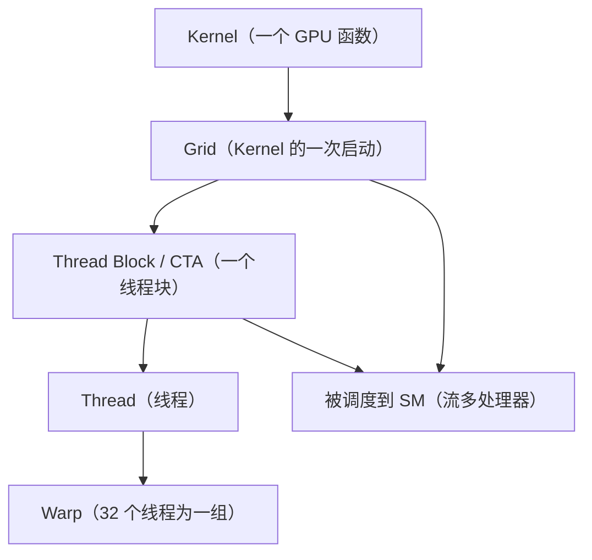
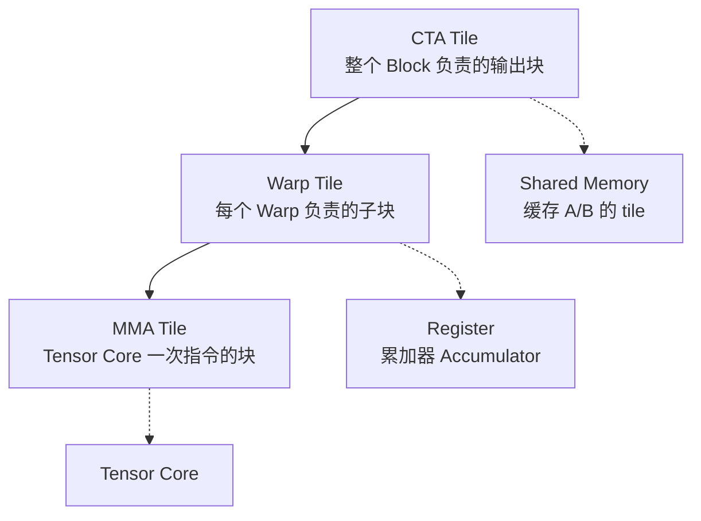
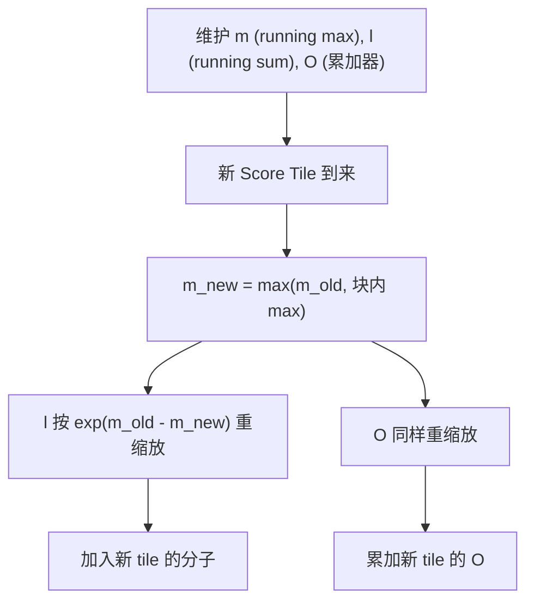
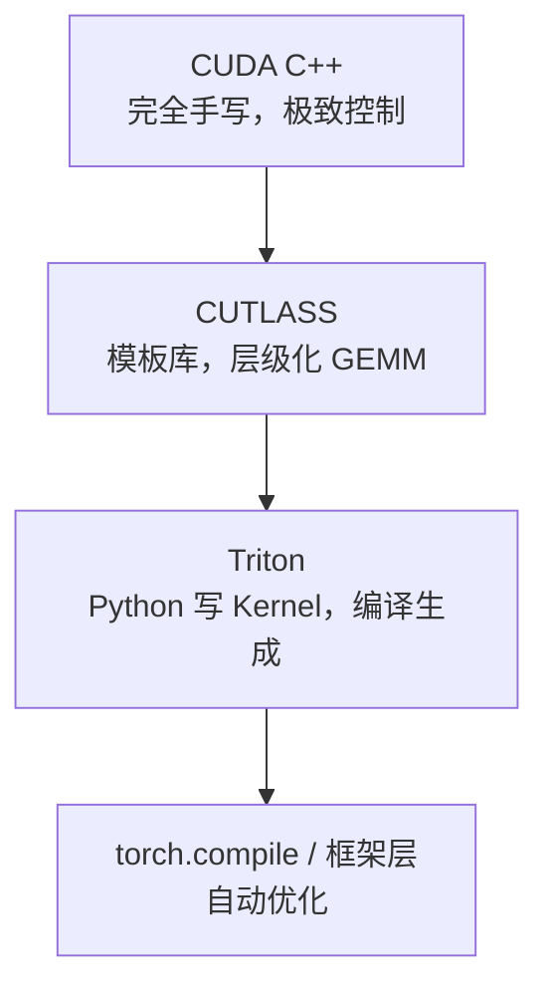

# 第 10 章 GPU Kernel 与 FlashAttention

> **所属路线**：AI 学习路线 · 第三部分
> **本章定位**：从 AI Compiler 继续下钻到 Kernel 层，理解 GPU 的执行模型、内存层级、GEMM 优化，以及 FlashAttention 如何用「算法-系统协同设计」解决 Attention 的内存搬运问题
> **核心资料**：[NVIDIA CUDA Programming Guide](https://docs.nvidia.com/cuda/cuda-c-programming-guide/) · [Triton](https://github.com/triton-lang/triton) · [FlashAttention](https://github.com/Dao-AILab/flash-attention) · [CUTLASS](https://github.com/NVIDIA/cutlass)
> **前置要求**：已理解第 6 章 Memory-Bound/Arithmetic Intensity、第 9 章 TVM 的 Schedule/Tiling/Tensorization
> **学习边界**：本章聚焦 GPU Kernel 与 FlashAttention；CUTLASS 讲清思想，不要求手写完整 Kernel；TMA/WGMMA 等 Hopper/Blackwell 高级特性只了解位置
> **资料检查日期**：2026-08-25

---

## 本章导读

第 9 章我们打通了「模型 → IR → Kernel」的编译链，但那个 Kernel 到底长什么样、为什么有的快有的慢，还是抽象。这一章把镜头对准 GPU 硬件本身。

核心问题是：

> **FlashAttention 为什么能比标准 Attention 快那么多？它到底改了什么？**

这个问题是 AI Systems 领域最典型的案例——它同时牵扯硬件执行模型、内存层级、算法重写、Kernel 融合，几乎把前面所有章节的知识都串起来了。学完这一章，你就真正从「会调 API」走到了「理解底层性能」的层面。

学完本章，你应该能回答：

1. GPU 的 Kernel / Grid / Block / Thread / Warp / SM 分别是什么？它们是什么关系？
2. 为什么 GPU 需要那么多 Thread？什么是 SIMT、Warp Divergence、Occupancy？
3. GPU 的内存层级（Global/Shared/Register/L2）为什么是性能优化的核心？
4. 什么是 Memory Coalescing、Bank Conflict、Register Spill？
5. GEMM 的层级化分解（CTA Tile → Warp Tile → MMA Tile）为什么能对应硬件层级？
6. Tensor Core 为什么快？它的输入为什么不是任意 Shape？
7. Triton 为什么出现？它和 CUDA、TVM TensorIR 是什么关系？
8. FlashAttention 是不是近似 Attention？Online Softmax 解决了什么？
9. FlashAttention 为什么既省内存、又更快？它的复杂度变了吗？
10. CUTLASS 的 CuTe、Mainloop/Epilogue、Grouped GEMM 分别解决什么？

**学习方法**：先建立 GPU 执行模型和内存层级的直觉，再顺着 GEMM 优化阶梯往上爬，最后 FlashAttention 会把前面所有概念一次性用上。**学习顺序不要反——先弄懂为什么，再谈怎么优化。**

---

## 1. GPU 执行模型

### 1.1 CPU vs GPU：最重要的思维转变

CPU 是「少量强核心」，擅长复杂逻辑、分支、串行任务；GPU 是「大量并行计算单元」，擅长**大量独立、相似的计算**。深度学习里充满矩阵乘加，天然适合 GPU。

### 1.2 核心概念层级



| 概念 | 是什么 |
|---|---|
| Kernel | 在 GPU 上执行的函数 |
| Grid | Kernel 一次启动的组织（含多个 Block） |
| Thread Block / CTA | 一组协作的线程，共享 Shared Memory |
| Thread | 最小执行单元 |
| Warp | **32 个线程为一组**，一起执行同一条指令 |
| SM | 流多处理器，Block 被调度到这里运行 |

> 💡 为什么需要这么多 Thread？因为 GPU 靠「海量线程」隐藏访存延迟——一个线程等数据时，其他线程可以继续算。

### 1.3 SIMT 与 Warp Divergence

> **定义 · SIMT**：一个 Warp 的 32 个线程**同时执行同一条指令**，但各自操作不同的数据。

- Warp 不是你在 CUDA 源码里显式创建的，是硬件自动把 32 个线程编成一组；
- **Warp Divergence**：如果 Warp 里线程走了不同分支（如 `if (tid % 2)`），两个分支会被**串行执行**，效率减半；
- 不是所有分支都坏——只有**同一 Warp 内**的分歧才致命。

### 1.4 Occupancy

> **定义**：Occupancy = 一个 SM 上「活跃 Warp 数 / 理论最大 Warp 数」。高 Occupancy 能更好地隐藏访存延迟。

但 **Occupancy 高 ≠ 一定快**：如果每个线程用了太多寄存器，高 Occupancy 反而会导致 Register Spill（寄存器溢出到内存）。所以 Occupancy 是**约束/指标**，不是目标。

---

## 2. GPU 内存层级

```text
Global Memory（慢，大）→ L2 → Shared Memory / L1 → Register（快，小）
```

| 层级 | 特点 | 优化要点 |
|---|---|---|
| Global Memory | 容量大、延迟高 | Memory Coalescing（合并访问） |
| L2 Cache | 片上缓存 | 提高命中率 |
| Shared Memory | 块内共享，较快 | 避免 Bank Conflict |
| Register | 最快、最少 | 避免 Spill |

### 2.1 Memory Coalescing

相邻线程访问**连续地址** → 一次合并成一次内存事务（快）；否则会拆成多次事务（慢）。

> 💡 这就是为什么 **Layout（数据布局）如此重要**：同样的张量，NCHW 和 NHWC 的访存模式完全不同，性能可能差很多。

### 2.2 Shared Memory Bank Conflict

Shared Memory 被分成若干 Bank，同一 Warp 内多个线程访问**同一个 Bank 的不同地址**会串行化。所以 Shared Memory 也不是随便用。

### 2.3 Register Spill 与 Local Memory

- **Register Pressure**：寄存器用太多会 Spill；
- **Local Memory 名字误导**：它其实是 Global Memory 的一部分（每个线程的私有空间），访问它很慢——寄存器溢出到 Local Memory 会严重拖慢性能。

> **Kernel Optimization 永远是 Tradeoff**：寄存器、Shared Memory、Occupancy 之间互相牵制，没有银弹。

---

## 3. Compute-bound 与 Memory-bound（再联系）

第 6 章的概念在这里落地：

- **Vector Add**：几乎只搬数据 → Memory-bound；
- **GEMM**：大量乘加 → 通常 Compute-bound（前提是数据复用做得好）；
- **Softmax**：中间要读写大张量 → Memory-bound，**Fusion 对它特别有效**。

---

## 4. GEMM 优化：层层往上爬

### 4.1 为什么 GEMM 是 AI Kernel 的核心

LLM 的大部分参数都在 Linear/FFN 里，本质是 GEMM。朴素 GEMM 慢，是因为**数据复用差、访存多**。

### 4.2 GEMM 的层级分解

这是本章最重要的结构图——它和 GPU 硬件层级**完美对应**：



- **CTA Tile**：Block 级别的输出块，A/B 的 tile 载入 Shared Memory；
- **K 维 Tiling**：把 K 切成一段段，逐段累加（Mainloop）；
- **Warp Tile / MMA Tile**：进一步细分给 Warp 和 Tensor Core；
- **Accumulator 放在 Register**：不每次写回 Shared/Global，只在最后写回。

### 4.3 为什么快

Tiling + Shared Memory 让 A/B 的每一块数据被**复用多次**，大幅提高 Arithmetic Intensity；累加器放寄存器避免中间写回慢速内存。

### 4.4 Mainloop 与 Epilogue

- **Mainloop**：反复「载入 tile → MMA 累加」；
- **Epilogue**：最后对累加结果做 scale/bias/激活等后处理。**Epilogue 单独设计，是因为 Fusion 最适合发生在这里**（LLM 里极常见：GEMM + 激活 + 量化反量化）。

### 4.5 Double Buffering / Pipeline

用异步拷贝（Async Copy）在「算当前 tile」的同时「预取下一个 tile」，隐藏内存延迟。多级流水线（Multi-stage Pipeline）是 Hopper/Blackwell 时代性能的关键，但**学习顺序不要反**——先搞懂 Tiling，再谈流水线。

---

## 5. Tensor Core 与 MMA

> **定义**：Tensor Core 是 GPU 上的专用矩阵单元，一条 **MMA 指令**就能完成小矩阵的乘加。

- Tensor Core 输入**不是任意 Shape**（有固定的 tile 形状，如 16×8×16），所以需要专门的 Layout 和分块；
- 它快，是因为「一次指令算一堆乘加」，吞吐远高于普通 FP32 指令；
- 但 **Tensor Core 不是免费性能**：要喂对 Layout、对好块大小、处理好累加顺序——这就是 CUTLASS 要解决的问题。

---

## 6. Triton：为什么出现

> **定义**：Triton 是一个「写 Python、编译成 GPU Kernel」的语言/编译器。它**不是 Python 直接在 GPU 上执行**，而是把 Python 描述的 block 逻辑编译成高效 Kernel。

关键概念：

- **Program Instance**：每个 Triton 程序实例对应一个 GPU Block（`program_id` 就是 block 的索引）；
- `tl.arange` / `tl.load` / `tl.store` / Mask：描述一个 block 内的向量化访存；
- `tl.dot`：调用 Tensor Core 的矩阵乘；
- **AutoTune**：对同一个 Kernel 尝试不同 tile 大小/配置，选最优——**Shape 是 key**（不同 Shape 最优配置不同，这就是 Kernel Specialization）。

> Triton 和 TVM TensorIR 很像（都是「描述块内计算 → 编译」），但定位不同：Triton 更贴近 GPU block 抽象，TVM 更通用跨硬件。**关键不是 Python vs C++，而是「能不能表达出好的 Tiling 和数据复用」。**

---

## 7. 为什么 FlashAttention 出现

### 7.1 标准 Attention 的问题

标准做法是「Materialized Attention」——把 `S = QKᵀ` 完整算出来存进 HBM，再 Softmax，再乘 V：

```text
Q[L,D] × K[D,L] → S[L,L]（完整存 HBM）→ Softmax → × V → O
```

问题在于 `S` 是 **L×L** 的矩阵。当序列长度 L 很大（如 8K、16K），`S` 的中间存储和读写极其昂贵。

### 7.2 核心洞察：算力不是唯一问题

Attention 的计算量是 O(L²D)，但**真正拖慢的是 HBM 的数据搬运**——反复读写那个巨大的 S 矩阵。所以 FlashAttention 要优化的是 **IO（数据搬运）**，不是删掉 Attention。

> **FlashAttention 不是近似 Attention**，它算的是精确的 Attention，只是用更好的算法和内存访问方式。

### 7.3 两大技巧

```text
第一件事：不保存完整 S —— 把 Q/K/V 分块（Tiling）
第二件事：分块后，每块单独算 Softmax 需要修正 —— Online Softmax
```

---

## 8. FlashAttention 核心：Tiling + Online Softmax

### 8.1 为什么不能简单分块各算各的 Softmax

Softmax 的分母是「所有分数的和」。如果 Q 被分成两块，各自算完再拼，两个局部分母不能直接合并——需要维护**全局最大值和全局和**，边算边修正。

### 8.2 Online Softmax 的关键

```text
维护状态：running max m 和 running sum l

新 Score Tile 到来：
1. 新最大值 m_new = max(m_old, 块内最大值)
2. 旧 sum 需要重新缩放：l ← l_old × exp(m_old - m_new)
3. 新 tile 的概率分子：exp(块内分数 - m_new) 求和加入 l
4. 输出累加器 O 也要同样缩放
```



### 8.3 为什么既省内存又更快

- **Memory 复杂度**：从 O(L²) 降到 O(L)（不再完整存储 S）；
- **计算复杂度没变**（仍是 O(L²D)），但因为**减少了 HBM 搬运**，实际更快——这就是 **IO complexity 思维**。

> 这就是「算法-系统协同设计」：数学上等价，工程上因为访存模式不同而更快。

---

## 9. FlashAttention-2 / 3 与周边

| 版本 | 重点 |
|---|---|
| FA1 | 提出 Tiling + Online Softmax，证明 IO-aware 的价值 |
| FA2 | 减少非矩阵乘的指令、优化并行划分、减少 warp 间通信 |
| FA3 | 更强调 **Hardware-aware**（针对 Hopper 的 TMA/WGMMA 等特性） |

**与周边的关系**：

- **FlashAttention vs PagedAttention**：不是竞争关系。FlashAttention 优化「单次 Attention 的 IO」；PagedAttention 优化「KV 在内存中的分页管理」。二者可以叠加；
- **FlashAttention vs KV Cache**：Prefill 阶段 FlashAttention 特别自然（L 大）；Decode 阶段 Q 长度=1，瓶颈在「读 KV Cache」，是另一种 Kernel。

---

## 10. CUTLASS：层级化 GEMM 库

> **定义**：CUTLASS 是 NVIDIA 的开源 CUDA C++ 模板库，用「层级分解」把 GEMM 映射到 GPU 硬件层级，是现代高性能 GEMM 的事实标准之一。

### 10.1 核心思想：Hierarchical Decomposition

把 GEMM 分解成 CTA Tile → Warp Tile → MMA Tile，层层对应硬件（这正是第 4 节那张图）。

### 10.2 CuTe：Layout Algebra

CUTLASS 3.x 的核心变化是用 **CuTe** 描述 Tensor 的 Layout 和分块代数，让「数据怎么摆放、怎么切块」变成可组合的代数运算——这是应对复杂访存模式的关键。

### 10.3 Mainloop + Epilogue

- Mainloop 负责 GEMM 主循环；
- Epilogue 负责后处理（scale/bias/激活/量化反量化），**最适合 Fusion**。

### 10.4 Grouped GEMM 与 MoE

MoE 里不同 Token 路由到不同 Expert，如果每个 Expert 单独 Launch 一个 GEMM，会有一堆小 Kernel、利用率低。**Grouped GEMM** 把多个小 GEMM 合并成一次高效执行——这就是 CUTLASS 对 MoE 如此重要的原因。

---

## 11. Triton vs CUTLASS vs CUDA：三层定位



| 层 | 定位 | 学习价值 |
|---|---|---|
| CUDA C++ | 手写 Kernel | 理解硬件本质 |
| CUTLASS | 模板化的高性能 GEMM | 理解层级分解 |
| Triton | Python 写 Kernel | 生产力 + 可读性 |

> **一个成熟 LLM Stack 通常是多层协作**：vLLM 用 Triton/CUTLASS 的 Kernel，torch.compile 做图级优化，MLC/TVM 做编译——Compiler 和手写 Kernel 不是互斥，而是各司其职。

---

## 12. Kernel Fusion

| 类型 | 例子 |
|---|---|
| Elementwise Fusion | 多个逐元素操作合成一个 Kernel |
| Reduction Fusion | Softmax 这类「读写中间张量」的融合 |
| GEMM Epilogue Fusion | GEMM + bias + 激活 + 量化 |
| Attention Fusion | FlashAttention 本质是 QKᵀ/Softmax/PV 的融合 |

> ⚠️ **Fusion 不是越多越好**：融合太多会让一个 Kernel 太大、寄存器溢出、复用变差。Fusion Decision 也是 Tradeoff。

---

## 13. Profiling：性能分析模板

工具：**Nsight Systems**（看时间线、Launch 开销）、**Nsight Compute**（看 Kernel 内部指标）。

**第一问永远是：这个 Kernel 是 Memory-bound 还是 Compute-bound？**

```text
Memory-bound  → 看 Coalescing、L2 Hit、数据复用
Compute-bound → 看 Tensor Core 利用率、算术强度
Occupancy 低  → 先别急着优化 Occupancy，先看是不是访存/依赖导致的 Warp Stall
```

**Benchmark 正确方式**：不要只跑一次取峰值、不要拿冷启动时间当性能、**必须验证 Correctness**（对 GPU Kernel 尤其要设 Numerical Tolerance，FlashAttention 官方测试就是这么做的）。

---

## 14. LLM 常见 Kernel

| Kernel | 优化点 |
|---|---|
| RMSNorm | 小 Kernel，常与后续算子融合 |
| RoPE | 常被 Fuse 进 Q/K 的计算，减少中间张量 |
| SwiGLU | 融合 gate/up 与激活 |
| Quantized GEMM | 核心是「边解码量化块边算 dot product」，而非先反量化 |
| MoE Kernel | 难点在路由、负载均衡、Grouped GEMM |

> 注意：**Kernel 设计会与 Runtime Scheduler 会合**——vLLM 的 Chunked Prefill 能让 Prefill/Decode 用不同 Kernel 路径，就是 Kernel 与调度协同的例子。

---

## 15. 与前后章节的映射

| 本章概念 | 对应 |
|---|---|
| `bind` / `cache_read` / `vectorize` / `tensorize` | TVM Schedule（第 9 章） |
| Backend / Prompt Processing / Decode | llama.cpp（第 7 章） |
| Chunked Prefill / Scheduler | vLLM（第 8 章） |
| Triton/CUTLASS 作为 Kernel 后端 | MLC/TVM（第 9 章） |
| NPU 也要问 Tiling/访存/矩阵单元 | RKNN（第 11 章） |

> **学 GPU Kernel 的价值对端侧同样成立**：RK3576 的 NPU 一样要问「数据怎么 Tile、片上 SRAM 怎么复用、矩阵单元怎么喂」。学懂 GPU Kernel，再看 NPU 只是换了一套硬件参数。

---

## 16. 本章实验

1. **CUDA Vector Add**：理解 Kernel/Grid/Block/Thread/threadIdx；
2. **Block Size 扫描**：观察不同 block size 对性能的影响；
3. **Memory Coalescing**：连续 vs 跨步访存，测带宽差异；
4. **Shared Memory Tiling**：Naive MatMul → Tiled MatMul，看加速；
5. **Bank Conflict**：构造冲突，观察性能下降；
6. **cuBLAS Baseline**：先别想着打败 cuBLAS，先理解差距；
7. **Triton Softmax**：写 Fused Softmax，看融合的收益；
8. **Triton MatMul**：改 tile 大小，看性能变化；
9. **标准 Attention vs FlashAttention**：跑 Sequence Length Sweep，记录显存和速度；
10. **CUTLASS GEMM**：看 Mainloop/Epilogue/GEMM Hierarchy。

> 完整实验清单见「学习资源」Stage 表。

---

## 17. 常见误区速查

| # | 误区 | 正确认识 |
|---|---|---|
| 1 | GPU 快 = 线程越多越快 | 受寄存器/Shared Memory/Occupancy 约束 |
| 2 | FlashAttention 是近似 Attention | 是精确 Attention，优化的是 IO |
| 3 | 算力是 Attention 唯一瓶颈 | 往往卡在 HBM 数据搬运 |
| 4 | Tiling 只对 GPU 有用 | ARM/NPU 同样需要 |
| 5 | Occupancy 越高越快 | 可能引发 Register Spill |
| 6 | Fusion 越多越好 | 可能寄存器溢出、复用变差 |
| 7 | Local Memory 是快的本地内存 | 其实是 Global Memory 的私有空间，很慢 |
| 8 | Tensor Core 免费提速 | 要喂对 Layout、对好块大小 |
| 9 | Triton = Python 直接在 GPU 跑 | 是编译成 GPU Kernel |
| 10 | FlashAttention 和 PagedAttention 二选一 | 二者可叠加，各优化不同维度 |

---

## 18. 本章小结

### 18.1 十个核心思维模型

1. **GPU = 海量线程 + 分层内存，靠并行隐藏延迟**；
2. **Kernel 优化 = 内存层级 + 数据复用 + 合并访存**；
3. **GEMM 层级分解（CTA → Warp → MMA）对应硬件层级**；
4. **Tensor Core 快，但要喂对 Shape 和 Layout**；
5. **FlashAttention = 精确 Attention + IO-aware 算法**；
6. **Online Softmax 解决「分块后 Softmax 怎么合并」**；
7. **性能差异往往来自 Data Movement，不是 FLOPs**；
8. **Epilogue 是 GEMM Fusion 的最佳位置**；
9. **Triton/CUTLASS/CUDA 是三层，不是非此即彼**；
10. **学 GPU Kernel 的价值可迁移到 NPU**。

### 18.2 术语表

| 术语 | 英文 | 一句话解释 |
|---|---|---|
| 内核 | Kernel | GPU 上执行的函数 |
| 网格 | Grid | Kernel 一次启动的组织 |
| 线程块 | Thread Block / CTA | 共享 Shared Memory 的线程组 |
| 线程束 | Warp | 32 线程为一组，一起执行 |
| 流多处理器 | SM | 调度 Block 运行的单元 |
| 单指令多线程 | SIMT | Warp 内线程同时执行同一指令 |
| 束发散 | Warp Divergence | Warp 内分支不同导致串行 |
| 占用率 | Occupancy | 活跃 Warp 占最大 Warp 的比例 |
| 合并访问 | Memory Coalescing | 相邻线程访问连续地址 |
| 银行冲突 | Bank Conflict | 共享内存同 Bank 被多线程访问 |
| 寄存器溢出 | Register Spill | 寄存器不够，溢出到慢内存 |
| 张量核心 | Tensor Core | 专用矩阵乘加单元 |
| 矩阵乘加 | MMA | Tensor Core 的矩阵指令 |
| 主循环 | Mainloop | GEMM 反复载入+累加的循环 |
| 后处理 | Epilogue | 累加结果的后处理阶段 |
| 在线 Softmax | Online Softmax | 分块计算时边算边修正的 Softmax |
| 组 GEMM | Grouped GEMM | 合并多个小 GEMM 一次执行 |

### 18.3 自测清单

**GPU 基础**：[ ] 能画 Kernel/Grid/Block/Thread/Warp/SM 关系；[ ] 能解释 SIMT/Warp Divergence/Occupancy；[ ] 能解释为什么 Block Size 常取 Warp Size 整数倍

**内存**：[ ] 能画内存层级；[ ] 能解释 Coalescing/Bank Conflict/Register Spill/Local Memory 的误导

**GEMM**：[ ] 能画 CTA→Warp→MMA 分解；[ ] 能解释 Shared Memory Tiling/Double Buffering/Mainloop/Epilogue；[ ] 能解释 Tensor Core 输入为何非任意 Shape

**Triton**：[ ] 能解释 program_id/tl.load/tl.dot/AutoTune；[ ] 能解释它与 CUDA、TVM TensorIR 的关系

**FlashAttention**：[ ] 能解释为什么 Materialized Attention 慢；[ ] 能解释 Tiling + Online Softmax；[ ] 能解释为什么省内存又更快、复杂度变没变；[ ] 能解释 FA2/FA3 演进方向

**CUTLASS**：[ ] 能解释层级分解、CuTe、Mainloop/Epilogue、Grouped GEMM 对 MoE 的意义

**Profiling**：[ ] 能回答第一问「Memory-bound 还是 Compute-bound」；[ ] 知道 Benchmark 要验证 Correctness 和 Numerical Tolerance

**不要求**：手写完整 FlashAttention CUDA Kernel、精通 TMA/WGMMA、精通 CuTe 全部细节、打败 cuBLAS。

---

## 19. 学习资源与推荐顺序

### 19.1 核心资料

| 资源 | 用途 |
|---|---|
| [CUDA C Programming Guide](https://docs.nvidia.com/cuda/cuda-c-programming-guide/) | GPU 执行模型/内存 |
| [Triton](https://github.com/triton-lang/triton) | Python 写 Kernel |
| [FlashAttention](https://github.com/Dao-AILab/flash-attention) | IO-aware Attention |
| [CUTLASS](https://github.com/NVIDIA/cutlass) | 层级化 GEMM 库 |

### 19.2 推荐学习顺序（8 Stage）

| Stage | 内容 |
|---|---|
| 1 | GPU 基础（执行模型） |
| 2 | Memory（层级/Coalescing/Bank） |
| 3 | Performance Model（Compute vs Memory-bound） |
| 4 | GEMM（Tiling 阶梯） |
| 5 | Triton（Softmax/MatMul） |
| 6 | FlashAttention（★核心） |
| 7 | CUTLASS（层级分解） |
| 8 | Profiling（Nsight） |

> **为什么 FlashAttention 是本章核心？** 因为它是 AI Systems 最典型的案例：把硬件、内存、算法、融合、Kernel 全部串起来了。

---

## 20. 下一章预告

GPU Kernel 是「通用加速器」的世界。但小谢真正要落地的是 **RK3576 的 NPU**——那是 Vendor 专用的加速器，工具链是 RKNN-Toolkit2，模型格式是 `.rknn`。有了前面所有章节打底，现在可以去看清：

> **RKNN 是什么？`.rknn` 和 `.onnx` 有什么本质区别？NPU Compiler 又是怎么工作的？**

下一章见：

> **[11_RKNN与Rockchip_NPU](11_RKNN与Rockchip_NPU.md)**
