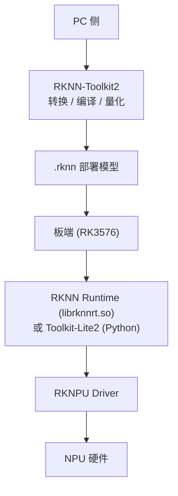
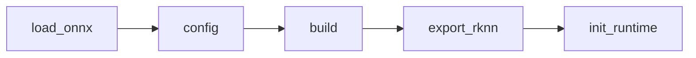

# 第 11 章 RKNN 与 Rockchip NPU

> **所属路线**：AI 学习路线 · 第三部分
> **本章定位**：把前面所有通用知识（Compiler、Kernel、量化、内存层级）落到 Rockchip 的 Vendor NPU 上，理解 RKNN 生态、`.rknn` 转换、量化、Tensor Layout、板端 Runtime
> **核心仓库**：[RKNN-Toolkit2](https://github.com/airockchip/rknn-toolkit2) · [RKNN Model Zoo](https://github.com/airockchip/rknn_model_zoo)
> **前置要求**：已理解第 3 章 ONNX、第 9 章 AI Compiler、第 10 章 GPU Kernel/量化
> **学习边界**：本章聚焦视觉/CNN 类模型的 RKNN 部署；LLM 的 RKLLM 单独在第 12 章
> **资料检查日期**：2026-08-25

---

## 本章导读

前面学的都是「通用」技术，现在落到小谢真正要用的 **RK3576 NPU** 上。这一章最核心的问题：

> **一个 PyTorch/ONNX 模型，经过 RKNN-Toolkit2 变成 `.rknn` 文件，最终在 RK3576 的 NPU 上跑起来，中间发生了什么？**

RKNN 生态里有一堆长得像、容易混的名词（RKNN / `.rknn` / Toolkit2 / Toolkit-Lite2 / Runtime / Driver / RKLLM），先把它们彻底分开，后面才不会晕。学完本章，你应该能回答：

1. RKNN、`.rknn`、RKNN-Toolkit2、Toolkit-Lite2、RKNN Runtime、RKNPU Driver、RKLLM 七者分别是什么？
2. `.rknn` 和 `.onnx` 有什么本质区别？
3. `rknn.build()` 为什么可以理解成「Vendor Compiler Driver」？
4. 为什么 NPU 喜欢 INT8？Affine Quantization 的 Zero Point 是什么？
5. NCHW / NHWC / NC1HWC2 三种 Layout 有什么区别？为什么会有 Blocked Layout？
6. Zero Copy 是什么？为什么它比 `rknn_inputs_set` 更值得做工程优化？
7. NPU 为什么快？它的本质是什么？
8. 为什么「CPU 能跑」不代表「NPU 能跑」？Unsupported Op 意味着什么？
9. 为什么学懂 TVM 和 GPU Kernel 后，看 RKNN 会清晰很多？

**学习方法**：牢牢抓住「**Vendor AI Compiler + Runtime 生态**」这个定位，把 RKNN 的每一步映射回前面章节学过的通用概念（Target-aware Compilation、Tensorization、Layout Transform、Zero Copy）。

---

## 1. 先分清 7 个概念

| 概念 | 是什么 |
|---|---|
| **RKNN** | Rockchip NPU 的**软件栈总称**（工具链 + 运行时 + 模型格式的统称） |
| **`.rknn`** | 编译后的**部署模型文件**（二进制，含权重 + 编译好的图） |
| **RKNN-Toolkit2** | PC 端的**转换/编译工具链**（Python），负责 ONNX→`.rknn` |
| **RKNN-Toolkit-Lite2** | **板端**的轻量 Python 推理接口（给 RK3576 上跑） |
| **RKNN Runtime** | 板端的 C/C++ 运行库（`librknnrt.so`） |
| **RKNPU Driver** | 内核驱动，Runtime 通过它调度 NPU 硬件 |
| **RKLLM / RKNN-LLM** | 专门做 **LLM** 的工具链（第 12 章） |

### 一张总关系图



> ⚠️ **`.rknn` 为什么和 `.onnx` 不一样？** `.onnx` 是开放的、框架无关的计算图格式；`.rknn` 是**针对特定 NPU 编译好的部署产物**——已经做过图优化、量化、Layout 转换，甚至可能是加密的二进制。**不要过度猜测 `.rknn` 内部格式**，把它当成「编译好的黑盒产物」即可。

---

## 2. 三条 RK3576 路线（别混起来）

```text
路线 1（视觉/CNN）:  PyTorch → ONNX → RKNN-Toolkit2 → .rknn → RKNN Runtime → NPU
路线 2（LLM）:      HF → RKLLM Toolchain → .rkllm → RKLLM Runtime → NPU
路线 3（CPU 基线）:  GGUF → llama.cpp → ARM CPU
```

> 三条线解决不同问题，工具链、格式、Runtime 都不同，**千万不要混**。

---

## 3. RKNN 完整 Workflow 与五个核心 API



| API | 作用 |
|---|---|
| `RKNN(verbose=True)` | 创建 RKNN 对象 |
| `rknn.config()` | 配置 `target_platform`、量化、预处理 |
| `load_onnx()` | 加载模型 |
| `rknn.build()` | **编译**（Vendor Compiler Driver） |
| `export_rknn()` | 导出 `.rknn` |
| `rknn.init_runtime()` | 初始化运行时 |

> 💡 **`rknn.build()` ≈ Vendor Compiler Driver**：它内部做的是图优化、量化、Layout 转换、映射 NPU——和 TVM 的 `compile()` 是同一类事，只是 Rockchip 专用。

### 3.1 target_platform：Target-aware 编译再现

`config(target_platform='rk3576')` 就是第 9 章说的「Target 决定 CodeGen/Schedule」的落地——不同 NPU 架构编译出不同的结果。

### 3.2 预处理契约（重要！）

`config(mean_values=..., std_values=...)` 把归一化**编译进模型**。这意味着：

> ⚠️ **转换前必须建立 Preprocess Contract**：训练时的 Resize/RGB-BGR/Normalize/Layout 必须和部署时完全一致，否则权重对了、预处理错了，输出照样全错（这是第 3 章「部署六道坎」的第一道）。

---

## 4. 三阶段正确性验证

不要「PyTorch → RKNN 后只看最终结果」，要分三层验证：

```text
Level 1: PyTorch 输出（基线）
Level 2: ONNX 输出（验证导出正确）
Level 3: RKNN FP 输出（验证转换正确）
Level 4: RKNN INT8 输出（验证量化）
```

> 每层都用**同一个输入**，比较 `np.max(abs(a-b))`。错了就停在这层，**不要跨层猜**——这是 RKNN 排错最有效的方法。

---

## 5. Quantization：为什么 NPU 喜欢 INT8

### 5.1 为什么

NPU 的 MAC 阵列对低精度整数有更高的吞吐、更低的功耗、更省内存（第 10 章 Tensor Core 同理）。

### 5.2 两个量化对象

```text
Weight Quantization（权重量化）
Activation Quantization（激活量化，需要 Calibration 校准）
```

### 5.3 PTQ 与 Calibration

`do_quantization=True` + `dataset.txt`（校准数据集）做的是 **PTQ（训练后量化）**。校准数据**非常关键**——它决定激活值的量化范围。校准集应该**代表真实部署数据的分布**，不要用几条不相关的样本敷衍。

### 5.4 Affine Quantization 与 Zero Point

```text
real ≈ scale × (quantized - zero_point)
```

**Zero Point** 存在的原因：激活值分布往往不对称（如 ReLU 后全是非负），用一个零点把整数区间对齐到真实值区间，能更好利用精度。

### 5.5 Per-tensor vs Per-channel

- Per-tensor：整个 Tensor 共用一个 scale（简单，但精度损失大）；
- Per-channel：每个通道一个 scale（精度更好，通常优先）。

### 5.6 Hybrid Quant 与 W4A16

- **Hybrid Quant**：不同层用不同精度（敏感层 INT8，不敏感层 INT8，极端层保持 FP16）——混合精度的本质；
- **W4A16**：权重 4-bit、激活 16-bit，是权重 4-bit 的典型方案。

> ⚠️ **三种「4-bit」必须分开**：llama.cpp 的 `Q4_K_M`、MLC 的 `q4f16_1`、RKNN 的 W4A16——是三个不同生态的量化方案，不互通。

### 5.7 Accuracy Analysis

量化后要做 **Layer-wise 对比**（用 Cosine Similarity 等），因为「能 build」≠「精度没掉」。但 **Cosine 高不代表任务精度一定高**，最终要看任务指标（mAP/准确率）。

---

## 6. Tensor Layout：NCHW / NHWC / NC1HWC2

| Layout | 含义 |
|---|---|
| NCHW | 通道优先，PyTorch 常用 |
| NHWC | 通道在后，TensorFlow/NPU 常见 |
| **NC1HWC2** | **Blocked Layout**，把通道按固定块（如 C2）重排 |

> **为什么会有 Blocked Layout？** 为了让 NPU 的向量单元/内存访问更高效（对齐、连续）——这和 GPU 的 Memory Coalescing 是**同一个基本原理**。**Layout Transform 有代价**，所以优化不只是减少 Operator FLOPs，还要减少 Layout 转换。

> 每次加载模型都打印 `rknn_tensor_attr`：看每个 Tensor 的 dtype、layout、shape、stride。**`size` 和 `size_with_stride` 不同**——硬件喜欢对齐（Alignment），实际占用内存往往比逻辑 size 大。

---

## 7. Zero Copy 与 RGA

### 7.1 Copy 的问题

`rknn_inputs_set` 会做一次「用户 buffer → NPU 内部 buffer」的拷贝，高频调用时是额外开销。

### 7.2 Zero Copy 思想

用 `rknn_create_mem` 预先分配 NPU 可访问的内存，`rknn_set_io_mem` 直接引用，避免反复拷贝。

> ⚠️ **Zero Copy 不代表「完全没有任何数据搬运」**——它省的是「应用层 ↔ Runtime」之间的多余拷贝，NPU 内部该搬的还在搬。但工程上能明显降低延迟。

### 7.3 异构 Pipeline

`Camera → RGA（硬件图像处理）→ NPU` 这条链才是端侧最优：**不要用 CPU/OpenCV 做预处理**，让 RGA 硬件干这件事，CPU 解放出来。`rknn_create_mem_from_fd` 可以把 RGA 的输出 fd 直接喂给 NPU——这就是嵌入式异构 Pipeline 的正确思维。

---

## 8. NPU 为什么快

| 特性 | 作用 |
|---|---|
| 大量 MAC | 专用乘加阵列，一次算一堆 |
| Low Precision | INT8/INT4 吞吐高、功耗低 |
| On-chip Memory | 片上 SRAM，减少 DDR 访问（= GPU Shared Memory 同理） |
| DMA | 专用搬运单元，与计算重叠 |

> **所以 NPU 性能高度依赖 Compiler**：怎么把数据 Tile 进 SRAM、怎么复用、怎么喂矩阵单元，都是 Compiler 决定的。**同一个模型，换一版 Toolkit 可能更快**——这就是 Compiler 版本的重要性（Toolkit / Runtime / Driver 版本三角必须匹配）。

---

## 9. Graph Fusion 与 Model Surgery

### 9.1 为什么需要 Fusion

NPU 上算子间写回 DDR 很贵，融合相邻算子能减少中间搬运（和 GPU Kernel Fusion 同理）。Transformer 里的融合（如 QKV 合并、LayerNorm+MatMul 融合）尤其重要。

### 9.2 Model Surgery（模型改造）

为了让模型适配 NPU，常需要改 Graph：ONNX Simplification、算子替换、Layout 调整。**「改模型 Graph 以适配 NPU」是 Vendor 部署的常态**。

### 9.3 Unsupported Op 与 CPU Fallback

> ⚠️ **「CPU 能跑」不代表「NPU 能跑」**。NPU 算子集固定，不支持的算子要么 Custom Op（跑 CPU/GPU），要么 Fallback——**Fallback 很危险**：NPU↔CPU 频繁拷贝会严重拖慢整体。**Operator Coverage 是 NPU 生态的生命线**，不要靠「感觉」判断支持，查官方文档。

---

## 10. Dynamic Shape 与 Core Mask

- NPU 更喜欢静态 Shape（能提前做内存规划），但实际模型（检测、LLM）需要动态；
- **NPU 的动态 Shape 不是「无限动态」**，通常是一组预定义的 Shape 范围，比静态难、比完全动态受限制；
- RK3576 有多 NPU Core，`NPU_CORE_ALL` 可以用满所有核，但**多核不一定线性加速**——要实测，别假设。

---

## 11. 调试方法：6 级排错链

```text
Level 1: PyTorch      → 基线正确吗？
Level 2: ONNX         → 导出正确吗？（比对输出）
Level 3: RKNN FP      → 转换正确吗？
Level 4: RKNN INT8    → 量化正确吗？
Level 5: Simulator vs Board → 板端一致吗？
Level 6: Python vs C++ → Runtime 一致吗？
```

**常见错误清单**：

| 错误 | 表现 |
|---|---|
| 颜色顺序 RGB/BGR 反了 | 分类全错但结构对 |
| Input Range 错（0-255 vs 0-1） | 输出数值异常 |
| Normalize 重复（config 里归一次，代码又归一次） | 结果偏差 |
| Layout 错（NCHW vs NHWC） | 乱码/全错 |
| 量化输出没反量化 | 数值是 int 不是 float |
| Stride 忽略 | 图像错位 |
| Toolkit/Runtime 版本不匹配 | 加载失败 |

---

## 12. 性能优化顺序

```text
1. Correctness（先保证结果对）
2. Unsupported Op（消除 Fallback）
3. Layout Transform（减少转换）
4. Quantization（INT8 提速）
5. Zero Copy（最后做，因为收益靠后）
```

> **为什么 Zero Copy 靠后？** 因为如果前面有 Fallback 或 Layout 转换，Zero Copy 省的那点拷贝微不足道。**先消除大头，再抠细节**。

---

## 13. 与前面章节的映射

| RKNN 概念 | 通用概念 |
|---|---|
| `load_onnx` | Frontend |
| `build` | AI Compiler（Target-aware） |
| `.rknn` | 编译产物（类似部署 artifact） |
| `librknnrt.so` | Runtime |
| `RKNPU Driver` | 硬件驱动 |
| Tensorization 映射矩阵单元 | NPU MAC Array |
| Layout Transform | GPU Coalescing 同理 |

> ⚠️ **这不是说 RKNN 内部用了 TVM**——只是抽象层高度类似。RKNN 是 Rockchip 自己的 Vendor Compiler，学懂 TVM 让你「知道它在做什么」，而不是「以为它用了 TVM」。

### 关键区别：开放度

- **GPU Programmer 自己控制更多**（手写 Kernel/Schedule）；
- **NPU 更多由 Compiler 控制**（你只能改图、改量化、改 Layout，不能直接写 NPU 的「内层循环」）。

> 这就是 NPU 优化思维和 GPU 优化思维的本质区别：GPU 你可以往下挖，NPU 你更多是「喂对图 + 喂对量化 + 消除 Fallback」。

---

## 14. 一个 YOLO 完整部署链

```text
PyTorch YOLO → 导出 ONNX → ONNX 简化 → ONNX Runtime 验证
→ RKNN-Toolkit2 转换(FP16) → 板端验证 → INT8 PTQ → 精度分析 → 部署
```

> 💡 **为什么第一模型更建议 MobileNet 而不是 YOLO？** MobileNet 结构简单、单输出、没有复杂后处理，先把「转换→板端→量化」这条链跑通；YOLO 多了 Decode Box + NMS 后处理，容易把「模型问题」和「后处理问题」混在一起。

---

## 15. 本章实验

1. **MobileNet FP**：跑通 PyTorch → ONNX → RKNN(FP16) → 板端；
2. **MobileNet INT8**：加校准集做 PTQ，对比精度和速度；
3. **Calibration Set 对比**：用代表性数据 vs 随意数据，看精度差异；
4. **Hybrid Quant**：敏感层 FP16，其余 INT8；
5. **Zero Copy**：对比 `rknn_inputs_set` vs `set_io_mem` 的延迟；
6. **Layer Performance**：用 `perf_debug` 找最慢的层；
7. **Core Mask**：单核 vs 全核，实测加速比；
8. **YOLO**：跑完整检测链，重点处理 NMS 后处理。

> 更多实验（RGA 预处理、Memory 分析、Dynamic Shape、Toolkit 版本对比）见「学习资源」Stage 表。

---

## 16. 常见误区速查

| # | 误区 | 正确认识 |
|---|---|---|
| 1 | `.rknn` = 开放格式 | 是编译好的部署产物，别猜内部格式 |
| 2 | CPU 能跑 = NPU 能跑 | NPU 算子集固定，需查 Operator Coverage |
| 3 | 能 build = 精度没掉 | 必须做 Accuracy Analysis |
| 4 | NPU 利用率高 = 快 | 可能大量 Fallback/Layout 转换 |
| 5 | Zero Copy = 完全没有搬运 | 只是省应用↔Runtime 的拷贝 |
| 6 | 多 NPU Core 线性加速 | 要实测，别假设 |
| 7 | 量化一定无损 | PTQ 有损，要验证 |
| 8 | 只报 NPU 时间 | 要报 End-to-End（含预处理） |
| 9 | W4A16 = Q4_K_M | 三个生态的 4-bit 不互通 |
| 10 | RKNN 内部用 TVM | 抽象类似，但那是 Rockchip 自己的 Compiler |

---

## 17. 本章小结

### 17.1 十二个核心思维模型

1. **RKNN = Rockchip NPU 的软件栈总称**；
2. **`.rknn` = 编译好的部署产物，不是开放图格式**；
3. **`build()` = Vendor Compiler Driver**；
4. **预处理必须进 Preprocess Contract**；
5. **三阶段验证（PyTorch→ONNX→RKNN）是最强排错链**；
6. **量化 = 省内存 + 低精度计算 + 需要校准**；
7. **Blocked Layout = 为 NPU 访存优化的 Layout**；
8. **Zero Copy = 消除应用↔Runtime 多余拷贝**；
9. **NPU 快 = MAC + Low Precision + SRAM + DMA**；
10. **NPU 性能高度依赖 Compiler**；
11. **Fallback 是性能杀手，Operator Coverage 是生命线**；
12. **GPU 自己控 Kernel，NPU 靠 Compiler 控 Kernel**。

### 17.2 术语表

| 术语 | 英文 | 一句话解释 |
|---|---|---|
| RKNN | RKNN | Rockchip NPU 软件栈总称 |
| `.rknn` | .rknn | 编译后的部署模型 |
| 工具链 | RKNN-Toolkit2 | PC 端转换/编译工具 |
| 板端接口 | Toolkit-Lite2 | 板端轻量 Python 推理 |
| 运行时 | RKNN Runtime | 板端 C/C++ 运行库 |
| 驱动 | RKNPU Driver | 调度 NPU 硬件的内核驱动 |
| 训练后量化 | PTQ | 用校准数据量化 |
| 校准 | Calibration | 确定激活值量化范围 |
| 仿射量化 | Affine Quantization | real ≈ scale×(q-zero_point) |
| 混合精度 | Hybrid Quant | 不同层用不同精度 |
| 分块布局 | Blocked Layout | 按固定块重排的 Layout |
| 零拷贝 | Zero Copy | 消除多余拷贝 |
| 算子覆盖 | Operator Coverage | NPU 支持的算子范围 |
| 回退 | Fallback | 不支持的算子落到 CPU |

### 17.3 自测清单

**生态**：[ ] 能分清 7 个概念并画关系图；[ ] 能画出三条 RK3576 路线

**Compiler**：[ ] 能解释 build() 是 Vendor Compiler；[ ] 能解释 target_platform、预处理契约

**量化**：[ ] 能解释 PTQ/Calibration/Affine/Zero Point/Per-channel/Hybrid/W4A16；[ ] 能解释三种 4-bit 的区别

**Tensor**：[ ] 能解释 NCHW/NHWC/NC1HWC2；[ ] 能解释 size vs size_with_stride

**Runtime**：[ ] 能解释 C API 生命周期（init/query/set/run/get/destroy）；[ ] 能解释 Zero Copy 与 RGA

**性能**：[ ] 能解释 NPU 为什么快；[ ] 能解释 Fallback 的危险；[ ] 能按优化顺序排优先级

**正确性**：[ ] 能走 6 级排错链；[ ] 能列举常见错误（颜色/range/normalize/layout/stride）

**不要求**：猜 `.rknn` 内部格式、写 Custom NPU Op、精通全部 MatMul API、精通动态 Shape 所有细节。

---

## 18. 学习资源与推荐顺序

### 18.1 核心仓库

| 资源 | 用途 |
|---|---|
| [RKNN-Toolkit2](https://github.com/airockchip/rknn-toolkit2) | 转换/编译工具链 |
| [RKNN Model Zoo](https://github.com/airockchip/rknn_model_zoo) | 官方模型示例（含 C++ 实现） |

### 18.2 推荐学习顺序（14 Stage）

```text
Stage 1 跑官方 example → Stage 2 自己转 ONNX → Stage 3 ONNX Runtime 验证
→ Stage 4 FP16 RKNN → Stage 5 板端验证 → Stage 6 INT8 PTQ → Stage 7 Accuracy
→ Stage 8 Hybrid Quant → Stage 9 C Runtime → Stage 10 Zero Copy → Stage 11 RGA
→ Stage 12 Benchmark → Stage 13 Dynamic Shape → Stage 14 Transformer Operator
```

> 源码阅读：**第一阶段不要读 Driver 源码或猜 `.rknn` 格式**，先读 Model Zoo 的 C++ 例子，理解 API 调用链。

---

## 19. 下一章预告

这一章解决了「视觉/CNN 模型上 NPU」。但 LLM 的动态 Decode Loop、KV Cache、RoPE，让普通 RKNN 这套「静态图 + 一次推理」的模型撑不住。所以 Rockchip 单独提供了 RKLLM：

> **RKLLM 和 RKNN 有什么本质区别？`.rkllm` 里装了什么？一个 Qwen 模型怎么在 RK3576 上跑起来？**

下一章见：

> **[12_RKLLM与端侧LLM部署](12_RKLLM与端侧LLM部署.md)**
