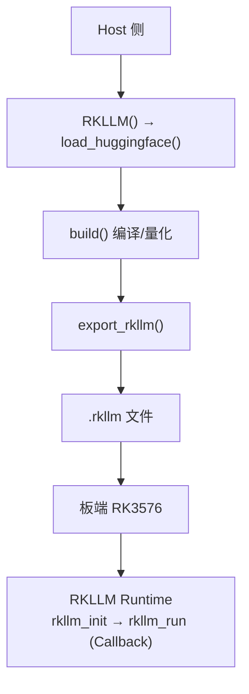

# 第 12 章 RKLLM 与端侧 LLM 部署

> **所属路线**：AI 学习路线 · 第三部分
> **本章定位**：把 LLM 部署到 Rockchip NPU 上，理解 RKLLM 工具链、`.rkllm` 转换、W4A16 量化、Runtime 生命周期，以及端侧 LLM 系统的分层优化
> **核心仓库**：[RKLLM](https://github.com/airockchip/rknn-llm)
> **前置要求**：已理解第 4 章 Transformer、第 5 章 Prefill/Decode/KV Cache、第 11 章 RKNN
> **学习边界**：本章聚焦 RKLLM（LLM 专用工具链）；普通视觉模型的 RKNN 已在第 11 章
> **资料检查日期**：2026-08-25

---

## 本章导读

第 11 章解决了「视觉/CNN 模型上 NPU」。但 LLM 不一样——它有动态 Decode Loop、KV Cache、RoPE、逐 Token 自回归，**不是「加载一次、跑一次、出一次结果」的静态图**。所以 Rockchip 单独提供了 RKLLM（RKNN-LLM）。

本章最核心的问题：

> **一个 Qwen 模型，怎么从 Hugging Face 变成 `.rkllm`，在 RK3576 的 NPU 上真正跑起来，并且能理解它的性能？**

学完本章，你应该能回答：

1. RKNN-LLM、RKLLM、`.rkllm` 分别是什么？`.rkllm` 和 `.rknn` 有什么本质区别？
2. 为什么 LLM 需要单独的 Artifact，而不是用普通 RKNN？
3. `load_huggingface()` → `build()` → `export_rkllm()` 这条 Host 链路在做什么？
4. W8A8 和 W4A16 有什么区别？为什么端侧 LLM 特别喜欢 W4A16？
5. RKLLM Runtime 为什么用 Callback？`keep_history` 和 KV Cache 是什么关系？
6. Prompt Cache 和 KV Cache 有什么区别？它能提升 Decode Tokens/s 吗？
7. 为什么 Decode TPS 会随 Context 增长而下降？为什么 W4A16 在 Decode 上特别占优？
8. 为什么「HF 能跑」不代表「RKLLM 一定能跑」？

**学习方法**：把第 5 章（Prefill/Decode/KV Cache/内存带宽）和第 11 章（Vendor Compiler）的知识直接套到 RKLLM 上。RKLLM 就是「Vendor LLM Runtime + 专用量化 + NPU 编译器」的组合。

---

## 1. 先固定 8 个概念

| 概念 | 是什么 |
|---|---|
| **RKNN-LLM** | Rockchip 的 LLM 工具链/Runtime 的**通用称呼** |
| **RKLLM** | 工具链 + Runtime 的具体产品名（仓库名 `rknn-llm`） |
| **`.rkllm`** | LLM 的部署模型文件 |
| **RKLLM Runtime** | 板端 LLM 运行库（`librkllmrt.so`） |
| **`.rknn`** | 视觉/CNN 的部署模型文件 |

### `.rkllm` 和 `.rknn` 为什么是两种 Artifact

> **普通 RKNN 是「一次推理」的静态图**；**LLM 是「有状态的、循环的解码过程」**——需要管理 KV Cache、序列、位置、停止条件。所以 LLM 的部署产物和 Runtime 都是单独一套。

一个 Qwen-VL（多模态）软件栈最能说明问题：

```text
Vision Encoder → .rknn（静态视觉模型）
LLM Decoder    → .rkllm（有状态解码）
```

---

## 2. RKLLM 完整 Host → Board Workflow



### 2.1 Host 侧最小转换代码

```python
from rkllm.api import RKLLM

llm = RKLLM()
llm.load_huggingface(model="Qwen/Qwen2.5-0.5B-Instruct", device='cuda')
llm.build(do_quantization=True, quantized_dtype='w4a16', target_platform='rk3576', max_context_len=2048)
llm.export_rkllm("qwen2.5-0.5b-w4a16.rkllm")
```

- `device='cuda'`：指**转换时**用 GPU 做计算（不是部署到 GPU）；
- `dtype` 有两种别混淆：**权重存储 dtype**（w4a16 的 w4）和 **计算 dtype**（a16）；
- `build()` 是核心 Compiler 阶段——量化 + 图优化 + 映射 NPU；
- `max_context_len` 直接影响 KV Cache 内存。

### 2.2 版本变化要盯紧

LLM Runtime 演进极快（当前 v1.3.0 就有 long-context decode 优化、多 EOS、Thinking Mode 等变化）。**部署前必看 CHANGELOG**，不要照搬旧教程的参数。

---

## 3. Quantization：RKLLM 的核心

| 方案 | 含义 | 特点 |
|---|---|---|
| W8A8 | 权重 8-bit、激活 8-bit | 精度好，速度较快 |
| W4A16 | 权重 4-bit、激活 16-bit | **端侧 LLM 首选** |
| W4A16_g128 | W4A16 的 group_size=128 变体 | 精度/速度平衡 |

### 3.1 为什么端侧 LLM 特别喜欢 W4A16

第 5 章讲过：Decode 是 Memory-Bound，瓶颈是**读权重**。W4A16 让权重从 FP16 降到 4-bit：

```text
权重内存 ↓（能装进板子）+ 每 Token 搬的权重字节 ↓（Decode 提速）
```

> W4A16 可能**同时**解决「装得下」和「跑得快」两件事——这正是 RK3576 这类 DDR 带宽有限的 SoC 上的关键。

### 3.2 Group Quantization 与 Mixed

- **Group Quant（`grq`）**：按 group 分别量化，精度更高，但可能变慢（要处理更多 scale）；
- **Mixed Quantization**：不同层用不同精度。

> 端侧选型永远是「速度 vs 精度 vs 内存」的权衡，**量化不是一句「转 INT4」**。校准数据（`data_quant.json`）要贴合目标场景（做技术助手就用技术文本，别用无关文本）。

---

## 4. RKLLM Runtime 生命周期与 Callback

### 4.1 为什么 RKLLM 用 Callback

LLM 是流式逐 Token 输出，Runtime 用一个 **Callback** 把每个新 Token（或状态变化）回调给应用。最基本生命周期：

```text
rkllm_createDefaultParam → 填 model_path/context/sampling
→ rkllm_init → rkllm_run(input, callback) → 回调里拿 token → rkllm_destroy
```

### 4.2 RKLLMParam 关键字段

| 字段 | 作用 |
|---|---|
| `model_path` | `.rkllm` 路径 |
| `max_context_len` | 上下文长度（影响 KV 内存） |
| `max_new_tokens` | 最大生成数 |
| `temperature/top_k/top_p` | 采样参数 |
| `repeat_penalty` | 重复惩罚 |

> Sampling 主要跑在 **CPU** 上（NPU 算完 logits，CPU 采样），这是 RKLLM 架构的一个重要事实。

### 4.3 keep_history 与 KV Cache

- `keep_history=1`：保留历史 KV，实现多轮对话；
- `keep_history=0`：每轮重置；
- `rkllm_clear_kv_cache()`：手动清 KV（可保留 System Prompt 前缀）。

> **没有 KV Cache 会怎样？** 每轮都要重新 Prefill 完整历史，TTFT 暴涨。

---

## 5. RKLLMInput：四种输入类型

| 类型 | 用途 |
|---|---|
| Prompt Input | 普通文本 |
| Token Input | 直接喂 Token ID（跳过 Tokenizer） |
| Embedding Input | 直接喂 Embedding（多模态/自定义前端） |
| Multimodal Input | 图文混合（Qwen-VL） |

> Tokenizer 和 Embedding 通过 **Callback** 由应用提供——这体现了 Runtime 越来越模块化，把「分词」和「编码」的灵活性交给上层。

---

## 6. Prompt Cache 与 KV Cache

| 缓存 | 是什么 | 用途 |
|---|---|---|
| KV Cache | 当前会话的历史 K/V | 多轮对话 |
| Prompt Cache | **跨请求复用**固定前缀的 KV | 固定 System Prompt |

> Prompt Cache 类比 vLLM 的 Prefix Cache。**它能降低 TTFT（省掉重复 Prefill），但不会提升 Decode Tokens/s**——因为它省的是「重新算前缀」，不是「让矩阵算更快」。

> 最适合：设备助手这种「固定 System Prompt + 变化用户指令」的场景。

---

## 7. Prefill / Decode 的现实落地

### 7.1 两个阶段，两个指标

```text
Prefill → TTFT（首 Token 延迟）
Decode  → TPS（每秒 Token 数）
```

`RKLLMPerfStat` 能拿到 prefill 时间和 decode TPS，是很有价值的 API。

### 7.2 为什么 Decode TPS 随 Context 增长而下降

Context 越长，每步 Decode 要读的 KV 越多，Attention 部分越贵（第 5 章已讲）。

### 7.3 为什么 W4A16 在 Decode 特别占优

Decode 是 Memory-Bound，权重 4-bit 直接减少每 Token 的 DDR 流量——**这就是 Roofline 模型在 RK3576 上的现实落地**。

### 7.4 为什么「HF 能跑」不代表 RKLLM 能跑

模型支持取决于：Architecture 是否被 RKLLM 实现、Attention 结构是否支持、算子是否覆盖、量化是否可行。**Model Support 的真正含义是「这条链走通了」，不是「HF 权重加载成功」。**

---

## 8. 异步与产品化

| API | 价值 |
|---|---|
| `rkllm_run_async()` | 异步运行，不阻塞主线程 |
| `rkllm_abort()` | 中止生成（产品化必备：用户取消） |
| `rkllm_is_running()` | 查询状态 |
| LoRA Adapter | 运行时热加载 LoRA（多租户/多任务） |

> **不要在 Callback 里做重活**（会卡住生成循环），第一版 Callback 只收 token 打印，后面再扩展。

---

## 9. RKLLM vs 其他路线

### 9.1 vs 普通 RKNN（最核心区别）

> **普通 RKNN 是 Stateless（一次推理）**；**RKLLM 是 Stateful（有 KV Cache、序列、位置、历史）**。这就是 API 完全不同、量化生态也不同的根因。

### 9.2 vs llama.cpp

| | llama.cpp | RKLLM |
|---|---|---|
| 定位 | 开放通用 Runtime | Vendor NPU 专用 |
| 后端 | CPU/GPU 多平台 | RKNPU |
| 格式 | GGUF | `.rkllm` |
| 学习价值 | 通用 Runtime 原理 | Vendor NPU 部署 |

> 为什么两条都学？llama.cpp 学「通用 LLM Runtime 原理」+ 提供 CPU Baseline；RKLLM 学「Vendor NPU 部署」。**RK3576 上同时保留两个 Baseline 对比，是极有价值的项目。**

### 9.3 vs vLLM / MLC

- vLLM 是「GPU 服务器 Serving」，学习重点是调度，不是 RK3576 路线；
- MLC 与 RKLLM 共同点：**都是「Compiler 把模型编译到目标硬件」**——这就是 Compiler Mental Model 的复用。

---

## 10. 端侧 LLM 系统的分层优化

```text
Layer 1 Model    → 选对模型大小（0.8B/2B/4B 权衡）
Layer 2 Quant    → W4A16 vs W8A8 vs g128
Layer 3 Compiler → 版本、算子覆盖
Layer 4 Runtime  → Context、Sampling、异步
Layer 5 System   → 内存、DDR 带宽、冷启动
Layer 6 App      → Prompt、Token Economy、RAG/Agent 设计
```

> **很多「LLM 太慢」其实是 Layer 6 问题**：Prompt 太长、Context 管理差、反复重复计算。**端侧 Prompt 要更节制**——Token 是资源，每多一个 Token 都消耗带宽和延迟。

### Token Economy（令牌经济）

端侧 AI 的核心工程指标之一是「**每个任务消耗多少 Token / 时间**」。优化手段：Context Compression、精简 Tool Schema、固定 System Prompt + Prompt Cache。

---

## 11. Error Debug

| 现象 | 排查方向 |
|---|---|
| 转换失败 | 架构不支持 / 算子不支持 / 环境版本 |
| Board init failed | RKNPU Driver 版本、权限 |
| 能生成但乱码 | **Chat Template 错** / Tokenizer 不匹配 |
| 回答质量差 | 量化精度 / 校准数据 / 采样参数 |
| 多轮突然忘记 | keep_history / KV 被误清 |
| 越来越慢 | Context 增长 / 热节流 |
| 内存越来越高 | KV 没释放 / 历史无限增长 |
| 用户串 Context | Session 生命周期管理错误（**每个 Session 必须明确 Context 生命周期**） |

> 多模态 Debug 要分层：**Vision Encoder（`.rknn`）单独验证，LLM（`.rkllm`）单独验证**，别混在一起猜。

---

## 12. Qwen3.5-2B 推荐实验路线

```text
Step 1 跑官方预转换模型 → Step 2 验证 Runtime → Step 3 自转 W4A16
→ Step 4 比较官方/自转 → Step 5 W8A8 → Step 6 g128 → Step 7 Context Sweep
→ Step 8 Prompt Cache → Step 9 History → Step 10 Async/Abort → Step 11 Server
→ Step 12 Agent → Step 13 RAG → Step 14 Sustained Benchmark
```

> 官方 RK3576 Benchmark 里 0.8B / 2B / 4B 的 W4A16 数据非常适合做 Model Size Tradeoff，但**不要把某个 tokens/s 当固定性能**——要自己实测，且 Benchmark 要固定 Prompt、固定 `ignore_eos_token`、测稳态（热节流）。

---

## 13. 常见误区速查

| # | 误区 | 正确认识 |
|---|---|---|
| 1 | `.rkllm` 就是 `.rknn` | 一个是有状态 LLM，一个是静态视觉 |
| 2 | HF 能跑 = RKLLM 能跑 | 还取决于架构/算子/量化支持 |
| 3 | 只看 Token/s | 要拆 Prefill(TTFT) / Decode(TPS) |
| 4 | W4A16 一定精度差 | g128/混合量化可缓解，要验证 |
| 5 | Prompt Cache 提升 Decode 速度 | 只省 Prefill，不加速 Decode |
| 6 | Context 越大越好 | KV 内存涨、Decode 变慢 |
| 7 | 多轮忘记 = 模型差 | 可能是 keep_history/KV 被清 |
| 8 | Callback 里做重活 | 会卡住生成循环 |
| 9 | 只测一次就定性能 | 要测稳态，注意热节流 |
| 10 | Sampling 在 NPU 上 | 主要跑 CPU |

---

## 14. 本章小结

### 14.1 十五个核心思维模型

1. **RKLLM = Vendor LLM Runtime + 专用量化 + NPU 编译器**；
2. **`.rkllm` 是「有状态」的 LLM 部署产物**；
3. **W4A16 = 端侧 LLM 首选**（省内存 + 提速 Decode）；
4. **`build()` = Vendor Compiler 阶段**（量化 + 图优化 + 映射 NPU）；
5. **Runtime 用 Callback 做流式输出**；
6. **keep_history ↔ KV Cache**；
7. **Prompt Cache ≠ KV Cache**（跨请求 vs 当前会话）；
8. **Prefill → TTFT，Decode → TPS**；
9. **Decode TPS 随 Context 下降**；
10. **W4A16 在 Decode 占优 = Memory-Bound 的现实**；
11. **RKLLM Stateful vs RKNN Stateless**；
12. **Sampling 主要跑 CPU**；
13. **端侧 LLM 慢常是 App 层问题**；
14. **Token Economy 是端侧核心工程指标**；
15. **版本演进快，必看 CHANGELOG**。

### 14.2 术语表

| 术语 | 英文 | 一句话解释 |
|---|---|---|
| RKLLM | RKLLM | Rockchip LLM 工具链 + Runtime |
| `.rkllm` | .rkllm | LLM 部署模型 |
| W4A16 | W4A16 | 权重 4-bit、激活 16-bit 量化 |
| 组量化 | Group Quant | 按 group 分别量化 |
| 回调 | Callback | Runtime 流式输出回调 |
| 保留历史 | keep_history | 是否保留多轮 KV |
| 提示缓存 | Prompt Cache | 跨请求复用固定前缀 KV |
| 首 Token 延迟 | TTFT | Prefill 的体验指标 |
| 每秒 Token | TPS | Decode 速度 |
| 令牌经济 | Token Economy | 用 Token 当资源精打细算 |
| 有状态 | Stateful | 带 KV/序列/历史的运行时 |

### 14.3 自测清单

**生态**：[ ] 能分清 RKNN-LLM/RKLLM/.rkllm/.rknn；[ ] 能解释为什么需要两种 Artifact

**Compiler**：[ ] 能解释 load_huggingface/build/export 链；[ ] 能解释 build() 是编译阶段；[ ] 能解释 device 和 dtype 两种含义

**量化**：[ ] 能解释 W8A8/W4A16/g128/Group/Mixed；[ ] 能解释为什么 W4A16 适合端侧 Decode

**Runtime**：[ ] 能解释生命周期和 Callback；[ ] 能解释 RKLLMParam 关键字段；[ ] 能解释 keep_history/KV Cache/Prompt Cache 区别

**Input**：[ ] 能解释 Prompt/Token/Embedding/Multimodal 四种输入

**推理**：[ ] 能解释 Prefill/Decode 两阶段指标；[ ] 能解释 Decode TPS 随 Context 下降；[ ] 能解释「HF 能跑 ≠ RKLLM 能跑」

**系统**：[ ] 能按 6 层分层定位性能问题；[ ] 能解释 Token Economy；[ ] 能列举常见 Error 与排查方向

**不要求**：精通全部 v1.3.0 API、手写 NPU Kernel、精通多模态所有细节、精通多租户 LoRA。

---

## 15. 学习资源与推荐顺序

### 15.1 核心仓库

- [RKLLM 主仓库](https://github.com/airockchip/rknn-llm)

### 15.2 源码阅读顺序

```text
README → CHANGELOG → Export Example → API Demo → C++ Demo → Header → Server Demo → Multimodal → Benchmark
```

> 先读 README 和 CHANGELOG 了解现状，再读 Export（Host 转换）和 API Demo（Runtime 生命周期），最后看 Server 和 Benchmark。

---

## 16. 下一章预告

到这里，RKLLM 的每个环节都清楚了。但「会转、会跑」还不够——真正的工程是：工作区怎么设计、版本怎么管理、Host/VM/板端怎么分工、怎么把 Qwen3.5-2B 的部署变成一个可复现的工程。

下一章把前面所有知识整合成一次完整实践：

> **[13_RK3576端侧AI实践](13_RK3576端侧AI实践.md)**
