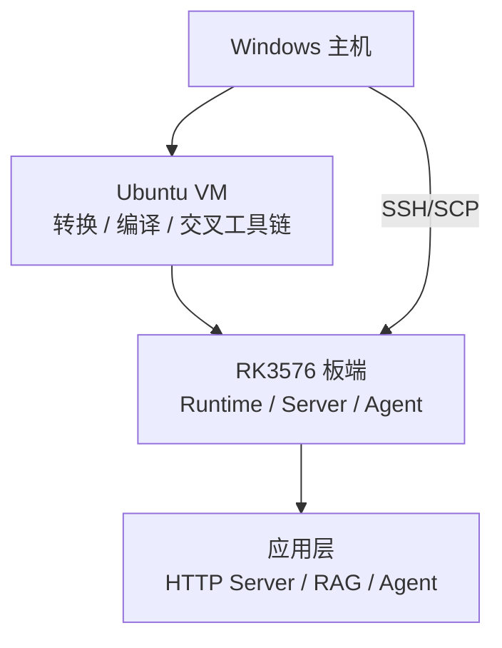
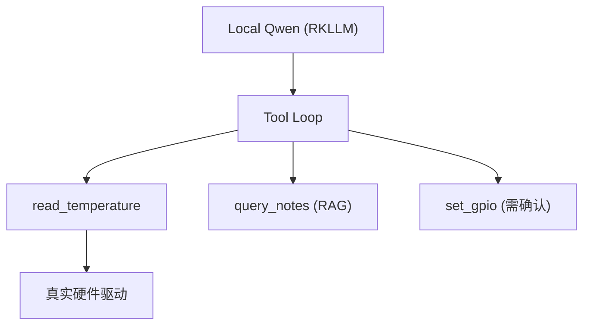

# 第 13 章 RK3576 端侧 AI 实践

> **所属路线**：AI 学习路线 · 第三部分
> **本章定位**：不再扩展理论，把前面 12 章的知识整合成一个可复现、可写进简历的完整工程——Qwen3.5-2B 在 RK3576 上的端侧部署
> **前置要求**：已完成第 11、12 章（RKNN / RKLLM）
> **资料检查日期**：2026-08-25

---

## 本章导读

前面每一章都在回答「这是什么、为什么这样」。这一章回答「**怎么做成一个真正的工程**」——工作区怎么设计、版本怎么管、Host/VM/板端怎么分工、怎么 Benchmark、怎么搭 RAG/Agent、怎么把成果写进简历。

最终项目总图：



> **一句话**：Windows 负责「管理和代码」，Ubuntu VM 负责「转换和编译」，RK3576 负责「真正推理」。

---

## 1. 为什么选 Qwen3.5-2B

- 2B 是「端侧能力与内存/带宽」的最佳平衡点：比 0.8B 明显更强，比 4B 明显更省；
- 官方有成熟的 RK3576 Benchmark（W4A16 / W4A16_g128 / W8A8 三组数据），适合做 Model Size Tradeoff；
- 是「多模态 Qwen-VL」的同一家族，后续可平滑扩展 Vision + LLM。

> ⚠️ 官方数据**只当 Baseline**，不当你自己的性能——你板子的固件、固频、量化、驱动都可能不同，必须自己实测。

---

## 2. 完整工作区设计

### 2.1 三端分工

| 端 | 职责 |
|---|---|
| Windows | 代码管理、写脚本、SSH 操作 |
| Ubuntu VM | 模型转换、编译、交叉工具链 |
| RK3576 | Runtime、Server、真正的推理 |

> ⚠️ **不要直接在 Windows NTFS 共享文件夹里做所有 Linux 编译**（性能差、权限/符号链接问题），在 VM 的 Linux 原生目录里编译。

### 2.2 推荐仓库结构

```text
rk3576-edge-ai/
├── models/          # .rkllm / .rknn 模型
├── conversion/      # Host 转换脚本
├── runtime/         # C++ Runtime 封装
├── server/          # HTTP Server
├── rag/             # RAG 相关
├── agent/           # Agent 工具
├── benchmark/       # benchmark 脚本 + 结果
├── docs/            # version_matrix / model_info
└── README.md
```

---

## 3. 版本管理：version_matrix.md

这是端侧工程最重要的习惯之一。记录：

```text
- RKLLM Toolkit 版本
- RKLLM Runtime 版本（librkllmrt.so）
- RKNPU Driver 版本
- 板端固件 / 内核版本
- Python 环境名（含版本，如 rkllm-1.3.0-py311）
- 转换脚本的 Git Commit
```

> 为什么 Git Commit 也要记录？因为「同一个模型、同一条命令，换一个 Toolkit 版本结果可能不同」。**Clone 官方仓库后马上记录当前 Commit，不要长期直接追 main**（main 在快速演进，容易踩 API 变化）。

---

## 4. 先跑官方模型，再自己转

> **正确路线**：先跑官方预转换模型 + 官方 C++ Demo，确认板子、Driver、Runtime 都正常，再自己转换。

原因：如果一开始就自己转，出错时分不清是「转换问题」还是「板子环境问题」。先把「板子能跑」这个前提钉死。

板端第一件事：查系统信息（CPU/内存/存储/SoC Device Tree/RKNPU Device），**Runtime 日志是最可靠的信息源之一**，不要硬编码某个 sysfs 路径。

---

## 5. 正确的 Benchmark 方法

### 5.1 三个 Phase

```text
Phase 1: Cold Start   → 冷启动（模型加载耗时）
Phase 2: Warm Runtime → 热运行时（稳态指标）
Phase 3: Sustained    → 持续运行（观察热节流）
```

### 5.2 两个 Sweep

```text
Prompt Length Sweep  → 看 TTFT 随 Prompt 变化
Output Length Sweep  → 看 TPS 随输出长度变化
```

> 两个 Sweep 都要做，因为它们分别暴露 Prefill 和 Decode 的瓶颈。

### 5.3 Benchmark 时的固定项

- 关闭 Thinking（否则 Token 数不可控）；
- 采样用 **Greedy**（确定性，可复现）；
- 固定 `ignore_eos_token` 行为；
- 固频（固定 CPU/NPU 频率）只用于 Benchmark，**平时不要固频**；
- 同时记录 CPU 和 NPU 占用（Sampling 在 CPU 上）。

> ⚠️ 温度采集别踩坑：有些 sysfs 返回的是「毫摄氏度」或原始 ADC 值，**不要看到 65000 就写 65000°C**，先搞清单位。

---

## 6. 自己转换 Qwen3.5-2B

### 6.1 转换矩阵

| 方案 | 目标 |
|---|---|
| W4A16 | 端侧首选（省内存 + 提速 Decode） |
| W4A16_g128 | 精度/速度平衡 |
| W8A8 | 精度优先 |

> **不要只比文件大小**——要记 `benchmark.csv`：模型大小、RAM、TTFT、TPS、精度（固定问题集）。

### 6.2 关键提醒

- 初次转换**用官方 export script 改造**，别从零写；
- `num_npu_core` 建议**从 2 开始**（不一定是越多越快，要实测）；
- 把参数做成 **CLI**，方便批量和复现；
- Calibration Set 用 **50~200 条贴合应用场景**的文本（做技术助手就用技术文本），但**不要夸大 Calibration 的作用**——它影响激活量化，不是万能的。

### 6.3 转换资源规划

Host 转换会同时占 CPU + RAM + （可选）GPU。**Ubuntu VM 建议给足 RAM，但别把物理内存全吃完**。

---

## 7. C++ Runtime 封装

第一版目标：**能跑、能流式输出**，不要一开始就上高并发。

```cpp
class RKLLMEngine {
    // init / run(callback) / abort / destroy 的封装
};
```

> 为什么要封装？把 Runtime 的生命周期、Callback、错误处理收敛到一个类里，上层（Server/Agent）只面向这个接口。

> ⚠️ **不要在 Callback 里直接做 RAG 或重活**——Callback 在生成循环里，重活会卡住流式输出。第一版只把 token 推进一个线程安全的 Queue，让别的线程消费。

---

## 8. HTTP Server 与 OpenAI 兼容

- **第一阶段**：优先用官方 Server（官方 build 脚本已支持）；
- **第二阶段**：自己做 OpenAI-compatible API。

> 为什么 OpenAI 兼容有巨大工程价值？**上层（Agent/RAG/任何 OpenAI SDK）可以无感切换后端**——今天接 RKLLM，明天换 llama.cpp 或云端，业务代码一行不改。这叫 Backend 可切换。

---

## 9. Prompt Cache 与 History/Session

- **Prompt Cache**：固定 System Prompt，第一次 Prefill 后复用，显著降 TTFT（适合设备助手）；
- **History/Session**：每个 Session 存自己的历史，`keep_history` 控制多轮；**Session 切换时注意 Context 生命周期**——不允许不同用户串 Context（这是多租户的基本正确性）。

> **不要一开始做多用户高并发**。RK3576 是单板端侧，单模型 Runtime 通常只允许一条活动生成，先做好「单 Session 流式 + 正确性」，再谈并发。

---

## 10. RAG：Edge RAG

最小 RAG 第一步：

```text
Embedding 模型（可以在板端跑，也可以用更小的模型）→ 向量检索 → Top-K Chunk 塞进 Prompt
```

> **最好的实验材料是你自己的 01~13 章笔记**：因为你知道正确答案在哪，能人工评估检索质量。

Edge RAG 的最终架构：`LLM（.rkllm）+ Embedding（.rknn）+ 向量库`——**双工具链**（视觉 RKNN + LLM RKLLM）第一次真正合流。

> **RAG 最重要的优化**：每一个 Chunk 都是 Prompt Token，端侧每个 Token 都消耗带宽和延迟。所以 Edge RAG 要做 **Context Compression**——别把 Top-20 全塞进去，精挑 Top-K + 压缩。

---

## 11. Agent：Edge Agent

- **不要第一版就上 LangChain 全家桶**——先手写最小 Tool Loop（第 6 章已经做过）；
- 最小 Tool 集：`read_temperature` / `set_gpio`（先 **Mock GPIO**，再接真实硬件）；
- **Tool 层必须做权限边界**：推荐「只读工具自动、写/危险工具人工确认」，绝不推荐「LLM 直接 shell 任意命令」。



> 一个真实 Edge Agent（问「实验箱温度多少」→ 调 `read_temperature()` → 返回 31.8°C → 回答）比「聊天机器人」有价值得多——**这是 Edge AI 方向最好的 Portfolio Project**。

---

## 12. 同一块板的三条 Runtime 路线

| 路线 | 后端 | 价值 |
|---|---|---|
| A: llama.cpp | ARM CPU | 通用 Runtime 原理 + CPU Baseline |
| B: RKLLM | RKNPU | Vendor NPU 部署 |
| C: MLC/Vulkan | GPU | Compiler 驱动部署 |

> 最有价值的对比实验：**同一个 Qwen 小模型，跑 llama.cpp CPU vs RKLLM NPU**，记录 PP/TG/RAM/功耗/温度。这会让你真正理解「NPU 的价值」，而不是「6 TOPS 所以更强」。

---

## 13. 系统稳定性与错误处理

- **Memory Leak 测试**：每轮 Session 后看内存是否回落，如果每轮都涨，说明 KV 没释放；
- **错误处理**：所有 API 调用检查返回值，Server 收到 Runtime Error 要能优雅降级（返回错误而非崩溃）；
- **日志体系**：每个 Request 记录时间、Prompt 长度、TTFT、TPS、错误——否则线上出问题无法复盘。

---

## 14. 性能分析思路（5 连问）

```text
第一问：是 Prefill 慢还是 Decode 慢？
第二问：是 Memory-bound 还是 Compute-bound？
第三问：有没有 Fallback / Layout 转换？
第四问：量化对不对？精度够不够？
第五问：是模型问题还是 App 层（Prompt/Context）问题？
```

- TTFT 慢 → 查 Prompt 长度、Prompt Cache、Prefill 配置；
- Memory 高 → 查 max_context、KV 释放、量化；
- 启动慢 → 查模型大小、冷启动（Page Cache 命中后应快很多）。

---

## 15. 端侧 Prompt 优化

端侧 Prompt 要「节制」——Token 是资源：

```text
System Prompt → 精简，配合 Prompt Cache
Tool Schema    → 精简字段说明
RAG            → Context Compression
History        → 只保留必要轮次
Thinking       → Benchmark 关闭，产品按需
```

> 这整套思路就叫 **Token Economy**，是端侧 AI 的核心工程指标。

---

## 16. 项目阶段规划（Phase 0–10）

```text
Phase 0 环境     → VM + 板端环境 + version_matrix
Phase 1 官方RKLLM → 跑通官方 Demo，建立 Runtime Baseline
Phase 2 自己转换  → W4A16 转换成功
Phase 3 Benchmark → Cold/Warm/Sustained + Sweep
Phase 4 C++ Runtime → RKLLMEngine 封装
Phase 5 HTTP      → Server + OpenAI 兼容
Phase 6 Prompt Cache / History
Phase 7 RAG
Phase 8 Agent
Phase 9 RKNN      → 视觉模型辅助项目
Phase 10 Portfolio → README + 简历 + 面试
```

> **每个 Phase 都要有 Definition of Done**（明确验收标准），不要「跑起来了就算完成」。例如 Phase 1 Done = 「官方 Demo 在板端出字 + 记录了版本 + 记录了首轮 benchmark」。

---

## 17. 简历表达与面试准备

### 17.1 项目标题（更好的写法）

```text
❌ 「基于 RK3576 的 LLM 部署」          （太空泛）
✅ 「Qwen3.5-2B 在 RK3576 NPU 上的端到端部署与性能优化」
```

### 17.2 简历 Bullet 示例

```text
- 完成 Qwen3.5-2B 从 Hugging Face → RKLLM W4A16 量化的端到端转换，
  在 RK3576 NPU 上实现 X token/s Decode，内存峰值 Y MB
- 建立 Host(Windows)→VM(Ubuntu)→板端 三层工作区与 version_matrix 版本管理
- 通过 Prompt Cache 将设备助手的 TTFT 降低 X%；通过 Zero Copy 优化数据搬运
- 搭建 Edge RAG/Agent（Local Qwen + 本地向量库 + GPIO Tool），全离线运行
```

> 这种表达强的点在于：**有可量化结果 + 有系统设计 + 有优化动作**，不是「我跑了个 demo」。

### 17.3 面试可能问什么

面试官大概率会追问：W4A16 为什么提速 Decode？Prompt Cache 和 KV Cache 区别？为什么 Decode 是 Memory-bound？你做了哪些优化、效果多少？Fallback 是什么、怎么排查？——**这些正是前面 12 章的核心，你现在已经都能答了**。

---

## 18. 最终成果与完成标准

### 18.1 建议最终输出 5 个成果

1. 一份 **version_matrix + benchmark_matrix**（可复现）；
2. 一个 **RKLLM C++ Runtime 封装**（工程化代码）；
3. 一个 **OpenAI 兼容 HTTP Server**；
4. 一个 **Edge RAG / Agent Demo**（全离线）；
5. 一份 **README + 简历项目描述**。

### 18.2 最终技术栈图

```text
模型层      Qwen3.5-2B
推理层      Prefill / Decode / KV Cache
Runtime 层  RKLLM Runtime / llama.cpp
Compiler 层 RKLLM build / TVM
Kernel 层   NPU MAC / 量化 Kernel
硬件层      RK3576 (CPU + NPU + GPU + DDR)
Embedded    RGA / Zero Copy / DMA
应用层      Server / RAG / Agent
```

> **这才是一条完整的 Edge AI 技术栈**——而你已经从第 1 章的「机器学习是什么」一路走到了这里。

---

## 19. 学习资源与最终顺序

### 19.1 官方核心链接

- [RKNN-LLM](https://github.com/airockchip/rknn-llm)（RKLLM 主仓库）
- [RKNN-Toolkit2](https://github.com/airockchip/rknn-toolkit2)
- [RKNN Model Zoo](https://github.com/airockchip/rknn_model_zoo)

### 19.2 最重要的顺序关系

1. **先跑官方，再自己转**（钉死板子能跑的前提）；
2. **先 Functional Build，再 Performance Build**（先对，再快）；
3. **先单 Session，再多用户**（先正确，再并发）；
4. **先 C++ 封装，再 Server/Agent**（先夯实 Runtime 层）。

---

## 20. 最终一句话总结

> 从「AI 是什么」到「Qwen3.5-2B 在 RK3576 NPU 上跑起来并优化」，你走完了一条完整的 **AI 基础 → Transformer → Runtime → Compiler → Kernel → 端侧部署** 的技术栈——这套能力，正是「嵌入式 + 边缘 AI」这个交叉方向最值钱的地方。

---

*全书（01–13 章）至此完成。*
