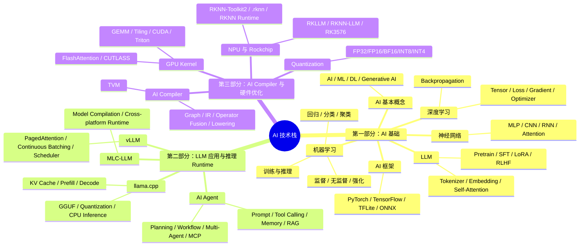
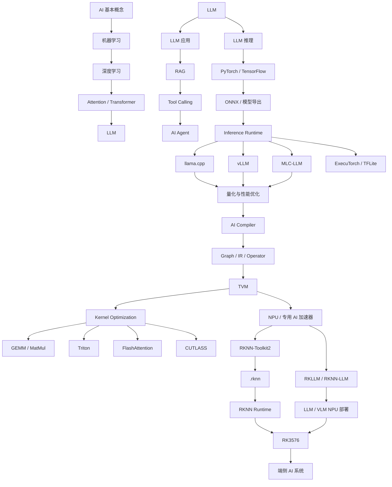

# AI 学习路线图：从基础理论到 Agent、推理框架与端侧硬件优化

> **版本**：v0.2（2026-08-25 重写）
> **定位**：个人 AI 技术栈总纲
> **目标**：建立从 **AI 基础 → LLM / Agent → 推理 Runtime → AI Compiler → GPU / NPU → 端侧部署** 的完整知识体系，最终形成面向嵌入式与端侧 AI 的工程能力
> **目标读者**：自己（传感器 / 嵌入式背景，向端侧 AI 工程师方向演进）
> **使用方法**：本图是"地图"，13 章笔记是"路书"。每开一章先回来看地图确认位置，学完一章回来打勾

---

## 0. 这份路线图要回答的核心问题

整套学习只围绕一个终极问题展开：

> **一个 Transformer / LLM，从 PyTorch 中的模型定义开始，究竟经历了什么，最终才变成 ARM CPU、GPU 或 Rockchip NPU 上执行的一条条计算指令？**

这个问题天然分成三层，对应三个学习阶段：

```text
第一层：模型是什么？为什么能训练？为什么能推理？   → 第一部分（01-04 章）
第二层：模型怎么用？怎么运行？Runtime 怎么管理？   → 第二部分（05-08 章）
第三层：模型为什么在硬件上跑得快或者慢？            → 第三部分（09-13 章）
```

三部分不是并列关系，而是逐层向下钻：

```text
第一部分解决“是什么”
        ↓
第二部分解决“怎么运行”
        ↓
第三部分解决“为什么快 / 慢”
        ↓
   Edge AI System
```

---

## 1. 全景学习树



---

## 2. 学习路线总图



---

## 3. 三大阶段 × 13 章详表

### 第一部分：AI 基础（01–04 章）

> **阶段目标**：不追求直接做复杂应用，先解决根本问题——AI 模型到底是什么，为什么能训练，为什么能推理。

| 章 | 文档 | 主题 | 核心概念 | 主仓库 |
|---|---|---|---|---|
| 01 | [01_AI基础与机器学习](01_AI基础与机器学习.md) | AI 与经典机器学习入门 | 符号 AI、特征/标签/模型/参数、训练与推理、回归/分类/聚类、过拟合与泛化、评估指标、ML 工作流 | [AI-For-Beginners](https://github.com/microsoft/AI-For-Beginners) · [ML-For-Beginners](https://github.com/microsoft/ML-For-Beginners) |
| 02 | [02_深度学习与神经网络](02_深度学习与神经网络.md) | 深度学习与神经网络 | 神经元、激活函数、MLP、Tensor、Batch/Epoch、反向传播、micrograd 拆黑盒 | [d2l-en](https://github.com/d2l-ai/d2l-en) · [micrograd](https://github.com/karpathy/micrograd) · [nn-zero-to-hero](https://github.com/karpathy/nn-zero-to-hero) |
| 03 | [03_Transformer与LLM](03_Transformer与LLM.md) | Transformer 与 LLM | Tokenizer（BPE）、Embedding、Self-Attention、Transformer Block、Pretrain/SFT/LoRA/RLHF、从零训练小模型 | [LLMs-from-scratch](https://github.com/rasbt/LLMs-from-scratch) · [minimind](https://github.com/jingyaogong/minimind) · [nanoGPT](https://github.com/karpathy/nanoGPT) · [minbpe](https://github.com/karpathy/minbpe) |
| 04 | [04_PyTorch与模型框架](04_PyTorch与模型框架.md) | PyTorch 与模型格式 | Tensor/Dtype/Device/Stride、autograd、训练循环、框架/格式/Runtime/Compiler 四分法、ONNX、LiteRT | [pytorch](https://github.com/pytorch/pytorch) · [onnx](https://github.com/onnx/onnx) · [onnxruntime](https://github.com/microsoft/onnxruntime) · [executorch](https://github.com/pytorch/executorch) |

**第一部分完成标准**：能从 Tensor、神经网络、Attention 一路解释到一个 LLM 如何完成 Next Token Prediction；能独立跑通 PyTorch 训练循环并导出 ONNX。

### 第二部分：LLM 应用与推理 Runtime（05–08 章）

> **阶段目标**：从"模型本身"转向"如何使用模型、如何让模型真正运行起来"。

| 章 | 文档 | 主题 | 核心概念 | 主仓库 |
|---|---|---|---|---|
| 05 | [05_AI_Agent与RAG](05_AI_Agent与RAG.md) | AI Agent 与 RAG | Agent Loop、Tool/Function Calling、Structured Output、Memory、RAG 链路、Workflow、Multi-Agent、MCP | [ai-agents-for-beginners](https://github.com/microsoft/ai-agents-for-beginners) · [agents-course](https://github.com/huggingface/agents-course) · [langgraph](https://github.com/langchain-ai/langgraph) · [MCP](https://github.com/modelcontextprotocol/modelcontextprotocol) |
| 06 | [06_LLM推理原理](06_LLM推理原理.md) | LLM 推理原理 | Chat Template、Prefill/Decode、KV Cache、Memory-Bound、Arithmetic Intensity、TTFT、Throughput、Sampling | [llama.cpp](https://github.com/ggml-org/llama.cpp) · [vllm](https://github.com/vllm-project/vllm) |
| 07 | [07_llama.cpp](07_llama.cpp.md) | llama.cpp 深入 | ggml/GGUF、convert_hf_to_gguf、llama-quantize、Q4_K_M、CPU Inference、GPU Offload、Backend | [llama.cpp](https://github.com/ggml-org/llama.cpp) · [ggml](https://github.com/ggml-org/ggml) |
| 08 | [08_vLLM与MLC-LLM](08_vLLM与MLC-LLM.md) | vLLM 与 MLC-LLM | Continuous Batching、PagedAttention、Scheduler、Serving vs 本地推理、MLC 编译跨平台部署 | [vllm](https://github.com/vllm-project/vllm) · [mlc-llm](https://github.com/mlc-ai/mlc-llm) |

**第二部分完成标准**：能解释一个 LLM 从模型文件加载 → Prefill → KV Cache → Decode → 生成 Token 的完整推理流程；能解释 Agent 如何通过 RAG、Memory、Tool Calling 把 LLM 变成能执行任务的系统。

### 第三部分：AI Compiler、Kernel 与端侧硬件（09–13 章）

> **阶段目标**：深入"AI 为什么能在具体硬件上高效运行"，从模型 → Graph → Compiler → Operator → Kernel → Hardware 一路打通。

| 章 | 文档 | 主题 | 核心概念 | 主仓库 |
|---|---|---|---|---|
| 09 | [09_AI_Compiler与TVM](09_AI_Compiler与TVM.md) | AI Compiler 与 TVM | Relax / TensorIR（tirx + s_tir）、IRModule、LegalizeOps、Schedule（split/tile/bind）、DLight、MetaSchedule、Target、CodeGen、BYOC | [tvm](https://github.com/apache/tvm) |
| 10 | [10_GPU_Kernel与FlashAttention](10_GPU_Kernel与FlashAttention.md) | GPU Kernel | Grid/Block/Warp/Thread、Shared Memory、GEMM Tiling、Memory Coalescing、FlashAttention、Triton、CUTLASS | [triton](https://github.com/triton-lang/triton) · [flash-attention](https://github.com/Dao-AILab/flash-attention) · [cutlass](https://github.com/NVIDIA/cutlass) |
| 11 | [11_RKNN与Rockchip_NPU](11_RKNN与Rockchip_NPU.md) | RKNN 与 Rockchip NPU | RKNN 七概念辨析、RKNN-Toolkit2 转换流程、量化、.rknn Artifact、RKNN Runtime、NPU Driver | [rknn-toolkit2](https://github.com/airockchip/rknn-toolkit2) · [rknn_model_zoo](https://github.com/airockchip/rknn_model_zoo) |
| 12 | [12_RKLLM与端侧LLM部署](12_RKLLM与端侧LLM部署.md) | RKLLM 与端侧 LLM | RKNN-LLM 工具链、.rkllm Artifact、W4A16/W8A8 量化、RKLLM Runtime、KV Cache、Prompt Cache、多模态 | [rknn-llm](https://github.com/airockchip/rknn-llm) |
| 13 | [13_RK3576端侧AI实践](13_RK3576端侧AI实践.md) | RK3576 端侧 AI 实践 | Qwen3.5-2B 部署、Host/VM/板端三段式工作区、version_matrix 版本管理、Functional/Performance 双构建、Benchmark | [rknn-toolkit2](https://github.com/airockchip/rknn-toolkit2) · [rknn-llm](https://github.com/airockchip/rknn-llm) · [rknn_model_zoo](https://github.com/airockchip/rknn_model_zoo) |

**第三部分完成标准**：不仅做到"模型可以跑"，而且能解释——为什么这样转换、为什么需要量化、为什么这个算子不支持、为什么 CPU 占用高、为什么 NPU 没跑满、为什么 Prefill/Decode 慢、为什么内存占用大。这才是端侧 AI 工程能力真正开始形成的地方。

---

## 4. 五层能力模型

整个路线最终形成五层能力，底层理论贯穿所有层：

```text
┌─────────────────────────────────┐
│  Layer 5：AI Application        │
│  Agent / RAG / Tool / Workflow  │
├─────────────────────────────────┤
│  Layer 4：LLM Runtime           │
│  llama.cpp / vLLM / MLC-LLM    │
├─────────────────────────────────┤
│  Layer 3：AI Compiler           │
│  Graph / IR / TVM / RKNN        │
├─────────────────────────────────┤
│  Layer 2：Operator / Kernel     │
│  GEMM / Triton / FlashAttention │
├─────────────────────────────────┤
│  Layer 1：Hardware              │
│  CPU / GPU / NPU / RK3576       │
└─────────────────────────────────┘

贯穿底座：Machine Learning + Deep Learning + Transformer + LLM
```

---

## 5. 全部核心仓库一览

以下汇总 13 章笔记中实际引用的全部 GitHub 仓库，按学习阶段排列。⭐ 数量代表在本路线中的优先级。

### 第一部分：AI 基础（01–04 章）

| 仓库 | 一句话定位 | 主要使用章节 | 优先级 |
|---|---|---|---|
| [microsoft/AI-For-Beginners](https://github.com/microsoft/AI-For-Beginners) | AI 总览课程（历史/符号AI/NN/CV/NLP/RL），有中文版 | 01 | ⭐⭐⭐⭐ |
| [microsoft/ML-For-Beginners](https://github.com/microsoft/ML-For-Beginners) | 经典机器学习 26 课（Scikit-learn），有中文版 | 01 | ⭐⭐⭐⭐⭐ |
| [d2l-ai/d2l-en](https://github.com/d2l-ai/d2l-en) | 《Dive into Deep Learning》教材代码 | 02、03 | ⭐⭐⭐⭐ |
| [karpathy/micrograd](https://github.com/karpathy/micrograd) | 100 行实现 autograd，拆反向传播黑盒的最佳材料 | 02 | ⭐⭐⭐⭐⭐ |
| [karpathy/nn-zero-to-hero](https://github.com/karpathy/nn-zero-to-hero) | Karpathy 神经网络系列课程 | 02、03 | ⭐⭐⭐⭐ |
| [rasbt/LLMs-from-scratch](https://github.com/rasbt/LLMs-from-scratch) | 从零实现一个小 GPT（配套同名书） | 03 | ⭐⭐⭐⭐⭐ |
| [jingyaogong/minimind](https://github.com/jingyaogong/minimind) | 从零训练小型 LLM 的完整中文项目 | 03 | ⭐⭐⭐⭐ |
| [karpathy/nanoGPT](https://github.com/karpathy/nanoGPT) | 极简但完整的 GPT 训练脚本 | 03 | ⭐⭐⭐ |
| [karpathy/minbpe](https://github.com/karpathy/minbpe) | 极简 BPE Tokenizer 实现 | 03 | ⭐⭐⭐ |
| [pytorch/pytorch](https://github.com/pytorch/pytorch) | 主训练框架 | 04 | ⭐⭐⭐⭐⭐ |
| [tensorflow/tensorflow](https://github.com/tensorflow/tensorflow) | 了解级（SavedModel / 模型转换生态） | 04 | ⭐⭐ |
| [keras-team/keras](https://github.com/keras-team/keras) | 高层 API 了解级 | 04 | ⭐⭐ |
| [onnx/onnx](https://github.com/onnx/onnx) | 部署中间格式标准 | 04、09、11 | ⭐⭐⭐⭐⭐ |
| [microsoft/onnxruntime](https://github.com/microsoft/onnxruntime) | 跨平台推理 Runtime（Execution Provider 机制） | 04、09 | ⭐⭐⭐⭐ |
| [google-ai-edge/LiteRT](https://github.com/google-ai-edge/LiteRT) | TFLite 的演进版本，端侧推理 | 04 | ⭐⭐⭐ |
| [google-ai-edge/litert-samples](https://github.com/google-ai-edge/litert-samples) | LiteRT 示例 | 04 | ⭐⭐ |
| [pytorch/executorch](https://github.com/pytorch/executorch) | PyTorch 官方端侧推理方案 | 04 | ⭐⭐⭐ |
| [lutzroeder/netron](https://github.com/lutzroeder/netron) | 模型可视化工具（看 ONNX/rknn 结构必备） | 04、11 | ⭐⭐⭐⭐ |

### 第二部分：LLM 应用与推理 Runtime（05–08 章）

| 仓库 | 一句话定位 | 主要使用章节 | 优先级 |
|---|---|---|---|
| [microsoft/ai-agents-for-beginners](https://github.com/microsoft/ai-agents-for-beginners) | 微软 Agent 入门课程 | 05 | ⭐⭐⭐⭐ |
| [huggingface/agents-course](https://github.com/huggingface/agents-course) | HF 官方 Agents 课程 | 05 | ⭐⭐⭐⭐ |
| [langchain-ai/langchain](https://github.com/langchain-ai/langchain) | LLM 应用框架（生态最大） | 05 | ⭐⭐⭐ |
| [langchain-ai/langgraph](https://github.com/langchain-ai/langgraph) | 基于图的状态机式 Agent 编排 | 05 | ⭐⭐⭐⭐ |
| [langchain-ai/docs](https://github.com/langchain-ai/docs) | LangChain 官方文档 | 05 | ⭐⭐ |
| [modelcontextprotocol/modelcontextprotocol](https://github.com/modelcontextprotocol/modelcontextprotocol) | MCP 协议规范 | 05 | ⭐⭐⭐⭐ |
| [modelcontextprotocol/python-sdk](https://github.com/modelcontextprotocol/python-sdk) | MCP Python SDK | 05 | ⭐⭐⭐ |
| [modelcontextprotocol/servers](https://github.com/modelcontextprotocol/servers) | MCP 官方参考 Server 集合 | 05 | ⭐⭐⭐ |
| [ggml-org/llama.cpp](https://github.com/ggml-org/llama.cpp) | C++ 实现的 LLM 推理引擎，本地/端侧部署事实标准 | 06、07 | ⭐⭐⭐⭐⭐ |
| [ggml-org/ggml](https://github.com/ggml-org/ggml) | llama.cpp 底层 Tensor 库 | 07 | ⭐⭐⭐⭐ |
| [vllm-project/vllm](https://github.com/vllm-project/vllm) | 高吞吐 LLM Serving 引擎（PagedAttention） | 06、08 | ⭐⭐⭐⭐ |
| [mlc-ai/mlc-llm](https://github.com/mlc-ai/mlc-llm) | 基于 TVM 的 LLM 编译部署栈，通向 Compiler 的桥梁 | 08 | ⭐⭐⭐⭐⭐ |

### 第三部分：AI Compiler、Kernel 与端侧硬件（09–13 章）

| 仓库 | 一句话定位 | 主要使用章节 | 优先级 |
|---|---|---|---|
| [apache/tvm](https://github.com/apache/tvm) | 开源 ML 编译框架（Relax + TensorIR），理解一切 AI Compiler 的共同语言 | 09 | ⭐⭐⭐⭐⭐ |
| [triton-lang/triton](https://github.com/triton-lang/triton) | Python 写 GPU Kernel 的语言/编译器 | 10 | ⭐⭐⭐⭐ |
| [Dao-AILab/flash-attention](https://github.com/Dao-AILab/flash-attention) | IO-aware Attention 实现，Kernel 优化教科书 | 10 | ⭐⭐⭐⭐⭐ |
| [NVIDIA/cutlass](https://github.com/NVIDIA/cutlass) | NVIDIA 官方 GEMM/Tensor Core 模板库 | 10 | ⭐⭐⭐ |
| [airockchip/rknn-toolkit2](https://github.com/airockchip/rknn-toolkit2) | Rockchip NPU 模型转换/量化工具链（Host 侧） | 11、13 | ⭐⭐⭐⭐⭐ |
| [airockchip/rknn-llm](https://github.com/airockchip/rknn-llm) | Rockchip 端侧 LLM 工具链与 Runtime | 12、13 | ⭐⭐⭐⭐⭐ |
| [airockchip/rknn_model_zoo](https://github.com/airockchip/rknn_model_zoo) | Rockchip 官方预转换模型库（验证转换流程用） | 11、13 | ⭐⭐⭐⭐ |

> 💡 除 GitHub 仓库外，各章还引用了 NVIDIA [CUDA Programming Guide](https://docs.nvidia.com/cuda/)、[NVIDIA LLM Inference Optimization](https://resources.nvidia.com/en-us-skilling-nvidia-inference-optimization)、HuggingFace [Transformers KV Cache 文档](https://huggingface.co/docs/transformers/main/en/llm_optims)、[TVM 官方文档](https://tvm.apache.org/docs/) 等非仓库资源，详见各章"核心参考链接"小节。

---

## 6. 当前学习主线

现阶段不追求所有方向同时深入，按顺序推进：

```text
AI 基础
  ↓
Deep Learning
  ↓
Transformer
  ↓
LLM
  ↓
Agent
  ↓
LLM Runtime
  ↓
Quantization
  ↓
AI Compiler
  ↓
Kernel
  ↓
GPU / NPU
  ↓
RK3576
```

即：

```text
第一阶段：先理解模型
        ↓
第二阶段：理解模型如何运行
        ↓
第三阶段：理解模型为什么能在硬件上高效运行
```

---

## 7. 学习原则

整个过程中遵守以下原则：

1. **先建立地图，再进入细节。**
2. **先理解原理，再学习框架 API。**
3. **不要把会调用 PyTorch / LangChain API 等同于理解 AI。**
4. **每学习一个抽象层，都继续追问下一层发生了什么。**
5. **模型 → Runtime → Compiler → Kernel → Hardware 是核心主线。**
6. **理论最终必须通过实际代码、模型和硬件验证。**
7. **端侧部署不以"成功运行模型"为终点，而以能够解释和优化整个推理链路为目标。**

---

## 8. 专题说明：量化不单独成章

原 v0.1 规划的《量化与模型格式》暂不单独成章，相关内容分布在：

| 量化主题 | 所在章节 |
|---|---|
| LLM 推理中的量化动机与精度格式 | 06（LLM 推理原理） |
| GGUF / Q4_K_M / llama-quantize 实操 | 07（llama.cpp） |
| Quantization Compiler（Scale/Zero Point/Dtype Propagation） | 09（AI Compiler 与 TVM） |
| RKNN 量化（Calibration / 量化失败定位） | 11（RKNN 与 Rockchip NPU） |
| RKLLM 量化（W4A16 / W8A8） | 12（RKLLM 与端侧 LLM） |

未来若量化需要系统化整理，再考虑提炼独立成章。

---

## 9. 文档清单与更新记录

### 当前文档清单

```text
01_AI基础与机器学习.md
02_深度学习与神经网络.md
03_Transformer与LLM.md
04_PyTorch与模型框架.md
05_AI_Agent与RAG.md
06_LLM推理原理.md
07_llama.cpp.md
08_vLLM与MLC-LLM.md
09_AI_Compiler与TVM.md
10_GPU_Kernel与FlashAttention.md
11_RKNN与Rockchip_NPU.md
12_RKLLM与端侧LLM部署.md
13_RK3576端侧AI实践.md
```

旧版本文件归档在同目录 `_archive/` 下。

### 更新记录

| 版本 | 日期 | 变化 |
|---|---|---|
| v0.1 | 2026-08-25 | 初版：三阶段学习树 + 31 节总纲 |
| v0.2 | 2026-08-25 | ① 合并原 09/10 两版《AI_Compiler与TVM》为一章（370 节）；② 章节重编号：GPU Kernel→10、RKNN→11、RKLLM→12、RK3576→13，17 处交叉引用同步修正；③ 量化不单独成章的说明；④ 01 章改写为教科书式教程（试点）；⑤ 新增"全部核心仓库一览"（30 个仓库，按阶段排列） |
