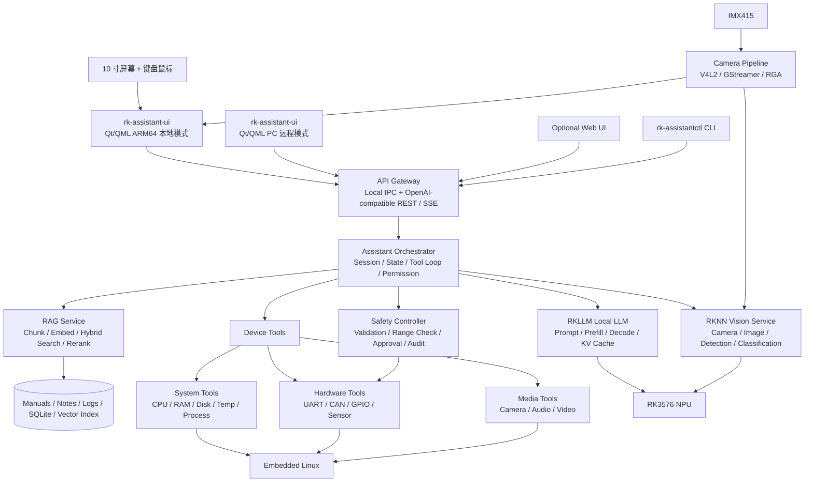

# RK3576 本地多模态设备助手：项目总纲与 Linux 系统学习路线

> **所属项目**：RK3576 本地多模态设备助手（独立项目）
> **关联路线**：从 AI 基础到端侧部署优化（01–13 提供模型、Runtime、Compiler 与 RK3576 部署知识）
> **项目定位**：以 RK3576 为端侧设备，构建一个能够离线对话、理解本地文档、读取设备状态、调用视觉模型并安全操作硬件的本地多模态助手
> **学习目标**：通过一个持续演进的真实项目，系统掌握嵌入式 Linux 应用开发、AI Runtime、多媒体、硬件接口、网络服务、性能优化与产品化部署
> **前置建议**：完成 01–05 的核心内容；06–13 可与本项目按阶段交叉学习
> **资料检查日期**：2026-08-25

---

## 0. 为什么选择这个项目

学习端侧 AI 最容易走向两个极端：

```text
只学模型：会训练、会导出，但不了解设备、服务和产品系统

只学板端命令：会运行官方 Demo，但不了解模型、Runtime 和性能瓶颈
```

本项目尝试把两条路线合并：

```text
AI 模型知识
    +
嵌入式 Linux 应用开发
    +
RKNN / RKLLM Runtime
    +
摄像头、音频、传感器和硬件接口
    +
网络服务、权限、安全和可维护性
    =
可以独立设计与交付的端侧 AI 系统
```

最终目标不是完成一个只能在终端里聊天的 Demo，而是实现一个接近真实产品的软件系统。

---

## 1. 最终作品定义

项目名称暂定为：

> **RK3576 Local Multimodal Device Assistant**

### 1.1 当前硬件基线

本项目不是基于一块假想开发板，而是基于当前已经具备完整人机交互条件的真实设备：

| 项目 | 当前配置 | 项目意义 |
|---|---|---|
| 主控 | RK3576 | ARM Linux + 6 TOPS NPU，承担系统、视觉和 LLM 推理 |
| 内存 | 4 GB | 是整个系统最主要的资源约束，需要严格控制模型、KV Cache、GUI 和 Camera Buffer |
| 存储 | 32 GB，当前剩余 10 GB 以上 | 足够第一版应用和少量部署模型，但必须控制日志、模型副本和缓存 |
| 系统 | Ubuntu Desktop | 便于直接使用屏幕和键鼠，但桌面环境也必须纳入内存预算 |
| 显示 | 10 寸屏幕 | 可以构建完整的板端本地图形界面，不必依赖外部 PC |
| 输入 | 键盘 + 鼠标 | 第一版可以先实现传统桌面交互，后续再根据屏幕能力适配触控 |
| 摄像头 | IMX415 | 支持实时预览、目标检测、状态识别和视觉问答实验 |
| 本地模型 | 已部署 Qwen3.5-2B 级模型 | 可直接作为第一版本地对话和 RKLLM 服务基线 |

实际模型文件、量化格式、Context Length、RKLLM Toolkit、Runtime 和 Driver 版本必须写入 `version_matrix.md`，不能只记录“Qwen3.5”。

4 GB 内存条件下的基本策略：

- 板端只保存和加载当前使用的模型，不同时常驻多个 LLM；
- Context 从 2K/4K 等可控范围开始实测，不盲目追求长上下文；
- Qt GUI、RKLLM、RKNN、Camera Buffer 和 RAG Index 必须放进同一张内存预算表；
- 模型转换、编译和大型缓存放在 Host PC，板端只保留部署 Artifact；
- IMX415 的高分辨率画面用于预览或录像，视觉推理走单独的低分辨率分支；
- 日志必须轮转，存储长期保留安全余量；
- ZRAM 只能提高系统抗压能力，不能替代真实 RAM，也不能提高模型推理速度。

它运行在 RK3576 Linux 设备上，具备以下能力：

1. 使用本地小语言模型完成离线多轮对话；
2. 使用本地 RAG 查询设备手册、技术文档和维护记录；
3. 读取 CPU、内存、磁盘、温度、NPU 等系统状态；
4. 读取并分析系统日志、应用日志和推理日志；
5. 调用 RKNN 视觉模型分析摄像头或本地图片；
6. 读取 UART、I²C、SPI、CAN、GPIO 或传感器数据；
7. 通过 Tool Calling 执行受控的设备操作；
8. 提供独立板端服务、OpenAI-compatible API、板端 Qt 界面、同源 PC Qt 客户端和可选 Web 管理页面；
9. 支持 systemd 自启动、日志管理、故障恢复和版本管理；
10. 能够输出可复现的精度、性能、内存、功耗和稳定性报告。

最终用户可以这样使用它：

```text
“当前设备温度和 NPU 使用率是多少？”
“过去 30 分钟日志里出现了哪些异常？”
“根据设备手册解释 RKLLM 初始化错误。”
“分析摄像头中的设备指示灯状态。”
“读取 CAN 总线上的最新故障码，并给出排查建议。”
“把风扇转速调整到 40%。”
```

最后一个操作必须经过确定性安全检查和权限控制，而不能由 LLM 直接控制硬件。

### 1.2 产品形态：板端 Qt 应用 + 核心服务 + PC 远程客户端

由于设备已经具备 10 寸屏幕、键盘、鼠标和摄像头，本项目应优先做成一台可以完全独立使用的 AI 终端，同时保留 PC 远程访问能力。推荐采用“核心服务与界面解耦、同一套 Qt 客户端支持本地和远程”的产品形态：

```text
RK3576 本地模式：Qt/QML Client → localhost → rk-assistantd
PC 远程模式：    Qt/QML Client → LAN → rk-assistantd
Browser 可选模式：轻量 Web UI → LAN → rk-assistantd
开发调试模式：    CLI → localhost / LAN → rk-assistantd
```

| 组件 | 暂定名称 | 运行位置 | 主要职责 |
|---|---|---|---|
| 板端核心 | `rk-assistantd` | RK3576 Linux | 模型推理、RAG、设备 Tool、权限、Session、状态、日志和 API |
| Qt 客户端 | `rk-assistant-ui` | RK3576 ARM64 + Windows/Linux PC | 本地或远程连接、聊天、摄像头、状态面板、知识库和模型管理 |
| Web UI（可选） | `RK Assistant Web` | 由板端提供或独立部署 | 手机/浏览器临时访问、轻量管理和应急维护 |
| CLI | `rk-assistantctl` | PC 或板端 | 自动化测试、诊断、Benchmark 和开发调试 |

其中，`rk-assistantd` 是产品核心，`rk-assistant-ui` 是主要人机界面。即使 Qt 界面退出，后台服务仍应继续完成推理、设备监控、告警和硬件任务。Qt 客户端不保存关键运行状态，也不直接操作 NPU、Camera Driver 和硬件，而是通过稳定 API 访问板端能力。

Qt 客户端至少应提供：

- 本地模式自动连接 `localhost`；
- PC 模式通过局域网发现并连接 RK3576；
- 首次启动向导和板端服务状态提示；
- 多轮聊天、流式输出和停止生成；
- 图片、文档和日志拖拽上传；
- IMX415 摄像头实时预览与视觉分析结果叠加；
- CPU、内存、温度、NPU、存储和服务状态仪表盘；
- 本地知识库的导入、重建和查询测试；
- 模型列表、当前模型、上下文和推理参数管理；
- Tool 调用过程展示与危险操作确认；
- 日志导出、诊断包生成和版本信息查看；
- 普通模式与开发者模式分离。

Qt/QML 是本项目的正式 UI 技术路线：

```text
Shared Qt/QML Client
├── ARM64 Build：运行在 RK3576 10 寸屏幕上，连接 localhost
├── Windows Build：运行在 PC，连接局域网中的 RK3576
└── Linux x86_64 Build：运行在 Linux PC，连接局域网中的 RK3576
```

选择 Qt/QML 而不是 Electron/Tauri 的主要原因：

- 4 GB RAM 下不能让 Chromium/WebView 长期挤占 RKLLM、KV Cache 和 Camera Buffer；
- Qt 更适合嵌入式 Linux、固定屏幕、键鼠、触控、Camera 和硬件状态界面；
- Qt/C++ 与本项目的 Linux、系统编程、CMake 和多媒体学习路线一致；
- 同一套 Qt/QML 代码可以构建板端版本和 PC 版本；
- QML 负责界面与交互，C++ 负责网络、模型状态、多媒体和系统能力，职责清晰。

已有 PyQt 使用经验可以作为过渡优势：第一版 UI 可以用 PyQt/PySide 快速验证信息架构和交互，但正式产品建议逐步迁移到 **Qt/QML + C++ Backend**。这样既能快速起步，也能降低长期运行时开销，并真正掌握 Qt 对象模型、信号槽、线程、Model/View、QML 与 C++ 绑定。

---

## 2. 系统总体架构



系统层次可以概括为：

```text
Layer 6  产品层：板端 Qt 界面、PC Qt 客户端、可选 Web UI、API
Layer 5  Agent 层：Tool Loop、RAG、State、Permission
Layer 4  AI Runtime：RKLLM、RKNN、Tokenizer、推理服务
Layer 3  Linux 应用：进程、线程、IPC、网络、多媒体、数据库
Layer 2  系统接口：V4L2、ALSA、Socket、GPIO、CAN、串口
Layer 1  BSP / Driver / Hardware：CPU、GPU、NPU、Camera、Sensor
```

学习顺序主要自上而下建立功能，再自下而上定位性能和系统问题。

---

## 3. 这个项目真正要学习的 Linux

本路线不以“掌握整个 Linux 内核源码”为目标。Linux 体量过大，真正合理的能力边界是：

```text
Linux 用户态应用开发：必须真正掌握
Linux 系统编程与性能分析：必须真正掌握
驱动 / Runtime / 设备树边界：必须能够理解和排错
复杂内核驱动开发：当前阶段选修
完整 Linux 内核源码研究：不作为本项目目标
```

建议投入比例：

| 方向 | 比例 | 目标 |
|---|---:|---|
| Linux 应用与系统开发 | 40% | 能构建稳定、可维护的板端服务 |
| AI 模型与 Runtime | 25% | 能转换、部署、验证和优化 RKNN/RKLLM |
| 多媒体与硬件接口 | 15% | 能接摄像头、音频、传感器和控制设备 |
| 性能、稳定性与产品化 | 15% | 能测量、定位问题并长期运行 |
| 内核边界知识 | 5% | 能区分应用、Runtime、Driver、Hardware 问题 |

---

## 4. 能力地图

### 4.1 Linux 基础与系统管理

必须掌握：

- Linux 文件系统、目录结构、挂载点；
- 用户、用户组、文件权限和最小权限；
- Shell、环境变量、管道和文本处理；
- 进程、线程、信号、Session、Daemon；
- systemd Service、启动顺序、自动重启；
- 日志：journal、应用日志、日志轮转；
- 软件包、动态库、运行路径和版本管理；
- 磁盘、内存、CPU、温度和进程监控；
- SSH、SCP、网络配置和远程维护。

### 4.2 C/C++ 与系统编程

必须掌握：

- C/C++ 编译、链接、静态库和动态库；
- CMake 与多目录工程；
- x86_64 与 AArch64 的区别；
- Host 编译、交叉编译和板端编译；
- 指针、内存、RAII、线程安全和错误处理；
- 文件描述符、Socket、共享内存、消息队列；
- `select` / `poll` / `epoll` 的基本思想；
- `mmap`、Buffer、数据复制和生命周期；
- C API 与 Python Binding 的边界。

### 4.3 网络与服务开发

必须掌握：

- TCP/IP、端口、监听和连接；
- HTTP、REST、JSON；
- SSE 流式 Token 输出；
- WebSocket 的使用场景；
- MQTT 在物联网和设备通信中的位置；
- 服务发现、超时、重试、限流和熔断；
- OpenAI-compatible API 的请求与响应结构；
- 鉴权、权限、TLS 和局域网安全边界。

### 4.4 Qt/QML 图形应用

必须掌握：

- Qt Object Model、Signal / Slot、Event Loop；
- Qt Widgets 与 Qt Quick/QML 的定位差异；
- QML Component、Property、Binding、Model/View；
- QML 与 C++ Backend 的绑定方式；
- Qt Network、REST Client 与 SSE 流式数据；
- Qt Multimedia、Camera Preview 和图像显示；
- Worker Thread 与 GUI Thread 的边界；
- ARM64 与 Windows/Linux PC 的多平台构建；
- 固定 10 寸屏幕的自适应布局、键鼠操作和可选触控；
- 本地模式、远程模式与统一 API Client。

已有 PyQt 经验时，优先复习 Signal/Slot、Model/View 和线程规则，再迁移到 QML 声明式界面与 C++ Backend，不必从 Qt 基础完全重学。

### 4.5 多媒体

重点学习：

- V4L2 摄像头采集；
- GStreamer Pipeline；
- FFmpeg 的封装、编解码和推流基础；
- ALSA 音频采集和播放；
- 图像格式、色彩空间、分辨率和帧率；
- NV12、RGB、BGR、NCHW、NHWC 等 Layout；
- 硬件编解码、零拷贝和 Buffer 传递；
- 摄像头 → 预处理 → RKNN → 后处理 → 显示/推流的完整链。

### 4.6 硬件接口

重点学习：

- UART / RS-485；
- I²C / SPI；
- GPIO / PWM；
- CAN / CAN FD；
- 传感器采样、校准和异常处理；
- 用户态 API 与 `/dev` 设备节点；
- 并发访问、超时和设备断线恢复；
- 读取操作与写入操作的权限分级。

### 4.7 AI Runtime

必须掌握：

- PyTorch → ONNX → RKNN 的视觉模型部署链；
- Hugging Face Model → RKLLM Toolkit → `.rkllm` 的 LLM 部署链；
- 模型、Tokenizer、Chat Template 和 Runtime 的版本匹配；
- W4A16、W8A8 等量化形式的基本意义；
- Prefill、Decode、KV Cache 和 Context Length；
- Runtime 内存、模型内存与峰值系统内存的区别；
- Operator Coverage、CPU Fallback 和数据搬运；
- RKNN 与 RKLLM 混合运行时的资源调度。

### 4.8 系统工程与产品化

必须掌握：

- 配置文件和版本矩阵；
- 服务拆分、进程隔离和健康检查；
- 看门狗、自动重启和故障降级；
- OTA / 应用更新的基本设计；
- 日志、Trace、Metric 和问题复现；
- 权限、Sandbox、审批和审计；
- 长时间稳定性测试；
- 可复现构建和部署文档。

---

## 5. 分阶段学习路线

## Phase 0：设备、环境和基线

### 学习内容

- 认识 RK3576 CPU、GPU、NPU、VPU、ISP、内存和外设；
- 区分 Host PC、构建环境和 RK3576 板端；
- 建立 SSH、文件传输、时间同步和软件安装能力；
- 记录 Board、OS、Kernel、Driver、Runtime、Toolkit 版本；
- 学会恢复系统和保留可工作的基线镜像。

### 项目任务

1. 板端启动并通过 SSH 登录；
2. 输出 CPU、内存、磁盘、网络、温度信息；
3. 编译并运行第一个 AArch64 C/C++ 程序；
4. 建立 `version_matrix.md`；
5. 保存一份“设备基线报告”。

### 验收标准

- [ ] 能说明 Host 与 Board 分别负责什么；
- [ ] 能识别一个二进制是 x86_64 还是 AArch64；
- [ ] 能解释 Toolkit、Runtime、Driver 为什么要匹配；
- [ ] 系统损坏时知道如何恢复，而不是害怕实验。

---

## Phase 1：Linux 日常使用与系统管理

### 学习内容

- 文件系统、权限、用户和进程；
- Shell、环境变量、重定向和管道；
- systemd、journal、服务生命周期；
- SSH、网络、磁盘与资源监控。

### 项目增量

实现 `device_monitor`：

```text
device_monitor
├── CPU 使用率
├── 内存使用量
├── 磁盘使用量
├── 系统温度
├── 网络状态
└── JSON 输出
```

将它注册为 systemd Service，支持启动、停止、重启和日志查询。

### 验收标准

- [ ] 程序能随系统启动；
- [ ] 崩溃后能按策略自动重启；
- [ ] 普通用户运行，不默认使用 root；
- [ ] 日志可查询、可轮转，不无限占用磁盘。

---

## Phase 2：C/C++、构建系统与系统编程

### 学习内容

- C/C++ 工程结构；
- CMake；
- 静态库、动态库和依赖；
- 文件、进程、线程、锁、Condition Variable；
- Socket、IPC、共享内存；
- 错误处理、资源释放和线程安全。

### 项目增量

把 `device_monitor` 拆成：

```text
Collector Thread → Shared State → API Thread → Client
```

支持多个采集器并行工作，由统一状态服务提供数据。

### 验收标准

- [ ] 可以在 Host 交叉编译后复制到 Board 运行；
- [ ] 能解释程序依赖哪些动态库；
- [ ] 多线程运行 24 小时无明显泄漏和死锁；
- [ ] 采集失败时返回结构化错误，不使整个程序退出。

---

## Phase 3：网络服务与 OpenAI-compatible API

### 学习内容

- HTTP Server、JSON、REST；
- SSE 流式响应；
- 超时、重试、连接断开和并发；
- API 鉴权与访问范围。

### 项目增量

实现基础服务：

```text
GET  /health
GET  /v1/device/status
GET  /v1/models
POST /v1/chat/completions
```

初期 `/v1/chat/completions` 可以使用 Mock Model，先把协议和流式链路跑通，再接 RKLLM。

### 验收标准

- [ ] PC 可以通过局域网访问板端 API；
- [ ] 支持非流式和 SSE 流式响应；
- [ ] 客户端断开不会使服务崩溃；
- [ ] API 有超时、请求大小和并发限制。

---

## Phase 4：Qt/QML 板端本地界面与 PC 客户端

### 学习内容

- 从已有 PyQt 经验迁移到 Qt/QML；
- Signal / Slot、Event Loop、Model/View；
- QML 布局、组件、状态和数据绑定；
- QML + C++ Backend；
- Qt Network、REST、SSE；
- Qt Multimedia 与 Camera Preview；
- GUI Thread 与 Worker Thread；
- ARM64、Windows 和 Linux 多平台构建。

### 项目增量

先用 Mock API 实现第一版 `rk-assistant-ui`：

```text
主窗口
├── 对话页：输入、流式输出、停止生成、历史记录
├── 视觉页：IMX415 预览、截图、识别结果
├── 设备页：CPU、RAM、NPU、温度、磁盘
├── 知识库页：文档导入、索引状态、检索测试
├── 工具页：Tool 记录、参数、结果、审批
└── 设置页：本地/远程模式、设备地址、模型参数、版本
```

构建两个运行模式：

```text
Local Mode：RK3576 ARM64 Build → localhost
Remote Mode：Windows/Linux PC Build → RK3576 LAN Address
```

第一版允许用 PyQt/PySide 快速验证布局和交互；API 和信息架构稳定后，逐步迁移到 Qt/QML + C++ Backend。不要把 RKLLM、RKNN 和硬件逻辑直接写进 GUI 进程。

### 验收标准

- [ ] Qt 客户端能显示 Mock Chat 的 SSE 流式输出；
- [ ] 同一套代码可构建 ARM64 本地版和至少一个 PC 版本；
- [ ] UI 卡顿任务已移出 GUI Thread；
- [ ] 板端界面在 10 寸屏幕上布局清晰，键鼠操作完整；
- [ ] UI 退出或崩溃不会终止 `rk-assistantd`；
- [ ] 本地模式与远程模式共用相同 API Client。

---

## Phase 5：RKNN 视觉模型

### 学习内容

- PyTorch → ONNX → RKNN；
- 图像预处理、Layout、Dtype；
- 模型转换、量化、精度验证；
- 摄像头或图片推理；
- 后处理与性能统计。

### 项目增量

实现 `vision_service`：

```text
Image / Camera
      ↓
Decode / Capture
      ↓
Resize / Normalize / Layout
      ↓
RKNN Runtime
      ↓
Postprocess
      ↓
Structured Result
```

第一版可选择分类或目标检测模型，不要一开始同时做多个视觉任务。

### 验收标准

- [ ] PyTorch、ONNX、RKNN 对同一输入的结果可比较；
- [ ] 能解释每一阶段的输入 Shape、Dtype 和 Layout；
- [ ] 有模型精度、延迟和内存报告；
- [ ] 能区分预处理、模型和后处理问题。

---

## Phase 6：RKLLM 本地语言模型

### 学习内容

- Tokenizer、Chat Template、Sampling；
- RKLLM Toolkit 和 RKLLM Runtime；
- `.rkllm` 模型转换与量化；
- Prefill、Decode、KV Cache；
- 流式 Token Callback；
- 模型、上下文和内存限制。

### 项目增量

接入本地 LLM：

```text
Client → /v1/chat/completions → Chat Template → RKLLM
       ← SSE Token Stream      ← Decode Callback
```

优先跑通官方支持的小模型。不要仅因为模型“能够加载”就认为完成部署，必须测量 TTFT、Decode Tokens/s、峰值内存和长上下文行为。

### 验收标准

- [ ] 支持多轮对话与清空 Session；
- [ ] Tokenizer 和 Chat Template 与模型匹配；
- [ ] 支持流式输出、停止和超时；
- [ ] 记录 TTFT、Prefill、Decode、Tokens/s、峰值内存；
- [ ] 能解释为什么 Context Length 会影响内存和延迟。

---

## Phase 7：RAG 本地知识库

### 学习内容

- 文档加载、清洗、Chunking；
- Embedding、BM25、Hybrid Search；
- Metadata、Reranker、Citation；
- 文档和索引版本管理；
- Retriever 与 Generator 分层评估。

### 项目增量

第一批知识库直接使用本路线的 01–13 文档，以及 RK3576、RKNN、RKLLM 使用手册：

```text
Markdown / PDF / Logs
      ↓
Parse / Chunk / Metadata
      ↓
Dense Index + BM25 Index
      ↓
Hybrid Retrieval / Rerank
      ↓
Context + Real Citation
      ↓
RKLLM Answer
```

### 验收标准

- [ ] 能回答“Prefill 和 Decode 有什么区别”并返回真实来源；
- [ ] 技术型号、函数名和错误码能够通过 BM25/Hybrid 找到；
- [ ] 引用来自 Retriever Metadata，不由 LLM 凭空生成；
- [ ] Answer 错误时能区分 Retrieval 问题和 Generation 问题。

---

## Phase 8：Tool Calling 与设备能力

### 学习内容

- Tool Schema、Structured Output；
- Tool Loop、State 和 Stop Condition；
- 只读、写入、危险操作的权限分级；
- 参数校验、超时、重试和幂等；
- Human Approval 与审计日志。

### 第一批 Tools

```text
只读：
get_device_status
get_cpu_temperature
get_npu_usage
read_system_log
list_processes
search_manual
capture_camera_frame
run_visual_detection
read_sensor

受控写入：
restart_service
set_fan_speed
set_gpio
send_can_message
```

安全链必须是：

```text
LLM Tool Request
      ↓
Schema Validation
      ↓
Permission Check
      ↓
Range / State Check
      ↓
Optional Human Approval
      ↓
Deterministic Execution
      ↓
Real Tool Result + Audit Log
```

### 验收标准

- [ ] LLM 只提出调用请求，不直接拥有设备权限；
- [ ] 只读 Tool 与写入 Tool 权限不同；
- [ ] 超范围参数被确定性代码拒绝；
- [ ] 写入和危险操作有审计记录；
- [ ] Tool 失败后不会无限重试。

---

## Phase 9：摄像头、音频与真正的多模态

### 学习内容

- V4L2 / GStreamer / FFmpeg；
- IMX415 的分辨率、帧率、像素格式和曝光控制；
- Rockchip RGA/硬件缩放在图像预处理中的位置；
- ALSA 音频；
- 图像、视频和音频 Buffer；
- 视觉模型与语言模型的协作；
- ASR / TTS 可按硬件能力选配。

### 项目增量

IMX415 主链优先采用预览与推理解耦的双分支，避免把完整高分辨率图像直接送入视觉模型：

```text
IMX415
  ↓
V4L2 / Camera Pipeline
  ├── Preview Branch：高分辨率 → Qt Multimedia / QML Preview
  └── Inference Branch：RGA/Resize → 640×640 等模型输入 → RKNN
                                                        ↓
                                              Box / Class / Score
                                                        ↓
                                              Qt Overlay + RKLLM
```

在此基础上实现以下链路中的至少一条：

```text
Camera → RKNN Detection → Structured Scene → RKLLM Explanation

Image → Vision Encoder / VLM → RKLLM → Visual Question Answering

Microphone → ASR → RKLLM → Tool → TTS → Speaker
```

### 验收标准

- [ ] 能稳定采集摄像头或音频；
- [ ] IMX415 预览和 RKNN 推理使用合理的分辨率与帧率；
- [ ] Qt 界面能叠加结构化检测结果，而不是修改原始帧；
- [ ] 能解释视频格式、分辨率、帧率、色彩空间；
- [ ] 多媒体 Pipeline 与 AI 推理之间没有无限制复制；
- [ ] 视觉与语言结果通过结构化数据衔接。

---

## Phase 10：性能优化

### 学习内容

- Latency、Throughput、TTFT、Tokens/s；
- CPU/NPU 利用率；
- Peak RSS、Runtime Buffer、KV Cache；
- Warmup、P50/P95/P99；
- CPU 亲和性、大小核、线程数；
- 内存复制、Layout 转换和零拷贝；
- 温度、频率、功耗和热降频；
- RKNN/RKLLM 混合运行的资源竞争。

### 4 GB 内存预算

在优化任何单点之前，先建立整机内存账本：

| 模块 | 必须测量的内容 |
|---|---|
| Ubuntu/Linux 桌面 | 空闲状态 RSS、桌面组件和后台服务 |
| `rk-assistantd` | 基础服务 RSS、线程数、队列和缓存 |
| Qt/QML UI | 启动、聊天、摄像头页面下的 RSS 变化 |
| RKLLM | 权重、Runtime Buffer、KV Cache、不同 Context 的峰值 |
| RKNN | 模型、输入输出 Tensor、Workspace |
| IMX415 Pipeline | Capture Buffer、Preview Buffer、Inference Buffer |
| RAG | Embedding Model、Index、文档缓存 |
| 系统余量 | 内核、Page Cache、突发请求和故障恢复余量 |

第一版的目标不是把 4 GB 全部占满，而是在最坏组合场景下仍保留安全余量：

```text
Qt Camera Preview
+ RKNN Vision Inference
+ RKLLM Decode
+ RAG Retrieval
+ System Services
≤ 可用内存 - Safety Margin
```

如果组合场景超出内存预算，优先通过限制 Context、降低 Camera Buffer/分辨率、按需加载模块、减少后台服务和调整任务并发解决，而不是依赖 Swap 硬撑。

### 统一 Benchmark 记录

每次性能结果必须记录：

```text
Board / RAM / OS / Kernel
NPU Driver / Runtime / Toolkit
Model / Quantization / Context
Input Shape / Batch / Precision
Warmup / Test Count
Latency P50 / P95 / P99
TTFT / Prefill / Decode Tokens/s
Peak RSS / NPU Memory / Buffer
CPU / NPU Utilization
Temperature / Frequency / Power
是否包含 Preprocess / Copy / Postprocess
```

### 验收标准

- [ ] 能复现自己的 Benchmark；
- [ ] 能区分模型慢、Runtime 慢、数据搬运慢和服务层慢；
- [ ] 能发现 CPU Fallback 或 CPU 占用异常；
- [ ] 能解释理论 TOPS 为什么不能直接等于实际性能。

---

## Phase 11：可靠性、安全与产品化

### 学习内容

- systemd、Watchdog、Health Check；
- 进程隔离、资源限制和权限；
- 配置、Secret 和模型文件管理；
- 日志、Metric、Trace；
- OTA 与回滚；
- 断网、断电、摄像头掉线、模型加载失败等故障恢复；
- 长时间运行与压力测试。

### 项目增量

将系统拆成可独立恢复的服务：

```text
assistant-gateway.service
rkllm-service.service
rknn-vision.service
rag-service.service
device-tool-service.service
device-monitor.service
```

是否真正拆成六个进程，需要根据资源和复杂度决定。学习阶段可以先做模块化单进程，再逐步拆分，不要为了“微服务”而微服务。

### 验收标准

- [ ] 开机后系统自动进入可用状态；
- [ ] 单个模块崩溃不会导致设备永久不可用；
- [ ] 支持健康检查和故障日志；
- [ ] 模型、Runtime 和配置可以回滚；
- [ ] 连续运行 72 小时无明显泄漏和失控增长；
- [ ] 未授权用户不能执行危险 Tool。

---

## 6. 里程碑与作品输出

| 里程碑 | 可演示成果 | 核心能力 |
|---|---|---|
| M0 | RK3576 基线报告 | 板端环境、版本管理、SSH |
| M1 | device_monitor 服务 | Linux、systemd、日志 |
| M2 | C++ 多线程状态服务 | CMake、线程、IPC、稳定性 |
| M3 | OpenAI-compatible Mock API | HTTP、JSON、SSE |
| M4 | Qt/QML 本地与远程客户端 | Qt、QML、C++ Backend、ARM64/PC 多平台构建 |
| M5 | RKNN 视觉服务 | ONNX、RKNN、IMX415、验证 |
| M6 | RKLLM 本地对话服务 | LLM Runtime、流式推理、性能 |
| M7 | 本地文档 RAG | Retrieval、Citation、评估 |
| M8 | 系统与硬件 Tools | Agent Loop、权限、安全 |
| M9 | 多模态助手 | Qt + RKNN + RKLLM + Camera/Audio |
| M10 | 稳定运行版本 | Watchdog、监控、故障恢复 |
| M11 | 最终作品集 | 架构、代码、报告、演示、复现文档 |

每个里程碑都应保留：

```text
README
Architecture Diagram
Source Code
Build Script
Deploy Script
Configuration
Test Cases
Benchmark
Known Issues
Demo Video / Screenshot
Learning Notes
```

---

## 7. 推荐工程目录

```text
rk3576-local-assistant/
├── README.md
├── docs/
│   ├── architecture.md
│   ├── version_matrix.md
│   ├── api.md
│   ├── security.md
│   ├── benchmark.md
│   └── troubleshooting.md
├── board/                         # RK3576 板端独立软件
│   ├── services/
│   │   ├── gateway/
│   │   ├── rkllm_service/
│   │   ├── rknn_vision/
│   │   ├── rag_service/
│   │   ├── device_tools/
│   │   └── monitor/
│   ├── common/
│   │   ├── protocol/
│   │   ├── logging/
│   │   ├── config/
│   │   └── security/
│   ├── configs/
│   ├── systemd/
│   └── packaging/                # 安装包、升级和卸载
├── clients/
│   ├── qt/                       # 同一套 Qt/QML 本地与远程客户端
│   │   ├── app/
│   │   ├── qml/
│   │   ├── backend/
│   │   ├── resources/
│   │   └── platforms/            # RK3576 ARM64 / Windows / Linux PC
│   ├── pyqt_prototype/           # 可选：早期交互原型，稳定后迁移
│   ├── web/                      # 可选：轻量 Browser 管理入口
│   └── cli/                      # rk-assistantctl
├── scripts/
│   ├── build/
│   ├── deploy/
│   ├── benchmark/
│   └── recovery/
├── models/
│   ├── manifests/
│   └── README.md
├── tests/
│   ├── unit/
│   ├── integration/
│   ├── regression/
│   └── stress/
└── third_party/
```

模型大文件不要直接提交到普通 Git 仓库。仓库中保存 Model Manifest、下载来源、Hash、转换参数和版本信息。

板端和桌面端可以暂时放在同一个 Monorepo，方便同步 API Schema 和版本；发布时则形成两个独立安装产物：

```text
板端：rk-assistantd + systemd units + configs + runtime dependencies
板端 UI：rk-assistant-ui ARM64 + QML resources
PC 客户端：同源 Qt/QML 的 Windows Installer / Linux AppImage
可选 Web：轻量静态资源或独立管理页面
```

---

## 8. 学习节奏建议

对在职学习者，不建议按“每天看多少页”推进，而应按可运行成果推进。

### 稳健路线：约 10–12 个月

```text
第 1–2 月：Phase 0–2，Linux + C/C++ + 系统编程
第 3 月：Phase 3，网络服务和 API
第 4 月：Phase 4，Qt/QML 板端与 PC 客户端
第 5 月：Phase 5，RKNN + IMX415 视觉部署
第 6 月：Phase 6，RKLLM 本地语言模型
第 7 月：Phase 7，RAG
第 8 月：Phase 8，Tool Calling 与设备控制
第 9 月：Phase 9，多模态集成
第 10 月：Phase 10，性能与 4 GB 内存优化
第 11–12 月：Phase 11，稳定性、产品化和作品集
```

### 加速路线：约 5–6 个月

适用于已有 Linux、C/C++ 和网络开发经验的人。压缩基础阶段，但不要跳过版本矩阵、数值验证、Benchmark 和稳定性测试。

### 每周循环

```text
理解一个概念
    ↓
运行最小实验
    ↓
集成到主项目
    ↓
制造一个故障并定位
    ↓
记录结果和限制
```

“制造故障并定位”非常重要，例如：

- 故意传错 NCHW/NHWC；
- 故意使用不匹配的 Runtime；
- 故意让 Tool 超时；
- 故意杀死服务观察 systemd 恢复；
- 故意断开摄像头；
- 故意设置错误模型路径；
- 故意让请求超过上下文或内存限制。

能够解释失败，才代表真正获得工程能力。

---

## 9. 与 01–13 章的对应关系

| 项目阶段 | 对应章节 | 用途 |
|---|---|---|
| 任务与模型选择 | 01 | 判断经典 ML、CNN、LLM 哪个更合适 |
| 网络与训练原理 | 02 | 理解 Tensor、Shape、Forward、Operator |
| 本地语言模型 | 03 | Tokenizer、Attention、KV Cache、Sampling |
| 模型导出与运行 | 04 | PyTorch、ONNX、Runtime、数值验证 |
| RAG 与工具系统 | 05 | Agent Loop、RAG、MCP、安全 |
| 性能指标 | 06 | Prefill、Decode、TTFT、带宽与内存 |
| CPU/ARM 对照实验 | 07 | GGUF、量化、llama.cpp、本地推理 |
| Runtime 对比 | 08 | Serving、Scheduler、MLC 编译思想 |
| 图与算子排错 | 09 | IR、Lowering、Fusion、Target |
| Kernel 性能理解 | 10 | GEMM、Tiling、FlashAttention、数据搬运 |
| RKNN 视觉部署 | 11 | Toolkit2、量化、Runtime、NPU |
| RKLLM 部署 | 12 | `.rkllm`、W4A16/W8A8、KV Cache |
| 板端集成 | 13 | RK3576 工作区、版本矩阵、Benchmark |

本项目不是第 13 章之后才开始。正确方式是：从 Phase 0 立即创建项目仓库，然后随着 01–13 的学习不断加入能力。

---

## 10. 求职与职业能力映射

完成本项目后，可以对应以下岗位方向：

### 端侧 AI / 模型部署工程师

- ONNX、RKNN、RKLLM；
- 量化、算子支持、数值验证；
- Runtime、性能和内存优化。

### 嵌入式 Linux 应用工程师

- C/C++、CMake、系统编程；
- 进程、线程、IPC、网络服务；
- 摄像头、音频、串口、CAN、GPIO；
- systemd、日志、稳定性和产品部署。

### AI 系统 / 推理工程师

- 模型 → Graph → Runtime → Hardware；
- Prefill、Decode、KV Cache；
- Operator Coverage、Fallback、Memory、Benchmark。

### 边缘智能产品工程师

- AI、Linux、硬件和业务系统整合；
- Local RAG、Tool Calling、多模态；
- 权限、安全、维护和设备管理。

面试时最有价值的不是说“我在 RK3576 上跑过 Qwen”，而是能够完整说明：

```text
为什么选这个模型？
模型怎样转换？
怎样验证转换正确？
运行时内存由什么组成？
Prefill 和 Decode 瓶颈分别是什么？
怎样设计流式 API？
Tool 权限怎样控制？
摄像头数据怎样进入 RKNN？
系统崩溃怎样恢复？
怎样做可复现 Benchmark？
最终性能、精度、功耗和限制是什么？
```

---

## 11. 当前不作为主线的内容

为了避免路线无限膨胀，以下内容暂不作为必修：

- 完整阅读 Linux 内核源码；
- 从零编写复杂 NPU、Camera 或网络驱动；
- Bootloader 深度开发；
- 自己实现大模型训练框架；
- 自己实现完整 AI Compiler；
- 自己编写所有 GPU/NPU Kernel；
- 大规模 Kubernetes 和云原生集群；
- 复杂 Multi-Agent 系统；
- 同时支持十几种语言模型和视觉模型。

遇到真实需求时，再按问题深入对应层次。

---

## 12. 项目完成标准 Definition of Done

只有同时满足以下条件，项目才算真正完成：

### 功能

- [ ] RK3576 上本地 LLM 可稳定多轮对话；
- [ ] 支持 OpenAI-compatible API 与流式输出；
- [ ] 支持本地文档 RAG 和真实引用；
- [ ] 支持至少一个 RKNN 视觉任务；
- [ ] 支持至少三个只读设备 Tool；
- [ ] 支持至少一个带审批的硬件写入 Tool；
- [ ] RK3576 10 寸屏上的 Qt/QML 客户端可以完成主要操作；
- [ ] 同源 Qt/QML PC 客户端能够发现、连接和管理 RK3576；
- [ ] IMX415 实时预览与视觉推理结果能在 Qt 页面显示；
- [ ] Qt 客户端关闭后，板端核心服务仍可独立运行；
- [ ] 可选 Web UI 不阻塞主项目完成。

### 正确性

- [ ] RKNN 转换前后完成数值或任务指标验证；
- [ ] Tokenizer、Chat Template 和模型完全匹配；
- [ ] RAG 引用可以追溯到真实文档；
- [ ] Tool 结果来自真实执行，不由模型假装成功。

### 性能

- [ ] 有视觉模型 Latency / FPS / Memory 报告；
- [ ] 有 LLM TTFT / Prefill / Decode / Tokens/s / Memory 报告；
- [ ] 有 Qt + IMX415 + RKNN + RKLLM + RAG 组合场景的 4 GB 内存报告；
- [ ] 最坏组合场景仍保留明确的系统安全余量；
- [ ] 有温度、频率、功耗或热稳定性记录；
- [ ] Benchmark 条件完整且可复现。

### 系统

- [ ] systemd 自动启动；
- [ ] `rk-assistantd` 先启动并通过健康检查后，Qt 客户端再进入主界面；
- [ ] 健康检查和故障恢复；
- [ ] 权限分级和危险操作审批；
- [ ] 日志、配置和版本矩阵完整；
- [ ] 连续运行测试通过；
- [ ] 能在一台新设备上按照文档重新部署。

### 作品集

- [ ] 项目介绍与系统架构图；
- [ ] 完整源码和构建部署说明；
- [ ] 模型转换与版本说明；
- [ ] Benchmark 和问题排查报告；
- [ ] 5–10 分钟演示视频；
- [ ] 一篇总结“从模型到 RK3576 产品系统”的技术文章。

---

## 13. 第一个两周行动计划

不要一开始就同时安装所有 AI 环境。第一阶段先建立可靠的 Linux 与设备基线。

### Week 1：认识设备

1. 记录板卡型号、RAM、存储、OS、Kernel；
2. 建立 SSH 和文件传输；
3. 查看 CPU、内存、磁盘、温度和网络；
4. 编译运行 Hello World；
5. 创建项目仓库和 `version_matrix.md`；
6. 保存第一份系统基线报告。

### Week 2：第一个长期运行服务

1. 编写 `device_monitor`；
2. 每隔固定时间采集系统状态；
3. 输出结构化 JSON；
4. 注册为 systemd Service；
5. 使用 journal 查看日志；
6. 人为杀死进程，验证自动恢复；
7. 连续运行 24 小时并检查内存。

两周后的第一个成果不是“跑通大模型”，而是：

> **已经能够在 RK3576 上构建、部署、管理和观察一个可靠的 Linux 应用服务。**

这会成为后面 RKNN、RKLLM、RAG、Tool 和多模态能力共同依赖的地基。

---

## 14. 核心参考

- [Rockchip RK3576 产品页](https://www.rock-chips.com/a/en/products/RK35_Series/2024/1212/2033.html)
- [Rockchip RKNN-Toolkit2](https://github.com/airockchip/rknn-toolkit2)
- [Rockchip RKNN Model Zoo](https://github.com/airockchip/rknn_model_zoo)
- [Rockchip RKLLM](https://github.com/airockchip/rknn-llm)
- [Ollama Linux ARM64](https://docs.ollama.com/linux)
- [OpenAI API Compatibility Concepts](https://github.com/airockchip/rknn-llm/tree/main/examples/rkllm_server_demo)
- [GStreamer Documentation](https://gstreamer.freedesktop.org/documentation/)
- [FFmpeg Documentation](https://ffmpeg.org/documentation.html)
- [Linux man-pages](https://www.kernel.org/doc/man-pages/)
- [systemd Documentation](https://systemd.io/)

---

## 15. 本章最终认识

这个项目真正要建立的，不是“会运行 RKLLM”这一项技能，而是一套完整的端侧系统观：

```text
模型决定能力上限
数据与预后处理决定正确性
Runtime 和硬件决定执行效率
Linux 应用决定系统能否工作
权限和安全决定系统能否被信任
日志、监控和恢复决定系统能否长期运行
文档和版本管理决定系统能否被复现与维护
```

最终职业能力可以浓缩成一句话：

> **能够把一个 AI 模型变成 RK3576 上可运行、可测量、可维护、可恢复、可交付的完整 Linux 产品系统。**
