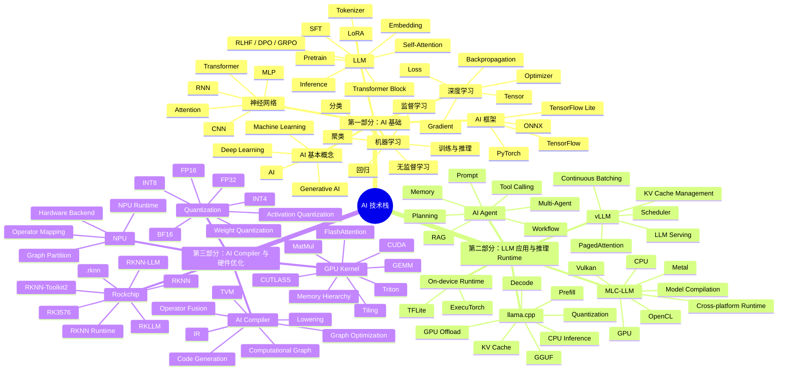
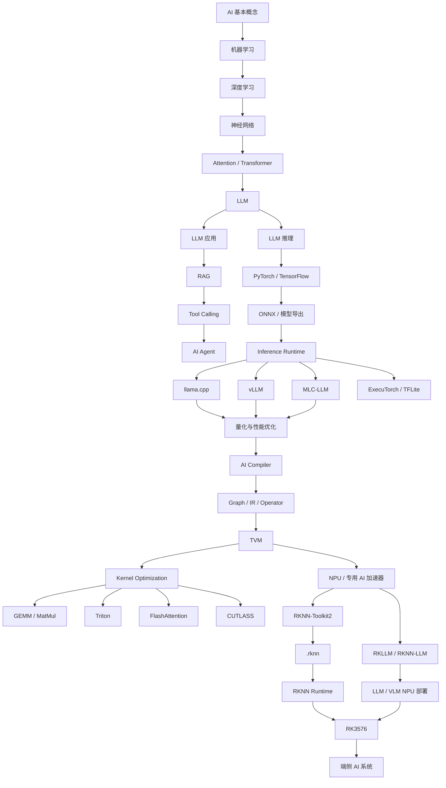

# AI 学习路线图：从基础理论到 Agent、推理框架与端侧硬件优化

> 版本：v0.1  
> 定位：个人 AI 技术栈总纲  
> 目标：建立从 **AI 基础 → LLM/Agent → 推理 Runtime → AI Compiler → GPU/NPU → 端侧部署** 的完整知识体系，并最终形成面向嵌入式与端侧 AI 的工程能力。

---

# 0. 总体学习树



---

# 1. 总体技术路线图

整个学习路线不是三个互相独立的模块，而是一条逐渐向底层深入的技术链路。



最终希望形成的能力链：

```text
AI / ML
    ↓
Deep Learning
    ↓
Transformer
    ↓
LLM
    ↓
Agent / RAG
    ↓
LLM Inference
    ↓
Runtime
    ↓
Quantization
    ↓
AI Compiler
    ↓
Operator / Kernel
    ↓
CPU / GPU / NPU
    ↓
ARM SoC
    ↓
RK3576
    ↓
端侧 AI 产品
```

---

# 2. 学习路线的三个阶段

整个 AI 技术栈暂时划分为三个大的学习阶段。

---

# 第一部分：AI 基础

## 2.1 学习目标

这一阶段不追求直接做复杂 AI 应用，而是解决一个根本问题：

> **AI 模型到底是什么，它为什么能够训练，又为什么能够完成推理？**

最终需要建立从机器学习到 Transformer、LLM 的完整认知。

---

## 2.2 AI 基本概念

首先建立整体概念：

```text
Artificial Intelligence
        │
        └── Machine Learning
                │
                └── Deep Learning
                        │
                        └── Neural Network
                                │
                                └── Transformer
                                        │
                                        └── Large Language Model
```

需要理解：

- Artificial Intelligence
- Machine Learning
- Deep Learning
- Generative AI
- Training
- Inference
- Dataset
- Feature
- Label
- Model
- Parameter
- Weight
- Bias
- Loss
- Gradient
- Optimizer
- Epoch
- Batch
- Overfitting
- Validation
- Test

这一阶段最重要的不是记住定义，而是建立这些概念之间的关系。

---

## 2.3 机器学习

需要理解经典机器学习问题：

### 监督学习

```text
输入数据 + 标签
      ↓
训练模型
      ↓
预测未知数据
```

包括：

- Regression
- Classification

### 无监督学习

包括：

- Clustering
- Dimensionality Reduction

需要重点理解：

```text
数据
 ↓
特征
 ↓
模型
 ↓
Loss
 ↓
Optimization
 ↓
Model Parameters
```

---

## 2.4 深度学习

深度学习阶段开始进入神经网络。

重点掌握：

- Tensor
- Matrix
- Vector
- Forward
- Loss Function
- Backpropagation
- Gradient
- Gradient Descent
- Optimizer
- Learning Rate
- Batch
- Epoch

核心计算流程：

```text
Input
  ↓
Neural Network
  ↓
Prediction
  ↓
Loss
  ↓
Backward
  ↓
Gradient
  ↓
Parameter Update
```

必须理解：

```python
loss.backward()
optimizer.step()
```

背后到底发生了什么。

---

## 2.5 神经网络

按照以下路线逐渐学习：

```text
Linear Regression
      ↓
Neuron
      ↓
MLP
      ↓
CNN
      ↓
RNN
      ↓
Attention
      ↓
Transformer
```

其中：

### MLP

理解：

- Linear
- Activation
- Layer
- Weight Matrix

### CNN

理解：

- Convolution
- Kernel
- Feature Map
- Pooling

### RNN

理解：

- Sequential Data
- Hidden State
- Time Series

CNN 与 RNN 不需要投入过多时间，但需要理解其基本思想。

重点最终转向：

> **Attention 与 Transformer**

---

# 3. Transformer

Transformer 是整个后续学习路线的核心节点。

需要重点掌握：

```text
Token
  ↓
Embedding
  ↓
Position Information
  ↓
Q / K / V
  ↓
Self-Attention
  ↓
Multi-Head Attention
  ↓
Feed Forward Network
  ↓
Transformer Block
```

重点理解：

- Token
- Tokenizer
- Vocabulary
- Embedding
- Positional Encoding
- Q / K / V
- Self-Attention
- Multi-Head Attention
- Softmax
- FFN
- Residual Connection
- LayerNorm / RMSNorm
- Transformer Block
- Encoder
- Decoder
- Causal Attention

这一阶段必须把：

> Transformer 从一个“黑盒模型”变成可以理解的数据流。

---

# 4. LLM

Transformer 掌握之后正式进入 LLM。

学习路线：

```text
Transformer
     ↓
Decoder-only Transformer
     ↓
GPT
     ↓
Pretraining
     ↓
Instruction Tuning
     ↓
Alignment
     ↓
LLM
```

---

## 4.1 LLM 模型结构

重点理解：

- Tokenizer
- Embedding
- Transformer Block
- Attention
- FFN
- RMSNorm
- RoPE
- LM Head

最终需要能够理解类似：

```text
Tokens
  ↓
Embedding
  ↓
Transformer Block × N
  ↓
RMSNorm
  ↓
LM Head
  ↓
Logits
  ↓
Sampling
  ↓
Next Token
```

---

## 4.2 LLM 训练

需要建立基本概念：

- Pretraining
- Fine-tuning
- SFT
- LoRA
- QLoRA
- Instruction Tuning
- Preference Alignment
- RLHF
- DPO
- PPO
- GRPO

这一部分暂时不要求深入所有算法。

核心是理解：

> 一个 Base Model 是如何逐渐变成能够进行人机对话的 Chat / Instruct Model。

---

## 4.3 LLM 推理

这是连接第一部分和第二、三部分的关键。

必须重点理解：

```text
Prompt
  ↓
Tokenizer
  ↓
Prefill
  ↓
KV Cache
  ↓
Decode
  ↓
Sampling
  ↓
Token
  ↓
Decode
  ↓
...
```

重点概念：

- Prefill
- Decode
- KV Cache
- Context Length
- Token/s
- TTFT
- Throughput
- Latency
- Sampling
- Temperature
- Top-K
- Top-P

这里开始逐渐进入：

> **LLM Systems**

---

# 5. AI 开发框架

AI 理论最终需要落实到实际框架。

重点学习：

---

## 5.1 PyTorch

PyTorch 作为主要学习框架。

重点掌握：

```text
Tensor
nn.Module
Dataset
DataLoader
Forward
Autograd
Loss
Optimizer
Training Loop
Inference
Model Save / Load
```

需要能够：

- 搭建简单神经网络
- 训练模型
- 保存模型
- 加载模型
- 执行推理
- 阅读 PyTorch 模型代码

---

## 5.2 TensorFlow

TensorFlow 不作为主要学习框架。

目标是能够：

- 理解 TensorFlow 模型
- 了解 TensorFlow 生态
- 理解 SavedModel
- 理解模型转换

---

## 5.3 TensorFlow Lite

TensorFlow Lite 的学习重点不在训练，而在：

> **端侧推理。**

重点理解：

```text
TensorFlow Model
       ↓
TFLite Converter
       ↓
.tflite
       ↓
TFLite Runtime
       ↓
CPU / GPU / NPU / DSP
```

这会为后续理解 RKNN 奠定基础。

---

## 5.4 ONNX

虽然 ONNX 不是训练框架，但它是整个 AI 部署技术栈的重要中间层。

需要理解：

```text
PyTorch
   ↓
ONNX
   ↓
Runtime / Compiler
   ↓
Hardware
```

重点掌握：

- Computational Graph
- Operator
- Input / Output Tensor
- Shape
- Model Export
- ONNX Runtime

---

# 6. 第一部分核心学习项目

建议重点关注：

### AI / ML

- `microsoft/AI-For-Beginners`
- `microsoft/ML-For-Beginners`

### Deep Learning

- `d2l-ai/d2l-en`
- `karpathy/micrograd`
- `karpathy/nn-zero-to-hero`

### LLM

- `rasbt/LLMs-from-scratch`
- `jingyaogong/minimind`
- `karpathy/llm.c`

第一阶段最终目标：

> 能够从 Tensor、神经网络、Attention 一直解释到一个 LLM 如何完成 Next Token Prediction。

---

# 第二部分：AI Agent 与 LLM 推理 Runtime

这一阶段开始从：

> **模型本身**

转向：

> **如何使用模型，以及如何让模型真正运行起来。**

---

# 7. AI Agent

Agent 的核心不是某一个框架。

真正需要理解的是：

```text
LLM
 +
Prompt
 +
Context
 +
Memory
 +
Tools
 +
Planning
 +
Workflow
 =
AI Agent
```

学习内容：

- Prompt
- System Prompt
- Context
- Structured Output
- Function Calling
- Tool Calling
- Memory
- RAG
- Planning
- Reflection
- Workflow
- Multi-Agent
- MCP

---

## 7.1 RAG

基本链路：

```text
Document
   ↓
Chunk
   ↓
Embedding
   ↓
Vector Database
   ↓
Retrieval
   ↓
Context
   ↓
LLM
```

重点理解：

- Embedding
- Vector
- Similarity
- Chunk
- Retriever
- Vector Database
- Reranker
- Context

---

## 7.2 Tool Calling

理解：

```text
User
 ↓
LLM
 ↓
Tool Decision
 ↓
Function / API
 ↓
Tool Result
 ↓
LLM
 ↓
Answer
```

它是 Agent 能够真正操作外部世界的基础。

---

## 7.3 Agent Framework

主要关注：

- LangChain
- LangGraph
- Hugging Face Agents
- Microsoft Agent Framework / Agent 教程

这一阶段重点学习：

> Agent 的设计思想，而不是背框架 API。

---

# 8. llama.cpp

`llama.cpp` 是第二部分最重要的项目之一。

它连接了：

```text
LLM
 ↓
Quantization
 ↓
Runtime
 ↓
CPU / GPU
 ↓
Local / Edge Deployment
```

需要重点理解：

- GGML
- GGUF
- Model Loader
- Quantization
- Tensor
- Operator
- Backend
- CPU Inference
- GPU Offload
- KV Cache
- Prefill
- Decode
- Sampling

---

## 8.1 GGUF

理解：

```text
Model Weights
+
Model Metadata
+
Tokenizer
+
Architecture Information
        ↓
      GGUF
```

需要弄清：

> GGUF 是模型文件格式，不是模型 Runtime，也不是量化算法本身。

---

## 8.2 Quantization

需要重点理解：

- FP32
- FP16
- BF16
- INT8
- INT4
- Q4
- Q5
- Q8
- Q4_K_M
- Weight Quantization
- Activation Quantization

以及：

> 为什么量化能够减少内存占用。

进一步理解：

> 为什么量化还可能提高 Decode 速度。

---

# 9. vLLM

vLLM 更偏向：

> **服务器端高吞吐 LLM Runtime / Serving Engine**

重点理解：

- Serving
- Batching
- Continuous Batching
- PagedAttention
- KV Cache
- Scheduler
- Request Management
- Throughput
- Latency

通过对比：

```text
llama.cpp
    ↓
Local / Edge / CPU-oriented

vLLM
    ↓
Server / GPU / High-throughput
```

建立不同 LLM Runtime 的设计思路。

---

# 10. MLC-LLM

MLC-LLM 非常重要，因为它连接：

```text
LLM
 ↓
Compiler
 ↓
Runtime
 ↓
Hardware Backend
```

支持思路包括：

```text
Model
 ↓
Compilation
 ↓
Optimized Runtime
 ↓
CUDA / Vulkan / Metal / OpenCL / CPU
```

它是第二部分与第三部分之间的重要桥梁。

重点关注：

- Model Compilation
- Graph
- Operator
- Hardware Backend
- Runtime
- Cross-platform Deployment

---

# 11. 第二部分核心项目

Agent：

- `microsoft/ai-agents-for-beginners`
- `huggingface/agents-course`
- `langchain-ai/langchain`
- `langchain-ai/langgraph`

LLM Runtime：

- `ggml-org/llama.cpp`
- `vllm-project/vllm`
- `mlc-ai/mlc-llm`
- `pytorch/executorch`

第二部分最终目标：

> 能够解释一个 LLM 从模型文件加载，到 Prefill、KV Cache、Decode，再到最终生成 Token 的完整推理流程。

同时理解：

> Agent 是如何通过 RAG、Memory 与 Tool Calling 将 LLM 变成一个能够执行复杂任务的系统。

---

# 第三部分：AI Compiler、Kernel 与端侧硬件优化

第三部分开始深入：

> **AI 为什么能够高效运行在具体硬件上。**

核心路线：

```text
Model
 ↓
Graph
 ↓
Compiler
 ↓
IR
 ↓
Optimization
 ↓
Operator
 ↓
Kernel
 ↓
CPU / GPU / NPU
```

---

# 12. AI Compiler

传统软件：

```text
C / C++
  ↓
Compiler
  ↓
Machine Code
  ↓
CPU
```

AI 系统：

```text
PyTorch / ONNX Model
       ↓
AI Compiler
       ↓
Graph Optimization
       ↓
Operator Optimization
       ↓
Hardware-specific Code
       ↓
CPU / GPU / NPU
```

需要重点理解：

- Computational Graph
- Operator
- IR
- Frontend
- Backend
- Graph Optimization
- Operator Fusion
- Constant Folding
- Layout Transformation
- Quantization
- Lowering
- Code Generation

---

# 13. TVM

TVM 是学习 AI Compiler 非常重要的项目。

重点路线：

```text
PyTorch / ONNX
      ↓
Frontend
      ↓
Graph / IR
      ↓
Optimization
      ↓
Lowering
      ↓
Code Generation
      ↓
CPU / GPU / Accelerator
```

学习 TVM 的重点不是立刻掌握全部源码。

首先要借助 TVM 理解：

> **AI Compiler 到底在解决什么问题。**

---

# 14. GPU Kernel

模型最终会被拆成大量 Operator。

例如 Transformer 中：

```text
Embedding
MatMul
RMSNorm
RoPE
Attention
Softmax
FFN
```

其中大量计算最终都落到：

> GEMM / MatMul

因此需要从：

```text
Model
```

逐渐深入到：

```text
Operator
```

再深入到：

```text
Kernel
```

---

# 15. GPU 基础

需要理解：

- GPU Architecture
- Thread
- Warp
- Block
- Grid
- Register
- Shared Memory
- Global Memory
- Cache
- Memory Bandwidth
- Compute Throughput

重点建立：

```text
Compute
vs
Memory Access
```

的性能意识。

---

# 16. GEMM / MatMul

GEMM：

```text
C = A × B
```

是深度学习和 LLM 中最核心的计算之一。

后续重点研究：

- Matrix Multiplication
- Tiling
- Blocking
- Cache
- Vectorization
- SIMD
- Tensor Core
- Memory Coalescing
- Data Reuse

真正理解：

> 为什么一个简单的矩阵乘法，会存在巨大的性能优化空间。

---

# 17. Triton

Triton 用于连接：

```text
PyTorch
  ↓
Triton Kernel
  ↓
GPU
```

重点学习：

- Kernel
- Block
- Tile
- Load
- Store
- Mask
- MatMul
- Softmax

---

# 18. FlashAttention

FlashAttention 是学习 AI Kernel 优化非常有代表性的项目。

它需要帮助建立一个重要认识：

> AI 性能优化不仅仅是减少 FLOPs。

很多时候真正的瓶颈是：

> **Memory IO / Memory Bandwidth**

重点理解：

- Attention
- HBM
- SRAM
- Tiling
- IO-aware Algorithm
- Kernel Fusion
- Memory Access

---

# 19. CUTLASS

CUTLASS 更深入 GEMM 与 GPU 底层。

重点关注：

- GEMM
- Tile
- Warp
- Tensor Core
- Pipeline
- Shared Memory
- Register
- FP16
- BF16
- INT8
- INT4

这一阶段不要求短期内完全掌握。

它更适合作为：

> GPU Kernel 与高性能 GEMM 的长期学习项目。

---

# 20. NPU

当硬件从 GPU 换成 NPU 后，核心思想仍然类似：

```text
Model
 ↓
Graph
 ↓
Operator
 ↓
Compiler
 ↓
Hardware Mapping
 ↓
NPU
```

但不同 NPU：

- 支持的 Operator 不同
- 数据类型不同
- Tensor Layout 不同
- 内存结构不同
- 编译器不同
- Runtime 不同

因此：

> 模型不能简单“复制”到 NPU 上运行。

通常需要：

```text
Model Conversion
+
Quantization
+
Graph Optimization
+
Operator Mapping
+
Compilation
```

---

# 21. Rockchip AI 技术栈

Rockchip 是端侧 AI 学习的重要实践平台。

总体分成两条主要路线：

```text
              Rockchip AI
                   │
        ┌──────────┴──────────┐
        │                     │
   通用 AI 模型             LLM / VLM
        │                     │
 RKNN-Toolkit2            RKLLM / RKNN-LLM
        │                     │
      .rknn               LLM Model
        │                     │
 RKNN Runtime             LLM Runtime
        │                     │
        └──────────┬──────────┘
                   │
                 RKNPU
                   │
                 RK3576
```

---

# 22. RKNN-Toolkit2

RKNN-Toolkit2 主要解决：

```text
PyTorch / TensorFlow / ONNX
            ↓
       RKNN-Toolkit2
            ↓
      Model Conversion
            ↓
       Quantization
            ↓
    Graph Optimization
            ↓
       NPU Compile
            ↓
          .rknn
```

重点理解：

- RKNN
- `.rknn`
- Model Conversion
- Quantization
- Calibration Dataset
- Operator Support
- NPU Compilation
- RKNN Runtime

---

# 23. `.rknn`

必须明确：

```text
.rknn
```

是：

> **Rockchip NPU 使用的编译后模型文件。**

类似于：

```text
ONNX
   ↓
RKNN Compiler
   ↓
.rknn
```

它不是：

- RKNN Toolkit
- RKNN Runtime
- RKLLM

而是整个部署链中的：

> **模型产物。**

---

# 24. RKNN Runtime

部署设备上：

```text
Application
     ↓
RKNN Runtime API
     ↓
.rknn
     ↓
RKNPU Driver
     ↓
NPU
```

因此需要逐渐理解：

- Model Load
- Input Tensor
- Output Tensor
- Tensor Memory
- Inference
- Runtime API
- NPU Driver

---

# 25. RKLLM / RKNN-LLM

LLM 与普通 CNN 模型存在明显差异。

LLM 推理需要处理：

- Tokenizer
- Prefill
- Decode
- KV Cache
- Sampling
- Long Context
- Autoregressive Generation

因此 Rockchip 针对 LLM 提供独立技术路线。

重点理解：

```text
Qwen / DeepSeek / LLM
        ↓
Model Conversion
        ↓
RKLLM / RKNN-LLM Toolchain
        ↓
Optimized LLM Model
        ↓
RKLLM Runtime
        ↓
RKNPU
        ↓
RK3576
```

---

# 26. RK3576

RK3576 将作为整个学习路线最终的重要实践平台之一。

需要逐渐把前面的知识全部串起来：

```text
Qwen
 ↓
Transformer
 ↓
LLM Inference
 ↓
Quantization
 ↓
Runtime
 ↓
Compiler
 ↓
Operator
 ↓
NPU
 ↓
RKNN / RKLLM
 ↓
RK3576
```

最终不仅需要做到：

> “模型可以跑。”

而要逐渐能够解释：

```text
为什么这样转换？
为什么需要量化？
为什么这个算子不支持？
为什么 CPU 占用高？
为什么 NPU 没有跑满？
为什么 Prefill 慢？
为什么 Decode 慢？
为什么内存占用这么大？
为什么换一种量化速度会变化？
```

这才是端侧 AI 工程能力真正开始形成的地方。

---

# 27. 三个阶段之间的关系

三个阶段并不是独立的。

```text
第一部分
AI / ML / DL / Transformer / LLM
             │
             │ 解决：
             │ 模型是什么？
             │ 为什么能够训练？
             │ 为什么能够推理？
             ▼
第二部分
Agent / llama.cpp / vLLM / MLC-LLM
             │
             │ 解决：
             │ LLM 怎么使用？
             │ LLM 怎么运行？
             │ Runtime 怎么管理推理？
             ▼
第三部分
Compiler / Kernel / GPU / NPU / RKNN
             │
             │ 解决：
             │ 模型到底如何映射到底层硬件？
             │ 为什么运行得快或者慢？
             ▼
        Edge AI System
```

---

# 28. 最终能力模型

整个学习路线最终希望形成五层能力。

```text
┌─────────────────────────────────┐
│  Layer 5：AI Application        │
│  Agent / RAG / Tool / Workflow  │
├─────────────────────────────────┤
│  Layer 4：LLM Runtime           │
│  llama.cpp / vLLM / MLC-LLM    │
├─────────────────────────────────┤
│  Layer 3：AI Compiler           │
│  Graph / IR / TVM / RKNN        │
├─────────────────────────────────┤
│  Layer 2：Operator / Kernel     │
│  GEMM / Triton / FlashAttention │
├─────────────────────────────────┤
│  Layer 1：Hardware              │
│  CPU / GPU / NPU / RK3576       │
└─────────────────────────────────┘
```

同时底层理论基础贯穿所有层：

```text
Machine Learning
       +
Deep Learning
       +
Transformer
       +
LLM
```

---

# 29. 预期最终技术栈

经过这一系列学习，希望逐渐形成如下技术栈：

```text
Programming
├── Python
├── C
└── C++

AI Framework
├── PyTorch
├── TensorFlow
├── TensorFlow Lite
└── ONNX

Deep Learning
├── CNN
├── RNN
├── Attention
└── Transformer

LLM
├── Tokenizer
├── Pretraining
├── SFT
├── LoRA
├── KV Cache
├── Prefill
└── Decode

Agent
├── RAG
├── Tool Calling
├── Memory
├── Workflow
└── MCP

LLM Runtime
├── llama.cpp
├── vLLM
├── MLC-LLM
└── ExecuTorch

Optimization
├── Quantization
├── FP16
├── INT8
├── INT4
├── GGUF
└── Q4_K_M

AI Compiler
├── Computational Graph
├── Operator
├── IR
├── TVM
├── Graph Optimization
└── Code Generation

GPU
├── CUDA
├── GEMM
├── Triton
├── FlashAttention
└── CUTLASS

Edge AI
├── ARM Linux
├── NPU
├── RKNN
├── RKNN-Toolkit2
├── RKNN Runtime
├── RKLLM
├── RKNN-LLM
└── RK3576
```

---

# 30. 当前学习主线

现阶段不追求所有方向同时深入。

总体按照：

```text
第一阶段：先理解模型
        ↓
第二阶段：理解模型如何运行
        ↓
第三阶段：理解模型为什么能在硬件上高效运行
```

即：

```text
AI 基础
  ↓
Deep Learning
  ↓
Transformer
  ↓
LLM
  ↓
Agent
  ↓
LLM Runtime
  ↓
Quantization
  ↓
AI Compiler
  ↓
Kernel
  ↓
GPU / NPU
  ↓
RK3576
```

后续将围绕这份总纲，分别建立独立学习文档：

```text
01_AI基础与机器学习.md

02_深度学习与神经网络.md

03_Transformer与LLM.md

04_PyTorch与模型框架.md

05_AI_Agent与RAG.md

06_LLM推理原理.md

07_llama.cpp.md

08_vLLM与MLC-LLM.md

09_AI_Compiler与TVM.md

10_GPU_Kernel与FlashAttention.md

11_RKNN与Rockchip_NPU.md

12_RKLLM与端侧LLM部署.md

13_RK3576端侧AI实践.md
```

> 注（2026-08-25 更新）：
> 1. 原 09 / 10 两版《AI_Compiler与TVM》已合并为 09 章，后续章节编号顺移（10 → GPU Kernel，11 → RKNN，12 → RKLLM，13 → RK3576 实践）。
> 2. 原规划的「量化与模型格式」暂不单独成章，相关内容分布在：06（LLM 推理量化）、07（GGUF / Q4_K_M）、09（Quantization Compiler）、11（RKNN 量化）、12（RKLLM 量化）。

---

# 31. 学习原则

整个过程中遵守以下原则：

1. **先建立地图，再进入细节。**
2. **先理解原理，再学习框架 API。**
3. **不要把会调用 PyTorch / LangChain API 等同于理解 AI。**
4. **每学习一个抽象层，都继续追问下一层发生了什么。**
5. **模型 → Runtime → Compiler → Kernel → Hardware 是核心主线。**
6. **理论最终必须通过实际代码、模型和硬件验证。**
7. **端侧部署不以“成功运行模型”为终点，而以能够解释和优化整个推理链路为目标。**

最终希望能够真正回答：

> 一个 Transformer / LLM，从 PyTorch 中的模型定义开始，究竟经历了什么，最终才变成 ARM CPU、GPU 或 Rockchip NPU 上执行的一条条计算指令？

这将作为整个 AI 技术栈学习的核心问题。
